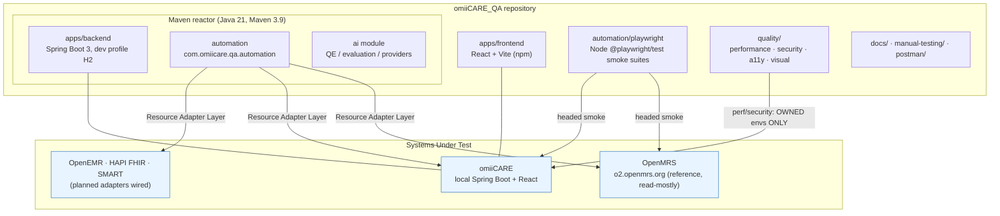
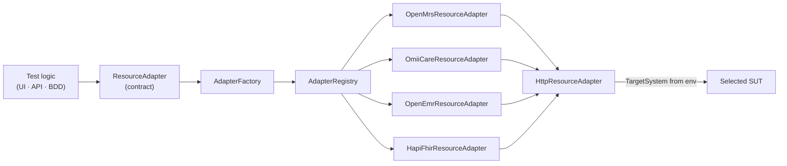
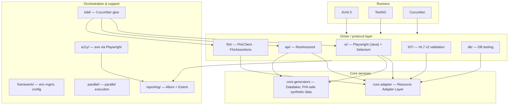
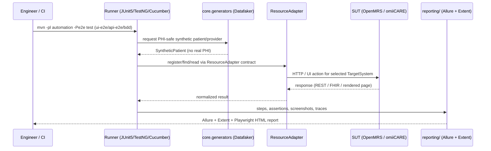
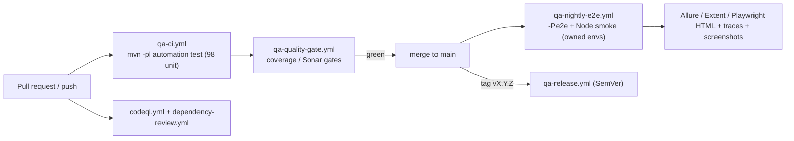
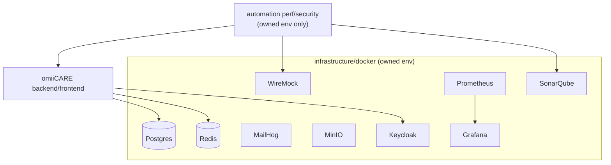

# omiiCARE_QA — Architecture Walkthrough

> Enterprise healthcare QA platform. Primary reference System-Under-Test (SUT) is
> **OpenMRS** (`https://o2.openmrs.org`); the local in-house SUT is **omiiCARE**
> (Spring Boot 3 / Java 21 backend, React + Vite frontend). The framework is
> portable across **OpenMRS / OpenEMR / HAPI FHIR / SMART / omiiCARE** through a
> single **Resource Adapter Layer**.

**Audience:** reviewers, hiring managers, contributors, and QA architects who want
a top-to-bottom view of how the platform is structured and how a test request flows
from a feature file to a rendered Allure report.

**Toolchain:** Java 21, Maven 3.9 (reactor), Node 22, Playwright (Java + Node),
Selenium, RestAssured, Cucumber, JUnit 5, TestNG.

---

## 1. System Context

The platform is one Maven reactor plus a Node-based Playwright/quality layer. It
exercises healthcare SUTs through a stable abstraction so the same test logic can
target OpenMRS today and OpenEMR/HAPI FHIR/omiiCARE tomorrow.

> **Hard rule:** performance (k6/JMeter) and security (ZAP) tests run **only**
> against owned/local environments. The public OpenMRS demo at `o2.openmrs.org` is
> used exclusively for low-volume functional smoke flows — never for load or attack
> traffic.

---

## 2. Resource Adapter Layer (portability core)

All SUT interaction is funneled through `core.adapter`. Tests depend on the
`ResourceAdapter` contract, never on a concrete SUT. The active adapter is chosen at
runtime by environment configuration, so one suite runs against many platforms.

Real classes in `automation/src/test/java/com/omiicare/qa/automation/core/adapter/`:

| File | Role |
|------|------|
| `ResourceAdapter.java` | Adapter contract (port) consumed by all tests |
| `AdapterFactory.java` | Builds the adapter for the configured target |
| `AdapterRegistry.java` | Registers/looks up adapters by `TargetSystem` |
| `HttpResourceAdapter.java` | Shared HTTP base behavior |
| `OpenMrsResourceAdapter.java` | OpenMRS REST/web mapping |
| `OmiiCareResourceAdapter.java` | omiiCARE backend mapping |
| `OpenEmrResourceAdapter.java` | OpenEMR mapping |
| `HapiFhirResourceAdapter.java` | HAPI FHIR / SMART mapping |
| `AdapterRegistryTest.java` | Unit coverage for registry resolution |

**Why it matters:** swapping SUTs is a config change, not a rewrite. The same
patient-registration flow can run against OpenMRS (reference) or omiiCARE (owned)
by selecting a different `TargetSystem`.

---

## 3. Test Framework Layers

The Java automation module (`automation/`, package
`com.omiicare.qa.automation`) is layered by concern. Verified source packages under
`automation/src/test/java/com/omiicare/qa/automation/`:

**Data generation (`core.generators`)** — PHI-safe by design, backed by Datafaker.
Verified factories: `PatientFactory`, `ProviderFactory`, `AppointmentFactory`,
`OrderFactory` with `SyntheticPatient/Provider/Appointment/Order` value types and
unit tests (`ProviderFactoryTest`, `AppointmentFactoryTest`). Only synthetic data
is ever generated — no real PHI enters the repo.

**FHIR (`fhir/`)** — `FhirClient` + `FhirAssertions` for resource read/validation;
`FhirMetadataAndReadE2ETest` and `features/fhir_patient_read.feature` provide the
end-to-end path. **HL7 (`hl7/`)** validates HL7 v2 messages.

---

## 4. Execution Profiles & Commands

Tests are split between fast, hermetic unit tests (default build) and SUT/browser
tests that need a live environment.

| Profile | Command | Scope | Tags |
|---------|---------|-------|------|
| Default | `mvn -pl automation test` | **98 unit tests PASS** — no SUT/browser | — |
| E2E | `mvn -pl automation -Pe2e test` | live SUT + browser | `ui-e2e`, `api-e2e`, `bdd` |
| Node smoke (omiiCARE) | `npm run smoke` in `automation/playwright/` (config `playwright.config.ts`) | omiiCARE headed smoke (5/5) | — |
| Node smoke (OpenMRS) | `npx playwright test --config playwright.openmrs.config.ts` | OpenMRS headed smoke (5/5) vs `o2.openmrs.org` | — |
| Report | `npm run report` in `automation/playwright/` | open Playwright HTML report | — |

The OpenMRS Node config (`automation/playwright/playwright.openmrs.config.ts`)
verified facts: `testDir: ./tests-openmrs`, `outputDir: ./artifacts-openmrs/test-output`,
`baseURL = process.env.OPENMRS_BASE_URL ?? 'https://o2.openmrs.org'`, reporters
`list` + `html` (`playwright-report-openmrs`) + `json` (`results-openmrs/results.json`).

---

## 5. Data Flow — a single E2E request

How one BDD/UI scenario travels from feature file to rendered report:

---

## 6. CI/CD Topology

Existing GitHub Actions workflows in `.github/workflows/` (verified) cover both the
omiiCARE app build and the QA platform. New QA workflows use **distinct names**
prefixed `qa-` so they never overwrite the app CI.

| Workflow | Purpose |
|----------|---------|
| `ci.yml`, `release.yml`, `nightly.yml` | omiiCARE app CI / release / nightly |
| `qa-ci.yml` | QA platform CI (default `mvn -pl automation test`, 98 unit tests) |
| `qa-nightly-e2e.yml` | Nightly `-Pe2e` SUT/browser suites + Node smoke |
| `qa-quality-gate.yml` | Quality gates (coverage/Sonar thresholds) |
| `qa-release.yml` | QA platform release (SemVer 2.0.0) |
| `codeql.yml`, `dependency-review.yml` | Security scanning of code & deps |
| `_reusable-backend.yml`, `_reusable-frontend.yml`, `_reusable-docker.yml`, `_reusable-quality.yml` | Reusable building blocks |
| `labeler.yml` | PR labeling |

SonarQube is wired via `sonar-project.properties` (root) and the SonarQube service
in `infrastructure/docker/docker-compose.yml`.

---

## 7. Reporting Layer

| Report | Producer | Location |
|--------|----------|----------|
| Allure | `reporting/` (Java suites) | `automation/allure-results/` → Allure HTML |
| Extent | `reporting/` (Java suites) | Extent HTML output |
| Playwright HTML (omiiCARE) | Node smoke | `automation/playwright/playwright-report/index.html` |
| Playwright HTML (OpenMRS) | Node smoke | `automation/playwright/playwright-report-openmrs/index.html` |
| Trace + screenshots (OpenMRS) | Node smoke | `automation/playwright/artifacts-openmrs/` (`trace.zip`, `screenshots/step-1..5`) |
| JSON result (OpenMRS) | Node smoke | `automation/playwright/results-openmrs/results.json` |

See `docs/portfolio/SAMPLE_REPORTS_AND_EXECUTIONS.md` for the concrete artifact
catalog and regeneration commands.

---

## 8. Supporting Infrastructure

`infrastructure/docker/docker-compose.yml` provides the owned local stack:
Postgres, Redis, MailHog, MinIO, Keycloak, WireMock, Prometheus, Grafana,
SonarQube. Lifecycle scripts live in `scripts/` (setup / start / stop / health).

---

## 9. Knowledge & Documentation Map

| Area | Path | Contents |
|------|------|----------|
| Reverse engineering | `docs/reverse-engineering/` | 22 docs (~10k lines, 78 Mermaid): BRD/SRS/FRD/NFR, use-cases, RBAC, ERD, API, FHIR, HL7, risk, architecture |
| QA management | `docs/qa-management/` | 15 docs: master strategy/plan, release/sprint, risk-based, estimation, defect mgmt, metrics, entry/exit, UAT, automation strategy, test data/env |
| Requirements | `docs/requirements/requirements-catalog.md` | 1,795 requirements |
| Manual test cases | `manual-testing/test-cases/openmrs/` | 4,187 cases across 66 modules (17-col CSV + `ALL_TEST_CASES.csv`) |
| RTM | `manual-testing/rtm/` | `RTM.csv` / `RTM.md` — 0 gaps, 0 untraced |
| Quality assets | `quality/` | k6 / JMeter (perf), ZAP (security), Playwright (a11y, visual) |

---

## 10. Design Principles

- **Adapter-first portability** — one contract, many SUTs; swapping is config, not code.
- **Fast default build** — 98 hermetic unit tests on `mvn -pl automation test`; live
  SUT/browser work is opt-in via `-Pe2e`.
- **PHI-safe by construction** — `core.generators` emits only synthetic data.
- **Owned-env guardrail** — perf/security never touch the public OpenMRS demo.
- **Green-build invariant** — `apps/backend` and `apps/frontend` stay green; docs and
  config additions never alter Java sources or build files.
- **SemVer 2.0.0 + Conventional Commits** for every release.

---

*Cross-references:* `ARCHITECTURE.md` (root), `docs/architecture/`,
`automation/AUTOMATION_FRAMEWORK.md`, `docs/portfolio/PORTFOLIO_GUIDE.md`,
`docs/portfolio/SAMPLE_REPORTS_AND_EXECUTIONS.md`.
