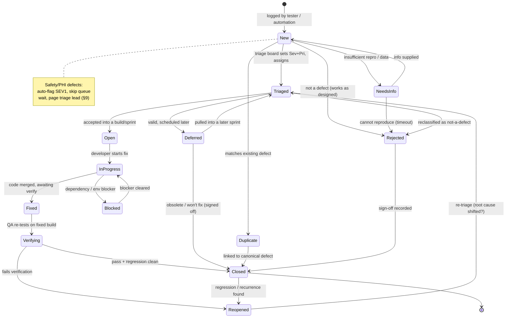
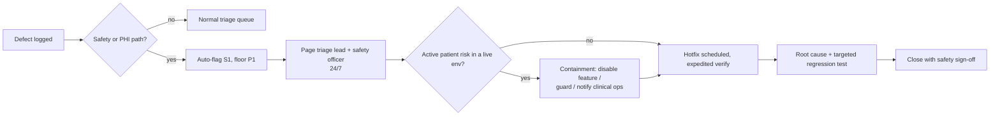

# Defect Management Process

> **Purpose.** Define how this healthcare QA portfolio captures, classifies,
> triages, escalates, fixes, verifies, and learns from defects across the
> system under test (SUT). The process makes **patient safety** and **PHI
> protection** first-class concerns: a defect that can cause clinical harm or
> expose protected health information follows a faster, stricter path than a
> cosmetic issue, regardless of how it was found.
>
> **System under test.** Primary: **OpenMRS** (`o2.openmrs.org` legacy O2
> RefApp; O3 demo at `o3.openmrs.org`). Portable to **OpenEMR, HAPI FHIR,
> SMART Health IT**, and the in-house **omiiCARE** app via the **Resource
> Adapter Layer (RAL)**.
>
> **Anchored to.** 472 requirements (`REQ-<PREFIX>-NNN`,
> [`requirements-catalog.md`](../requirements/requirements-catalog.md)),
> 1,349+ manual test cases across 21 modules
> ([`manual-testing/test-cases/openmrs/`](../../manual-testing/test-cases/openmrs/),
> soon ~4,000), the RTM
> ([`manual-testing/rtm/RTM.csv`](../../manual-testing/rtm/RTM.csv)), the
> [`RISK_REGISTER.md`](../reverse-engineering/RISK_REGISTER.md), and the
> [`RISK_BASED_TESTING_STRATEGY.md`](./RISK_BASED_TESTING_STRATEGY.md).
>
> **Standards.** FHIR R4, HL7 v2, WCAG 2.1 AA, OWASP (ASVS / Top 10),
> HIPAA-like Privacy & Security controls.
>
> **Provenance.** Behavior verified against the OpenMRS RefApp is stated
> plainly. Every SLA hour, threshold, weighting, and target below is a
> portfolio design decision tagged **(Assumption)** — tunable per deployment.
>
> **Ethics / scope guard.** Defects from performance and security testing are
> only ever reproduced against **owned or local environments** (local OpenMRS
> SDK build, owned omiiCARE instance, self-hosted HAPI). Repro steps in a
> defect record **never** target public demo sites or third-party hosts, and
> **never** embed real PHI.

---

## 1. Scope and Principles

1. **Patient safety first.** Any defect with a credible path to wrong-patient,
   wrong-drug, wrong-dose, lost clinical data, or a silently dropped order is a
   **Safety defect** and escalates immediately (§9), bypassing normal triage
   queue latency.
2. **PHI is sacred.** Defect records, screenshots, logs, and repro data are
   sanitized — synthetic patients only (e.g., `Test, Aaa` / fictitious MRNs).
   A defect that itself leaks PHI is a Security defect **and** a privacy
   incident (§9.2).
3. **Every defect traces to a requirement.** A defect references the failing
   `REQ-<PREFIX>-NNN`, the `TC-<PREFIX>-NNNN` that found it (or `EXPLORATORY`),
   and the `RISK-<CAT>-NN` it realizes. Untraceable defects are missing data,
   not valid records.
4. **Multi-system aware.** A defect is tagged with the SUT and the layer:
   `CORE` (OpenMRS/OpenEMR behavior) vs `RAL` (Resource Adapter Layer mapping).
   This separates "the EHR is wrong" from "our adapter mapped it wrong."
5. **Reproducible or it is a question.** A defect needs deterministic repro
   steps, environment, build, and expected-vs-actual. Non-reproducible
   observations enter as `Needs-Info`, not `New`.

---

## 2. Defect Lifecycle State Machine

**State semantics**

| State | Owner | Entry condition | Exit gate |
|-------|-------|-----------------|-----------|
| New | Reporter | Logged with mandatory fields (§5) | Triage board reviews |
| NeedsInfo | Reporter | Triage cannot reproduce/assess | Info supplied or 5-day timeout → Rejected |
| Triaged | Triage lead | Sev + Pri + owner + sprint set | Accept / defer / reject |
| Open | Dev lead | Accepted into a build | Dev picks up |
| InProgress | Developer | Fix started | Code merged |
| Blocked | Developer | External/internal blocker logged | Blocker resolved |
| Fixed | Developer | Fix in a deployed/testable build | QA verifies |
| Verifying | QA | Fixed build available | Pass+regression or fail |
| Reopened | QA | Verification failed or recurrence | Back through triage |
| Deferred | Triage lead | Valid but out of current scope | Re-triage or sign-off close |
| Duplicate | Triage lead | Canonical defect identified | Link + close |
| Rejected | Triage lead | Not a defect / WAD | Sign-off close |
| Closed | QA lead | Verified or signed off | Terminal (reopenable) |

---

## 3. Severity vs Priority

**Severity** = technical/clinical impact if the defect ships (objective,
tester-set at logging). **Priority** = business urgency to fix (negotiated at
triage). They are **independent axes** — a typo in a P1 login screen is low
severity but can be high priority; a rare data-corruption path is high severity
but may be lower priority if the trigger is improbable.

### 3.1 Severity scale

| Sev | Name | Definition (healthcare-weighted) | Examples (module) |
|-----|------|----------------------------------|-------------------|
| **S1** | Critical | Patient-safety hazard, PHI breach, data loss/corruption, full outage, or security control bypass | Wrong patient shown on chart (PDASH/SRCH), order silently dropped (ORDLAB), RBAC bypass (RBAC/SEC), unencrypted PHI export (DATA/SEC) |
| **S2** | Major | Core clinical workflow broken with no safe workaround; standards interop failure that drops/garbles data | Cannot save vitals (VITAL), double-book overwrites slot (APPT), FHIR R4 Observation rejected (FHIR), HL7 ORU not ACKed (HL7) |
| **S3** | Moderate | Workflow impaired but workaround exists; partial/degraded feature | Search pagination off-by-one (SRCH), reminder sent twice (NOTIF), report total miscalculated but raw data correct (RPT) |
| **S4** | Minor | Cosmetic, copy, or low-impact UX; no functional/clinical effect | Misaligned label, truncated tooltip, non-AA contrast on decorative element (A11Y) |

### 3.2 Priority scale

| Pri | Name | Meaning |
|-----|------|---------|
| **P1** | Immediate | Fix now; blocks release / active patient risk |
| **P2** | High | Fix this sprint |
| **P3** | Medium | Schedule into a near sprint |
| **P4** | Low | Backlog; fix opportunistically |

### 3.3 Severity → default Priority matrix

Triage starts from the cell, then adjusts for likelihood, blast radius, and
release proximity. Patient-safety / PHI defects are **floored at P1**
regardless of severity-likelihood.

| | **S1 Critical** | **S2 Major** | **S3 Moderate** | **S4 Minor** |
|---|---|---|---|---|
| **High likelihood / broad impact** | P1 | P1 | P2 | P3 |
| **Medium likelihood** | P1 | P2 | P3 | P4 |
| **Low likelihood / narrow** | P1 *(safety)* / P2 | P2 | P3 | P4 |

> **(Assumption)** Any defect tagged `safety` or `phi` cannot be set below
> **P1** by triage; downgrade requires the safety officer's sign-off recorded
> in the defect.

---

## 4. Triage

### 4.1 Cadence

| Forum | Frequency | Attendees | Decides |
|-------|-----------|-----------|---------|
| **Async intake screen** | Continuous | On-call QA | NeedsInfo / dup / valid → queue |
| **Daily triage board** | Daily, 15 min | QA lead, dev lead, PO | Sev/Pri, owner, sprint, defer |
| **Safety escalation** | On demand (24/7) | QA lead, safety officer, dev lead | S1-safety/PHI disposition (§9) |
| **Defer review** | Per sprint boundary | QA lead, PO | Re-triage deferred backlog |

### 4.2 Triage decision flow

1. **Valid defect?** No → `Rejected` (works-as-designed, env issue, test-data
   error) with reason. Yes → continue.
2. **Reproducible / enough info?** No → `NeedsInfo`.
3. **Duplicate?** Yes → `Duplicate`, link canonical (§6).
4. **Set Severity** (objective) and **Priority** (matrix §3.3 + adjustment).
5. **Safety/PHI flag?** Yes → escalate (§9), floor P1.
6. **Assign** layer (`CORE`/`RAL`), SUT, owner, target sprint/build.
7. **Confirm traceability**: `REQ`, `TC`/`EXPLORATORY`, `RISK` populated.

### 4.3 Triage quality gate
A defect cannot leave triage with empty Severity, Priority, owner, `REQ-` link,
or layer tag. The board rejects under-specified records back to `New`.

---

## 5. Defect Record Fields

| Field | Req? | Notes / allowed values |
|-------|------|------------------------|
| ID | auto | `DEF-<PREFIX>-NNNN` mirroring module prefix (AUTH, REG, … TELE) |
| Title | ✔ | `[Module] concise symptom` — no PHI |
| Severity | ✔ | S1–S4 (§3.1) |
| Priority | ✔ (triage) | P1–P4 (§3.2) |
| Module / Prefix | ✔ | One of 21: AUTH REG SRCH PDASH VISIT VITAL CLIN APPT ORDLAB PHARM RBAC DATA RPT FHIR HL7 SEC A11Y PERF NOTIF BILL TELE |
| Requirement ID | ✔ | `REQ-<PREFIX>-NNN` that failed |
| Test Case ID | ✔ | `TC-<PREFIX>-NNNN` or `EXPLORATORY` |
| Risk ID | ✔ | `RISK-<CAT>-NN` realized |
| SUT | ✔ | OpenMRS \| OpenEMR \| HAPI \| SMART \| omiiCARE |
| Layer | ✔ | `CORE` \| `RAL` |
| Build / Version | ✔ | Commit/tag of SUT and RAL |
| Environment | ✔ | Local SDK \| owned omiiCARE \| self-hosted HAPI (never public for perf/sec) |
| Steps to Reproduce | ✔ | Deterministic, synthetic data only |
| Expected vs Actual | ✔ | Tie expected to the requirement's acceptance criterion |
| Evidence | ✔ | Sanitized screenshot/log/HAR; PHI redacted |
| Safety flag | cond. | `safety` if clinical-harm path |
| PHI flag | cond. | `phi` if data exposure path |
| Root-cause category | on close | §8 taxonomy |
| Found-in phase | ✔ | Where detected (§10.2) |
| Injected-in phase | on close | Where introduced (for leakage/RCA) |
| Detection technique | ✔ | Functional/Negative/Boundary/Decision-Table/State-Transition/Pairwise/Exploratory/A11Y/Security/API/Database/FHIR/HL7 |

> **PHI rule.** Free-text, evidence, and repro fields are screened at intake;
> any record containing real identifiers is quarantined, scrubbed, and the
> exposure logged per §9.2.

---

## 6. Duplicate Handling

1. **Detect at intake.** Search by module + symptom + `REQ` + stack signature
   before logging. CI-generated defects de-dupe on a normalized failure
   fingerprint (test id + assertion + top stack frame).
2. **Canonical selection.** The earliest open defect with the fullest repro is
   canonical; later ones become `Duplicate → Closed` and link to it.
3. **Merge metadata.** Move any new repro detail, affected SUT/layer, or
   evidence onto the canonical; bump its occurrence count.
4. **Severity reconciliation.** If a duplicate shows a worse impact than the
   canonical, raise the canonical's severity to the max — never lose the worst
   observed behavior.
5. **Cross-system duplicates.** Same symptom on OpenMRS and omiiCARE may be
   **one RAL defect** (shared adapter) or **two CORE defects** (independent EHR
   bugs). Tag accordingly; do not blind-merge across `CORE`/`RAL`.
6. **Mis-marked duplicates.** If a closed duplicate later proves distinct,
   reopen as its own defect and unlink.

---

## 7. Reopen and Deferral

### 7.1 Reopen
- **Triggers.** Verification fails; the symptom recurs in a later build
  (regression); a closed-as-fixed defect resurfaces from the field/automation.
- **Flow.** `Closed/Verifying → Reopened → Triaged` — reopening always returns
  through triage because the root cause may have shifted (e.g., a re-fix in a
  different layer).
- **Reopen counter.** Each defect tracks `reopen_count`. **(Assumption)**
  ≥2 reopens auto-escalates to the dev lead for a deeper root-cause review and
  a mandatory added regression test.
- **Regression linkage.** A reopen caused by a *new* change links the offending
  change-set and adds/expands the guarding `TC-<PREFIX>-NNNN`.

### 7.2 Deferral
A defect may be **valid yet deferred** when fixing now costs more risk than it
buys. Deferral requires explicit disposition — silence is not deferral.

| Defer gate | Rule |
|------------|------|
| Eligible severity | **(Assumption)** Only S3–S4 may defer by triage alone |
| S1/S2 deferral | Requires PO **and** safety officer sign-off, recorded with rationale + review date |
| Safety/PHI | **Never deferred** while a clinical-harm or exposure path is open |
| Expiry | Every Deferred defect has a `review_by` date; lapsed defers auto-return to `Triaged` |
| Won't-fix close | Deferred → Closed only with documented business sign-off |

---

## 8. Root-Cause Categories (RCA Taxonomy)

Set on close; drives the **leakage** and **prevention** analytics (§10).

| Code | Category | Typical signal | Prevention lever |
|------|----------|----------------|------------------|
| RC-REQ | Requirements gap/ambiguity | Behavior "correct" but unspecified | Tighten `REQ` acceptance criteria |
| RC-DES | Design/architecture flaw | Wrong state machine, race, missing constraint | Design review, model the state machine |
| RC-COD | Coding error | Logic/off-by-one/null | Unit tests, lint, code review |
| RC-DATA | Data / config | Concept dictionary, value set, env config | Config validation, golden datasets |
| RC-INTG | Integration / RAL mapping | Field mapped wrong CORE↔RAL | RAL contract tests, mapping review |
| RC-FHIR | FHIR R4 conformance | Bad profile, code system URI, cardinality | Validator in CI, profile assertions |
| RC-HL7 | HL7 v2 conformance | Segment/field, ACK, encoding | Message conformance harness |
| RC-SEC | Security control | AuthZ, session, injection, crypto | OWASP ASVS checks, threat model |
| RC-A11Y | Accessibility | Name/role/state, contrast, focus | Axe scans, manual SR pass |
| RC-PERF | Performance | Latency, N+1, lock contention | Load tests on owned env |
| RC-TEST | Test defect / env | False positive, flaky, env drift | Stabilize harness, quarantine flakes |
| RC-DOC | Documentation | Misleading user/clin guidance | Doc review |

---

## 9. Patient-Safety and PHI Escalation

### 9.1 Safety fast-path
A defect with a credible clinical-harm path (`safety` flag) **does not wait in
the daily queue**:

**Safety triggers (non-exhaustive).** Wrong-patient association
(PDASH/SRCH/REG), wrong-drug/dose or dropped order (ORDLAB/PHARM), lost or
silently truncated clinical data (VITAL/CLIN/DATA), allergy/interaction alert
not firing (CLIN/PHARM), appointment/no-show state corruption affecting care
(APPT), and any standards path that **drops** clinical content
(FHIR/HL7 mapping loss).

### 9.2 PHI exposure path
A `phi` defect is simultaneously a **defect** and a **privacy incident**:
1. Contain — restrict access to the affected record/evidence; scrub any leaked
   identifiers from the tracker.
2. Assess scope — which records, which SUT, was it a live or owned env.
3. Notify per the deployment's HIPAA-like breach procedure (out of QA scope to
   decide, in scope to surface immediately).
4. Fix + add a guarding security/`RC-SEC` test; close with privacy sign-off.

> Escalation latency targets in §10 are **floors**; the safety fast-path may
> beat them but never exceed them.

---

## 10. SLAs and Metrics

### 10.1 Response / resolution SLAs *(Assumption — business hours unless noted)*

| Sev / flag | Acknowledge (triage) | Target fix | Verify after Fixed |
|------------|----------------------|------------|--------------------|
| **S1 + safety/phi** | **≤ 1 hr (24/7)** | ≤ 24 hr (hotfix path) | ≤ 4 hr |
| **S1** | ≤ 2 hr | ≤ 2 business days | ≤ 1 business day |
| **S2** | ≤ 4 hr | ≤ 5 business days / this sprint | ≤ 1 business day |
| **S3** | ≤ 1 business day | Scheduled sprint | ≤ 2 business days |
| **S4** | ≤ 2 business days | Backlog | Next regression pass |

**SLA breach handling.** A defect past its Acknowledge or Fix target auto-flags
`sla-breach` and surfaces in the daily board; repeated S1/S2 breaches feed the
sprint retrospective.

### 10.2 Core metrics

| Metric | Formula | Target *(Assumption)* | Purpose |
|--------|---------|------------------------|---------|
| **DRE** (Defect Removal Efficiency) | `defects found pre-release / (pre-release + post-release)` × 100 | **≥ 95%**; **≥ 99%** for safety/PHI | How much we catch before users do |
| **Defect Leakage** | `post-release defects / total defects` × 100 | **≤ 5%**; **0** safety/PHI leaks | Inverse of DRE; escapes |
| **Phase Containment** | defects caught in same phase they were injected | ≥ 80% | Shift-left effectiveness |
| **Reopen Rate** | `reopened / closed` × 100 | ≤ 8% | Fix quality |
| **Duplicate Rate** | `duplicates / logged` × 100 | ≤ 10% | Intake hygiene |
| **MTTR** (S1) | mean(Closed − New) for S1 | ≤ 2 days (≤ 24 hr safety) | Responsiveness |
| **Defect Density** | `valid defects / module-KLOC or /100 TCs` | trend, not threshold | Hotspot detection |
| **Aging WIP** | open defects past SLA, by sev | trend ↓ | Backlog health |

### 10.3 DRE & leakage worked illustration *(Assumption — example numbers)*

| Phase | Found | Injected-here | Leaked onward |
|-------|-------|---------------|---------------|
| Requirements/Design review | 40 | 60 | 20 |
| Test design + manual exec | 180 | 150 | 50 |
| Integration / FHIR-HL7 / RAL | 70 | 70 | 30 |
| **Pre-release total** | **290** | — | — |
| Post-release (escapes) | 12 | — | — |

`DRE = 290 / (290 + 12) = 96.0%` · `Leakage = 12 / 302 = 4.0%`.
A single safety/PHI escape forces a **root-cause + process** review regardless
of the aggregate DRE staying green.

### 10.4 Leakage attribution
Every escaped (post-release) defect is back-analyzed: which `TC` *should* have
caught it, which technique was missing (e.g., no boundary/pairwise/negative
coverage), and which RCA category applies. The gap closes by adding the missing
`TC-<PREFIX>-NNNN` to the suite and the RTM — leakage analysis is the primary
feedback loop into the growing ~4,000-case manual suite.

---

## 11. Roles and Responsibilities

| Role | Responsibilities |
|------|------------------|
| **Reporter (QA/automation)** | Log with mandatory fields, sanitized evidence, traceability |
| **On-call QA (intake)** | Screen for dup/NeedsInfo/PHI; route validity |
| **Triage lead / QA lead** | Set Sev/Pri, gate quality, own metrics & SLAs |
| **Dev lead** | Assign fixes, ≥2-reopen reviews, blocker resolution |
| **Safety officer** | S1-safety/PHI disposition, deferral & close sign-offs |
| **Product owner** | Priority negotiation, deferral business sign-off |

---

## 12. Tooling and Traceability Integration

- **IDs link the chain:** `DEF-` ↔ `REQ-` ↔ `TC-` ↔ `RISK-`, so any defect is
  navigable to its requirement, test case, and risk, and back into
  [`RTM.csv`](../../manual-testing/rtm/RTM.csv).
- **CI-found defects** open automatically with the failure fingerprint, build,
  technique, and module prefix pre-filled; de-dupe runs before creation.
- **Sprint linkage:** defect Sev/Pri and aging feed
  [`SPRINT_TEST_PLAN.md`](./SPRINT_TEST_PLAN.md); risk realization updates the
  [`RISK_REGISTER.md`](../reverse-engineering/RISK_REGISTER.md).
- **Audit:** every state transition, sign-off, and PHI-scrub action is logged
  with actor and timestamp to support HIPAA-like accountability.

---

*End of Defect Management Process.*
