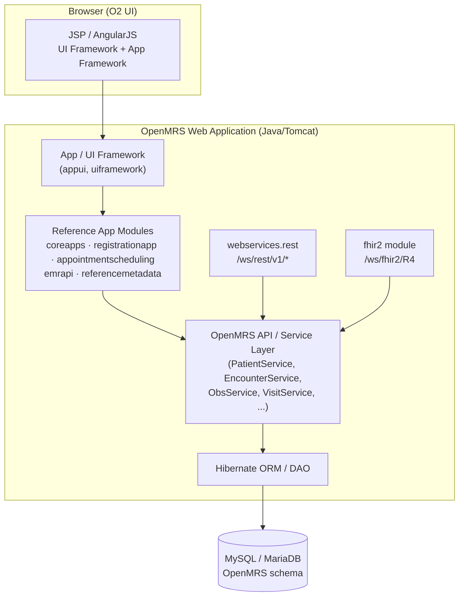
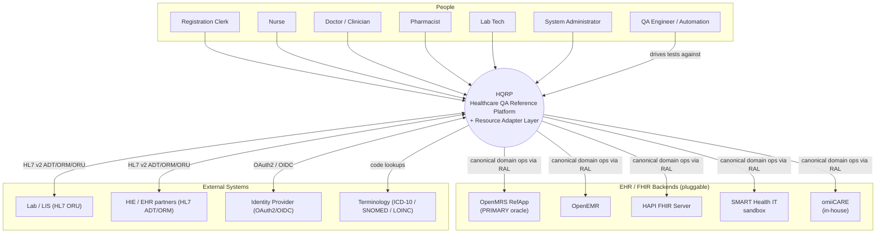
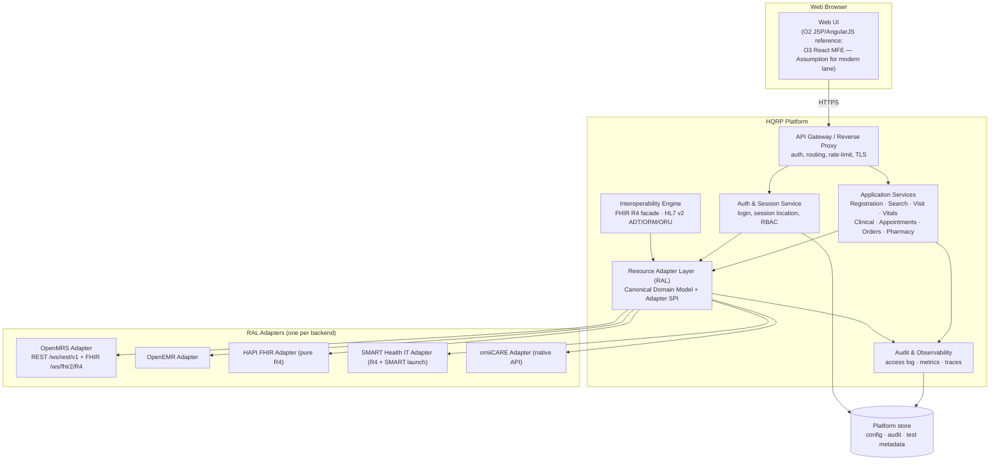
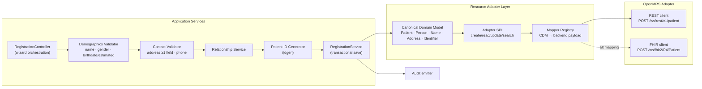
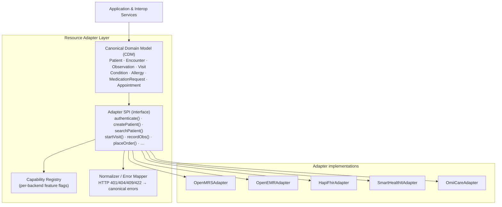
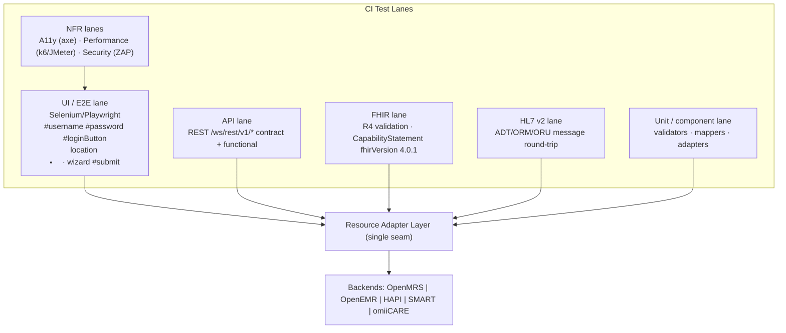
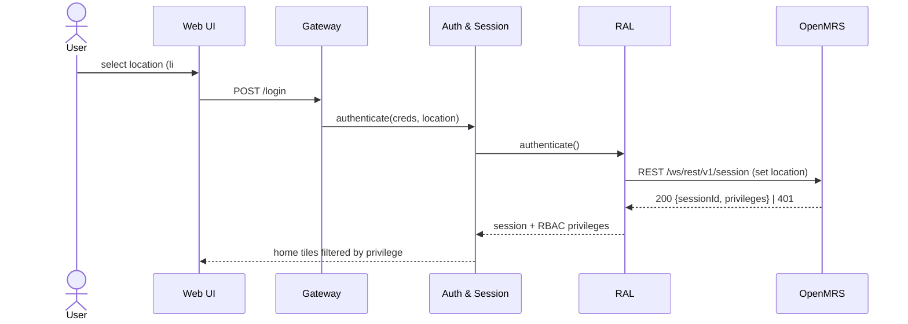
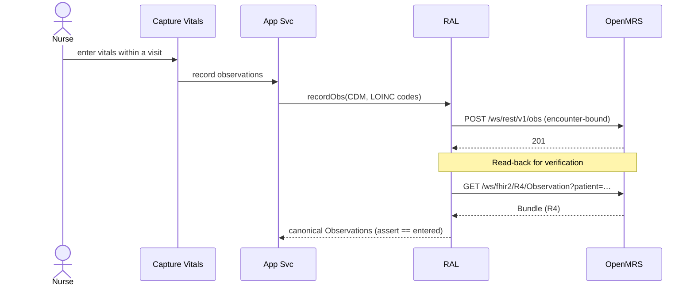
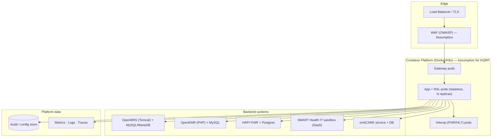

# Architecture Documentation
## OpenMRS-Primary Healthcare QA Reference Platform (HQRP)

> **Primary reference system:** OpenMRS Reference Application (legacy **O2**, https://o2.openmrs.org; modern demo **O3** at o3.openmrs.org).
> **Portability targets:** OpenEMR, HAPI FHIR, SMART Health IT, and the in-house **omiiCARE** app — all reached through a **Resource Adapter Layer (RAL)**.
> **Document date:** 2026-07-01 · **Status:** Baseline 1.0 · **Audience:** QA Architects, Business Analysts, Solution Architects.
> **Traceability:** Cross-references the 472-requirement catalog (`docs/requirements/`) and the 1,349-case RTM (`docs/RTM.md`). Requirement IDs follow `REQ-<PREFIX>-NNN`.
> **Convention:** Statements beyond verified OpenMRS behavior are tagged **(Assumption)**.

---

## Table of Contents
1. [Architectural Goals & Drivers](#1-architectural-goals--drivers)
2. [Reference-System Architecture (OpenMRS)](#2-reference-system-architecture-openmrs)
3. [C4 Model — Level 1: System Context](#3-c4-model--level-1-system-context)
4. [C4 Model — Level 2: Container View](#4-c4-model--level-2-container-view)
5. [C4 Model — Level 3: Component View](#5-c4-model--level-3-component-view)
6. [Resource Adapter Layer (RAL)](#6-resource-adapter-layer-ral)
7. [Test Architecture](#7-test-architecture)
8. [Data Flow](#8-data-flow)
9. [Integration Points](#9-integration-points)
10. [Deployment View](#10-deployment-view)
11. [Technology Stack](#11-technology-stack)
12. [Architecture Decision Log (Summary)](#12-architecture-decision-log-summary)
13. [Quality Attributes → Architecture Mapping](#13-quality-attributes--architecture-mapping)

---

## 1. Architectural Goals & Drivers

| # | Driver | Architectural Response | Req. trace |
|---|--------|------------------------|------------|
| D1 | **Vendor portability** — same test suite must run against ≥5 backends | Resource Adapter Layer (RAL) abstracts every backend behind a canonical domain model | REQ-FHIR-*, REQ-DATA-* |
| D2 | **Standards conformance** — FHIR R4, HL7 v2 | Dedicated interoperability containers; FHIR R4 base `4.0.1` validated from `CapabilityStatement` | REQ-FHIR-001..NNN, REQ-HL7-* |
| D3 | **Security & RBAC** — privilege-gated apps/actions | Session + role/privilege enforcement at gateway and service tiers; 401 on unauthenticated REST/FHIR | REQ-AUTH-*, REQ-RBAC-*, REQ-SEC-* |
| D4 | **Testability** — 1,349 manual + automated cases | Test architecture layered to the same boundaries as the product (UI → API → FHIR → DB) | REQ-* (all) |
| D5 | **Accessibility & performance** as first-class NFRs | A11y test lane + performance lane wired into CI | REQ-A11Y-*, REQ-PERF-* |
| D6 | **Observability & auditability** (HIPAA) | Centralized audit log of every PHI access/mutation | REQ-SEC-*, REQ-DATA-* |

---

## 2. Reference-System Architecture (OpenMRS)

OpenMRS O2 is a **modular Java monolith** built on the **OpenMRS API/core** with a **Spring + Hibernate** persistence core and a **module (OMOD) plugin system**. The Reference Application is an *assembly of modules* (coreapps, registrationapp, appointmentscheduling, fhir2, webservices.rest, etc.) over the platform.



**Key reference facts encoded above (verified):**
- REST at `/openmrs/ws/rest/v1/*` (session, patient, encounter, obs, visit, concept, relationship…); FHIR R4 at `/openmrs/ws/fhir2/R4` (`metadata` → `CapabilityStatement`, `fhirVersion 4.0.1`).
- REST/FHIR require auth (Basic/OAuth); unauthenticated → **401**.
- Login binds a **session location** (Outpatient Clinic, Inpatient Ward, Pharmacy, Laboratory, Registration Desk, Isolation Ward) before credentials.
- Apps are surfaced as **home-dashboard tiles** gated by privileges (RBAC).

**HQRP relationship to the reference:** HQRP does *not* fork OpenMRS. It treats OpenMRS as the **canonical behavioral oracle** and places a **Resource Adapter** in front of it (and each other backend) so the *same* requirement set and tests apply uniformly.

---

## 3. C4 Model — Level 1: System Context



**Context notes**
- The **same actors and use cases** apply regardless of which backend is wired in — this is the portability promise (D1).
- QA is modeled as a first-class actor: automation drives HQRP through the *same* public surfaces a human uses (UI, REST, FHIR).
- Terminology services (ICD-10/SNOMED/LOINC) are read-only references for coding (REQ-CLIN-*, REQ-ORDLAB-*).

---

## 4. C4 Model — Level 2: Container View



| Container | Responsibility | Key tech | Req. trace |
|-----------|----------------|----------|------------|
| Web UI | Render app tiles, registration wizard, patient dashboard | O2 JSP/AngularJS (ref); React MFE *(Assumption)* | REQ-REG-*, REQ-PDASH-* |
| API Gateway | TLS termination, routing, rate-limit, auth pre-check | NGINX / Spring Cloud Gateway *(Assumption)* | REQ-SEC-*, REQ-PERF-* |
| Auth & Session Service | Credential check, **session-location binding**, RBAC privilege resolution | Spring Security / OAuth2 | REQ-AUTH-*, REQ-RBAC-* |
| Application Services | Domain use cases (register, search, visit, vitals, orders…) | Service layer over RAL | REQ-REG/SRCH/VISIT/VITAL/CLIN/APPT/ORDLAB/PHARM-* |
| **RAL** | Map canonical domain ↔ each backend | Adapter SPI (see §6) | REQ-DATA-*, REQ-FHIR-* |
| Interoperability Engine | FHIR R4 facade + HL7 v2 messaging | HAPI FHIR libs, HL7 v2 parser | REQ-FHIR-*, REQ-HL7-* |
| Audit & Observability | Immutable PHI-access log, metrics, traces | Append-only store | REQ-SEC-*, REQ-DATA-* |

---

## 5. C4 Model — Level 3: Component View

Zoom into **Application Services + RAL** for the *Patient Registration* slice (representative; other slices follow the same shape).



| Component | Responsibility | Reference behavior | Req. trace |
|-----------|----------------|--------------------|------------|
| RegistrationController | Drive the multi-step wizard (Demographics → Contact → Relationships → Confirm `#submit`) | registrationapp wizard | REQ-REG-001..NNN |
| Demographics Validator | given/middle/family name, gender, **birthdate exact or estimated** | required-field rules | REQ-REG-* |
| Contact Validator | **address requires ≥1 field**, phone number | registrationapp contact step | REQ-REG-* |
| Patient ID Generator | unique Patient ID on save | idgen module | REQ-REG-* |
| RegistrationService | transactional save → redirect to dashboard → "Created Patient Record" toast | observed behavior | REQ-REG-*, REQ-PDASH-* |
| Canonical Domain Model | backend-neutral `Patient`/`Person`/`Identifier` | abstraction (Assumption) | REQ-DATA-* |
| Adapter SPI / Mapper | translate CDM → `POST /ws/rest/v1/patient` **or** FHIR `Patient` | dual-protocol | REQ-FHIR-*, REQ-DATA-* |

---

## 6. Resource Adapter Layer (RAL)

The RAL is the architectural keystone that makes one requirement set and one test suite portable across OpenMRS, OpenEMR, HAPI FHIR, SMART Health IT, and omiiCARE.

### 6.1 Design



### 6.2 Adapter capability matrix

| Capability (SPI) | OpenMRS (PRIMARY) | OpenEMR | HAPI FHIR | SMART Health IT | omiiCARE |
|------------------|-------------------|---------|-----------|-----------------|----------|
| Auth model | Basic / OAuth + **session location** | Basic / OAuth2 *(Assumption)* | none / token *(Assumption)* | **SMART launch** OAuth2/OIDC | JWT *(Assumption)* |
| Patient CRUD | REST `/ws/rest/v1/patient` + FHIR `Patient` | REST + FHIR `Patient` | FHIR `Patient` only | FHIR `Patient` only | native + FHIR *(Assumption)* |
| Encounter / Visit | REST `encounter`,`visit` + FHIR `Encounter` | REST + FHIR | FHIR `Encounter` | FHIR `Encounter` | native *(Assumption)* |
| Observation / Vitals | REST `obs` + FHIR `Observation` (LOINC) | FHIR `Observation` | FHIR `Observation` | FHIR `Observation` | native *(Assumption)* |
| Condition / Allergy | FHIR `Condition`,`AllergyIntolerance` | FHIR | FHIR | FHIR | FHIR *(Assumption)* |
| Orders / Meds | REST order + FHIR `MedicationRequest` | FHIR | FHIR `MedicationRequest` | FHIR | native *(Assumption)* |
| HL7 v2 ADT/ORM/ORU | via interop engine | via interop engine | not native *(Assumption)* | not native *(Assumption)* | via interop engine |
| Session location | **native** | partial *(Assumption)* | n/a | n/a | native *(Assumption)* |

> The **Capability Registry** lets a test skip-or-assert per backend: e.g. "session location" is asserted on OpenMRS/omiiCARE and marked *not-applicable* for pure-FHIR HAPI. This prevents false test failures when a backend genuinely lacks a feature.

### 6.3 Canonical error normalization

| Backend signal | Canonical error | Test expectation |
|----------------|-----------------|------------------|
| HTTP 401 (unauthenticated REST/FHIR) | `AUTH_REQUIRED` | REQ-AUTH-*, REQ-SEC-* negative tests |
| HTTP 403 (privilege missing) | `FORBIDDEN` | REQ-RBAC-* deny tests |
| HTTP 404 | `NOT_FOUND` | search/lookup edge cases |
| HTTP 409 / duplicate identifier | `CONFLICT` | REQ-REG-* duplicate-patient |
| HTTP 422 / validation | `VALIDATION_FAILED` | REQ-REG-* field validation |

---

## 7. Test Architecture

Tests are layered to the **same boundaries** as the product so a failure localizes to a layer. Aligned with `docs/TEST_PYRAMID.md` and `docs/MASTER_TEST_PLAN.md`.



| Lane | Targets | Selectors / contracts (verified) | Req. trace |
|------|---------|----------------------------------|------------|
| UI / E2E | Login, registration wizard, dashboard widgets | `#username`,`#password`,`#loginButton`; location `<li id=…>`; wizard `#submit`; "Created Patient Record" toast | REQ-AUTH-*, REQ-REG-*, REQ-PDASH-* |
| API (REST) | session, patient, encounter, obs, visit, concept, relationship | `/openmrs/ws/rest/v1/*`; 401 when unauth | REQ-* functional |
| FHIR (R4) | Patient, Encounter, Observation, Condition, AllergyIntolerance, MedicationRequest | `/ws/fhir2/R4/metadata` → `CapabilityStatement`, `fhirVersion 4.0.1` | REQ-FHIR-* |
| HL7 v2 | ADT (registration/visit), ORM (orders), ORU (results) | message structure round-trip | REQ-HL7-* |
| A11y | WCAG keyboard/labels/contrast on key flows | axe-core ruleset | REQ-A11Y-* |
| Performance | login, search, dashboard load, FHIR read | latency/throughput SLOs | REQ-PERF-* |
| Security | authz, 401/403, injection, headers | OWASP Top 10 | REQ-SEC-* |
| Unit/component | validators, mappers, capability registry | pure functions | cross-cutting |

**Portability of tests:** the same UI/API/FHIR cases run against any backend because they target the RAL seam. Backend-specific gaps are handled by the **Capability Registry** (skip-or-assert), not by branching test code.

---

## 8. Data Flow

### 8.1 Login with session location (REQ-AUTH-*, REQ-RBAC-*)



### 8.2 Patient registration → dashboard (REQ-REG-*, REQ-PDASH-*)

```mermaid
sequenceDiagram
  actor C as Registration Clerk
  participant UI as Registration Wizard
  participant APP as Application Svc
  participant RAL as RAL
  participant OM as OpenMRS
  participant AUD as Audit
  C->>UI: Demographics → Contact → Relationships → Confirm (#submit)
  UI->>APP: submit canonical Patient
  APP->>APP: validate (name/gender/birthdate; address ≥1; phone)
  APP->>RAL: createPatient(CDM)
  RAL->>OM: POST /ws/rest/v1/patient (idgen → Patient ID)
  OM-->>RAL: 201 {patientId}
  RAL-->>APP: Patient ID
  APP->>AUD: audit(create, patientId, user, location)
  APP-->>UI: redirect to dashboard + "Created Patient Record" toast
```

### 8.3 Vitals capture & FHIR read-back (REQ-VITAL-*, REQ-FHIR-*)



---

## 9. Integration Points

| # | Integration | Protocol / surface | Direction | Auth | Req. trace |
|---|-------------|--------------------|-----------|------|------------|
| I1 | OpenMRS REST | `/openmrs/ws/rest/v1/*` | bidirectional | Basic/OAuth, 401 if absent | REQ-* |
| I2 | OpenMRS FHIR R4 | `/openmrs/ws/fhir2/R4` | bidirectional | Basic/OAuth | REQ-FHIR-* |
| I3 | OpenEMR | REST + FHIR R4 | bidirectional | OAuth2 *(Assumption)* | REQ-FHIR-*, REQ-DATA-* |
| I4 | HAPI FHIR | FHIR R4 only | bidirectional | token *(Assumption)* | REQ-FHIR-* |
| I5 | SMART Health IT | FHIR R4 + SMART App Launch | bidirectional | OAuth2/OIDC SMART scopes | REQ-FHIR-*, REQ-SEC-* |
| I6 | omiiCARE | native API + FHIR facade | bidirectional | JWT *(Assumption)* | REQ-DATA-* |
| I7 | LIS / Lab | HL7 v2 **ORM** out / **ORU** in | bidirectional | VPN/MLLP *(Assumption)* | REQ-ORDLAB-*, REQ-HL7-* |
| I8 | HIE / partner EHR | HL7 v2 **ADT** | bidirectional | MLLP/TLS *(Assumption)* | REQ-HL7-* |
| I9 | Identity Provider | OAuth2 / OIDC | inbound | — | REQ-AUTH-*, REQ-SEC-* |
| I10 | Terminology | ICD-10 / SNOMED / LOINC lookup | outbound read | — | REQ-CLIN-*, REQ-ORDLAB-* |
| I11 | Notifications | email/SMS *(Assumption)* | outbound | API key | REQ-NOTIF-* |
| I12 | Billing | claims/charge export *(Assumption)* | outbound | — | REQ-BILL-* |
| I13 | Telehealth | video session link *(Assumption)* | outbound | — | REQ-TELE-* |

**FHIR resource coverage (verified for OpenMRS fhir2):** `Patient`, `Encounter`, `Observation`, `Condition`, `AllergyIntolerance`, `MedicationRequest`; base FHIR version **4.0.1** from `CapabilityStatement`.

---

## 10. Deployment View



| Concern | Approach | Req. trace |
|---------|----------|------------|
| Topology | Stateless gateway/app/interop pods; sessions externalized | REQ-PERF-*, REQ-SEC-* |
| Scaling | Horizontal replicas on app + interop; backends scale independently | REQ-PERF-* |
| Environments | `dev` (single backend) → `qa` (multi-backend matrix) → `stage` → `prod` *(Assumption)* | — |
| Secrets/TLS | TLS everywhere; secret manager; no creds in images *(Assumption)* | REQ-SEC-* |
| Backups/DR | Per-backend DB backup + audit-store retention | REQ-DATA-*, REQ-SEC-* |
| Observability | Central logs/metrics/traces; immutable audit | REQ-SEC-*, REQ-DATA-* |

> **Reference baseline (verified):** OpenMRS RefApp itself deploys as a **Tomcat web app over MySQL/MariaDB**. The K8s/multi-replica topology above is the **HQRP wrapper** deployment **(Assumption)**, not a claim about stock OpenMRS.

---

## 11. Technology Stack

| Layer | Reference (OpenMRS, verified) | HQRP platform (Assumption where noted) | Test tooling |
|-------|-------------------------------|----------------------------------------|--------------|
| Client | JSP + AngularJS (O2); React MFE (O3) | Web-responsive UI | Selenium / Playwright |
| App server | Java + Spring + Tomcat | Java/Spring services *(Assumption)* | JUnit / Mockito |
| Modules | OMOD plugins (coreapps, registrationapp, fhir2, webservices.rest) | RAL adapters (SPI) | contract tests |
| Persistence | Hibernate ORM → MySQL/MariaDB | Postgres for platform store *(Assumption)* | Testcontainers *(Assumption)* |
| REST | `/ws/rest/v1/*` | gateway-fronted | REST-assured / Postman (`postman/`) |
| FHIR | fhir2 module, R4 `4.0.1` | HAPI FHIR libs facade | FHIR validator |
| HL7 v2 | (via integration) | HL7 v2 parser (ADT/ORM/ORU) | message harness |
| Security | Spring Security, RBAC privileges | OAuth2/OIDC, SMART launch | OWASP ZAP |
| Coding systems | ICD-10 / SNOMED / LOINC | terminology client | code-validity tests |
| A11y / Perf | — | — | axe-core / k6 / JMeter |
| CI/CD | — | pipeline per `docs/CI_CD_GUIDE.md` | lane orchestration |

---

## 12. Architecture Decision Log (Summary)

| ADR | Decision | Rationale | Status |
|-----|----------|-----------|--------|
| ADR-A1 | Adopt **Resource Adapter Layer** with canonical domain model | One requirement set + test suite across 5 backends (D1) | Accepted |
| ADR-A2 | Treat **OpenMRS as oracle**, do not fork | Verified behavior is the contract; portability via adapters | Accepted |
| ADR-A3 | **Capability Registry** for skip-or-assert | Avoid false failures where a backend lacks a feature | Accepted |
| ADR-A4 | **FHIR R4 (4.0.1)** as canonical interop wire format | Matches OpenMRS fhir2; widest backend support | Accepted |
| ADR-A5 | **HL7 v2** kept in dedicated interop engine | ADT/ORM/ORU legacy integration isolated from app core | Accepted |
| ADR-A6 | **Normalize errors** to canonical codes | Stable test assertions across HTTP status variance | Accepted |
| ADR-A7 | Tests target the **RAL seam**, NFRs target UI | Layered failure localization; portability | Accepted |

---

## 13. Quality Attributes → Architecture Mapping

| Quality attribute | Architectural mechanism | Verified anchor | Req. trace |
|-------------------|-------------------------|-----------------|------------|
| Portability | RAL + canonical model + capability registry | OpenMRS REST + FHIR dual surface | REQ-DATA-*, REQ-FHIR-* |
| Security | Gateway authz, session+RBAC, 401/403, audit | unauth REST/FHIR → 401 | REQ-AUTH-*, REQ-RBAC-*, REQ-SEC-* |
| Interoperability | FHIR R4 facade + HL7 v2 engine | `CapabilityStatement` 4.0.1; fhir2 resources | REQ-FHIR-*, REQ-HL7-* |
| Testability | Boundary-aligned test lanes at RAL seam | stable selectors `#username/#loginButton/#submit` | REQ-* |
| Accessibility | A11y lane on key flows | — | REQ-A11Y-* |
| Performance | Stateless horizontal scaling + perf lane | — | REQ-PERF-* |
| Auditability (HIPAA) | Immutable PHI-access audit on every mutation | session location captured at login | REQ-SEC-*, REQ-DATA-* |

---

> **Cross-document links:** `SRS.md` (parent requirements), `RBAC_MATRIX.md` (privilege gating), `FHIR_GUIDE.md` / `HL7_GUIDE.md` (interop detail), `MASTER_TEST_PLAN.md` + `TEST_PYRAMID.md` (test lanes), `DEPLOYMENT_GUIDE.md` (deploy specifics), `DATA_DICTIONARY.md` (canonical model fields).
