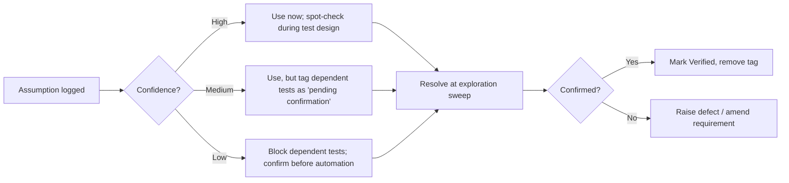
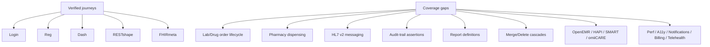

# Assumptions & Open Questions
## OpenMRS-Primary Healthcare QA Reference Platform

> **Document type:** Assumptions & Open Questions register (reverse-engineering control document)
> **Primary reference system:** OpenMRS Reference Application — legacy O2 (https://o2.openmrs.org); modern demo O3 (https://o3.openmrs.org)
> **Generated:** 2026-07-01
> **Status:** Baseline v1.0
> **Owner:** QA Architecture / Business Analysis / Solution Architecture
> **Traceability:** 472 requirements (`REQ-<PREFIX>-NNN`) across 21 modules, 1,349 manual test cases (see `docs/requirements/requirements-catalog.md`, `docs/RTM.md`).

> **Why this document exists.** Every reverse-engineered artifact in `docs/reverse-engineering/` (BRD, SRS, FRD, NFR, API blueprint, data dictionary, RBAC matrix, validation matrix, use cases, user stories) embeds assumptions — places where we extrapolated beyond what was directly observed on the live OpenMRS Reference Application. This register **centralizes** those assumptions so they can be confirmed, challenged, or retired in one place, rather than buried across thirteen documents. It is the single source of truth for *"what do we still need to verify before treating this baseline as authoritative?"*

> **Convention.** Each item carries an ID, a confidence level, the impact if the assumption is wrong, and a resolution path. **(Assumption)** marks anything not directly verified on the live system. **(Verified)** marks facts observed against the OpenMRS Reference Application.

---

## 1. How to Read This Register

| Field | Meaning |
|---|---|
| **ID** | `ASM-NNN` (assumption) or `OQ-NNN` (open question). Stable across versions. |
| **Confidence** | **High** = strongly implied by verified behavior / standards; **Medium** = reasonable inference; **Low** = guess, needs confirmation before relying on it. |
| **Impact if wrong** | What breaks (tests, requirements, architecture) if the assumption is false. |
| **Affects REQ** | Requirement IDs whose interpretation depends on this assumption. |
| **Resolution** | How to confirm: live exploration, source-code read, SME interview, standards lookup, or backend-owner sign-off. |

### Confidence → action policy

---

## 2. Scope & Methodology of the Reverse-Engineering Effort

### 2.1 What "reverse-engineering" meant here

- **Primary method:** Black-box exploration of the OpenMRS Reference Application UI + documented REST (`/openmrs/ws/rest/v1/*`) and FHIR R4 (`/openmrs/ws/fhir2/R4`) contracts.
- **Secondary method:** Inference from healthcare standards (FHIR R4, HL7 v2 ADT/ORM/ORU, ICD-10/SNOMED/LOINC/RxNorm) and from common EHR domain patterns.
- **NOT used:** We did not (in this pass) read the OpenMRS Java/OWA source, run the database, or instrument the server. Many internal-behavior assumptions below stem directly from that boundary. **(Assumption)** that black-box + standards inference is sufficient for a QA *baseline*; deep conformance claims still need source/DB confirmation.

### 2.2 Multi-backend framing

The document set is designed to validate against **OpenMRS (primary), OpenEMR, HAPI FHIR, SMART Health IT, and the in-house omiiCARE app** through a **Resource Adapter Layer (RAL)**. A large class of assumptions exists *only* because we are generalizing OpenMRS-observed behavior into a backend-neutral contract. These are flagged **[RAL]**.

---

## 3. Assumptions Register

### 3.1 Authentication & Session (AUTH, SEC)

| ID | Assumption | Conf. | Impact if wrong | Affects REQ | Resolution |
|---|---|---|---|---|---|
| ASM-001 | Session location is **mandatory** before username/password and constrains downstream encounter `location`. **(Verified)** location list exists; **(Assumption)** that it is enforced server-side, not just UI. | High | Location-scoped tests (VITAL/VISIT) mis-target | REQ-AUTH-001..010, REQ-VISIT-003 | Inspect REST `session` POST; attempt API call with mismatched location |
| ASM-002 | Demo credentials `admin/Admin123` map to a **superuser** with all privileges; role-gated tests must use *non-admin* accounts. **(Assumption)** such accounts are provisionable on the demo. | High | RBAC negative tests invalid if only admin exists | REQ-RBAC-001..040, REQ-AUTH-006 | Confirm seed users per role exist or can be created |
| ASM-003 | Account lockout, password complexity, and session timeout follow configurable OpenMRS global properties; **(Assumption)** default thresholds (e.g., lockout after N attempts) are unknown. | Low | SEC lockout/timeout tests assert wrong thresholds | REQ-SEC-004, REQ-SEC-009, REQ-AUTH-008 | Read global props `security.*`; SME confirm |
| ASM-004 | `#username` / `#password` / `#loginButton` selectors and `<li id="...">` location items are **stable** across O2 builds. **(Verified)** present today; **(Assumption)** stable. | Medium | UI automation locators break | REQ-AUTH-001, REQ-A11Y-002 | Pin to a build; re-verify on upgrade (see UPGRADE_GUIDE.md) |
| ASM-005 | **[RAL]** Other backends authenticate via Basic/OAuth2/SMART-on-FHIR; the adapter normalizes to a single "authenticated session" concept. **(Assumption)** SMART Health IT uses SMART launch, not form login. | Medium | Cross-backend auth tests need per-backend auth strategy | REQ-AUTH-*, REQ-FHIR-001 | Define auth strategy per adapter; confirm omiiCARE scheme |

### 3.2 Registration & Demographics (REG, SRCH)

| ID | Assumption | Conf. | Impact if wrong | Affects REQ | Resolution |
|---|---|---|---|---|---|
| ASM-010 | Registration wizard order is Demographics → Contact Info → Relationships → Confirm, with **Address requiring ≥1 field** and `#submit` finalizing. **(Verified)** | High | Wizard-flow tests mis-sequence | REQ-REG-001..015 | Verified; re-check if registrationapp config changes |
| ASM-011 | Patient **ID is server-generated, unique, and non-editable** post-creation (idgen module). **(Assumption)** format/check-digit (e.g., Luhn mod 30) not confirmed. | High | ID-format validation tests assert wrong pattern | REQ-REG-008, REQ-SRCH-004 | Inspect idgen source/config; capture sample IDs |
| ASM-012 | "Estimated" birthdate stores an age→DOB derivation and flags `birthdateEstimated=true`. **(Assumption)** exact derivation rule (year-only vs month) unconfirmed. | Medium | Age-calculation tests off by months | REQ-REG-005, REQ-PDASH-003 | Verify via REST `patient` payload `birthdateEstimated` |
| ASM-013 | Search (`coreapps findPatient`) matches on name + identifier with **partial/prefix** matching and is **case-insensitive**. **(Assumption)** phonetic/soundex behavior unknown. | Medium | Search fuzzy-match tests wrong | REQ-SRCH-001..006 | Probe with diacritics, partials, transposed letters |
| ASM-014 | Duplicate-patient detection exists but does **not hard-block** creation (warn-only). **(Assumption)** — not observed; OpenMRS commonly warns. | Low | Dup-prevention test expects block | REQ-REG-012 | Attempt duplicate; observe warn vs block |
| ASM-015 | **[RAL]** All backends expose given/family/gender/birthdate as required-equivalent; omiiCARE may add mandatory national-ID. **(Assumption)** | Medium | Required-field matrix diverges per backend | REQ-REG-001, REQ-DATA-002 | Per-backend field-requirement matrix |

### 3.3 Visits, Vitals & Clinical (VISIT, VITAL, CLIN)

| ID | Assumption | Conf. | Impact if wrong | Affects REQ | Resolution |
|---|---|---|---|---|---|
| ASM-020 | A patient may have **one active visit at a time** per location; "Add Past Visit" backdates. **(Assumption)** concurrency rule not stress-tested. | Medium | Concurrent-visit tests mis-assert | REQ-VISIT-001..006 | Attempt overlapping visits via REST |
| ASM-021 | Vitals (height, weight, BP, pulse, temp, SpO2, resp rate) map to **LOINC-coded concepts** with numeric ranges that trigger warnings, not hard rejects. **(Assumption)** ranges/units unconfirmed. | Medium | Range-validation tests assert wrong bounds/units | REQ-VITAL-001..012 | Inspect concept dictionary `conceptNumeric` ranges |
| ASM-022 | Weight graph plots historical weight obs chronologically; units are **kg** by default. **(Assumption)** unit toggle behavior unknown. | Low | Graph/unit tests wrong | REQ-PDASH-009, REQ-VITAL-004 | Verify obs `units` field |
| ASM-023 | Diagnoses use ICD-10/SNOMED concepts; **coded vs free-text** both allowed. **(Assumption)** | Medium | Coding-conformance tests over/under-strict | REQ-CLIN-003, REQ-FHIR-006 | Inspect emr-api diagnosis concept source |
| ASM-024 | "Mark Patient Deceased" sets `dead=true` + `deathDate` + `causeOfDeath` (coded) and may **auto-close active visits**. **(Assumption)** cascade behavior unconfirmed. | Medium | Deceased-cascade tests wrong | REQ-CLIN-010, REQ-VISIT-006 | Mark test patient; observe visit/order cascade |

### 3.4 Orders, Pharmacy, Appointments (ORDLAB, PHARM, APPT)

| ID | Assumption | Conf. | Impact if wrong | Affects REQ | Resolution |
|---|---|---|---|---|---|
| ASM-030 | Lab orders follow an order→sample→result lifecycle expressible as HL7 v2 **ORM/ORU**; result entry is a separate role (Lab Tech). **(Assumption)** OpenMRS order-entry module presence/version unconfirmed on demo. | Low | ORDLAB lifecycle tests assume absent module | REQ-ORDLAB-001..015, REQ-HL7-004 | Confirm orderentry/labonfhir module enabled |
| ASM-031 | Drug orders capture drug + dose + frequency + route + duration; dispensing is Pharmacist-gated. **(Assumption)** dispense workflow may be absent in base RefApp. | Low | PHARM tests assume dispensing UI exists | REQ-PHARM-001..012, REQ-RBAC-022 | Confirm dispensing app installed |
| ASM-032 | Appointment scheduling supports book/reschedule/cancel with status transitions and provider+service+time slots. **(Assumption)** appointmentschedulingui module behavior generalized. | Medium | APPT state-machine tests wrong | REQ-APPT-001..014, REQ-NOTIF-003 | Explore Appointment Scheduling app |
| ASM-033 | **[RAL]** Orders/appointments map to FHIR `ServiceRequest`/`MedicationRequest`/`Appointment`; not all backends populate all fields. **(Assumption)** | Medium | FHIR field-conformance tests over-strict | REQ-FHIR-007, REQ-APPT-001 | Per-backend FHIR capability check |

### 3.5 RBAC & Privileges (RBAC, SEC)

| ID | Assumption | Conf. | Impact if wrong | Affects REQ | Resolution |
|---|---|---|---|---|---|
| ASM-040 | Privileges (Add/Edit/Delete Patients, Manage Roles, etc.) gate **both UI tile visibility and API authorization**; API returns **403** (not just hidden UI) when unauthorized. **(Assumption)** — UI gating verified, API enforcement inferred. | High | Negative RBAC tests pass falsely if only UI gated | REQ-RBAC-*, REQ-SEC-006 | Call REST/FHIR with under-privileged token; expect 403 |
| ASM-041 | The named roles (Doctor/Clinician, Nurse, Registration Clerk, Pharmacist, Lab Tech, System Administrator) exist as **seed roles** with the privilege sets in RBAC_MATRIX.md. **(Assumption)** exact privilege membership per role unconfirmed. | Medium | RBAC_MATRIX cells wrong | REQ-RBAC-001..040 | Read role/privilege seed data via REST `role` |
| ASM-042 | Privilege checks are **deny-by-default** (absent privilege = denied). **(Assumption)** | High | Authz model inverted in tests | REQ-RBAC-002, REQ-SEC-006 | Confirm default-deny in source/behavior |
| ASM-043 | "Delete Patient" is a **void (soft-delete)**, recoverable, audited — not a hard DB delete. **(Assumption)** | Medium | Deletion + audit tests assert hard delete | REQ-RBAC-024, REQ-DATA-007, REQ-SEC-010 | Delete then query voided patient via REST |

### 3.6 Interoperability — FHIR & HL7 (FHIR, HL7)

| ID | Assumption | Conf. | Impact if wrong | Affects REQ | Resolution |
|---|---|---|---|---|---|
| ASM-050 | FHIR endpoint is **R4 (4.0.1)** per CapabilityStatement; supported resources: Patient, Encounter, Observation, Condition, AllergyIntolerance, MedicationRequest. **(Verified)** metadata; **(Assumption)** read/write parity for each. | High | FHIR conformance suite targets wrong resources/ops | REQ-FHIR-001..020 | Probe each resource for read/search/create support |
| ASM-051 | Unauthenticated REST/FHIR calls return **401**; the suite uses 401 as the negative-auth oracle. **(Verified)** for documented endpoints. | High | Auth negative tests mis-assert | REQ-FHIR-002, REQ-SEC-001 | Verified; re-check per endpoint |
| ASM-052 | HL7 v2 (ADT/ORM/ORU/SIU) is **inbound-capable** via the hl7 module but **not exposed on the demo** UI; HL7 tests are **design-level / RAL-only** until a real interface engine is wired. **(Assumption)** | Medium | HL7 execution tests have no system-under-test | REQ-HL7-001..018 | Stand up Mirth/hl7 listener; or mark HL7 as adapter-mocked |
| ASM-053 | Terminology bindings (ICD-10/SNOMED/LOINC/RxNorm) are present as **concept mappings**, but the demo dictionary may be **partial**. **(Assumption)** | Medium | Coding-conformance tests fail on missing maps | REQ-FHIR-006, REQ-CLIN-003 | Inspect conceptmap/source coverage |
| ASM-054 | **[RAL]** HAPI FHIR and SMART Health IT are **FHIR-native** (no HL7 v2); omiiCARE FHIR maturity is **unknown**. **(Assumption)** | Medium | Backend-neutral tests assume uniform FHIR | REQ-FHIR-*, REQ-HL7-* | Capability statement per backend; omiiCARE owner input |

### 3.7 Data, Reports, Non-Functional (DATA, RPT, NFR, PERF, A11Y, NOTIF, BILL, TELE)

| ID | Assumption | Conf. | Impact if wrong | Affects REQ | Resolution |
|---|---|---|---|---|---|
| ASM-060 | All PHI-touching actions write to an **audit/log table** sufficient for HIPAA access-audit tests. **(Assumption)** — OpenMRS has audit capability; demo retention/coverage unconfirmed. | High | HIPAA audit tests unverifiable | REQ-DATA-007, REQ-SEC-010 | Confirm auditlog module + queryable trail |
| ASM-061 | Reports module produces patient-line and aggregate outputs (CSV/PDF) with **role-gated** access. **(Assumption)** report definitions on demo unknown. | Low | RPT tests assume specific reports | REQ-RPT-001..010 | Enumerate available report definitions |
| ASM-062 | **BILL** (billing) and **TELE** (telehealth) modules are **NOT part of base OpenMRS RefApp**; these requirements are **omiiCARE/extension-targeted (Assumption)** and have no OpenMRS system-under-test. | High | BILL/TELE tests fail "no SUT" if run vs OpenMRS | REQ-BILL-*, REQ-TELE-* | Confirm target backend per requirement; mark OpenMRS N/A |
| ASM-063 | Performance baselines (page load, search latency, API p95) are **(Assumption)** targets set by NFR.md, not measured on the live demo. | Medium | PERF tests measure against arbitrary SLA | REQ-PERF-001..008 | Baseline against a controlled instance |
| ASM-064 | Accessibility target is **WCAG 2.1 AA**; legacy O2 likely has **gaps** (the O3 UI differs substantially). **(Assumption)** | Medium | A11Y tests over-fail on legacy UI | REQ-A11Y-001..012 | Pick O2 vs O3 as A11Y SUT; document which |
| ASM-065 | Notifications (appointment reminders, etc.) are **(Assumption)** — no email/SMS channel confirmed on demo. | Low | NOTIF tests have no delivery channel | REQ-NOTIF-001..006 | Confirm messaging/notification module |

### 3.8 Architecture & Resource Adapter Layer (cross-cutting)

| ID | Assumption | Conf. | Impact if wrong | Affects REQ | Resolution |
|---|---|---|---|---|---|
| ASM-070 | **[RAL]** A single requirement/test set can be parameterized across 5 backends via adapters; **≥70%** of requirements are backend-neutral, the rest are backend-specific. **(Assumption)** ratio is an estimate. | Medium | Test reuse economics overstated | All REQ | Tag each requirement neutral vs specific |
| ASM-071 | **[RAL]** Adapters normalize identity, terminology, and resource shapes; **semantic mismatches** (e.g., OpenMRS concept vs FHIR code) are resolvable in-adapter. **(Assumption)** some may not be. | Medium | Some cross-backend tests un-portable | REQ-DATA-*, REQ-FHIR-* | Build a thin spike adapter; measure mismatch rate |
| ASM-072 | OpenMRS is the **canonical model**; other backends map *toward* OpenMRS semantics. **(Assumption)** could bias the model. | Medium | Backend-neutral claims skew to OpenMRS | All REQ | Validate model against FHIR R4 as neutral anchor |
| ASM-073 | The 472 requirements / 1,349 test cases / RTM are **internally consistent and complete** for the explored journeys. **(Assumption)** completeness not yet audited against coverage matrix. | High | Coverage gaps undetected | RTM | Run coverage audit (see §6) |

---

## 4. Open Questions (require external input / sign-off)

| ID | Question | Owner to answer | Blocks | Until answered |
|---|---|---|---|---|
| OQ-001 | Is the QA baseline targeted at **O2 (legacy)** or **O3 (modern)** as the primary SUT? They differ in UI, selectors, and A11Y posture. | Product / QA lead | Locator strategy, A11Y scope (ASM-004, ASM-064) | Maintain dual-locator notes; do not automate UI |
| OQ-002 | Which backends are **in-scope for execution** vs design-only this release? (OpenEMR, HAPI, SMART, omiiCARE) | Solution architect | RAL build order, BILL/TELE/HL7 SUT (ASM-052, ASM-062) | Treat non-OpenMRS as design-level |
| OQ-003 | What are omiiCARE's **auth scheme, FHIR maturity, and mandatory fields**? | omiiCARE product owner | ASM-005, ASM-015, ASM-054 | omiiCARE tests are placeholders |
| OQ-004 | Are **per-role seed accounts** available on the SUT for RBAC negative testing, or must we provision them? | Environment owner | ASM-002, ASM-041 | RBAC tests blocked at automation |
| OQ-005 | What is the **patient ID format / check-digit** algorithm? | OpenMRS SME / idgen config | ASM-011 | ID-format assertions loose |
| OQ-006 | Are **lab order-entry, dispensing, and HL7 listener** modules enabled on the SUT? | Environment owner | ASM-030, ASM-031, ASM-052 | ORDLAB/PHARM/HL7 design-level |
| OQ-007 | Is patient **deletion a void (recoverable)** and is it audited? Same for merge. | OpenMRS SME | ASM-043, ASM-060 | Deletion tests assert soft-delete tentatively |
| OQ-008 | What are the **agreed performance SLAs** and the reference hardware? | Architecture / Ops | ASM-063 | PERF tests informational only |
| OQ-009 | What is the **audit log schema + retention** and is it queryable for test assertions? | Compliance / DBA | ASM-060 | HIPAA audit tests unverifiable |
| OQ-010 | Which **terminology code systems are mandatory** for conformance (ICD-10 vs SNOMED primary; LOINC for labs/vitals)? | Compliance / standards | ASM-021, ASM-023, ASM-053 | Coding tests warn-only |
| OQ-011 | Is **consent capture** (FHIR `Consent` / OpenMRS) in scope? Not observed in explored journeys. | Compliance | Privacy/consent requirements | No consent tests authored |
| OQ-012 | What is the **data-reset / fixture strategy** on the shared demo (it may be reset nightly / mutated by others)? | Environment owner | All stateful tests | Use self-contained fixtures; avoid shared-state asserts |

---

## 5. Areas Needing Live Confirmation (verification backlog)

Prioritized list of probes to run against a controlled instance to retire the highest-impact assumptions.

| Priority | Probe | Retires | Method |
|---|---|---|---|
| P1 | Call REST + FHIR with an **under-privileged token**; confirm 403 vs 200 | ASM-040, ASM-042 | API (Postman/curl), no UI |
| P1 | Confirm **per-role seed users** and their privilege sets | ASM-002, ASM-041 | REST `role`, `user` |
| P1 | Enumerate **enabled modules** (orderentry, dispensing, hl7, auditlog, reporting, appointmentscheduling) | ASM-030/031/052/060/061 | REST `module` / admin page |
| P1 | Capture **patient payload** post-registration: ID format, `birthdateEstimated`, identifiers | ASM-011, ASM-012 | REST `patient` |
| P2 | Inspect **conceptNumeric ranges + units** for vitals | ASM-021, ASM-022 | REST `concept` |
| P2 | Probe each **FHIR resource** for read/search/create/update support | ASM-050, ASM-033 | FHIR `metadata` + per-resource calls |
| P2 | Attempt **duplicate registration** and **overlapping visits** | ASM-014, ASM-020 | UI + REST |
| P2 | Mark a test patient **deceased**; observe visit/order cascade | ASM-024 | UI + REST |
| P3 | Measure **search behavior**: partials, diacritics, transpositions, case | ASM-013 | UI/REST search |
| P3 | Confirm **delete = void** and presence of **audit trail** entry | ASM-043, ASM-060 | REST `patient` (voided), auditlog |
| P3 | Inspect **terminology/conceptmap** coverage | ASM-053, ASM-010 | REST `conceptsource`, `conceptmap` |
| P3 | Baseline **performance** under controlled load | ASM-063 | Load harness |

> **Do-not-mutate caution (OQ-012):** the public demo is shared. Confirmation probes that create/void data should run on a **private, disposable instance**, not o2/o3.openmrs.org, to avoid polluting shared state and to keep results reproducible.

---

## 6. Exploration Coverage Notes

### 6.1 Journeys explored (basis for verified facts)

| Journey | Depth | Coverage | Notes |
|---|---|---|---|
| Login with session-location selection | Deep | Full happy path | Selectors + location list verified |
| Home dashboard / app-tile inventory | Deep | Full | All major tiles catalogued |
| Register a patient (4-step wizard) | Deep | Happy path + field rules | Address ≥1 field, `#submit`, toast verified |
| Patient dashboard widgets + General Actions | Medium | Inventory verified, deep behavior inferred | Action *effects* mostly inferred (ASM-024, ASM-043) |
| REST contract shape (`/ws/rest/v1/*`) | Medium | Documented endpoints | Auth=401 verified; payload specifics partial |
| FHIR R4 contract (`/ws/fhir2/R4`) | Medium | CapabilityStatement | Per-resource op parity inferred (ASM-050) |
| RBAC role/privilege model | Shallow | Concept verified, membership inferred | API enforcement not probed (ASM-040/041) |

### 6.2 Journeys partially or NOT explored (coverage gaps)

| Area | Status | Why not explored | Linked items |
|---|---|---|---|
| Lab/drug order lifecycle | Inferred only | Module presence on demo unconfirmed | ASM-030/031, OQ-006 |
| Pharmacy dispensing | Inferred only | Likely absent in base RefApp | ASM-031, OQ-006 |
| HL7 v2 messaging | Design-level | No exposed interface engine | ASM-052, OQ-006 |
| Audit trail assertions | Inferred only | Schema/retention/queryability unknown | ASM-060, OQ-009 |
| Reports content | Inferred only | Report definitions on demo unknown | ASM-061, OQ-... |
| Merge / Delete cascade behavior | Inferred only | Mutating action not run on shared demo | ASM-024/043, OQ-007 |
| Consent capture | Not explored | Not surfaced in observed journeys | OQ-011 |
| OpenEMR / HAPI / SMART / omiiCARE | Not explored | Out-of-scope for this pass; RAL design only | ASM-070..072, OQ-002/003 |
| Performance / Accessibility / Notifications / Billing / Telehealth | Design-level | No measured SUT / module absent | ASM-062/063/064/065, OQ-001/008 |

### 6.3 Coverage self-assessment

- **Strong (verified):** AUTH happy path, REG wizard, dashboard inventory, FHIR R4 version + resource list, 401 auth oracle.
- **Medium (inferred from verified behavior + standards):** RBAC model, VISIT/VITAL/CLIN semantics, FHIR per-resource parity.
- **Weak (design-level, no live SUT):** ORDLAB, PHARM, HL7, BILL, TELE, NOTIF, PERF, audit assertions, and **all non-OpenMRS backends**.
- **Completeness of requirement catalog (ASM-073):** assumed complete for explored journeys; **a formal RTM coverage audit has not yet run** — this is itself an open action.

---

## 7. Risk of Acting on Unconfirmed Assumptions

| Risk | Driven by | Severity | Mitigation |
|---|---|---|---|
| Negative RBAC tests pass falsely (UI-gated only, API open) | ASM-040 | **Critical** | P1 API authz probe before trusting any RBAC result |
| HIPAA audit requirements declared "tested" without a real trail | ASM-060 | **Critical** | Block audit-pass claims until OQ-009 resolved |
| Whole modules (BILL/TELE/HL7/ORDLAB/PHARM) reported as failing for "no SUT" | ASM-062, ASM-052 | High | Mark N/A-vs-OpenMRS explicitly; route to correct backend |
| UI automation rots on O2/O3 divergence | ASM-004, OQ-001 | High | Pick one SUT; defer UI automation until OQ-001 |
| Cross-backend reuse economics overstated | ASM-070..072 | Medium | Spike one adapter; measure real reuse before scaling |
| Coding-conformance tests over-strict on partial demo dictionary | ASM-053 | Medium | Warn-only until terminology coverage confirmed |

---

## 8. Change Log & Resolution Tracking

| Version | Date | Change | Resolved items |
|---|---|---|---|
| v1.0 | 2026-07-01 | Initial register: 40+ assumptions (ASM), 12 open questions (OQ), verification backlog, coverage notes | — |

> **Maintenance rule.** When a probe (§5) resolves an assumption, update the ASM row to **(Verified)**, strike its dependent-test "pending" tags, and record it here. When an open question is answered, link the answer and cascade to dependent ASM rows. This register is **living** and should be reviewed at the start of every test-design and automation cycle.

---

### Cross-references

- `docs/reverse-engineering/BRD.md`, `SRS.md`, `FRD.md`, `NFR.md` — source documents whose embedded assumptions are centralized here
- `docs/reverse-engineering/RBAC_MATRIX.md` — privilege membership (ASM-041)
- `docs/reverse-engineering/API_BLUEPRINT.md` — REST/FHIR contracts (ASM-050/051)
- `docs/reverse-engineering/VALIDATION_MATRIX.md` — field rules (ASM-010/012/021)
- `docs/requirements/requirements-catalog.md`, `docs/RTM.md` — 472 requirements / 1,349 tests (ASM-073)
- `docs/UPGRADE_GUIDE.md`, `docs/COMPATIBILITY_MATRIX.md` — O2/O3 + version stability (ASM-004, OQ-001)
