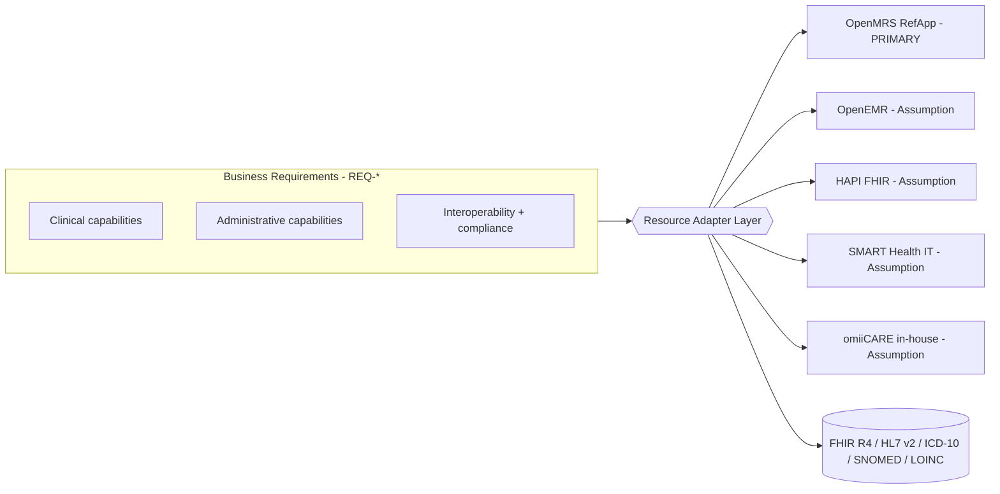
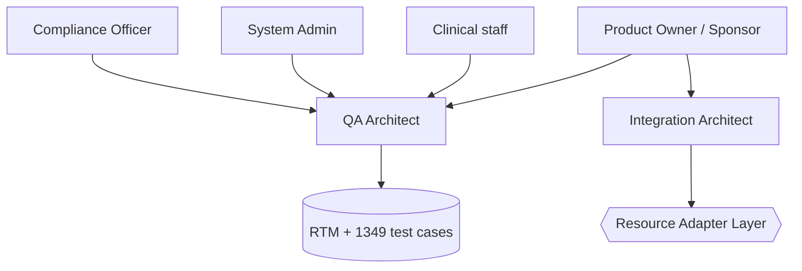

# Business Requirements Document (BRD)
## OpenMRS-Primary Healthcare QA Reference Platform

> **Document type:** Business Requirements Document (reverse-engineered)
> **Primary reference system:** OpenMRS Reference Application — legacy O2 (https://o2.openmrs.org); modern demo O3 (https://o3.openmrs.org)
> **Generated:** 2026-07-01
> **Status:** Baseline v1.0
> **Owner:** QA Architecture / Business Analysis
> **Traceability:** 472 requirements (`REQ-<PREFIX>-NNN`) across 21 modules, traced by 1,349 manual test cases (see `docs/requirements/requirements-catalog.md`, `docs/RTM.md`).

> **Convention:** Statements verified against the OpenMRS Reference Application are stated as fact. Statements extrapolated for the broader QA platform — or for systems other than OpenMRS — are tagged **(Assumption)**.

---

## 1. Document Purpose & Audience

This BRD reverse-engineers the OpenMRS Reference Application into a portable, enterprise-grade **business** specification for a healthcare QA portfolio. It captures *what* the business needs and *why*, independent of *how* any single product implements it, so the same requirement set, test catalog, and RTM can be validated against multiple Electronic Health Record (EHR) / Health Information System (HIS) backends through a **Resource Adapter Layer (RAL)**.

| Audience | What they take from this document |
|---|---|
| Business / Product stakeholders | Scope, goals, objectives, success metrics |
| QA Architects & Test Leads | Requirement-to-objective mapping, acceptance themes, RTM anchor |
| Solution / Integration Architects | System boundary, RAL strategy, standards constraints |
| Compliance / Privacy officers | Regulatory constraints, audit and consent obligations |
| Delivery / Program managers | In/out-of-scope boundary, assumptions, dependencies |

---

## 2. Business Context

### 2.1 Background
OpenMRS is a mature, open-source, modular medical record platform used widely in low- and middle-income, resource-constrained clinical settings. Its Reference Application demonstrates an end-to-end ambulatory + inpatient workflow: clinician/staff log in at a **session location** (Outpatient Clinic, Inpatient Ward, Pharmacy, Laboratory, Registration Desk, Isolation Ward), then register patients, start visits, capture vitals, record clinical observations, place orders, and run reports. Interoperability is exposed via a **REST API** (`/openmrs/ws/rest/v1/*`) and **FHIR R4** (`/openmrs/ws/fhir2/R4`), with the broader healthcare ecosystem relying on **HL7 v2** messaging (ADT/ORM/ORU/SIU) and standard terminologies (ICD-10, SNOMED CT, LOINC, RxNorm).

### 2.2 Business Problem
A healthcare QA practice needs a single, vendor-neutral requirement and test baseline that:
- Proves end-to-end clinical, administrative, and interoperability workflows behave correctly and safely;
- Is **reusable across multiple EHR/FHIR backends** (avoiding a per-vendor test rewrite);
- Demonstrates depth in compliance-sensitive areas (privacy, audit, access control, standards conformance);
- Provides defensible traceability from business need → requirement → test case → result.

### 2.3 Solution Concept
Treat OpenMRS as the **golden reference**, but author all business requirements at a **capability** level. A **Resource Adapter Layer** normalizes each target system's surface (UI selectors, REST/FHIR endpoints, terminology bindings, auth model) so the same `REQ-*` catalog and RTM execute against any adapter.

---

## 3. Business Goals

| # | Goal | Linked modules (prefixes) |
|---|---|---|
| G1 | Validate safe, complete patient-care workflows end to end | REG, SRCH, PDASH, VISIT, VITAL, CLIN, ORDLAB, PHARM, APPT |
| G2 | Guarantee data integrity and clinical-record trustworthiness | DATA, PDASH, CLIN, VITAL, RPT |
| G3 | Enforce security, privacy, and least-privilege access | AUTH, RBAC, SEC, RPT |
| G4 | Prove standards-based interoperability | FHIR, HL7, ORDLAB, APPT |
| G5 | Ensure accessibility and inclusive design | A11Y (cross-cutting) |
| G6 | Establish performance and reliability readiness | PERF, NOTIF, TELE |
| G7 | Deliver vendor-neutral reuse via the Resource Adapter Layer | All (RAL is cross-cutting) |
| G8 | Provide audit-ready compliance evidence | RPT, SEC, AUTH, DATA, BILL |

---

## 4. Stakeholders

### 4.1 Business / clinical stakeholders
| Stakeholder | Interest / responsibility | Key requirement areas |
|---|---|---|
| Clinician / Physician | Accurate, accessible clinical record at point of care | VISIT, VITAL, CLIN, ORDLAB, PHARM |
| Nurse | Vitals capture, observations, care delivery | VITAL, VISIT, CLIN |
| Registration Clerk | Fast, accurate patient registration and identity | REG, SRCH, PDASH |
| Pharmacist | Medication order review and dispensing | PHARM, CLIN (allergy interactions) |
| Lab / Radiology Technician | Order fulfillment and result reporting | ORDLAB, HL7 |
| Scheduler / Front Office | Appointment booking and reminders | APPT, NOTIF |
| Billing / Insurance Clerk | Charge capture, claims, payments | BILL |
| Patient | Privacy, consent, correct record, remote care | SEC, NOTIF, TELE, A11Y |

### 4.2 Governance & delivery stakeholders
| Stakeholder | Interest / responsibility |
|---|---|
| System Administrator | RBAC, metadata, configuration, account lifecycle (RBAC, AUTH, DATA) |
| Privacy / Compliance Officer | HIPAA-aligned audit, consent, minimum-necessary PHI (RPT, SEC, AUTH) |
| Integration Architect | FHIR/HL7 conformance, RAL adapters (FHIR, HL7) |
| QA Architect / Test Lead | Requirement coverage, RTM integrity, quality gates (all) |
| Product Owner / Sponsor | Scope, priorities, success metrics |
| Interoperability Partners **(Assumption)** | External labs, pharmacies, payers, HIEs exchanging HL7/FHIR |

---

## 5. Scope

### 5.1 In Scope
| Area | Included business capabilities |
|---|---|
| Access & session | Location-scoped login, logout, lockout, idle timeout, deep-link redirect (AUTH) |
| Identity & registration | Multi-step patient registration, unique Patient ID, demographics, contact, relationships (REG) |
| Patient lookup | Find Patient Record search by name/ID, result selection, dashboard navigation (SRCH) |
| Patient dashboard | Demographics header, clinical widgets, General Actions (PDASH) |
| Visits & encounters | Start/past/merge visits, encounter capture, visit lifecycle (VISIT) |
| Vitals & observations | Capture Vitals, obs recording, ranges, trends (VITAL) |
| Clinical records | Allergies, conditions, diagnoses with coded terminology (CLIN) |
| Orders | Lab and radiology ordering and results (ORDLAB) |
| Pharmacy | Medication orders, interaction/allergy checks, dispensing (PHARM) |
| Appointments | Booking, reschedule, cancel, no-show, recurrence, reminders (APPT) |
| Access control | Roles, privileges, user admin, least privilege (RBAC) |
| Data management | Merge, void/delete, integrity, deceased status (DATA) |
| Reporting & audit | Reports, audit logging, compliance evidence (RPT) |
| Interoperability | FHIR R4 resources & HL7 v2 messaging (FHIR, HL7) |
| Cross-cutting quality | Security, accessibility, performance readiness, notifications (SEC, A11Y, PERF, NOTIF) |
| Billing **(Assumption — beyond OpenMRS RefApp core)** | Charge capture, eligibility, claims, payments (BILL) |
| Telemedicine **(Assumption — beyond OpenMRS RefApp core)** | Virtual visit lifecycle, session, consent (TELE) |
| Reuse | Resource Adapter Layer abstraction for multiple backends |

### 5.2 Out of Scope
| Excluded | Rationale |
|---|---|
| Building/modifying OpenMRS source code | This is a QA/BA reverse-engineering effort, not product development |
| Production clinical use or real PHI | Demo/test data only (`admin/Admin123` demo credentials) |
| Hardware, network, and infrastructure provisioning | Owned by hosting/ops, not the QA baseline |
| Full revenue-cycle accounting / general-ledger integration **(Assumption)** | BILL covers claim/charge flow, not ERP finance |
| Medical-device integration & waveform capture **(Assumption)** | Not exercised by the RefApp |
| Certification submission (ONC/CEHRT) deliverables **(Assumption)** | Readiness only; formal certification is separate |
| Native mobile applications | Reference surface is web-based |
| AI/ML clinical decision algorithms | DSS limited to rule-based allergy/interaction alerts (CLIN, PHARM) |

---

## 6. Business Objectives (SMART)

| ID | Objective | Measure | Linked goal |
|---|---|---|---|
| BO-1 | Cover every requirement with at least one traced test case | 472/472 requirements traced in RTM | G1–G8 |
| BO-2 | Achieve workflow completeness for core clinical journey | Register → Visit → Vitals → Clinical → Order verified | G1 |
| BO-3 | Demonstrate zero unauthorized-access defects in RBAC suite | 0 Critical RBAC/AUTH escapes at release | G3 |
| BO-4 | Conform to FHIR R4 (`fhirVersion 4.0.1`) for in-scope resources | CapabilityStatement validated; resources schema-valid | G4 |
| BO-5 | Meet WCAG 2.1 AA across primary user journeys | 0 open Critical/High A11Y findings | G5 |
| BO-6 | Establish performance baselines for key transactions | Search/registration/dashboard within target SLAs (PERF) | G6 |
| BO-7 | Re-run the same RTM against ≥2 backends via RAL | OpenMRS + ≥1 additional adapter pass **(Assumption)** | G7 |
| BO-8 | Produce audit evidence for every security-sensitive action | Audit entries present for auth, access, data changes | G8 |

---

## 7. High-Level Business Requirements by Module

> Each row is a business-level statement. The "Req IDs" column anchors traceability to the catalog; counts indicate module size.

### 7.1 Authentication & Session — `AUTH` (23 reqs)
- The business shall authenticate users with valid credentials **only after a session location is selected** (REQ-AUTH-001, REQ-AUTH-004).
- The business shall reject invalid credentials with a generic, non-enumerating message and enforce lockout after configured failures (REQ-AUTH-002, REQ-AUTH-005).
- Sessions shall terminate on logout and on idle timeout, and shall be non-replayable (REQ-AUTH-006–008, REQ-AUTH-019).
- Unauthenticated deep links shall redirect to login and return to target (REQ-AUTH-012).
- REST and FHIR APIs shall require authentication; unauthorized requests return **401** (REQ-AUTH-013, REQ-AUTH-021).

### 7.2 Patient Registration — `REG` (25 reqs)
- The business shall register a patient through a multi-step wizard: Demographics → Contact Info → Relationships → Confirm (REQ-REG-001+).
- Demographics shall capture given/middle/family name, gender, and exact or estimated birthdate (REQ-REG).
- Contact Info shall require at least one address field plus phone number (REQ-REG).
- On save, the system shall generate a **unique Patient ID**, redirect to the patient dashboard, and confirm with a "Created Patient Record" toast (REQ-REG).

### 7.3 Find Patient Record / Search — `SRCH` (24 reqs)
- The business shall locate a patient by name or identifier and navigate to the correct record (REQ-SRCH).
- Search shall handle partial, diacritic, empty, and oversized input safely and resist injection (REQ-SRCH, cross-ref REQ-SEC).

### 7.4 Patient Dashboard & Demographics — `PDASH` (15 reqs)
- The dashboard shall display name, gender, age, DOB, and Patient ID with clinical widgets (Diagnoses, Vitals, Visits, Allergies, Conditions, Attachments, Weight graph, Appointments) (REQ-PDASH).
- General Actions (Start Visit, Add Past Visit, Merge Visits, Schedule/Request Appointment, Mark Deceased, Edit Registration, Delete Patient, Attachments) shall be gated by privilege (REQ-PDASH, cross-ref REQ-RBAC).

### 7.5 Visits & Encounters — `VISIT` (23 reqs)
- The business shall start, add past, and merge visits, and record encounters within an active visit (REQ-VISIT).
- Visit and encounter lifecycle/state transitions shall be enforced and audited (REQ-VISIT, cross-ref REQ-RPT).

### 7.6 Vitals & Observations — `VITAL` (29 reqs)
- The business shall capture vitals (e.g., temperature, pulse, BP, respiration, height, weight) with range validation and unit handling (REQ-VITAL).
- Observations shall trend over time (e.g., weight graph) and reject physiologically implausible values (REQ-VITAL).

### 7.7 Allergies, Conditions & Diagnoses — `CLIN` (24 reqs)
- The business shall record allergies (allergen, category, reaction, severity), manage "No Known Allergies," and prevent duplicates (REQ-CLIN-001–006).
- Severity-driven decision support shall alert at drug order time (REQ-CLIN-007, cross-ref REQ-PHARM).
- Allergies shall be exposed as FHIR **AllergyIntolerance** (REQ-CLIN-011, cross-ref REQ-FHIR).

### 7.8 Orders, Laboratory & Radiology — `ORDLAB` (31 reqs)
- The business shall place lab/radiology orders, track fulfillment, and report results (REQ-ORDLAB).
- Orders/results shall interoperate via HL7 ORM/ORU and FHIR ServiceRequest/Observation (REQ-ORDLAB, cross-ref REQ-HL7, REQ-FHIR).

### 7.9 Pharmacy & Medication Orders — `PHARM` (22 reqs)
- The business shall create medication orders with dose/route/frequency, screen for allergy and drug interactions, and support dispensing (REQ-PHARM, cross-ref REQ-CLIN).
- Medication data shall map to FHIR **MedicationRequest** (REQ-PHARM, cross-ref REQ-FHIR).

### 7.10 Appointment Scheduling — `APPT` (19 reqs)
- The business shall book, reschedule, and cancel appointments with conflict and past-date prevention (REQ-APPT-001, REQ-APPT-003, REQ-APPT-004, REQ-APPT-006, REQ-APPT-007).
- An appointment status state machine (Scheduled/CheckedIn/Completed/Cancelled/Missed) shall be enforced; reminders respect consent and minimum-necessary PHI (REQ-APPT-009, REQ-APPT-010).
- Appointments shall support FHIR Appointment/Slot and inbound HL7 SIU (REQ-APPT-018, REQ-APPT-019).

### 7.11 Roles, Privileges & User Admin — `RBAC` (26 reqs)
- The business shall gate every app/action by privilege, mapped to roles (System Administrator, Doctor/Clinician, Nurse, Registration Clerk, Pharmacist, Lab Tech) (REQ-RBAC).
- Disabled/retired accounts shall not authenticate; role/privilege changes shall be audited (REQ-RBAC, cross-ref REQ-AUTH-020, REQ-RPT).

### 7.12 Data Management & Integrity — `DATA` (17 reqs)
- The business shall merge duplicate patients, void/delete records with reason capture, and mark patients deceased without data loss (REQ-DATA, cross-ref REQ-PDASH).
- Referential integrity and concurrency shall be preserved across edits (REQ-DATA).

### 7.13 Reporting & Audit Logging — `RPT` (19 reqs)
- The business shall produce reports and maintain a complete, tamper-evident audit trail of security- and PHI-relevant actions (REQ-RPT, cross-ref REQ-SEC, REQ-AUTH).

### 7.14 FHIR R4 API — `FHIR` (34 reqs)
- The business shall expose conformant FHIR R4 (`fhirVersion 4.0.1`) resources: Patient, Encounter, Observation, Condition, AllergyIntolerance, MedicationRequest (and Appointment/Slot) (REQ-FHIR).
- The CapabilityStatement (`/metadata`) shall be valid; unauthorized requests return 401 (REQ-FHIR, cross-ref REQ-AUTH-021).

### 7.15 HL7 v2 Messaging — `HL7` (count per catalog)
- The business shall process ADT/ORM/ORU/SIU messages with correct ACK/NAK handling and source authorization (REQ-HL7, cross-ref REQ-AUTH-022).

### 7.16 Security (functional/readiness) — `SEC` (15 reqs)
- The business shall resist OWASP Top 10 classes (injection, IDOR/BOLA, broken access control, sensitive-data exposure) and mask/minimize PHI (REQ-SEC, cross-ref REQ-AUTH, REQ-RBAC).

### 7.17 Accessibility (WCAG 2.1 AA) — `A11Y` (15 reqs)
- All primary journeys shall be keyboard-operable, screen-reader-compatible, contrast-compliant, and reflow at 200%/400% zoom (REQ-A11Y-001–015). A11Y is cross-cutting against AUTH, REG, APPT, CLIN, BILL.

### 7.18 Performance Readiness — `PERF` (17 reqs)
- The business shall define and verify performance criteria for search, registration, dashboard load, and API throughput (REQ-PERF). **(Assumption: targets are design-level readiness, not load-tested in the RefApp demo.)**

### 7.19 Notifications & Alerts — `NOTIF` (25 reqs)
- The business shall deliver appointment, clinical, and system notifications respecting consent and minimum-necessary PHI (REQ-NOTIF, cross-ref REQ-APPT-010).

### 7.20 Billing & Insurance — `BILL` (22 reqs) **(Assumption — beyond core OpenMRS RefApp)**
- The business shall capture charges from finalized encounters, verify eligibility (270/271), create and submit claims (837P), track status (276/277), and post payments (ERA 835) with idempotency and RBAC/PHI controls (REQ-BILL-001–022).

### 7.21 Telemedicine — `TELE` (14 reqs) **(Assumption — beyond core OpenMRS RefApp)**
- The business shall support a virtual-visit lifecycle (schedule, join, conduct, document, consent) with session security and accessibility (REQ-TELE, cross-ref REQ-APPT, REQ-A11Y, REQ-SEC).

---

## 8. Cross-Cutting Business Requirements

| Theme | Statement | Modules |
|---|---|---|
| Least privilege | Every action is authorized before execution | RBAC, AUTH, SEC |
| Auditability | Security/PHI-relevant actions are logged immutably | RPT, SEC, AUTH, DATA, BILL |
| Consent & minimum-necessary | PHI exposure limited by consent and need | NOTIF, APPT, SEC, TELE |
| Standards conformance | Coded data uses ICD-10/SNOMED/LOINC/RxNorm; APIs use FHIR R4/HL7 v2 | FHIR, HL7, CLIN, ORDLAB, PHARM |
| Accessibility | WCAG 2.1 AA on all primary journeys | A11Y (all) |
| Vendor neutrality | Requirements validate against any backend via the RAL | All |

---

## 9. Success Metrics

| Metric | Target | Source |
|---|---|---|
| Requirement traceability coverage | 100% (472/472) | RTM |
| Test case execution pass rate (release) | ≥ 98% on P1, ≥ 95% overall **(Assumption)** | Test execution |
| Critical/High security defects open at release | 0 | SEC/AUTH/RBAC suites |
| FHIR R4 resource conformance | 100% of in-scope resources schema-valid | FHIR validator |
| WCAG 2.1 AA Critical/High findings open | 0 | A11Y audit |
| Core clinical journey success rate | 100% happy-path, defined error paths covered | VISIT/VITAL/CLIN/ORDLAB |
| Backends validated via RAL | ≥ 2 (OpenMRS + 1) **(Assumption)** | Adapter runs |
| Audit-evidence completeness | 100% of sensitive actions logged | RPT |
| Performance SLA adherence | All key transactions within target **(Assumption)** | PERF |

---

## 10. Constraints

| # | Constraint | Type | Impact |
|---|---|---|---|
| C1 | OpenMRS legacy O2 is the verified reference; O3 differs in UI surface | Technical | RAL must abstract UI/selectors per version |
| C2 | REST/FHIR APIs require auth (Basic/OAuth); unauthorized → 401 | Technical/Security | All API tests need credential management |
| C3 | Demo environment uses `admin/Admin123` with seeded demo data | Environment | No real PHI; data resets possible |
| C4 | Must conform to FHIR R4 (4.0.1) and HL7 v2 ADT/ORM/ORU/SIU | Standards | Limits acceptable resource/message shapes |
| C5 | HIPAA-aligned privacy: audit, consent, minimum-necessary | Regulatory **(Assumption for non-US backends)** | Drives audit/consent requirements |
| C6 | WCAG 2.1 AA mandated for all user-facing journeys | Regulatory/Quality | Cross-cutting A11Y gate |
| C7 | Session location selection is mandatory pre-auth | Functional | Login flow ordering fixed |
| C8 | Terminology bound to ICD-10/SNOMED/LOINC/RxNorm | Standards | Coded-field validation required |
| C9 | RAL must support OpenMRS, OpenEMR, HAPI FHIR, SMART Health IT, omiiCARE | Architectural **(Assumption)** | Each backend needs an adapter |
| C10 | BILL and TELE extend beyond verified RefApp scope | Scope | Marked assumption-driven |

---

## 11. Assumptions & Dependencies

| # | Assumption / Dependency | Tag |
|---|---|---|
| A1 | OpenEMR, HAPI FHIR, SMART Health IT, omiiCARE are reachable test targets | **(Assumption)** |
| A2 | The RAL normalizes UI selectors, REST/FHIR endpoints, terminology, and auth per backend | **(Assumption)** |
| A3 | BILL workflows (270/271, 837P, 276/277, 835) apply to US payer context | **(Assumption)** |
| A4 | TELE is delivered by an integrated virtual-visit capability | **(Assumption)** |
| A5 | Performance targets are readiness criteria, not measured in the demo | **(Assumption)** |
| D1 | Stable demo data and credentials for repeatable runs | Dependency |
| D2 | FHIR validator and accessibility tooling available in CI | Dependency |
| D3 | HL7 interface endpoints with ACK semantics available for HL7 suite | Dependency |

---

## 12. Glossary

| Term | Definition |
|---|---|
| ADT / ORM / ORU / SIU | HL7 v2 message types: Admit-Discharge-Transfer / Order / Observation Result / Scheduling |
| BO | Business Objective (this document) |
| BRD | Business Requirements Document |
| CapabilityStatement | FHIR resource describing a server's capabilities (`/metadata`) |
| DSS | (Clinical) Decision Support System — here, rule-based allergy/interaction alerts |
| EHR / HIS | Electronic Health Record / Health Information System |
| Encounter | A clinical interaction recorded within a visit |
| FHIR R4 | HL7 Fast Healthcare Interoperability Resources, release 4 (version 4.0.1) |
| HIPAA | US Health Insurance Portability and Accountability Act (privacy/security) |
| HL7 v2 | Health Level Seven version 2 messaging standard |
| IDOR / BOLA | Insecure Direct Object Reference / Broken Object-Level Authorization |
| ICD-10 / SNOMED CT / LOINC / RxNorm | Standard terminologies: diagnoses / clinical terms / lab observations / medications |
| O2 / O3 | OpenMRS legacy Reference App (O2) vs modern microfrontend app (O3) |
| OpenMRS | Open-source modular medical record platform (primary reference) |
| Patient ID | Unique identifier generated on registration |
| PHI | Protected Health Information |
| RAL | Resource Adapter Layer — abstraction enabling multi-backend reuse |
| RBAC | Role-Based Access Control |
| REST API | OpenMRS REST endpoints at `/openmrs/ws/rest/v1/*` |
| REQ-<PREFIX>-NNN | Requirement identifier in the catalog (21 module prefixes) |
| RTM | Requirements Traceability Matrix |
| Session location | Mandatory location context selected at login |
| SMART Health IT | SMART-on-FHIR reference/sandbox platform |
| Visit | A bounded patient stay/contact containing encounters |
| WCAG 2.1 AA | Web Content Accessibility Guidelines, level AA |

---

## 13. Module Requirement-Count Summary

| Module | Prefix | Reqs |
|---|---|---|
| FHIR R4 API | FHIR | 34 |
| Orders, Laboratory & Radiology | ORDLAB | 31 |
| Vitals & Observations | VITAL | 29 |
| Roles, Privileges & User Admin | RBAC | 26 |
| Patient Registration | REG | 25 |
| Notifications & Alerts | NOTIF | 25 |
| Find Patient Record / Search | SRCH | 24 |
| Allergies, Conditions & Diagnoses | CLIN | 24 |
| Visits & Encounters | VISIT | 23 |
| Authentication & Session | AUTH | 23 |
| Pharmacy & Medication Orders | PHARM | 22 |
| Billing & Insurance **(Assumption)** | BILL | 22 |
| Reporting & Audit Logging | RPT | 19 |
| Appointment Scheduling | APPT | 19 |
| Performance Readiness | PERF | 17 |
| Data Management & Integrity | DATA | 17 |
| Security (functional/readiness) | SEC | 15 |
| Patient Dashboard & Demographics | PDASH | 15 |
| Accessibility (WCAG 2.1 AA) | A11Y | 15 |
| Telemedicine **(Assumption)** | TELE | 14 |
| HL7 v2 Messaging | HL7 | (see catalog) |
| **Total** | — | **472** |

> Authoritative per-requirement detail lives in `docs/requirements/requirements-catalog.md`; test-case mapping in `docs/RTM.md`.
