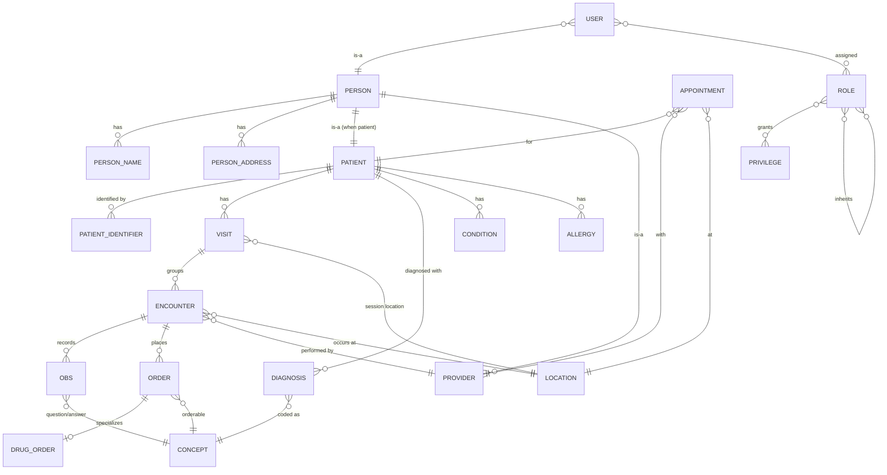

# Data Dictionary
## OpenMRS-Primary Healthcare QA Reference Platform

> **Primary reference system:** OpenMRS Reference Application (legacy O2, https://o2.openmrs.org; modern demo O3 at o3.openmrs.org).
> **Portability targets:** OpenEMR, HAPI FHIR, SMART Health IT, and the in-house **omiiCARE** application via a **Resource Adapter Layer (RAL)**.
> **Document date:** 2026-07-01 · **Status:** Baseline 1.0 · **Audience:** QA, BA, Solution Architecture, Data Engineering.
> **Traceability:** Entity attributes cross-reference the 472-requirement catalog (`docs/requirements/requirements-catalog.md`) via `REQ-<PREFIX>-NNN` and feed the 1,349-case RTM (`docs/RTM.md`).

---

## Table of Contents
1. [Purpose & Conventions](#1-purpose--conventions)
2. [Entity Overview & Relationships](#2-entity-overview--relationships)
3. [Identity & Demographics Domain](#3-identity--demographics-domain)
   - [3.1 Person](#31-person)
   - [3.2 PersonName](#32-personname)
   - [3.3 PersonAddress](#33-personaddress)
   - [3.4 Patient](#34-patient)
   - [3.5 PatientIdentifier](#35-patientidentifier)
4. [Encounter & Visit Domain](#4-encounter--visit-domain)
   - [4.1 Visit](#41-visit)
   - [4.2 Encounter](#42-encounter)
   - [4.3 Obs (Observation)](#43-obs-observation)
5. [Orders & Pharmacy Domain](#5-orders--pharmacy-domain)
   - [5.1 Order (base)](#51-order-base)
   - [5.2 DrugOrder](#52-drugorder)
6. [Clinical Domain](#6-clinical-domain)
   - [6.1 Diagnosis](#61-diagnosis)
   - [6.2 Condition](#62-condition)
   - [6.3 Allergy](#63-allergy)
7. [Terminology & Reference Data](#7-terminology--reference-data)
   - [7.1 Concept](#71-concept)
8. [Care Delivery Actors & Places](#8-care-delivery-actors--places)
   - [8.1 Provider](#81-provider)
   - [8.2 Location](#82-location)
   - [8.3 Appointment](#83-appointment)
9. [Security Domain](#9-security-domain)
   - [9.1 User](#91-user)
   - [9.2 Role](#92-role)
   - [9.3 Privilege](#93-privilege)
10. [Cross-Cutting Audit Columns](#10-cross-cutting-audit-columns)
11. [Canonical Code Systems & Enumerations](#11-canonical-code-systems--enumerations)
12. [Resource Adapter Layer Field Mapping](#12-resource-adapter-layer-field-mapping)

---

## 1. Purpose & Conventions

This data dictionary is the authoritative catalog of logical entities, attributes, types, and constraints for the platform. It is **reverse-engineered from the OpenMRS data model** (the OpenMRS schema is the canonical source) and is normalized into a **vendor-neutral logical model** so the same QA assertions hold against OpenEMR, HAPI FHIR, SMART Health IT, and omiiCARE through the RAL.

### Column legend (used in every entity table)

| Column | Meaning |
|---|---|
| **Attribute** | Logical attribute name (camelCase). OpenMRS physical column noted where it differs. |
| **Type** | Logical type — see type lexicon below. |
| **Null** | `N` = required/NOT NULL, `Y` = optional/nullable, `Cond` = conditionally required (rule in Notes). |
| **Key/Constraint** | PK, FK→target, UK (unique), CK (check), DV (default), IDX (indexed). |
| **Description / Rules** | Semantics, validation, and `(Assumption)` tags where inferred beyond verified OpenMRS facts. |
| **REQ** | Traced requirement ID(s). |

### Type lexicon

| Logical type | Physical realization (OpenMRS / RDBMS) | FHIR R4 analog |
|---|---|---|
| `uuid` | `char(38)` globally-unique business key | resource `id` / `identifier` |
| `pk-int` | `int` auto-increment surrogate (internal only) | n/a (not exposed) |
| `string(n)` | `varchar(n)` | `string` |
| `text` | `text` / `clob` | `string` / `markdown` |
| `bool` | `tinyint(1)` / `boolean` | `boolean` |
| `date` | `date` | `date` |
| `datetime` | `datetime` (server tz, UTC normalized) | `dateTime` / `instant` |
| `decimal(p,s)` | `decimal` | `decimal` / `Quantity.value` |
| `enum{...}` | `varchar` constrained by lookup/CK | `code` (ValueSet-bound) |
| `concept-ref` | FK → `concept.concept_id` | `CodeableConcept` |
| `coded` | concept-ref resolved to a coding | `Coding` |

**Verified vs inferred.** Attributes, multiplicities, and rules that correspond to observed OpenMRS Reference Application behavior or the documented OpenMRS schema are stated plainly. Anything beyond that (extra columns, vendor parity assumptions, omiiCARE-specific fields) is marked **(Assumption)**.

---

## 2. Entity Overview & Relationships

**Identity model (critical):** OpenMRS separates **Person** (demographics) from **Patient** (clinical identity). Every Patient *is-a* Person (shares `person_id`); a Person may exist without being a Patient (e.g., a Provider or User who is staff only). This 1:1 specialization drives the demographics-vs-clinical-identity test boundary (`REQ-REG-NNN`).

| Relationship | Cardinality | Verified? |
|---|---|---|
| Person → PersonName | 1 .. * (exactly one `preferred`) | Verified |
| Person → PersonAddress | 0 .. * (≥1 address field required at registration) | Verified |
| Patient → PatientIdentifier | 1 .. * (exactly one `preferred`) | Verified |
| Patient → Visit | 0 .. * | Verified |
| Visit → Encounter | 0 .. * | Verified |
| Encounter → Obs | 0 .. * (Obs may also be visit-level / orphan) | Verified |
| Encounter → Order | 0 .. * | Verified |
| User → Role → Privilege | * .. * (RBAC, inheritable roles) | Verified |

---

## 3. Identity & Demographics Domain

### 3.1 Person
Abstract demographic root. Holds non-clinical identity facts shared by patients, providers, and users.

| Attribute | Type | Null | Key/Constraint | Description / Rules | REQ |
|---|---|---|---|---|---|
| uuid | uuid | N | UK, IDX | Global business key, REST/FHIR resource id. | REG-001 |
| personId | pk-int | N | PK | Surrogate; internal only, never exposed via FHIR. | — |
| gender | enum{M,F,O,U} | N | CK | OpenMRS verified values `M`/`F`. `O`(Other)/`U`(Unknown) **(Assumption)** for omiiCARE parity. Maps FHIR `Patient.gender`. | REG-010 |
| birthdate | date | Cond | CK ≤ today | Required unless `birthdateEstimated` workflow supplies age→date. Future dates rejected. | REG-011 |
| birthdateEstimated | bool | N | DV=false | True when DOB derived from an entered age (wizard "estimated"). | REG-012 |
| dead | bool | N | DV=false | Deceased flag; set by *Mark Patient Deceased*. | PDASH-040 |
| deathDate | datetime | Cond | CK ≥ birthdate | Required when `dead=true`; else must be null. | PDASH-041 |
| causeOfDeath | concept-ref | Cond | FK→Concept | Coded cause; required when `dead=true` per config. | PDASH-042 |
| birthtime | datetime | Y | — | Optional time-of-birth **(Assumption)** (neonatal). | REG-013 |
| voided | bool | N | DV=false | Soft-delete (see §10). | DATA-005 |

### 3.2 PersonName
One-to-many name records per person; exactly one flagged `preferred`.

| Attribute | Type | Null | Key/Constraint | Description / Rules | REQ |
|---|---|---|---|---|---|
| uuid | uuid | N | UK | Resource key. | — |
| personNameId | pk-int | N | PK | Surrogate. | — |
| personId | pk-int | N | FK→Person | Owner. | — |
| givenName | string(50) | N | IDX | First name. Maps FHIR `HumanName.given[0]`. | REG-002 |
| middleName | string(50) | Y | — | Maps `HumanName.given[1]`. | REG-003 |
| familyName | string(50) | N | IDX | Surname. Maps `HumanName.family`. | REG-004 |
| familyName2 | string(50) | Y | — | Second surname (Latin/Iberian) **(Assumption)**. | REG-005 |
| prefix | string(50) | Y | — | Title (Dr., Mr.). | REG-006 |
| preferred | bool | N | DV=false | Exactly one preferred name per person (CK enforced at app/RAL). | REG-007 |
| voided | bool | N | DV=false | Soft-delete. | — |

### 3.3 PersonAddress
Structured postal/geographic address. At registration **≥1 address field is required** (verified Contact Info step).

| Attribute | Type | Null | Key/Constraint | Description / Rules | REQ |
|---|---|---|---|---|---|
| uuid | uuid | N | UK | Resource key. | — |
| personAddressId | pk-int | N | PK | Surrogate. | — |
| personId | pk-int | N | FK→Person | Owner. | — |
| address1 | string(255) | Cond | — | Street line 1. Maps FHIR `Address.line[0]`. | REG-020 |
| address2 | string(255) | Y | — | Street line 2. | REG-021 |
| cityVillage | string(255) | Y | — | Maps `Address.city`. | REG-022 |
| stateProvince | string(255) | Y | — | Maps `Address.state`. | REG-023 |
| country | string(50) | Y | — | Maps `Address.country`. | REG-024 |
| postalCode | string(50) | Y | — | Maps `Address.postalCode`. | REG-025 |
| latitude | string(50) | Y | — | Geo lat (string per OpenMRS). | REG-026 |
| longitude | string(50) | Y | — | Geo long. | REG-026 |
| preferred | bool | N | DV=false | One preferred address. | REG-027 |
| voided | bool | N | DV=false | Soft-delete. | — |

> **Form rule (verified):** registration Save (`#submit`) is blocked unless at least one of `address1/cityVillage/stateProvince/country/postalCode` is populated → maps to negative test set `REQ-REG-028`.

### 3.4 Patient
Clinical identity. 1:1 with Person (`patientId == personId`).

| Attribute | Type | Null | Key/Constraint | Description / Rules | REQ |
|---|---|---|---|---|---|
| uuid | uuid | N | UK, IDX | FHIR `Patient.id`. | SRCH-001 |
| patientId | pk-int | N | PK, FK→Person | Equals personId (table-per-subclass). | — |
| allergyStatus | enum{Unknown,None,SeeList} | N | DV=Unknown | Roll-up of allergy module state **(Assumption)** for UI banner. | CLIN-030 |
| voided | bool | N | DV=false | Soft-delete; voiding hides from search but preserves audit. | DATA-006 |

### 3.5 PatientIdentifier
Business identifiers (MRN, national ID). Exactly one `preferred`; auto-generated **Patient ID** on save (verified).

| Attribute | Type | Null | Key/Constraint | Description / Rules | REQ |
|---|---|---|---|---|---|
| uuid | uuid | N | UK | Resource key. | — |
| patientIdentifierId | pk-int | N | PK | Surrogate. | — |
| patientId | pk-int | N | FK→Patient | Owner. | — |
| identifier | string(50) | N | UK(per type), IDX | Value; uniqueness scoped by `identifierType`. Maps FHIR `Patient.identifier.value`. | REG-030 |
| identifierTypeId | pk-int | N | FK→IdentifierType | OpenMRS ID, National ID, etc. → `identifier.system`. | REG-031 |
| locationId | pk-int | Y | FK→Location | Issuing location. | REG-032 |
| preferred | bool | N | DV=false | Exactly one preferred per patient. | REG-033 |
| voided | bool | N | DV=false | Soft-delete. | — |

> **Generation rule (verified):** a system-assigned unique Patient ID is created on registration save (Luhn/mod-30 check-digit per OpenMRS idgen). Duplicate manual entry within a type → 400/validation error → `REQ-REG-034`.

---

## 4. Encounter & Visit Domain

### 4.1 Visit
A patient's stay/session; container for encounters. Started via *Start Visit* / *Add Past Visit* (verified).

| Attribute | Type | Null | Key/Constraint | Description / Rules | REQ |
|---|---|---|---|---|---|
| uuid | uuid | N | UK | FHIR `Encounter`(class=visit-level) key. | VISIT-001 |
| visitId | pk-int | N | PK | Surrogate. | — |
| patientId | pk-int | N | FK→Patient | Subject. | VISIT-002 |
| visitTypeId | pk-int | N | FK→VisitType | e.g., Outpatient, Inpatient. | VISIT-003 |
| startDatetime | datetime | N | CK ≤ now, IDX | Visit start. | VISIT-004 |
| stopDatetime | datetime | Y | CK ≥ start | Null = active visit (drives *Active Visits* tile). | VISIT-005 |
| locationId | pk-int | Y | FK→Location | Session location (Outpatient Clinic, Inpatient Ward...). | VISIT-006 |
| indicationConceptId | concept-ref | Y | FK→Concept | Reason for visit **(Assumption)**. | VISIT-007 |
| voided | bool | N | DV=false | Soft-delete. | — |

> **Overlap rule (Assumption):** two *active* visits (null `stopDatetime`) for the same patient should be prevented or merged via *Merge Visits* → `REQ-VISIT-010`.

### 4.2 Encounter
A single clinical interaction within a visit.

| Attribute | Type | Null | Key/Constraint | Description / Rules | REQ |
|---|---|---|---|---|---|
| uuid | uuid | N | UK | FHIR `Encounter.id`. | VISIT-020 |
| encounterId | pk-int | N | PK | Surrogate. | — |
| patientId | pk-int | N | FK→Patient | Subject. | VISIT-021 |
| visitId | pk-int | Y | FK→Visit | Parent visit (nullable for legacy/orphan). | VISIT-022 |
| encounterTypeId | pk-int | N | FK→EncounterType | Vitals, Consultation, Admission... | VISIT-023 |
| encounterDatetime | datetime | N | CK ≤ now, IDX | When it occurred. | VISIT-024 |
| locationId | pk-int | Y | FK→Location | Where. | VISIT-025 |
| formId | pk-int | Y | FK→Form | Capture form used. | VISIT-026 |
| voided | bool | N | DV=false | Soft-delete. | — |

> **Provider linkage:** encounter↔provider is many-to-many via `encounter_provider` (role-typed, e.g., *Attending*). Captured here as a relationship, not a column → `REQ-CLIN-005`.

### 4.3 Obs (Observation)
The universal EAV clinical fact. A single Obs answers one Concept "question" with one typed value; groups nest via `obsGroup`. Drives Vitals, Latest Observations widgets (verified).

| Attribute | Type | Null | Key/Constraint | Description / Rules | REQ |
|---|---|---|---|---|---|
| uuid | uuid | N | UK | FHIR `Observation.id`. | VITAL-001 |
| obsId | pk-int | N | PK | Surrogate. | — |
| personId | pk-int | N | FK→Person | Subject. | VITAL-002 |
| encounterId | pk-int | Y | FK→Encounter | Context (null for visit/standalone obs). | VITAL-003 |
| conceptId | concept-ref | N | FK→Concept, IDX | The "question" (e.g., LOINC 8867-4 Heart rate). | VITAL-004 |
| obsDatetime | datetime | N | CK ≤ now | Observation time. | VITAL-005 |
| valueNumeric | decimal(22,8) | Cond | CK in concept range | Numeric value; exactly one value* column populated per datatype. | VITAL-006 |
| valueCoded | concept-ref | Cond | FK→Concept | Coded answer (e.g., Yes/No). | VITAL-007 |
| valueText | text | Cond | — | Free-text answer. | VITAL-008 |
| valueDatetime | datetime | Cond | — | Date/time answer. | VITAL-009 |
| valueBoolean | bool | Cond | — | Boolean answer (legacy coded). | VITAL-010 |
| units | string(50) | Y | — | Derived from concept-numeric (e.g., bpm, °C). | VITAL-011 |
| obsGroupId | pk-int | Y | FK→Obs (self) | Parent grouping obs (e.g., BP panel → systolic+diastolic). | VITAL-012 |
| status | enum{PRELIMINARY,FINAL,AMENDED} | N | DV=FINAL | FHIR `Observation.status` **(Assumption)** for FHIR parity. | FHIR-020 |
| voided | bool | N | DV=false | Soft-delete (amendment = void+replace). | DATA-007 |

> **Datatype invariant (CK):** exactly one `value*` column is non-null and it must match the Concept's datatype (Numeric→valueNumeric, Coded→valueCoded, etc.). Range/units inherited from `concept_numeric`. Out-of-range entry → soft warning or hard block per concept config → `REQ-VITAL-015`.

---

## 5. Orders & Pharmacy Domain

### 5.1 Order (base)
Abstract orderable action (lab, drug, referral). Uses **append-only revision** semantics (no in-place edit; revise/discontinue creates a new row).

| Attribute | Type | Null | Key/Constraint | Description / Rules | REQ |
|---|---|---|---|---|---|
| uuid | uuid | N | UK | FHIR `ServiceRequest`/`MedicationRequest` id. | ORDLAB-001 |
| orderId | pk-int | N | PK | Surrogate. | — |
| orderType | enum{drugorder,testorder,referral} | N | CK | Discriminator. | ORDLAB-002 |
| patientId | pk-int | N | FK→Patient | Subject. | ORDLAB-003 |
| encounterId | pk-int | N | FK→Encounter | Ordering encounter. | ORDLAB-004 |
| conceptId | concept-ref | N | FK→Concept | What is ordered (orderable). | ORDLAB-005 |
| ordererId | pk-int | N | FK→Provider | Ordering clinician. | ORDLAB-006 |
| orderAction | enum{NEW,REVISE,DISCONTINUE,RENEW} | N | DV=NEW | Lifecycle action; revisions reference `previousOrderId`. | ORDLAB-007 |
| previousOrderId | pk-int | Cond | FK→Order(self) | Required when action ≠ NEW. | ORDLAB-008 |
| urgency | enum{ROUTINE,STAT,ON_SCHEDULED_DATE} | N | DV=ROUTINE | Priority → FHIR `priority`. | ORDLAB-009 |
| dateActivated | datetime | N | — | Effective start. | ORDLAB-010 |
| autoExpireDate | datetime | Y | CK ≥ dateActivated | Auto-stop. | ORDLAB-011 |
| dateStopped | datetime | Y | — | Set on discontinue. | ORDLAB-012 |
| orderReasonConceptId | concept-ref | Y | FK→Concept | Coded reason. | ORDLAB-013 |
| accessionNumber | string(255) | Y | — | Lab accession / specimen link. | ORDLAB-014 |
| voided | bool | N | DV=false | Soft-delete. | — |

### 5.2 DrugOrder
Specialization of Order for medications (powers Pharmacy app). One-to-one with parent Order on `orderId`.

| Attribute | Type | Null | Key/Constraint | Description / Rules | REQ |
|---|---|---|---|---|---|
| orderId | pk-int | N | PK, FK→Order | Shared key. | PHARM-001 |
| drugInventoryId | pk-int | Y | FK→Drug | Specific formulation; null when only concept ordered. | PHARM-002 |
| dose | decimal(22,8) | Cond | CK > 0 | Dose amount. | PHARM-003 |
| doseUnitsConceptId | concept-ref | Cond | FK→Concept | mg, mL... | PHARM-004 |
| frequencyId | pk-int | Cond | FK→OrderFrequency | BID, TID, QHS. | PHARM-005 |
| route | concept-ref | Y | FK→Concept | Oral, IV, IM. | PHARM-006 |
| asNeeded | bool | N | DV=false | PRN flag. | PHARM-007 |
| asNeededCondition | string(255) | Cond | — | Required when `asNeeded=true`. | PHARM-008 |
| quantity | decimal(22,8) | Y | CK ≥ 0 | Dispense quantity. | PHARM-009 |
| quantityUnitsConceptId | concept-ref | Y | FK→Concept | Dispense units. | PHARM-010 |
| numRefills | int | Y | CK ≥ 0 | Refills authorized. | PHARM-011 |
| duration | int | Y | CK > 0 | Duration count. | PHARM-012 |
| durationUnitsConceptId | concept-ref | Cond | FK→Concept | days, weeks (required with duration). | PHARM-013 |
| dosingType | enum{SIMPLE,FREE_TEXT} | N | DV=SIMPLE | Structured vs free-text sig. | PHARM-014 |
| dosingInstructions | text | Cond | — | Required when `dosingType=FREE_TEXT`. | PHARM-015 |

> **Safety rule (Assumption):** dose-range and duplicate-therapy checks fire before activation; overrides require a coded reason → `REQ-PHARM-020`.

---

## 6. Clinical Domain

### 6.1 Diagnosis
Encounter/visit-level diagnosis (powers Diagnoses widget). Coded to ICD-10/SNOMED via Concept.

| Attribute | Type | Null | Key/Constraint | Description / Rules | REQ |
|---|---|---|---|---|---|
| uuid | uuid | N | UK | Resource key. | CLIN-001 |
| diagnosisId | pk-int | N | PK | Surrogate. | — |
| patientId | pk-int | N | FK→Patient | Subject. | CLIN-002 |
| encounterId | pk-int | Y | FK→Encounter | Context. | CLIN-003 |
| codedDiagnosisConceptId | concept-ref | Cond | FK→Concept | Coded dx; null when free-text only. | CLIN-004 |
| nonCodedDiagnosis | string(255) | Cond | — | Free-text dx (one of coded/non-coded required). | CLIN-005 |
| certainty | enum{CONFIRMED,PROVISIONAL} | N | DV=PROVISIONAL | Diagnostic certainty. | CLIN-006 |
| rank | int | N | DV=1, CK ≥1 | 1=primary, 2+=secondary. | CLIN-007 |
| voided | bool | N | DV=false | Soft-delete. | — |

### 6.2 Condition
Longitudinal problem-list entry (powers Conditions widget).

| Attribute | Type | Null | Key/Constraint | Description / Rules | REQ |
|---|---|---|---|---|---|
| uuid | uuid | N | UK | FHIR `Condition.id`. | CLIN-020 |
| conditionId | pk-int | N | PK | Surrogate. | — |
| patientId | pk-int | N | FK→Patient | Subject. | CLIN-021 |
| conditionConceptId | concept-ref | Cond | FK→Concept | Coded problem. | CLIN-022 |
| conditionNonCoded | string(255) | Cond | — | Free-text (one of coded/non-coded required). | CLIN-023 |
| clinicalStatus | enum{ACTIVE,INACTIVE,HISTORY_OF} | N | DV=ACTIVE | FHIR `Condition.clinicalStatus`. | CLIN-024 |
| onsetDate | date | Y | CK ≤ today | Onset. | CLIN-025 |
| endDate | date | Cond | CK ≥ onsetDate | Required when status=INACTIVE. | CLIN-026 |
| voided | bool | N | DV=false | Soft-delete. | — |

### 6.3 Allergy
Allergy/intolerance record (powers Allergies widget, drives no-known-allergies banner).

| Attribute | Type | Null | Key/Constraint | Description / Rules | REQ |
|---|---|---|---|---|---|
| uuid | uuid | N | UK | FHIR `AllergyIntolerance.id`. | CLIN-040 |
| allergyId | pk-int | N | PK | Surrogate. | — |
| patientId | pk-int | N | FK→Patient | Subject. | CLIN-041 |
| allergenType | enum{DRUG,FOOD,ENVIRONMENT,OTHER} | N | CK | Category → FHIR `category`. | CLIN-042 |
| codedAllergenId | concept-ref | Cond | FK→Concept | Coded allergen. | CLIN-043 |
| nonCodedAllergen | string(255) | Cond | — | Free-text allergen (one required). | CLIN-044 |
| severity | concept-ref | Y | FK→Concept | Mild/Moderate/Severe. | CLIN-045 |
| reactions | concept-ref[] | Y | FK→Concept | Manifestations (rash, anaphylaxis...). | CLIN-046 |
| comment | string(1024) | Y | — | Notes. | CLIN-047 |
| voided | bool | N | DV=false | Soft-delete. | — |

---

## 7. Terminology & Reference Data

### 7.1 Concept
The terminology backbone. Every clinical value, question, orderable, diagnosis, and allergen resolves to a Concept; mappings carry external code system codes (ICD-10/SNOMED/LOINC).

| Attribute | Type | Null | Key/Constraint | Description / Rules | REQ |
|---|---|---|---|---|---|
| uuid | uuid | N | UK | FHIR `Coding`/`CodeSystem` ref. | DATA-100 |
| conceptId | pk-int | N | PK | Surrogate. | — |
| datatypeId | pk-int | N | FK→ConceptDatatype | Numeric, Coded, Text, Date, Boolean, N/A. | DATA-101 |
| conceptClassId | pk-int | N | FK→ConceptClass | Diagnosis, Drug, Test, Finding, Question... | DATA-102 |
| isSet | bool | N | DV=false | True = concept-set (panel/group). | DATA-103 |
| retired | bool | N | DV=false | Retirement (concept analog of void). | DATA-104 |
| fullySpecifiedName | string(255) | N | UK(locale) | Canonical name (locale-scoped). | DATA-105 |
| shortName | string(255) | Y | — | Display short form. | DATA-106 |
| — *(child)* conceptNumeric | decimal | Y | — | hiAbsolute/lowAbsolute/hiNormal/lowNormal/units/precise — range source for Obs CK. | VITAL-014 |
| — *(child)* conceptMapping | coded[] | Y | — | External codes: ICD-10, SNOMED CT, LOINC, RxNorm with `mapType` (SAME-AS, NARROWER-THAN). | FHIR-030 |

> **Terminology rule:** Obs/Order/Diagnosis validation derives units, ranges, and answer sets from the linked Concept. A coded value must be a member of the question concept's answer set → `REQ-VITAL-014`, `REQ-FHIR-030`.

---

## 8. Care Delivery Actors & Places

### 8.1 Provider
Clinician/care-team actor; usually backed by a Person.

| Attribute | Type | Null | Key/Constraint | Description / Rules | REQ |
|---|---|---|---|---|---|
| uuid | uuid | N | UK | FHIR `Practitioner.id`. | CLIN-060 |
| providerId | pk-int | N | PK | Surrogate. | — |
| personId | pk-int | Y | FK→Person | Demographics (nullable for system providers). | CLIN-061 |
| identifier | string(255) | Y | UK, IDX | Provider/license number. | CLIN-062 |
| providerRoleId | pk-int | Y | FK→ProviderRole | Care-team role **(Assumption)**. | CLIN-063 |
| retired | bool | N | DV=false | Retirement. | — |

### 8.2 Location
Physical/logical place; doubles as login session location (verified: Outpatient Clinic, Inpatient Ward, Pharmacy, Laboratory, Registration Desk, Isolation Ward).

| Attribute | Type | Null | Key/Constraint | Description / Rules | REQ |
|---|---|---|---|---|---|
| uuid | uuid | N | UK | FHIR `Location.id`. | AUTH-020 |
| locationId | pk-int | N | PK | Surrogate. | — |
| name | string(255) | N | UK, IDX | Display name (login `<li id>` source). | AUTH-021 |
| parentLocationId | pk-int | Y | FK→Location(self) | Hierarchy (ward→bed). | AUTH-022 |
| locationTags | string[] | Y | — | Tags (Login Location, Visit Location, Admission Location) gate use. | AUTH-023 |
| retired | bool | N | DV=false | Retirement. | — |

> **Login rule (verified):** only locations tagged *Login Location* render in the session-location list at sign-in → `REQ-AUTH-024`.

### 8.3 Appointment
Scheduled future encounter (Appointment Scheduling app; *Schedule/Request Appointment* actions).

| Attribute | Type | Null | Key/Constraint | Description / Rules | REQ |
|---|---|---|---|---|---|
| uuid | uuid | N | UK | FHIR `Appointment.id`. | APPT-001 |
| appointmentId | pk-int | N | PK | Surrogate. | — |
| patientId | pk-int | N | FK→Patient | Subject. | APPT-002 |
| providerId | pk-int | Y | FK→Provider | Assigned clinician. | APPT-003 |
| locationId | pk-int | Y | FK→Location | Where. | APPT-004 |
| appointmentServiceId | pk-int | N | FK→AppointmentService | Service type. | APPT-005 |
| startDateTime | datetime | N | CK > now(@create), IDX | Slot start. | APPT-006 |
| endDateTime | datetime | N | CK > startDateTime | Slot end. | APPT-007 |
| status | enum{REQUESTED,SCHEDULED,CHECKED_IN,COMPLETED,CANCELLED,MISSED} | N | DV=SCHEDULED | Lifecycle. | APPT-008 |
| comments | string(255) | Y | — | Notes. | APPT-009 |
| voided | bool | N | DV=false | Soft-delete. | — |

> **Slot rule (Assumption):** overlapping appointments for the same provider/location/time are rejected unless overbooking is enabled → `REQ-APPT-015`.

---

## 9. Security Domain

### 9.1 User
Authenticatable account; backed by a Person.

| Attribute | Type | Null | Key/Constraint | Description / Rules | REQ |
|---|---|---|---|---|---|
| uuid | uuid | N | UK | Account key. | AUTH-001 |
| userId | pk-int | N | PK | Surrogate. | — |
| personId | pk-int | N | FK→Person | Identity. | AUTH-002 |
| username | string(50) | N | UK, IDX | Login id (`#username`); demo `admin`. | AUTH-003 |
| systemId | string(50) | Y | UK | Internal system id. | AUTH-004 |
| passwordHash | string(128) | N | — | Salted hash; never returned by API. | SEC-010 |
| salt | string(128) | N | — | Per-user salt. | SEC-011 |
| retired | bool | N | DV=false | Disabled flag. | AUTH-005 |
| failedLoginCount | int | N | DV=0 | Lockout counter **(Assumption)**. | SEC-012 |
| lastLogin | datetime | Y | — | Audit **(Assumption)**. | SEC-013 |

> **Auth rule (verified):** REST `/ws/rest/v1/*` and FHIR `/ws/fhir2/R4` require Basic/OAuth; missing/invalid credentials → **401** → `REQ-SEC-001`, `REQ-FHIR-001`.

### 9.2 Role
Named bundle of privileges; roles inherit other roles.

| Attribute | Type | Null | Key/Constraint | Description / Rules | REQ |
|---|---|---|---|---|---|
| uuid | uuid | N | UK | Key. | RBAC-001 |
| role | string(50) | N | PK | Role name (System Administrator, Doctor/Clinician, Nurse, Registration Clerk, Pharmacist, Lab Tech). | RBAC-002 |
| description | string(255) | Y | — | Purpose. | RBAC-003 |
| inheritedRoles | string[] | Y | FK→Role(self M:M) | Parent roles (privilege union). | RBAC-004 |

### 9.3 Privilege
Atomic permission gating an app/action.

| Attribute | Type | Null | Key/Constraint | Description / Rules | REQ |
|---|---|---|---|---|---|
| uuid | uuid | N | UK | Key. | RBAC-020 |
| privilege | string(255) | N | PK | Name (Add Patients, Edit Patients, Delete Patients, Manage Roles, View Patients...). | RBAC-021 |
| description | string(255) | Y | — | What it grants. | RBAC-022 |

> **RBAC rule (verified):** UI tiles and General Actions are hidden/blocked when the user's effective privilege set (roles ∪ inherited) lacks the gating privilege; API returns **403** on privilege failure (vs **401** for unauthenticated) → `REQ-RBAC-030`, `REQ-SEC-005`.

---

## 10. Cross-Cutting Audit Columns

Every primary entity carries OpenMRS audit metadata. Listed once here; assume present on all tables above unless stated.

| Attribute | Type | Null | Description | REQ |
|---|---|---|---|---|
| creator | pk-int (FK→User) | N | Who created. | DATA-001 |
| dateCreated | datetime | N | When created (UTC). | DATA-002 |
| changedBy | pk-int (FK→User) | Y | Last modifier. | DATA-003 |
| dateChanged | datetime | Y | Last modified. | DATA-004 |
| voided / retired | bool | N | Soft-delete (`voided` for data, `retired` for metadata). | DATA-005 |
| voidedBy / retiredBy | pk-int (FK→User) | Y | Who soft-deleted. | DATA-006 |
| dateVoided / dateRetired | datetime | Y | When. | DATA-007 |
| voidReason / retireReason | string(255) | Cond | Required when voided/retired = true. | DATA-008 |

> **Audit invariant (HIPAA, Assumption for parity):** no hard deletes for clinical data; all mutations append audit and set soft-delete flags. *Delete Patient* (verified action) voids rather than purges unless an admin force-purge is invoked → `REQ-DATA-010`, `REQ-SEC-020`.

---

## 11. Canonical Code Systems & Enumerations

| Domain | Code system | URI / OID | Used by |
|---|---|---|---|
| Diagnosis | ICD-10 | `http://hl7.org/fhir/sid/icd-10` | Diagnosis, Condition |
| Clinical findings | SNOMED CT | `http://snomed.info/sct` | Diagnosis, Condition, Allergy reactions |
| Lab/Observations | LOINC | `http://loinc.org` | Obs, Order (testorder) |
| Medications | RxNorm | `http://www.nlm.nih.gov/research/umls/rxnorm` | DrugOrder, Drug |
| Administrative | OpenMRS local | concept `uuid` namespace | all concept-ref columns |

| Enumeration | Values | Bound attribute |
|---|---|---|
| Gender | M, F, O*, U* | Person.gender (*=Assumption) |
| Order action | NEW, REVISE, DISCONTINUE, RENEW | Order.orderAction |
| Urgency | ROUTINE, STAT, ON_SCHEDULED_DATE | Order.urgency |
| Appointment status | REQUESTED, SCHEDULED, CHECKED_IN, COMPLETED, CANCELLED, MISSED | Appointment.status |
| Obs status | PRELIMINARY, FINAL, AMENDED | Obs.status (Assumption) |
| Diagnosis certainty | CONFIRMED, PROVISIONAL | Diagnosis.certainty |
| Condition status | ACTIVE, INACTIVE, HISTORY_OF | Condition.clinicalStatus |

---

## 12. Resource Adapter Layer Field Mapping

The RAL normalizes backend-specific schemas to the logical entities above. Representative cross-vendor mapping (illustrative; full matrix in `docs/INTEGRATION_GUIDE.md`).

| Logical entity.attr | OpenMRS (primary) | HAPI FHIR R4 | OpenEMR | omiiCARE *(Assumption)* |
|---|---|---|---|---|
| Patient.uuid | `patient.uuid` | `Patient.id` | `patient_data.uuid` | `patient.globalId` |
| PatientIdentifier.identifier | `patient_identifier.identifier` | `Patient.identifier.value` | `patient_data.pubpid` | `mrn.value` |
| PersonName.givenName | `person_name.given_name` | `Patient.name.given[0]` | `patient_data.fname` | `name.first` |
| Person.gender | `person.gender` | `Patient.gender` | `patient_data.sex` | `demographics.gender` |
| Visit | `visit` | `Encounter`(part-of chain) | `form_encounter`(visit) | `encounterGroup` |
| Encounter | `encounter` | `Encounter` | `form_encounter` | `encounter` |
| Obs | `obs` | `Observation` | `procedure_result`/`form_*` | `observation` |
| DrugOrder | `drug_order` | `MedicationRequest` | `prescriptions` | `medicationOrder` |
| Diagnosis | `encounter_diagnosis` | `Condition`(encounter-dx) | `lists`(type=medical_problem) | `diagnosis` |
| Allergy | `allergy` | `AllergyIntolerance` | `lists`(type=allergy) | `allergy` |
| Concept mapping | `concept_reference_map` | `Coding.system+code` | `codes` | `terminology.coding` |
| User/Role/Privilege | `users`/`role`/`privilege` | (SMART scopes) | `users`/`acl` | `account`/`role`/`scope` |

> **Adapter contract:** every adapter MUST expose the **Null/Key/Constraint** semantics defined in §3–§9. Where a backend lacks a field (e.g., HAPI FHIR has no surrogate `pk-int`), the RAL synthesizes or omits per the type lexicon; conformance is asserted by the FHIR/HL7 test packs (`REQ-FHIR-*`, `REQ-HL7-*`).

---

### Document control
| Field | Value |
|---|---|
| Baseline | 1.0 (2026-07-01) |
| Source of truth | OpenMRS data model + verified RefApp behavior |
| Inferred content | Tagged **(Assumption)** inline |
| Downstream | `docs/RTM.md`, `docs/requirements/requirements-catalog.md`, `docs/DATABASE_BLUEPRINT.md`, `docs/FHIR_GUIDE.md` |
