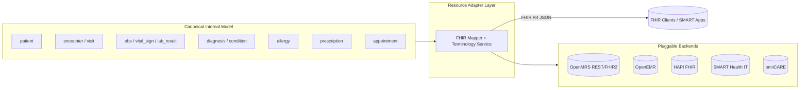
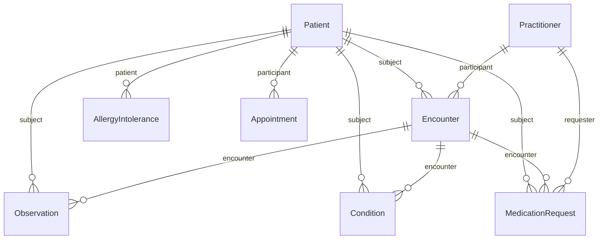

# FHIR R4 Mapping

> **Field-by-field mapping of the internal clinical model to HL7 FHIR R4 resources.**
> Reverse-engineered from the **OpenMRS Reference Application** (primary reference
> system, legacy O2 at `https://o2.openmrs.org`, modern demo O3 at
> `https://o3.openmrs.org`) and generalized through a **Resource Adapter Layer**
> so the same mapping serves OpenEMR, HAPI FHIR, SMART Health IT, and the in-house
> **omiiCARE** app. Target version is **FHIR R4 (4.0.1)**.
>
> Inferences beyond verified OpenMRS facts are tagged **(Assumption)**.
> Requirement IDs `REQ-FHIR-NNN` (and related module prefixes) are cross-referenced
> for traceability into the RTM (472 requirements / 1,349 manual test cases).

---

## 1. Purpose & Scope

| Aspect | Detail |
|--------|--------|
| Goal | Define a normative, testable contract for serializing internal entities as FHIR R4 resources |
| FHIR version | R4 **4.0.1** — confirmed via `CapabilityStatement.fhirVersion` at `/openmrs/ws/fhir2/R4/metadata` |
| In-scope resources | `Patient`, `Encounter`, `Observation`, `Condition`, `AllergyIntolerance`, `MedicationRequest`, `Appointment` |
| Supporting resources | `Practitioner`, `Organization`, `Location`, `Medication`, `DiagnosticReport`, `Coverage` (mapping summarized, not field-level) |
| Endpoints | OpenMRS FHIR R4 base: `/openmrs/ws/fhir2/R4`; omiiCARE base: `/api/v1/fhir` **(Assumption)** |
| Auth | All FHIR reads/writes require auth (Basic / OAuth2 / SMART-on-FHIR); unauthorized → **401** (`REQ-FHIR-001`, `REQ-SEC-*`) |
| Out of scope | Certification claims; bulk-data ($export) field detail; profile authoring (US Core referenced, not redefined) |

### Conformance Targets

| Profile set | Applicability | Notes |
|-------------|---------------|-------|
| FHIR R4 base resources | All adapters | Minimum bar |
| US Core 3.1.1 / 6.x | omiiCARE, SMART Health IT | Must-Support flags below follow US Core where cited **(Assumption for OpenMRS — OpenMRS FHIR2 module is base-R4, not US-Core-strict)** |
| IPS (International Patient Summary) | Cross-border export | Future milestone **(Assumption)** |

---

## 2. Resource Adapter Layer (RAL)

The internal canonical model is mapped **once** to FHIR; each backend system plugs
in through an adapter that resolves identifiers, code systems, and serialization
quirks. This isolates FHIR consumers from backend differences.



| Adapter concern | OpenMRS | OpenEMR | HAPI FHIR | SMART Health IT | omiiCARE |
|-----------------|---------|---------|-----------|-----------------|----------|
| Resource `id` | UUID (36-char) | numeric/UUID | server-assigned | synthetic | UUID v4 |
| Patient identifier | OpenMRS ID (Luhn-mod30) | PID | MRN system | sandbox MRN | MRN |
| Terminology source | CIEL / SNOMED / LOINC | internal lists | external $validate-code | US Core value sets | internal terminology svc |
| Auth | Basic / OAuth2 | OAuth2 | Smart / Basic | SMART-on-FHIR | OAuth2 + SMART |

---

## 3. Global Conventions

| Convention | Rule |
|------------|------|
| Cardinality notation | `0..1` optional single, `1..1` required single, `0..*` optional list, `1..*` required list |
| Must-Support (MS) | Server **must** populate when data exists; client **must** process. Marked `MS` in tables |
| Datatypes | FHIR primitive/complex types (`HumanName`, `CodeableConcept`, `Reference`, `Period`, `Quantity`) |
| References | `ResourceType/{id}` relative form; absolute URLs only for cross-server **(Assumption)** |
| Unknown values | Use data-absent-reason extension rather than omitting MS elements **(Assumption)** |
| `meta.profile` | Asserted when a profile is claimed; omitted for plain base R4 |

### Code Systems (canonical URIs)

| System | URI | Used by |
|--------|-----|---------|
| SNOMED CT | `http://snomed.info/sct` | Condition, AllergyIntolerance (substance/reaction), Observation |
| LOINC | `http://loinc.org` | Observation (vitals, labs), DiagnosticReport |
| ICD-10 | `http://hl7.org/fhir/sid/icd-10` | Condition (billing/secondary coding) |
| RxNorm | `http://www.nlm.nih.gov/research/umls/rxnorm` | MedicationRequest, Medication |
| UCUM | `http://unitsofmeasure.org` | Quantity units (mg, mmHg, Cel, /min) |
| CIEL | `https://openconceptlab.org/orgs/CIEL/sources/CIEL` | OpenMRS native concept dictionary |
| Administrative Gender | `http://hl7.org/fhir/administrative-gender` | Patient.gender |
| Allergy clinical status | `http://terminology.hl7.org/CodeSystem/allergyintolerance-clinical` | AllergyIntolerance |
| Condition clinical status | `http://terminology.hl7.org/CodeSystem/condition-clinical` | Condition |
| Encounter class | `http://terminology.hl7.org/CodeSystem/v3-ActCode` | Encounter.class |
| Observation category | `http://terminology.hl7.org/CodeSystem/observation-category` | Observation.category |
| Identifier type | `http://terminology.hl7.org/CodeSystem/v2-0203` | identifier.type (MR) |

---

## 4. Patient

**Internal entity:** `patient` (Demographics + Contact Info wizard steps).
**Requirements:** `REQ-REG-*`, `REQ-FHIR-002`, `REQ-FHIR-010`.

| FHIR element | Card. | MS | Internal field | Type | Mapping / terminology |
|--------------|-------|----|----------------|------|-----------------------|
| `identifier` | 1..* | MS | OpenMRS ID | Identifier | `system` = MRN namespace; `type.coding` = `MR` (v2-0203). Luhn-mod30 check digit |
| `identifier[x].use` | 0..1 | | — | code | `usual` for primary MRN **(Assumption)** |
| `active` | 0..1 | MS | voided (negated) | boolean | `false` when patient voided/deleted (`REQ-PDASH-*` Delete Patient) |
| `name` | 1..* | MS | given / middle / family Name | HumanName | `given[0]`=given, `given[1]`=middle, `family`=family, `use`=`official` |
| `telecom` | 0..* | MS | Phone Number | ContactPoint | `system`=`phone`, `value`, `use`=`mobile`/`home` |
| `gender` | 1..1 | MS | Gender | code | `male`/`female`/`other`/`unknown` (administrative-gender) |
| `birthDate` | 1..1 | MS | Birthdate | date | Exact date; if estimated → `birthDate` + `data-absent-reason`/`birthTime` precision **(Assumption)** |
| `_birthDate.extension` (estimated) | 0..1 | | "estimated" flag | extension | OpenMRS `birthdateEstimated` → custom extension **(Assumption)** |
| `deceased[x]` | 0..1 | MS | Mark Patient Deceased | boolean/dateTime | `deceasedBoolean` or `deceasedDateTime` |
| `address` | 0..* | MS | Address (≥1 field required) | Address | `line`, `city`, `state`, `postalCode`, `country` |
| `maritalStatus` | 0..1 | | maritalStatus attr | CodeableConcept | v3-MaritalStatus **(Assumption)** |
| `contact` | 0..* | | Relationships (next of kin) | BackboneElement | from Relationships wizard step |
| `generalPractitioner` | 0..* | | assigned clinician | Reference(Practitioner) | **(Assumption)** |
| `managingOrganization` | 0..1 | | session location → org | Reference(Organization) | **(Assumption)** |

**Search params (must-support):** `_id`, `identifier`, `name`, `family`, `given`,
`birthdate`, `gender`, `address-city` (`REQ-SRCH-*`, `REQ-FHIR-020`).

```json
{
  "resourceType": "Patient",
  "id": "b1a2c3d4-0000-4a5b-8c9d-1234567890ab",
  "identifier": [{
    "use": "usual",
    "type": { "coding": [{ "system": "http://terminology.hl7.org/CodeSystem/v2-0203", "code": "MR" }] },
    "system": "http://openmrs.org/identifier",
    "value": "100GEJ"
  }],
  "active": true,
  "name": [{ "use": "official", "family": "Doe", "given": ["John", "Allen"] }],
  "telecom": [{ "system": "phone", "value": "+15551234567", "use": "mobile" }],
  "gender": "male",
  "birthDate": "1990-04-12",
  "address": [{ "use": "home", "line": ["12 Market St"], "city": "Boston", "state": "MA", "postalCode": "02118", "country": "USA" }]
}
```

---

## 5. Encounter

**Internal entity:** `encounter` (within a `visit`). **Requirements:** `REQ-VISIT-*`,
`REQ-CLIN-*`, `REQ-FHIR-021`.

> **Note:** OpenMRS distinguishes **Visit** (episode) from **Encounter** (interaction).
> FHIR R4 `Encounter` maps the OpenMRS encounter; the OpenMRS visit maps to
> `Encounter.partOf` or to `EpisodeOfCare` **(Assumption)**.

| FHIR element | Card. | MS | Internal field | Type | Mapping / terminology |
|--------------|-------|----|----------------|------|-----------------------|
| `identifier` | 0..* | | encounter UUID | Identifier | |
| `status` | 1..1 | MS | visit/encounter state | code | `planned`/`in-progress`/`finished`/`cancelled` |
| `class` | 1..1 | MS | encounter type → class | Coding | v3-ActCode: `AMB` (Outpatient), `IMP` (Inpatient Ward), `EMER` |
| `type` | 0..* | MS | encounterType | CodeableConcept | CIEL/SNOMED (e.g., Vitals, Consultation) |
| `subject` | 1..1 | MS | patient | Reference(Patient) | |
| `participant` | 0..* | MS | provider | BackboneElement | `individual`=Reference(Practitioner), `type`=ATND |
| `period` | 0..1 | MS | encounter datetime | Period | `start`/`end` |
| `location` | 0..* | MS | session location | BackboneElement | Outpatient Clinic / Inpatient Ward / Laboratory etc. |
| `partOf` | 0..1 | | parent visit | Reference(Encounter) | OpenMRS visit container **(Assumption)** |
| `reasonCode` | 0..* | | visit reason | CodeableConcept | SNOMED/ICD-10 **(Assumption)** |
| `serviceProvider` | 0..1 | | org | Reference(Organization) | **(Assumption)** |

**Search params:** `_id`, `patient`/`subject`, `date`, `status`, `location`, `type`.

```json
{
  "resourceType": "Encounter",
  "id": "e5f6a7b8-1111-4c2d-9e0f-abcdef012345",
  "status": "finished",
  "class": { "system": "http://terminology.hl7.org/CodeSystem/v3-ActCode", "code": "AMB", "display": "ambulatory" },
  "type": [{ "coding": [{ "system": "http://snomed.info/sct", "code": "270427003", "display": "Patient-initiated encounter" }] }],
  "subject": { "reference": "Patient/b1a2c3d4-0000-4a5b-8c9d-1234567890ab", "display": "John Doe" },
  "participant": [{
    "type": [{ "coding": [{ "system": "http://terminology.hl7.org/CodeSystem/v3-ParticipationType", "code": "ATND" }] }],
    "individual": { "reference": "Practitioner/d0c9b8a7-2222-4e3f-8a1b-fedcba987654" }
  }],
  "period": { "start": "2026-07-01T09:15:00-04:00", "end": "2026-07-01T09:45:00-04:00" },
  "location": [{ "location": { "reference": "Location/outpatient-clinic", "display": "Outpatient Clinic" } }]
}
```

---

## 6. Observation

**Internal entity:** `obs` / `vital_sign` / `lab_result` (Capture Vitals, lab results).
**Requirements:** `REQ-VITAL-*`, `REQ-ORDLAB-*`, `REQ-FHIR-025`.

| FHIR element | Card. | MS | Internal field | Type | Mapping / terminology |
|--------------|-------|----|----------------|------|-----------------------|
| `identifier` | 0..* | | obs UUID | Identifier | |
| `status` | 1..1 | MS | obs state | code | `final` (default), `amended`, `cancelled` |
| `category` | 0..* | MS | obs group | CodeableConcept | `vital-signs` / `laboratory` (observation-category) |
| `code` | 1..1 | MS | concept | CodeableConcept | LOINC primary (e.g., 8867-4 heart rate), CIEL alt |
| `subject` | 1..1 | MS | patient | Reference(Patient) | |
| `encounter` | 0..1 | MS | encounter | Reference(Encounter) | |
| `effective[x]` | 0..1 | MS | obs datetime | dateTime/Period | `effectiveDateTime` |
| `value[x]` | 0..1 | MS | obs value | Quantity/CodeableConcept/string | numeric → `valueQuantity` (UCUM); coded → `valueCodeableConcept` |
| `dataAbsentReason` | 0..1 | | — | CodeableConcept | when no value |
| `interpretation` | 0..* | | flag | CodeableConcept | `H`/`L`/`N` (v3-ObservationInterpretation) |
| `referenceRange` | 0..* | | concept normal range | BackboneElement | low/high Quantity |
| `component` | 0..* | MS | BP systolic/diastolic | BackboneElement | LOINC 8480-6 / 8462-4 under panel 85354-9 |

**Common vitals → LOINC:**

| Vital | LOINC | UCUM unit |
|-------|-------|-----------|
| Heart rate | 8867-4 | `/min` |
| Respiratory rate | 9279-1 | `/min` |
| Body temperature | 8310-5 | `Cel` |
| Systolic BP | 8480-6 | `mm[Hg]` |
| Diastolic BP | 8462-4 | `mm[Hg]` |
| Body weight | 29463-7 | `kg` |
| Body height | 8302-2 | `cm` |
| Oxygen saturation | 59408-5 | `%` |

**Search params:** `_id`, `patient`, `category`, `code`, `date`, `encounter`, `value-quantity`.

```json
{
  "resourceType": "Observation",
  "id": "a1b2c3d4-3333-4f5a-8b6c-001122334455",
  "status": "final",
  "category": [{ "coding": [{ "system": "http://terminology.hl7.org/CodeSystem/observation-category", "code": "vital-signs" }] }],
  "code": { "coding": [{ "system": "http://loinc.org", "code": "8867-4", "display": "Heart rate" }] },
  "subject": { "reference": "Patient/b1a2c3d4-0000-4a5b-8c9d-1234567890ab" },
  "encounter": { "reference": "Encounter/e5f6a7b8-1111-4c2d-9e0f-abcdef012345" },
  "effectiveDateTime": "2026-07-01T09:20:00-04:00",
  "valueQuantity": { "value": 72, "unit": "beats/minute", "system": "http://unitsofmeasure.org", "code": "/min" }
}
```

---

## 7. Condition

**Internal entity:** `diagnosis` / `condition` (Diagnoses & Conditions widgets).
**Requirements:** `REQ-CLIN-*`, `REQ-FHIR-030`.

| FHIR element | Card. | MS | Internal field | Type | Mapping / terminology |
|--------------|-------|----|----------------|------|-----------------------|
| `clinicalStatus` | 0..1 | MS | condition state | CodeableConcept | `active`/`resolved`/`inactive` (condition-clinical). 1..1 unless `verificationStatus=entered-in-error` |
| `verificationStatus` | 0..1 | MS | confirmed flag | CodeableConcept | `confirmed`/`provisional` |
| `category` | 0..* | MS | diagnosis vs problem-list | CodeableConcept | `encounter-diagnosis` / `problem-list-item` |
| `code` | 1..1 | MS | concept | CodeableConcept | SNOMED primary, ICD-10 secondary |
| `subject` | 1..1 | MS | patient | Reference(Patient) | |
| `encounter` | 0..1 | MS | encounter | Reference(Encounter) | |
| `onset[x]` | 0..1 | | onset date | dateTime | `onsetDateTime` |
| `recordedDate` | 0..1 | MS | created datetime | dateTime | |
| `recorder` | 0..1 | | provider | Reference(Practitioner) | **(Assumption)** |

**Search params:** `_id`, `patient`, `clinical-status`, `category`, `code`, `encounter`.

```json
{
  "resourceType": "Condition",
  "id": "c0ffee00-4444-4a1b-9c2d-66778899aabb",
  "clinicalStatus": { "coding": [{ "system": "http://terminology.hl7.org/CodeSystem/condition-clinical", "code": "active" }] },
  "verificationStatus": { "coding": [{ "system": "http://terminology.hl7.org/CodeSystem/condition-ver-status", "code": "confirmed" }] },
  "category": [{ "coding": [{ "system": "http://terminology.hl7.org/CodeSystem/condition-category", "code": "encounter-diagnosis" }] }],
  "code": { "coding": [
    { "system": "http://snomed.info/sct", "code": "44054006", "display": "Type 2 diabetes mellitus" },
    { "system": "http://hl7.org/fhir/sid/icd-10", "code": "E11.9" }
  ] },
  "subject": { "reference": "Patient/b1a2c3d4-0000-4a5b-8c9d-1234567890ab" },
  "encounter": { "reference": "Encounter/e5f6a7b8-1111-4c2d-9e0f-abcdef012345" },
  "recordedDate": "2026-07-01T09:30:00-04:00"
}
```

---

## 8. AllergyIntolerance

**Internal entity:** `allergy` (Allergies widget). **Requirements:** `REQ-CLIN-*`,
`REQ-FHIR-030`.

| FHIR element | Card. | MS | Internal field | Type | Mapping / terminology |
|--------------|-------|----|----------------|------|-----------------------|
| `clinicalStatus` | 0..1 | MS | active flag | CodeableConcept | `active`/`inactive`/`resolved` (allergyintolerance-clinical) |
| `verificationStatus` | 0..1 | MS | confirmed | CodeableConcept | `confirmed`/`unconfirmed` |
| `type` | 0..1 | | type | code | `allergy`/`intolerance` |
| `category` | 0..* | MS | allergen class | code | `food`/`medication`/`environment`/`biologic` |
| `criticality` | 0..1 | MS | severity flag | code | `low`/`high`/`unable-to-assess` |
| `code` | 1..1 | MS | allergen concept | CodeableConcept | SNOMED / RxNorm (drug allergens) |
| `patient` | 1..1 | MS | patient | Reference(Patient) | |
| `recordedDate` | 0..1 | | created | dateTime | |
| `reaction` | 0..* | MS | reaction obs | BackboneElement | `manifestation` (SNOMED), `severity` (mild/moderate/severe) |

**Search params:** `_id`, `patient`, `clinical-status`, `category`, `criticality`, `code`.

```json
{
  "resourceType": "AllergyIntolerance",
  "id": "a11e0000-5555-4b2c-8d3e-99aabbccddee",
  "clinicalStatus": { "coding": [{ "system": "http://terminology.hl7.org/CodeSystem/allergyintolerance-clinical", "code": "active" }] },
  "verificationStatus": { "coding": [{ "system": "http://terminology.hl7.org/CodeSystem/allergyintolerance-verification", "code": "confirmed" }] },
  "category": ["medication"],
  "criticality": "high",
  "code": { "coding": [{ "system": "http://www.nlm.nih.gov/research/umls/rxnorm", "code": "7980", "display": "Penicillin G" }] },
  "patient": { "reference": "Patient/b1a2c3d4-0000-4a5b-8c9d-1234567890ab" },
  "reaction": [{
    "manifestation": [{ "coding": [{ "system": "http://snomed.info/sct", "code": "247472004", "display": "Hives" }] }],
    "severity": "severe"
  }]
}
```

---

## 9. MedicationRequest

**Internal entity:** `prescription` / drug order (Pharmacy app, ORDER orders).
**Requirements:** `REQ-PHARM-*`, `REQ-ORDLAB-*`, `REQ-FHIR-030`.

| FHIR element | Card. | MS | Internal field | Type | Mapping / terminology |
|--------------|-------|----|----------------|------|-----------------------|
| `status` | 1..1 | MS | order state | code | `active`/`completed`/`stopped`/`cancelled` |
| `intent` | 1..1 | MS | order intent | code | `order` (default), `plan` |
| `priority` | 0..1 | | urgency | code | `routine`/`stat` |
| `medication[x]` | 1..1 | MS | drug concept | CodeableConcept/Reference | `medicationCodeableConcept` (RxNorm) or Reference(Medication) |
| `subject` | 1..1 | MS | patient | Reference(Patient) | |
| `encounter` | 0..1 | MS | encounter | Reference(Encounter) | |
| `authoredOn` | 0..1 | MS | order datetime | dateTime | |
| `requester` | 0..1 | MS | ordering provider | Reference(Practitioner) | |
| `dosageInstruction` | 0..* | MS | dose/route/freq | Dosage | `doseAndRate.doseQuantity` (UCUM), `route` (SNOMED), `timing` |
| `dispenseRequest` | 0..1 | | quantity / refills | BackboneElement | `quantity`, `numberOfRepeatsAllowed` |
| `reasonCode` / `reasonReference` | 0..* | | indication | CodeableConcept/Reference(Condition) | **(Assumption)** |

**Search params:** `_id`, `patient`, `status`, `intent`, `authoredon`, `encounter`, `requester`.

```json
{
  "resourceType": "MedicationRequest",
  "id": "med00000-6666-4c3d-8e4f-aabbccddeeff",
  "status": "active",
  "intent": "order",
  "priority": "routine",
  "medicationCodeableConcept": { "coding": [{ "system": "http://www.nlm.nih.gov/research/umls/rxnorm", "code": "860975", "display": "Metformin 500 MG Oral Tablet" }] },
  "subject": { "reference": "Patient/b1a2c3d4-0000-4a5b-8c9d-1234567890ab" },
  "encounter": { "reference": "Encounter/e5f6a7b8-1111-4c2d-9e0f-abcdef012345" },
  "authoredOn": "2026-07-01T09:35:00-04:00",
  "requester": { "reference": "Practitioner/d0c9b8a7-2222-4e3f-8a1b-fedcba987654" },
  "dosageInstruction": [{
    "text": "500 mg orally twice daily",
    "timing": { "repeat": { "frequency": 2, "period": 1, "periodUnit": "d" } },
    "route": { "coding": [{ "system": "http://snomed.info/sct", "code": "26643006", "display": "Oral route" }] },
    "doseAndRate": [{ "doseQuantity": { "value": 500, "unit": "mg", "system": "http://unitsofmeasure.org", "code": "mg" } }]
  }],
  "dispenseRequest": { "quantity": { "value": 60, "unit": "tablet" }, "numberOfRepeatsAllowed": 3 }
}
```

---

## 10. Appointment

**Internal entity:** `appointment` (Appointment Scheduling app, Schedule/Request
Appointment actions). **Requirements:** `REQ-APPT-*`, `REQ-FHIR-070`.

| FHIR element | Card. | MS | Internal field | Type | Mapping / terminology |
|--------------|-------|----|----------------|------|-----------------------|
| `identifier` | 0..* | | appointment UUID | Identifier | |
| `status` | 1..1 | MS | appt state | code | `proposed`/`booked`/`arrived`/`fulfilled`/`cancelled`/`noshow` |
| `serviceType` | 0..* | MS | appointment service | CodeableConcept | local service catalog |
| `specialty` | 0..* | | provider specialty | CodeableConcept | SNOMED **(Assumption)** |
| `appointmentType` | 0..1 | | scheduled/walk-in | CodeableConcept | v2-0276 **(Assumption)** |
| `start` | 0..1 | MS | start datetime | instant | required when `booked` |
| `end` | 0..1 | MS | end datetime | instant | |
| `minutesDuration` | 0..1 | | duration | positiveInt | |
| `participant` | 1..* | MS | patient + provider + location | BackboneElement | `actor` Reference, `status` `accepted`/`needs-action`, `required` |
| `reasonCode` | 0..* | | reason | CodeableConcept | SNOMED **(Assumption)** |
| `description` / `comment` | 0..1 | | notes | string | |

**Search params:** `_id`, `patient`/`actor`, `date`, `status`, `service-type`, `practitioner`.

```json
{
  "resourceType": "Appointment",
  "id": "app70000-7777-4d4e-8f50-bbccddeeff00",
  "status": "booked",
  "serviceType": [{ "coding": [{ "system": "http://example.org/service-type", "code": "general-consult", "display": "General Consultation" }] }],
  "start": "2026-07-08T14:00:00-04:00",
  "end": "2026-07-08T14:30:00-04:00",
  "minutesDuration": 30,
  "participant": [
    { "actor": { "reference": "Patient/b1a2c3d4-0000-4a5b-8c9d-1234567890ab" }, "required": "required", "status": "accepted" },
    { "actor": { "reference": "Practitioner/d0c9b8a7-2222-4e3f-8a1b-fedcba987654" }, "required": "required", "status": "accepted" },
    { "actor": { "reference": "Location/outpatient-clinic" }, "required": "required", "status": "accepted" }
  ]
}
```

---

## 11. Reference & Status Crosswalk



| Internal state | Patient.active | Encounter.status | Condition.clinicalStatus | MedReq.status | Appt.status |
|----------------|----------------|------------------|--------------------------|---------------|-------------|
| Created/new | true | planned | active | active | booked |
| In progress | true | in-progress | active | active | arrived |
| Completed | true | finished | resolved | completed | fulfilled |
| Voided/deleted | false | cancelled | entered-in-error | cancelled | cancelled |
| No-show | true | — | — | — | noshow |

---

## 12. Terminology & Code-System Validation Rules

| Rule | Resources | Requirement |
|------|-----------|-------------|
| `code.coding.system` must be an absolute URI from §3 table | all | `REQ-FHIR-040` **(Assumption ID)** |
| At least one `coding` SHALL be present in MS `CodeableConcept` | Condition, Allergy, MedReq, Obs | `REQ-FHIR-041` **(Assumption ID)** |
| `Quantity.system` = UCUM and `code` populated for numeric values | Observation, MedReq dosage | `REQ-VITAL-*` |
| Gender restricted to administrative-gender value set | Patient | `REQ-REG-*` |
| ICD-10 used for billing/secondary, SNOMED primary for clinical | Condition | `REQ-BILL-*`, `REQ-CLIN-*` |
| RxNorm required for drug coding | MedicationRequest | `REQ-PHARM-*` |
| Server validates against CapabilityStatement-declared profiles | all | `REQ-FHIR-001` |

---

## 13. CapabilityStatement Summary

| Element | Value |
|---------|-------|
| `fhirVersion` | `4.0.1` |
| `format` | `application/fhir+json`, `application/fhir+xml` |
| `rest.security` | OAuth2 / SMART-on-FHIR (`token`, `authorize` URIs); Basic for OpenMRS |
| `rest.resource.interaction` | `read`, `search-type`, `create`, `update` (per resource & RBAC) |
| Conformance | Base R4; US Core asserted for omiiCARE/SMART adapters **(Assumption)** |

```json
{
  "resourceType": "CapabilityStatement",
  "status": "active",
  "fhirVersion": "4.0.1",
  "format": ["application/fhir+json"],
  "rest": [{
    "mode": "server",
    "resource": [
      { "type": "Patient", "interaction": [{ "code": "read" }, { "code": "search-type" }, { "code": "create" }, { "code": "update" }] },
      { "type": "Encounter", "interaction": [{ "code": "read" }, { "code": "search-type" }] },
      { "type": "Observation", "interaction": [{ "code": "read" }, { "code": "search-type" }] },
      { "type": "Condition", "interaction": [{ "code": "read" }, { "code": "search-type" }] },
      { "type": "AllergyIntolerance", "interaction": [{ "code": "read" }, { "code": "search-type" }] },
      { "type": "MedicationRequest", "interaction": [{ "code": "read" }, { "code": "search-type" }] },
      { "type": "Appointment", "interaction": [{ "code": "read" }, { "code": "search-type" }] }
    ]
  }]
}
```

---

## 14. QA Test Hooks (Traceability)

| Test focus | Resource | Linked REQ | Manual test theme |
|------------|----------|------------|-------------------|
| Unauthorized FHIR read → 401 | all | `REQ-FHIR-001`, `REQ-SEC-*` | negative auth |
| Patient round-trip (create → read) field parity | Patient | `REQ-FHIR-002`, `REQ-REG-*` | data integrity |
| Vitals captured in UI surface as LOINC-coded Observation | Observation | `REQ-VITAL-*`, `REQ-FHIR-025` | UI↔API consistency |
| Diagnosis dual-coded SNOMED + ICD-10 | Condition | `REQ-CLIN-*`, `REQ-FHIR-030` | terminology |
| Drug allergy criticality propagates to interaction warning | AllergyIntolerance | `REQ-CLIN-*`, `REQ-PHARM-*` | clinical safety |
| Prescription RxNorm + UCUM dosage validation | MedicationRequest | `REQ-PHARM-*` | structured order |
| Appointment status transitions match UI actions | Appointment | `REQ-APPT-*`, `REQ-FHIR-070` | workflow |
| `_search` params honored (name, identifier, date) | Patient/Encounter/Obs | `REQ-SRCH-*`, `REQ-FHIR-020` | search contract |
| CapabilityStatement `fhirVersion` = 4.0.1 | metadata | `REQ-FHIR-001` | conformance smoke |
| Adapter parity (OpenMRS vs HAPI vs omiiCARE same JSON shape) | all | `REQ-FHIR-200` | cross-system contract |

---

## 15. Assumptions Register

| # | Assumption |
|---|------------|
| A1 | omiiCARE FHIR base path `/api/v1/fhir`; OpenMRS verified at `/openmrs/ws/fhir2/R4` |
| A2 | US Core Must-Support semantics applied to omiiCARE/SMART adapters; OpenMRS FHIR2 is base-R4 only |
| A3 | OpenMRS Visit → `Encounter.partOf`/`EpisodeOfCare`; encounter → FHIR `Encounter` |
| A4 | `birthdateEstimated` carried via a custom extension on `birthDate` |
| A5 | `REQ-FHIR-040/041/200` IDs proposed to extend the existing catalog; confirm against RTM |
| A6 | Relative references used intra-server; absolute only cross-server |
| A7 | Data-absent-reason used instead of omitting Must-Support elements |
