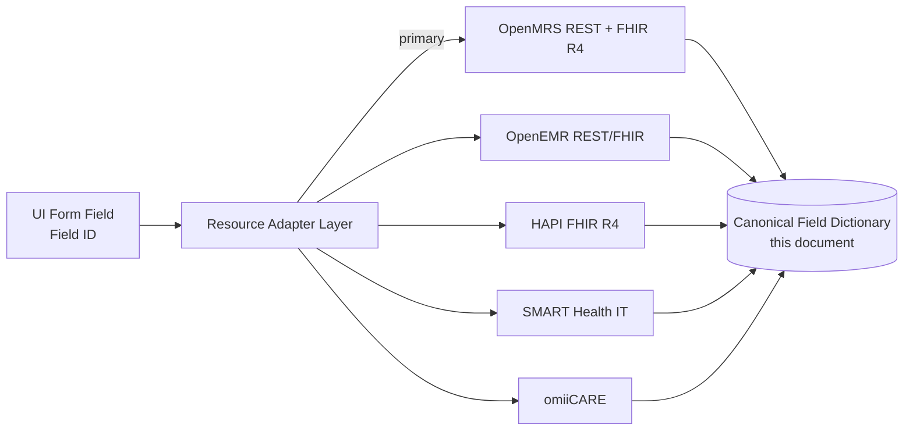

# Field Dictionary

**System under reverse-engineering:** OpenMRS Reference Application (legacy O2 RefApp — https://o2.openmrs.org; modern demo O3 at o3.openmrs.org)
**Document type:** Enterprise Field Dictionary / Data Element Catalog
**Audience:** QA Engineers, Business Analysts, Solution Architects, Test Automation Engineers
**Last reviewed:** 2026-07-01

---

## 1. Purpose and Scope

This Field Dictionary is the **single authoritative catalog of every user-facing data field** in the OpenMRS Reference Application, captured for the purpose of building a healthcare QA portfolio. For each field it records: UI label, UI control, data type, required/optional, format/constraint, validation rule, default value, sample value, and the **mapped data element** in the underlying domain model (REST resource property, FHIR R4 element, or HL7 v2 segment-field).

It is the lookup table that test cases, test-data factories, and the Requirements Traceability Matrix (RTM) all dereference. Where a test case asserts "Birthdate rejects future dates", it is asserting the rule recorded in this dictionary under `REG-BIRTHDATE`.

### 1.1 Multi-System Design Goal

OpenMRS is the **primary reference system**. However this dictionary is structured so the same field semantics map onto alternate backends through a **Resource Adapter Layer (RAL)** — see §11. Target systems:

| System | Role | Field-mapping strategy |
|--------|------|------------------------|
| OpenMRS O2/O3 | Primary reference | Native REST `/ws/rest/v1` + FHIR `/ws/fhir2/R4` |
| OpenEMR | Secondary reference | REST `/apis/default/api` + FHIR R4 façade |
| HAPI FHIR | Pure-FHIR backend | Direct FHIR R4 resources, no proprietary REST |
| SMART Health IT (sandbox) | OAuth2/SMART-on-FHIR test target | FHIR R4 + SMART scopes |
| omiiCARE (in-house) | Product under build | RAL-native schema mapped to canonical field IDs *(Assumption)* |

The **Field ID** column is the canonical, system-independent key. Adapters translate Field ID → system-specific path.

### 1.2 Legend

| Token | Meaning |
|-------|---------|
| `R` | Required (form will not submit without it) |
| `O` | Optional |
| `C` | Conditionally required (rule stated in Validation column) |
| `(Assumption)` | Inferred beyond verified OpenMRS facts; not directly observed |
| `Ø` | No default (empty on load) |

---

## 2. Canonical Data Types

All `Data Type` cells below use this controlled vocabulary so test-data generators can switch on a single token.

| Type token | Definition | Storage / FHIR analogue | Edge-case test seeds |
|-----------|------------|--------------------------|----------------------|
| `STRING` | Free Unicode text | `string` | empty, 1 char, 255 chars, 256 chars, emoji, RTL, SQL meta-chars |
| `NAME` | Person-name fragment | `HumanName.given/family` | hyphen, apostrophe (O'Brien), accents (José), CJK |
| `ENUM` | Closed value set | coded `code` | valid, invalid-not-in-set, case variant, null |
| `BOOL` | true/false | `boolean` | true, false, null |
| `INT` | Integer | `integer` | 0, negative, max-int, non-numeric |
| `DECIMAL` | Fixed/floating numeric | `decimal` / `Quantity.value` | 0.0, negative, >precision, comma-decimal |
| `DATE` | Calendar date | `date` (YYYY-MM-DD) | future, 1900-01-01, leap 02-29, invalid 02-30 |
| `DATETIME` | Instant | `dateTime` (ISO-8601 + TZ) | DST boundary, no-TZ, far future |
| `PHONE` | Telephone | `ContactPoint.value` | intl +CC, extension, letters |
| `UUID` | OpenMRS object UUID | `id` / logical reference | malformed, non-existent |
| `IDENTIFIER` | Business identifier (MRN) | `Identifier.value` | duplicate, check-digit fail |
| `CODED` | Concept reference (SNOMED/ICD/LOINC) | `CodeableConcept` | wrong code-system URI, deprecated code |
| `QUANTITY` | value + unit | `Quantity` (UCUM unit) | unit mismatch, out-of-range |

---

## 3. Authentication & Session Fields
*Module prefix: AUTH — traces REQ-AUTH-001..NNN*

Login screen of the OpenMRS RefApp: pick a **session location**, then enter credentials.

| Field ID | UI Label | UI Control | Data Type | Req | Format / Constraint | Validation | Default | Sample | Mapped Data Element | Req-IDs |
|----------|----------|-----------|-----------|-----|---------------------|-----------|---------|--------|---------------------|---------|
| AUTH-LOC | Login Location | List of `<li id>` (single-select) | ENUM | R | One of: Outpatient Clinic, Inpatient Ward, Pharmacy, Laboratory, Registration Desk, Isolation Ward | Must select before login button enables | Last-used (cookie) *(Assumption)* | "Outpatient Clinic" | REST `session.sessionLocation` (UUID); FHIR `Encounter.location` | REQ-AUTH-002 |
| AUTH-USER | Username | `<input #username type=text>` | STRING | R | 1–50 chars, no leading/trailing space | Non-empty; trimmed | Ø | `admin` | REST `session.user.username` | REQ-AUTH-001 |
| AUTH-PASS | Password | `<input #password type=password>` | STRING | R | Min length per password policy | Non-empty; masked; never logged | Ø | `Admin123` | (not stored in clear; Basic-Auth header) | REQ-AUTH-001, REQ-SEC-004 |
| AUTH-SUBMIT | Log In | `<button #loginButton>` | — (action) | — | Enabled only when USER+PASS+LOC present | On 401 → inline "Invalid username or password" | disabled | — | `POST /ws/rest/v1/session` | REQ-AUTH-003 |
| AUTH-LOCALE | Locale | dropdown (header) | ENUM | O | IETF BCP-47 (en, es, fr, ...) | Must be installed locale | `en` | `en_GB` | REST `session.locale` | REQ-AUTH-007 *(Assumption)* |

**Negative-path note:** Invalid credentials return HTTP `401` on `POST /ws/rest/v1/session`; UI shows generic error (no user-enumeration disclosure — REQ-SEC-005).

---

## 4. Patient Registration Fields
*Module prefix: REG — traces REQ-REG-001..NNN. Source app: `registrationapp` wizard.*

The Register-a-Patient wizard has 4 steps: **Demographics → Contact Info → Relationships → Confirm**.

### 4.1 Step 1 — Demographics

| Field ID | UI Label | UI Control | Data Type | Req | Format / Constraint | Validation | Default | Sample | Mapped Data Element | Req-IDs |
|----------|----------|-----------|-----------|-----|---------------------|-----------|---------|--------|---------------------|---------|
| REG-GIVEN | Given (First) Name | text | NAME | R | 1–50, letters/space/hyphen/apostrophe | Non-empty; regex `^[\p{L}][\p{L}\-' ]*$` | Ø | `John` | REST `person.names[0].givenName`; FHIR `Patient.name.given[0]` | REQ-REG-001 |
| REG-MIDDLE | Middle Name | text | NAME | O | 0–50 | Same charset as given | Ø | `Robert` | `person.names[0].middleName`; FHIR `name.given[1]` | REQ-REG-002 |
| REG-FAMILY | Family (Last) Name | text | NAME | R | 1–50 | Non-empty; name charset | Ø | `Smith` | `person.names[0].familyName`; FHIR `name.family` | REQ-REG-001 |
| REG-GENDER | Gender | radio / select | ENUM | R | M \| F \| O \| U *(O/U Assumption)* | One option selected | Ø | `M` | `person.gender`; FHIR `Patient.gender` (male/female/other/unknown) | REQ-REG-003 |
| REG-BDATE | Birthdate (exact) | date picker | DATE | C | YYYY-MM-DD; not future; ≥1900 | Required unless estimated age given; reject future date | Ø | `1985-04-12` | `person.birthdate`; FHIR `Patient.birthDate` | REQ-REG-004 |
| REG-BEST-FLAG | Birthdate is Estimated | checkbox | BOOL | O | true/false | If true, exact date may be derived from age | `false` | `false` | `person.birthdateEstimated` | REQ-REG-005 |
| REG-AGE-Y | Estimated Age (Years) | number | INT | C | 0–130 | Required if BDATE empty; derives birthdate | Ø | `40` | derived → `person.birthdate` | REQ-REG-005 |
| REG-AGE-M | Estimated Age (Months) | number | INT | O | 0–11 | Combined with years | Ø | `6` | derived → `person.birthdate` | REQ-REG-005 |

> **Cross-field rule (REQ-REG-006):** Exactly one of {exact birthdate} or {estimated age} must be provided. Test cases must cover both-empty (reject) and both-present (precedence: exact wins *(Assumption)*).

### 4.2 Step 2 — Contact Info (Address + Phone)

Address uses the configured `addresshierarchy` template; at least **one** address field must be non-empty.

| Field ID | UI Label | UI Control | Data Type | Req | Format / Constraint | Validation | Default | Sample | Mapped Data Element | Req-IDs |
|----------|----------|-----------|-----------|-----|---------------------|-----------|---------|--------|---------------------|---------|
| REG-ADDR1 | Address Line 1 | text | STRING | C | 0–255 | ≥1 address field required (group rule) | Ø | `12 Oak Street` | `person.addresses[0].address1`; FHIR `Patient.address.line[0]` | REQ-REG-007 |
| REG-ADDR2 | Address Line 2 | text | STRING | O | 0–255 | — | Ø | `Apt 4B` | `address.address2`; FHIR `address.line[1]` | REQ-REG-007 |
| REG-CITY | City / Village | text or hierarchy select | STRING | C | 0–100 | Part of address group rule | Ø | `Boston` | `address.cityVillage`; FHIR `address.city` | REQ-REG-007 |
| REG-STATE | State / Province | text or hierarchy | STRING | O | 0–100 | — | Ø | `MA` | `address.stateProvince`; FHIR `address.state` | REQ-REG-007 |
| REG-POSTAL | Postal Code | text | STRING | O | locale pattern *(Assumption: US `\d{5}(-\d{4})?`)* | Format per country | Ø | `02115` | `address.postalCode`; FHIR `address.postalCode` | REQ-REG-007 |
| REG-COUNTRY | Country | select | STRING | O | ISO-3166 name | From list | configured default | `United States` | `address.country`; FHIR `address.country` | REQ-REG-007 |
| REG-PHONE | Phone Number | text (tel) | PHONE | O | digits, `+`, space, `-`, `()`; E.164 recommended | Pattern check if entered | Ø | `+1-617-555-0142` | person attribute "Telephone Number"; FHIR `Patient.telecom[system=phone]` | REQ-REG-008 |

> **Group rule (REQ-REG-007):** The Contact step blocks submission if **all** address fields are empty. A single field (e.g. City only) satisfies it.

### 4.3 Step 3 — Relationships

| Field ID | UI Label | UI Control | Data Type | Req | Format / Constraint | Validation | Default | Sample | Mapped Data Element | Req-IDs |
|----------|----------|-----------|-----------|-----|---------------------|-----------|---------|--------|---------------------|---------|
| REG-REL-TYPE | Relationship Type | select | ENUM | C | Parent/Child, Sibling, Spouse, Doctor/Patient... | Required if a related person is chosen | Ø | `Parent` | `relationship.relationshipType` (UUID); FHIR `RelatedPerson.relationship` | REQ-REG-009 |
| REG-REL-PERSON | Related Person | autocomplete search | UUID | C | Existing person UUID | Must resolve to a person | Ø | (patient UUID) | `relationship.personA/personB`; FHIR `RelatedPerson.patient` | REQ-REG-009 |

### 4.4 Step 4 — Confirm & System-Generated

| Field ID | UI Label | UI Control | Data Type | Req | Format / Constraint | Validation | Default | Sample | Mapped Data Element | Req-IDs |
|----------|----------|-----------|-----------|-----|---------------------|-----------|---------|--------|---------------------|---------|
| REG-SUBMIT | Confirm | `<button #submit>` | — (action) | — | All prior steps valid | On success → toast "Created Patient Record" | — | — | `POST /ws/rest/v1/patient` | REQ-REG-010 |
| REG-PATID | Patient ID (MRN) | read-only (generated) | IDENTIFIER | system | Idgen pattern (e.g. `10000X` with check digit) | Server-unique; check-digit valid | auto | `100GEJ` | `patient.identifiers[0].identifier`; FHIR `Patient.identifier` | REQ-REG-011 |
| REG-UUID | Patient UUID | hidden | UUID | system | RFC-4122 v4 | Server-assigned, immutable | auto | `da7f...` | `patient.uuid`; FHIR `Patient.id` | REQ-REG-011 |

---

## 5. Vitals & Biometrics Fields
*Module prefix: VITAL — traces REQ-VITAL-001..NNN. App: Capture Vitals → vitals encounter; obs map to LOINC concepts.*

| Field ID | UI Label | UI Control | Data Type | Req | Format / Constraint | Validation | Default | Sample | Mapped Data Element (LOINC) | Req-IDs |
|----------|----------|-----------|-----------|-----|---------------------|-----------|---------|--------|------------------------------|---------|
| VIT-HEIGHT | Height (cm) | number | QUANTITY | O | 0–272 cm; UCUM `cm` | Range check; warn if outlier | Ø | `178` | obs concept *Height* → LOINC `8302-2`; FHIR `Observation` | REQ-VITAL-001 |
| VIT-WEIGHT | Weight (kg) | number | QUANTITY | O | 0–500 kg; UCUM `kg` | Range; drives weight graph | Ø | `72.5` | *Weight* → LOINC `29463-7` | REQ-VITAL-002 |
| VIT-BMI | BMI | read-only (computed) | DECIMAL | system | weight/height² | Auto-calc, not editable | Ø | `22.9` | *BMI* → LOINC `39156-5` | REQ-VITAL-003 |
| VIT-TEMP | Temperature (°C) | number | QUANTITY | O | 25–45 °C; UCUM `Cel` | Range; flag fever ≥38 | Ø | `37.0` | *Temperature* → LOINC `8310-5` | REQ-VITAL-004 |
| VIT-PULSE | Pulse (bpm) | number | INT | O | 0–250 /min | Range; flag brady/tachy | Ø | `72` | *Pulse* → LOINC `8867-4` | REQ-VITAL-005 |
| VIT-RR | Respiratory Rate | number | INT | O | 0–80 /min | Range | Ø | `16` | *Resp rate* → LOINC `9279-1` | REQ-VITAL-006 |
| VIT-SBP | Systolic BP (mmHg) | number | INT | C | 0–250 | Required if DBP entered; SBP>DBP | Ø | `120` | LOINC `8480-6` | REQ-VITAL-007 |
| VIT-DBP | Diastolic BP (mmHg) | number | INT | C | 0–150 | Required if SBP entered; DBP<SBP | Ø | `80` | LOINC `8462-4` | REQ-VITAL-007 |
| VIT-SPO2 | Oxygen Saturation (%) | number | INT | O | 0–100 % | Range; flag <92 | Ø | `98` | LOINC `2708-6` | REQ-VITAL-008 |

> **Cross-field rule (REQ-VITAL-007):** Systolic and Diastolic are a pair — if one is present the other becomes required, and SBP must exceed DBP. Outlier values are saved with a warning, not blocked (clinical override) *(Assumption)*.

---

## 6. Clinical — Allergies, Conditions, Diagnoses
*Module prefix: CLIN — traces REQ-CLIN-001..NNN*

### 6.1 Allergy

| Field ID | UI Label | UI Control | Data Type | Req | Format / Constraint | Validation | Default | Sample | Mapped Data Element | Req-IDs |
|----------|----------|-----------|-----------|-----|---------------------|-----------|---------|--------|---------------------|---------|
| ALG-ALLERGEN | Allergen | coded autocomplete | CODED | R | Concept (drug/food/environmental) | Must be a known concept | Ø | `Penicillin` | FHIR `AllergyIntolerance.code`; REST allergy `allergen` | REQ-CLIN-001 |
| ALG-CATEGORY | Category | select | ENUM | R | drug \| food \| environmental | One value | Ø | `drug` | `AllergyIntolerance.category` | REQ-CLIN-002 |
| ALG-REACTION | Reaction(s) | multi-select chips | CODED[] | O | SNOMED reaction concepts | each in set | Ø | `Hives` | `AllergyIntolerance.reaction.manifestation` | REQ-CLIN-003 |
| ALG-SEVERITY | Severity | select | ENUM | O | mild \| moderate \| severe | one of set | Ø | `severe` | `AllergyIntolerance.reaction.severity` | REQ-CLIN-004 |
| ALG-ONSET | Onset Date | date | DATE | O | ≤ today | not future | Ø | `2020-03-01` | `AllergyIntolerance.onsetDateTime` | REQ-CLIN-005 |
| ALG-NOTE | Comment | textarea | STRING | O | 0–1000 | — | Ø | "Anaphylaxis 2020" | `AllergyIntolerance.note.text` | REQ-CLIN-006 |

### 6.2 Condition / Diagnosis

| Field ID | UI Label | UI Control | Data Type | Req | Format / Constraint | Validation | Default | Sample | Mapped Data Element | Req-IDs |
|----------|----------|-----------|-----------|-----|---------------------|-----------|---------|--------|---------------------|---------|
| CND-CODE | Diagnosis / Condition | coded autocomplete | CODED | R | ICD-10 / SNOMED concept | resolves to concept | Ø | `Type 2 diabetes (E11)` | `Condition.code` (ICD-10 `http://hl7.org/fhir/sid/icd-10`) | REQ-CLIN-010 |
| CND-CERTAINTY | Certainty | radio | ENUM | R | Confirmed \| Presumed | one of set | `Presumed` | `Confirmed` | `Condition.verificationStatus` | REQ-CLIN-011 |
| CND-RANK | Diagnosis Order | radio | ENUM | C | Primary \| Secondary | one Primary per encounter *(Assumption)* | `Secondary` | `Primary` | `Condition` extension / rank | REQ-CLIN-012 |
| CND-STATUS | Clinical Status | select | ENUM | O | active \| inactive \| resolved | one of set | `active` | `active` | `Condition.clinicalStatus` | REQ-CLIN-013 |
| CND-ONSET | Onset Date | date | DATE | O | ≤ today | not future | Ø | `2019-11-20` | `Condition.onsetDateTime` | REQ-CLIN-014 |

---

## 7. Visit & Encounter Fields
*Module prefix: VISIT — traces REQ-VISIT-001..NNN*

| Field ID | UI Label | UI Control | Data Type | Req | Format / Constraint | Validation | Default | Sample | Mapped Data Element | Req-IDs |
|----------|----------|-----------|-----------|-----|---------------------|-----------|---------|--------|---------------------|---------|
| VST-TYPE | Visit Type | select | ENUM | R | Facility Visit, Home Visit... | one of configured | Ø | `Facility Visit` | `visit.visitType`; FHIR `Encounter.class` | REQ-VISIT-001 |
| VST-LOC | Visit Location | select | UUID | R | session/login location | valid location | session loc | `Outpatient Clinic` | `visit.location`; FHIR `Encounter.location` | REQ-VISIT-002 |
| VST-START | Start Date/Time | datetime | DATETIME | R | ≤ now (for past visit) | not future for active; ≤ stop | now | `2026-07-01T09:00` | `visit.startDatetime`; `Encounter.period.start` | REQ-VISIT-003 |
| VST-STOP | Stop Date/Time | datetime | DATETIME | C | ≥ start | required for Past Visit; ≥ start | Ø | `2026-07-01T10:30` | `visit.stopDatetime`; `Encounter.period.end` | REQ-VISIT-004 |
| VST-PASTFLAG | Add Past Visit | action | — | — | opens dated form | requires start & stop | — | — | (visit with explicit dates) | REQ-VISIT-005 |

> **Rule (REQ-VISIT-004):** Stop must be ≥ Start. Overlapping active visits for one patient are disallowed *(Assumption)*.

---

## 8. Appointment Scheduling Fields
*Module prefix: APPT — traces REQ-APPT-001..REQ-APPT-019*

| Field ID | UI Label | UI Control | Data Type | Req | Format / Constraint | Validation | Default | Sample | Mapped Data Element | Req-IDs |
|----------|----------|-----------|-----------|-----|---------------------|-----------|---------|--------|---------------------|---------|
| APT-PATIENT | Patient | autocomplete | UUID | R | existing patient | resolves | Ø | `John Smith (100GEJ)` | `Appointment.participant[actor=Patient]` | REQ-APPT-001 |
| APT-SERVICE | Service | select | ENUM | R | configured services | one of set | Ø | `General Medicine` | `Appointment.serviceType` | REQ-APPT-002 |
| APT-SERVICE-TYPE | Service Type | select | ENUM | O | sub-type of service | child of service | Ø | `Follow-up` | `Appointment.appointmentType` *(Assumption)* | REQ-APPT-003 |
| APT-PROVIDER | Provider | autocomplete | UUID | O | active provider | resolves | Ø | `Dr. Jane Doe` | `Appointment.participant[actor=Practitioner]` | REQ-APPT-004 |
| APT-LOC | Location | select | UUID | R | valid location | resolves | session loc | `Outpatient Clinic` | `Appointment.participant[actor=Location]` | REQ-APPT-005 |
| APT-DATE | Appointment Date | date picker | DATE | R | ≥ today | not past *(Assumption)* | today | `2026-07-15` | part of `Appointment.start` | REQ-APPT-006 |
| APT-START | Start Time | time | DATETIME | R | within service hours | ≥ now; < end | Ø | `10:00` | `Appointment.start` | REQ-APPT-007 |
| APT-END | End Time | time | DATETIME | R | > start | duration > 0 | Ø | `10:30` | `Appointment.end` | REQ-APPT-008 |
| APT-STATUS | Status | select | ENUM | system | Requested, Scheduled, CheckedIn, Completed, Cancelled, Missed | valid transition | `Scheduled` | `Scheduled` | `Appointment.status` | REQ-APPT-009 |
| APT-NOTE | Notes | textarea | STRING | O | 0–1000 | — | Ø | "Routine review" | `Appointment.comment` | REQ-APPT-010 |

> **Rule (REQ-APPT-008):** End time must be strictly after Start time; the system rejects zero/negative duration. Double-booking the same provider/slot triggers a conflict warning (REQ-APPT-011) *(Assumption)*.

---

## 9. Orders — Lab & Pharmacy
*Module prefixes: ORDLAB, PHARM — trace REQ-ORDLAB-NNN, REQ-PHARM-NNN*

### 9.1 Lab / Test Order

| Field ID | UI Label | UI Control | Data Type | Req | Format / Constraint | Validation | Default | Sample | Mapped Data Element | Req-IDs |
|----------|----------|-----------|-----------|-----|---------------------|-----------|---------|--------|---------------------|---------|
| LAB-TEST | Test / Order Concept | coded autocomplete | CODED | R | LOINC orderable | in orderables set | Ø | `CBC (58410-2)` | `Order.concept`; FHIR `ServiceRequest.code` (LOINC) | REQ-ORDLAB-001 |
| LAB-URGENCY | Urgency | select | ENUM | R | Routine \| STAT \| On Scheduled Date | one of set | `Routine` | `STAT` | `Order.urgency`; `ServiceRequest.priority` | REQ-ORDLAB-002 |
| LAB-SCHEDDATE | Scheduled Date | datetime | DATETIME | C | required if urgency=On Scheduled Date; ≥ now | conditional | Ø | `2026-07-05T08:00` | `Order.scheduledDate` | REQ-ORDLAB-003 |
| LAB-SPECIMEN | Specimen Source | select | CODED | O | specimen concept | in set | Ø | `Venous blood` | `ServiceRequest.specimen` *(Assumption)* | REQ-ORDLAB-004 |
| LAB-INSTR | Instructions | textarea | STRING | O | 0–1000 | — | Ø | "Fasting" | `Order.instructions` | REQ-ORDLAB-005 |
| LAB-ORDERER | Ordering Provider | read-only / select | UUID | R | active provider | resolves | current user | `Dr. Jane Doe` | `Order.orderer`; `ServiceRequest.requester` | REQ-ORDLAB-006 |

### 9.2 Drug / Pharmacy Order

| Field ID | UI Label | UI Control | Data Type | Req | Format / Constraint | Validation | Default | Sample | Mapped Data Element | Req-IDs |
|----------|----------|-----------|-----------|-----|---------------------|-----------|---------|--------|---------------------|---------|
| RX-DRUG | Drug | coded autocomplete | CODED | R | formulary drug concept | in formulary | Ø | `Amoxicillin 500mg` | `DrugOrder.drug`; FHIR `MedicationRequest.medication` | REQ-PHARM-001 |
| RX-DOSE | Dose | number + unit | QUANTITY | R | >0; UCUM unit | positive; unit from list | Ø | `500 mg` | `DrugOrder.dose` + `doseUnits`; `MedicationRequest.dosageInstruction.doseAndRate` | REQ-PHARM-002 |
| RX-ROUTE | Route | select | CODED | R | oral, IV, IM... (SNOMED) | in set | Ø | `Oral` | `DrugOrder.route`; `dosage.route` | REQ-PHARM-003 |
| RX-FREQ | Frequency | select | CODED | R | e.g. BID, TID, QID | in set | Ø | `Twice daily (BID)` | `DrugOrder.frequency`; `dosage.timing` | REQ-PHARM-004 |
| RX-DURATION | Duration | number + unit | QUANTITY | C | >0; days/weeks | required unless PRN/continuous | Ø | `7 days` | `DrugOrder.duration` + `durationUnits` | REQ-PHARM-005 |
| RX-QTY | Quantity to Dispense | number + unit | QUANTITY | C | >0 | required for outpatient dispense | Ø | `21 tablet` | `DrugOrder.quantity`; `MedicationRequest.dispenseRequest.quantity` | REQ-PHARM-006 |
| RX-REFILLS | Refills | number | INT | O | 0–11 | non-negative | `0` | `2` | `DrugOrder.numRefills`; `dispenseRequest.numberOfRepeatsAllowed` | REQ-PHARM-007 |
| RX-PRN | As Needed (PRN) | checkbox | BOOL | O | true/false | if true, reason recommended | `false` | `true` | `dosageInstruction.asNeededBoolean` | REQ-PHARM-008 |
| RX-INSTR | Dosing Instructions | textarea | STRING | O | 0–1000 | — | Ø | "Take with food" | `DrugOrder.dosingInstructions`; `dosage.patientInstruction` | REQ-PHARM-009 |

> **Cross-field rule (REQ-PHARM-005):** Either Duration **or** an explicit "continuous/indefinite" flag must be set; dose and dispense quantity are checked for internal consistency (warn if dispense < dose×freq×duration) *(Assumption)*.

---

## 10. Search, Reports, and Misc Fields

### 10.1 Patient Search (SRCH — REQ-SRCH-NNN)

| Field ID | UI Label | UI Control | Data Type | Req | Format / Constraint | Validation | Default | Sample | Mapped Data Element | Req-IDs |
|----------|----------|-----------|-----------|-----|---------------------|-----------|---------|--------|---------------------|---------|
| SRCH-QUERY | Search (name or ID) | text (debounced) | STRING | R | ≥2 chars to trigger | min length; no script injection | Ø | `Smith` or `100GEJ` | `GET /ws/rest/v1/patient?q=`; FHIR `Patient?name=`/`identifier=` | REQ-SRCH-001 |

### 10.2 Mark Patient Deceased (PDASH — REQ-PDASH-NNN)

| Field ID | UI Label | UI Control | Data Type | Req | Format / Constraint | Validation | Default | Sample | Mapped Data Element | Req-IDs |
|----------|----------|-----------|-----------|-----|---------------------|-----------|---------|--------|---------------------|---------|
| DEC-DEAD | Deceased | checkbox/toggle | BOOL | R | true to mark | confirm dialog | `false` | `true` | `person.dead`; FHIR `Patient.deceasedBoolean` | REQ-PDASH-020 |
| DEC-DATE | Death Date | date | DATE | C | ≥ birthdate, ≤ today | required if dead; not future; ≥ DOB | Ø | `2026-06-30` | `person.deathDate`; FHIR `Patient.deceasedDateTime` | REQ-PDASH-021 |
| DEC-CAUSE | Cause of Death | coded autocomplete | CODED | C | ICD-10/SNOMED | required if dead | Ø | `Myocardial infarction` | `person.causeOfDeath` | REQ-PDASH-022 |

---

## 11. Resource Adapter Layer — Cross-System Field Mapping

The canonical **Field ID** is system-independent. The adapter resolves it per target. Representative mappings:

| Field ID | OpenMRS REST | OpenMRS FHIR R4 | OpenEMR | HAPI FHIR | HL7 v2 | omiiCARE *(Assumption)* |
|----------|--------------|-----------------|---------|-----------|--------|--------------------------|
| REG-GIVEN | `person.names[].givenName` | `Patient.name.given[0]` | `patient.fname` | `Patient.name.given[0]` | PID-5.2 | `patient.firstName` |
| REG-FAMILY | `person.names[].familyName` | `Patient.name.family` | `patient.lname` | `Patient.name.family` | PID-5.1 | `patient.lastName` |
| REG-GENDER | `person.gender` | `Patient.gender` | `patient.sex` | `Patient.gender` | PID-8 | `patient.gender` |
| REG-BDATE | `person.birthdate` | `Patient.birthDate` | `patient.DOB` | `Patient.birthDate` | PID-7 | `patient.dob` |
| REG-PATID | `patient.identifiers[].identifier` | `Patient.identifier.value` | `patient.pubpid` | `Patient.identifier.value` | PID-3 | `patient.mrn` |
| VIT-WEIGHT | obs (LOINC 29463-7) | `Observation.valueQuantity` | `form_vitals.weight` | `Observation.valueQuantity` | OBX (LOINC 29463-7) | `vitals.weightKg` |
| CND-CODE | diagnosis obs/condition | `Condition.code` | `lists.diagnosis` | `Condition.code` | DG1-3 | `condition.code` |
| RX-DRUG | `DrugOrder.drug` | `MedicationRequest.medication` | `prescriptions.drug` | `MedicationRequest.medication` | RXO-1 | `medication.drugCode` |
| APT-START | n/a (appointmentscheduling) | `Appointment.start` | `openemr_postcalendar_events` | `Appointment.start` | SIU SCH-11 | `appointment.startTime` |

---

## 12. Field-Level Validation Catalog (Reusable Rules)

These named rules are referenced from the tables above and from test cases, so a single rule change updates everywhere.

| Rule ID | Name | Definition | Applies to | Negative test seed |
|---------|------|------------|-----------|--------------------|
| VR-REQ | Required | Non-null, non-blank after trim | all `R` fields | empty, whitespace-only |
| VR-NAME | Name charset | `^[\p{L}][\p{L}\-' ]{0,49}$` | REG-GIVEN/MIDDLE/FAMILY | digits, `<script>`, 51 chars |
| VR-NOTFUTURE | No future date | value ≤ server today | REG-BDATE, ALG-ONSET, DEC-DATE | tomorrow, year 3000 |
| VR-DOBORDER | Death ≥ Birth | DEC-DATE ≥ REG-BDATE | DEC-DATE | death before birth |
| VR-RANGE | Numeric range | min ≤ value ≤ max | all QUANTITY/INT vitals | below min, above max |
| VR-PAIR-BP | BP pair | SBP & DBP both-or-neither; SBP>DBP | VIT-SBP/DBP | SBP only; SBP<DBP |
| VR-TIMEORDER | End after start | end > start | APT-END, VST-STOP | end=start, end<start |
| VR-ADDRGROUP | Address group | ≥1 of address fields non-empty | REG-ADDR* | all blank |
| VR-CODED | Concept exists | value resolves to active concept | all CODED fields | unknown code, deprecated code |
| VR-UCUM | Valid unit | unit ∈ UCUM allowed set for concept | QUANTITY fields | wrong unit (kg for temp) |
| VR-UNIQUE-ID | Unique identifier | MRN unique + check-digit valid | REG-PATID | duplicate, bad check digit |
| VR-INJECT | Injection-safe | reject/escape SQL & script meta-chars | all STRING/free-text | `'; DROP`, `` |

---

## 13. Test-Data Sample Bank (per Data Type)

For automation factories — boundary and adversarial seeds keyed to §2 types.

| Data Type | Valid | Boundary | Invalid / Adversarial |
|-----------|-------|----------|------------------------|
| NAME | `José`, `O'Brien`, `李伟` | 1 char `A`, 50 chars | 51 chars, `Robert123`, `<script>` |
| DATE | `1990-06-15` | `1900-01-01`, leap `2024-02-29` | future, `2023-02-30`, `15/06/1990` |
| QUANTITY (weight) | `72.5 kg` | `0.5 kg`, `500 kg` | `-5`, `501`, `72.5 lb` (wrong unit) |
| PHONE | `+1-617-555-0142` | `+999999999999` (E.164 max) | `abc`, `555` (too short) |
| IDENTIFIER | `100GEJ` | shortest valid | duplicate existing MRN, bad check digit |
| CODED | `Penicillin` (active) | least-used concept | retired concept, free-text non-concept |
| ENUM (gender) | `M`, `F` | `O`, `U` | `X`, `male` (case/format), null |

---

## 14. Traceability & Maintenance

- **Upstream:** Each Field ID rolls up to one or more `REQ-<PREFIX>-NNN` requirements (catalog of 472 requirements). The RTM links Field ID → Requirement → Test Case (1,349 manual cases).
- **Downstream:** Test-data factories and Page Objects reference Field IDs as stable selectors-of-record; UI selector drift (e.g. `#username`) is isolated to the Page Object, not this dictionary.
- **Change control:** Any new UI field MUST be added here with a Field ID before a test case may reference it. A field marked `(Assumption)` must be reconciled against the live RefApp before promotion to a release baseline.
- **Coverage check (QA gate):** every `R`/`C` field requires at least one positive and one negative test case; every named rule in §12 requires at least one dedicated boundary test.

---

*End of Field Dictionary. Items marked **(Assumption)** are inferences beyond directly verified OpenMRS Reference Application behavior and must be validated against the running instance before use as a release baseline.*
