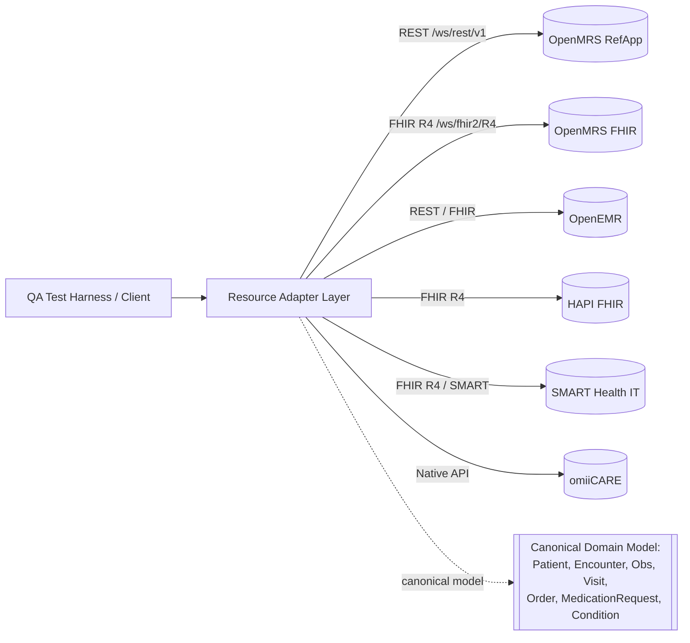
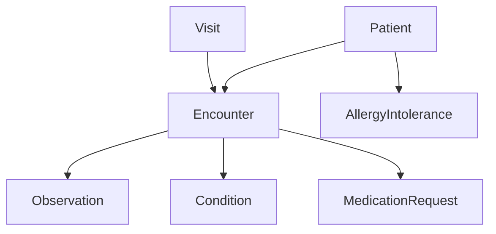
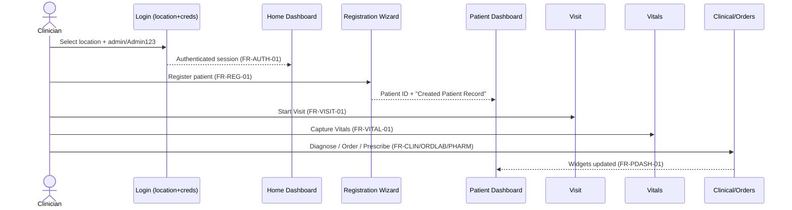

# Functional Requirements Document (FRD)
## OpenMRS Reference Application — Multi-System Healthcare QA Reference

| Field | Value |
|---|---|
| Document Type | Functional Requirements Document (FRD) |
| Primary Reference System | OpenMRS Reference Application (legacy O2 — `https://o2.openmrs.org`; modern demo O3 — `o3.openmrs.org`) |
| Secondary Targets (via Resource Adapter Layer) | OpenEMR, HAPI FHIR, SMART Health IT, in-house omiiCARE |
| Status | Baseline (reverse-engineered) |
| Date | 2026-07-01 |
| Traceability | Cross-referenced to requirement catalog (472 requirements `REQ-<PREFIX>-NNN`; 1,349 manual test cases via RTM) |
| Standards Footprint | FHIR R4 (4.0.1), HL7 v2 (ADT/ORM/ORU), ICD-10, SNOMED CT, LOINC |

> **Assumption marking:** Statements that go beyond the VERIFIED OpenMRS facts are explicitly tagged **(Assumption)**. Verified facts are stated plainly.

---

## 1. Purpose & Scope

This FRD specifies the functional behavior of the OpenMRS Reference Application as the **primary** system under test, while structuring every requirement so it can be re-bound to alternate backends (OpenEMR, HAPI FHIR, SMART Health IT, omiiCARE) through a **Resource Adapter Layer (RAL)**. Each functional requirement is expressed in terms of *inputs → processing → outputs → business rules*, decoupled from the underlying API dialect.

### 1.1 In Scope (Functional Modules)

| Module | Prefix | OpenMRS App / Surface |
|---|---|---|
| Authentication & Session | AUTH | Login (location + credentials), Logout, session |
| Registration | REG | `registrationapp` Register a patient wizard |
| Patient Search | SRCH | `coreapps` Find Patient Record |
| Patient Dashboard | PDASH | Patient dashboard widgets + General Actions |
| Visits | VISIT | Start/Add Past/Merge Visit, Active Visits |
| Vitals | VITAL | Capture Vitals |
| Clinical | CLIN | Diagnoses, Conditions, Allergies, Observations |
| Appointments | APPT | Appointment Scheduling |
| Orders / Lab / Radiology | ORDLAB | Order entry, lab results |
| Pharmacy | PHARM | Pharmacy app, MedicationRequest |
| RBAC | RBAC | Roles, privileges, app gating |
| Data Management | DATA | Data Management, Configure Metadata |
| Reporting & Audit | RPT | Reports + audit logging |
| FHIR API | FHIR | `/ws/fhir2/R4` |
| HL7 Interfaces | HL7 | ADT / ORM / ORU |
| Billing | BILL | (Assumption) billing/charges |
| Telemedicine | TELE | (Assumption) virtual visits |
| Notifications | NOTIF | (Assumption) alerts/reminders |
| Security | SEC | OWASP, transport, auth |
| Accessibility | A11Y | WCAG conformance |
| Performance | PERF | Latency/throughput |

### 1.2 Out of Scope
Implementation of non-OpenMRS backends themselves; only the **adapter contract** is specified here.

---

## 2. Architecture Context — Resource Adapter Layer (RAL)

**RAL contract (Assumption for non-OpenMRS targets):** every functional requirement maps a canonical operation (e.g. `CreatePatient`, `StartEncounter`, `RecordObservation`) to a system-specific call. Adapters MUST preserve the *inputs/outputs/business rules* in this document; only transport, auth, and field-naming differ.

| Canonical Op | OpenMRS REST | OpenMRS FHIR R4 | OpenEMR (Assumption) | HAPI FHIR | omiiCARE (Assumption) |
|---|---|---|---|---|---|
| CreatePatient | `POST /ws/rest/v1/patient` | `POST /Patient` | `POST /api/patient` | `POST /Patient` | native |
| SearchPatient | `GET /patient?q=` | `GET /Patient?name=` | `GET /api/patient?search=` | `GET /Patient?` | native |
| StartVisit | `POST /visit` | `POST /Encounter` | `POST /api/encounter` | `POST /Encounter` | native |
| RecordVitals | `POST /encounter` + `obs` | `POST /Observation` | `POST /api/observation` | `POST /Observation` | native |
| AddDiagnosis | `POST /patientdiagnoses` | `POST /Condition` | n/a | `POST /Condition` | native |
| PrescribeMed | `POST /order` (drugorder) | `POST /MedicationRequest` | `POST /api/prescription` | `POST /MedicationRequest` | native |

---

## 3. Module Functional Requirements

Notation per requirement: **FR-<MODULE>-NN** with linked catalog IDs `REQ-<PREFIX>-NNN`. Catalog IDs shown are representative anchors for traceability; the RTM is authoritative for full mapping.

---

### 3.1 Authentication & Session (AUTH)

#### FR-AUTH-01 — Location-scoped login
| Attribute | Detail |
|---|---|
| Description | User selects a session **location** then authenticates with username/password. |
| Inputs | Session location (one of: Outpatient Clinic, Inpatient Ward, Pharmacy, Laboratory, Registration Desk, Isolation Ward — rendered as `<li id="...">`); `#username`; `#password`; activate `#loginButton`. Demo creds `admin/Admin123`. |
| Processing | Validate credentials against user store; bind selected location to the session; establish authenticated session token/cookie. |
| Outputs | On success → Home dashboard with header showing user menu + active session location. On failure → inline error, remain on login. |
| Business Rules | BR1: A location MUST be selected before credentials are accepted. BR2: Session location scopes subsequently created encounters/visits. BR3: Lockout/error messaging must not disclose which factor failed (**Assumption** — generic error). |
| Linked REQ | REQ-AUTH-001, REQ-AUTH-014, REQ-SEC-002 |

#### FR-AUTH-02 — Logout / session termination
| Attribute | Detail |
|---|---|
| Inputs | **Logout** action in the collapsible navbar (user menu). |
| Processing | Invalidate server session; clear auth cookie. |
| Outputs | Redirect to login; protected routes inaccessible. |
| Business Rules | Back-button after logout MUST NOT expose patient data (**Assumption**). Idle session timeout enforced (**Assumption**). |
| Linked REQ | REQ-AUTH-020, REQ-SEC-009 |

#### FR-AUTH-03 — API authentication
| Attribute | Detail |
|---|---|
| Description | REST `/openmrs/ws/rest/v1/*` and FHIR `/openmrs/ws/fhir2/R4` require auth (Basic / OAuth). |
| Inputs | Authorization header (Basic or Bearer). |
| Processing | Authenticate; reject if absent/invalid. |
| Outputs | Authorized → resource payload; unauthorized → **HTTP 401**. |
| Business Rules | All non-public API endpoints reject anonymous access with 401. |
| Linked REQ | REQ-AUTH-030, REQ-FHIR-002, REQ-SEC-001 |

---

### 3.2 Registration (REG)

#### FR-REG-01 — Multi-step patient registration wizard
| Attribute | Detail |
|---|---|
| Description | `registrationapp` "Register a patient" — wizard steps: **Demographics → Contact Info → Relationships → Confirm**. |
| Inputs (Demographics) | Given Name, Middle Name, Family Name, Gender, Birthdate (exact date OR estimated age). |
| Inputs (Contact Info) | Address (≥1 address field required), Phone Number. |
| Inputs (Relationships) | Optional related persons + relationship type. |
| Processing | Validate each step; on Confirm activate `#submit`; generate a **unique Patient ID**; persist person/patient records. |
| Outputs | Redirect to the new patient dashboard; **"Created Patient Record"** toast; Patient ID displayed. |
| Business Rules | BR1: Given + Family Name and Gender are mandatory. BR2: Birthdate accepts exact date OR estimated age (mutually consistent). BR3: Contact step requires at least one address field. BR4: Patient ID is system-generated and unique. BR5: Wizard prevents advancing past invalid step. |
| Linked REQ | REQ-REG-001, REQ-REG-007, REQ-REG-022, REQ-REG-040 |

#### FR-REG-02 — Edit registration information
| Inputs | "Edit Registration Information" (patient dashboard General Action). |
| Processing | Reopen wizard pre-filled; persist edits with audit trail. |
| Outputs | Updated demographics; confirmation toast. |
| Business Rules | Identifier immutable; demographic edits versioned (**Assumption**). |
| Linked REQ | REQ-REG-050, REQ-RPT-031 |

#### FR-REG-03 — Estimated vs exact birthdate
| Processing | If estimated age entered, derive birthdate flagged as estimated; if exact, store precise DOB. |
| Business Rules | Age derived dynamically for display on dashboard. |
| Linked REQ | REQ-REG-012 |

---

### 3.3 Patient Search (SRCH)

#### FR-SRCH-01 — Find Patient Record
| Attribute | Detail |
|---|---|
| Description | `coreapps` Find Patient Record tile. |
| Inputs | Search string (name and/or identifier). |
| Processing | Query patient index; return matching candidates. |
| Outputs | Result list (name, gender, age, ID); selecting a row opens the patient dashboard. |
| Business Rules | BR1: Partial-name and identifier search supported. BR2: No-match returns an empty-state message, not an error. BR3: Results scoped by caller privileges. |
| Linked REQ | REQ-SRCH-001, REQ-SRCH-009, REQ-RBAC-014 |

#### FR-SRCH-02 — Search API parity
| Processing | REST `GET /ws/rest/v1/patient?q=` and FHIR `GET /Patient?name=` MUST return equivalent canonical results via RAL. |
| Linked REQ | REQ-SRCH-020, REQ-FHIR-010 |

---

### 3.4 Patient Dashboard (PDASH)

#### FR-PDASH-01 — Dashboard composition
| Attribute | Detail |
|---|---|
| Description | Patient dashboard renders header + clinical widgets + General Actions. |
| Outputs (Header) | Name, gender, age, DOB, Patient ID. |
| Outputs (Widgets) | Diagnoses, Latest Observations, Vitals, Recent Visits, Family, Conditions, Allergies, Attachments, Weight graph, Appointments. |
| Outputs (General Actions) | Start Visit, Add Past Visit, Merge Visits, Schedule Appointment, Request Appointment, Mark Patient Deceased, Edit Registration Information, Delete Patient, Attachments. |
| Business Rules | BR1: Widgets render empty-state when no data. BR2: Action visibility gated by RBAC privileges. BR3: Weight graph plots weight observations over time. |
| Linked REQ | REQ-PDASH-001, REQ-PDASH-018, REQ-RBAC-020 |

#### FR-PDASH-02 — Mark Patient Deceased
| Inputs | Death date, cause of death (concept). |
| Processing | Set deceased flag; record cause; surface banner on dashboard. |
| Business Rules | Deceased patients restrict order/visit creation (**Assumption**). |
| Linked REQ | REQ-PDASH-030, REQ-CLIN-041 |

#### FR-PDASH-03 — Delete Patient
| Processing | Soft-delete (void) with reason; audit logged. |
| Business Rules | Requires "Delete Patients" privilege; reversible by admin (**Assumption** soft-delete). |
| Linked REQ | REQ-PDASH-035, REQ-RBAC-040, REQ-RPT-040 |

---

### 3.5 Visits (VISIT)

#### FR-VISIT-01 — Start visit
| Inputs | Visit type, session location (from login), start datetime. |
| Processing | Create active visit bound to location; expose in Active Visits. |
| Outputs | Active visit context; visit appears in Recent Visits + Active Visits app. |
| Business Rules | BR1: Only one active visit per patient at a time (**Assumption**). BR2: Visit location defaults to session location. |
| Linked REQ | REQ-VISIT-001, REQ-VISIT-010 |

#### FR-VISIT-02 — Add Past Visit / Merge Visits
| Inputs | Past visit dates (Add Past Visit); two visits to merge (Merge Visits). |
| Processing | Backfill historical visit / reconcile encounters under one visit. |
| Business Rules | Merge preserves all child encounters/obs; audit logged. |
| Linked REQ | REQ-VISIT-020, REQ-VISIT-031, REQ-RPT-033 |

#### FR-VISIT-03 — Active Visits dashboard
| Outputs | List of currently active visits across the facility, filterable by location. |
| Linked REQ | REQ-VISIT-040 |

---

### 3.6 Vitals (VITAL)

#### FR-VITAL-01 — Capture Vitals
| Attribute | Detail |
|---|---|
| Inputs | Vital sign observations (e.g. height, weight, temperature, pulse, BP, SpO₂, respiratory rate). |
| Processing | Create an encounter under the active visit; record obs against LOINC-coded concepts. |
| Outputs | Vitals widget + Latest Observations update; weight feeds the Weight graph. |
| Business Rules | BR1: Numeric values validated against concept absolute/critical ranges. BR2: Out-of-range values flagged (**Assumption**). BR3: Vitals require an open encounter context. |
| Linked REQ | REQ-VITAL-001, REQ-VITAL-012, REQ-CLIN-006 |

---

### 3.7 Clinical (CLIN)

#### FR-CLIN-01 — Diagnoses
| Inputs | Diagnosis concept (ICD-10 / SNOMED coded), certainty (confirmed/presumed), rank (primary/secondary). |
| Processing | Attach diagnosis to encounter/visit. |
| Outputs | Diagnoses widget. |
| Business Rules | Coded to ICD-10 / SNOMED; primary diagnosis singular per encounter (**Assumption**). |
| Linked REQ | REQ-CLIN-001, REQ-CLIN-008 |

#### FR-CLIN-02 — Conditions
| Inputs | Condition (SNOMED), clinical status (active/inactive/resolved), onset date. |
| Outputs | Conditions widget; maps to FHIR `Condition`. |
| Linked REQ | REQ-CLIN-020, REQ-FHIR-021 |

#### FR-CLIN-03 — Allergies
| Inputs | Allergen, reaction(s), severity, criticality. |
| Processing | Record allergy; maps to FHIR `AllergyIntolerance`. |
| Outputs | Allergies widget; drives prescription interaction checks (**Assumption**). |
| Business Rules | Severity/criticality mandatory; duplicate allergen warned. |
| Linked REQ | REQ-CLIN-030, REQ-FHIR-025, REQ-PHARM-014 |

#### FR-CLIN-04 — Observations
| Inputs | Concept + typed value (numeric/coded/text/datetime). |
| Outputs | Latest Observations widget; FHIR `Observation`. |
| Business Rules | Value type MUST match concept datatype. |
| Linked REQ | REQ-CLIN-040, REQ-FHIR-020 |

---

### 3.8 Appointments (APPT)

#### FR-APPT-01 — Appointment Scheduling
| Inputs | Patient, service/type, provider, location, date/time slot. |
| Processing | Reserve slot; create scheduled appointment. |
| Outputs | Appointments widget; Appointment Scheduling app list. |
| Business Rules | BR1: No double-booking of the same provider/slot (**Assumption**). BR2: Past-dated scheduling blocked. |
| Linked REQ | REQ-APPT-001, REQ-APPT-011 |

#### FR-APPT-02 — Request Appointment
| Inputs | Requested service + preferred window (from dashboard "Request Appointment"). |
| Processing | Create pending request for scheduler triage. |
| Outputs | Pending request entry; notification to scheduler (**Assumption**). |
| Linked REQ | REQ-APPT-020, REQ-NOTIF-008 |

---

### 3.9 Orders / Lab / Radiology (ORDLAB)

#### FR-ORDLAB-01 — Place lab/radiology order
| Inputs | Order type (test/imaging concept, LOINC), priority (routine/STAT), ordering provider, encounter. |
| Processing | Create order in active encounter; route to ancillary system via HL7 ORM (**Assumption**). |
| Outputs | Order in patient orders list; outbound ORM message. |
| Business Rules | BR1: Order requires active encounter + ordering provider. BR2: STAT priority flagged. BR3: Orders coded to LOINC. |
| Linked REQ | REQ-ORDLAB-001, REQ-HL7-020, REQ-ORDLAB-014 |

#### FR-ORDLAB-02 — Receive lab results
| Inputs | Inbound result (HL7 ORU or REST obs). |
| Processing | Match to order; persist result obs; flag abnormal vs reference range. |
| Outputs | Result in Latest Observations / Vitals; abnormal flag. |
| Business Rules | Result MUST link to originating order; critical results trigger notification (**Assumption**). |
| Linked REQ | REQ-ORDLAB-030, REQ-HL7-030, REQ-NOTIF-012 |

---

### 3.10 Pharmacy (PHARM)

#### FR-PHARM-01 — Prescribe medication (drug order)
| Inputs | Drug, dose, units, frequency, route, duration, instructions, ordering provider. |
| Processing | Create drug order; expose to Pharmacy app; maps to FHIR `MedicationRequest`. |
| Outputs | Active medication list; MedicationRequest resource. |
| Business Rules | BR1: Dose/frequency/route mandatory. BR2: Allergy interaction check against recorded allergies (**Assumption**). BR3: Controlled substances flagged (**Assumption**). |
| Linked REQ | REQ-PHARM-001, REQ-CLIN-030, REQ-FHIR-030 |

#### FR-PHARM-02 — Dispense / fulfill
| Inputs | Dispense quantity, lot, dispensing pharmacist (Pharmacy session location). |
| Processing | Decrement stock (**Assumption**); record dispense event. |
| Outputs | Dispense record; updated medication status. |
| Business Rules | Dispense requires Pharmacist privilege + Pharmacy location. |
| Linked REQ | REQ-PHARM-020, REQ-RBAC-026 |

---

### 3.11 RBAC (RBAC)

#### FR-RBAC-01 — Role/privilege gating
| Attribute | Detail |
|---|---|
| Description | Roles (System Administrator, Doctor/Clinician, Nurse, Registration Clerk, Pharmacist, Lab Tech, etc.) carry privileges (Add Patients, Edit Patients, Delete Patients, Manage Roles, etc.) that gate apps/actions. |
| Inputs | Authenticated user's assigned roles. |
| Processing | Evaluate required privilege for each app tile / action / API call. |
| Outputs | Authorized → action executes; unauthorized → action hidden in UI / **403** at API. |
| Business Rules | BR1: Least privilege — deny by default. BR2: Privilege checks enforced server-side, not only UI. BR3: Role changes audited. |
| Linked REQ | REQ-RBAC-001, REQ-RBAC-014, REQ-SEC-015 |

#### FR-RBAC-02 — Manage roles
| Inputs | Role name, privilege set, inherited roles. |
| Processing | Create/edit role (requires Manage Roles privilege). |
| Linked REQ | REQ-RBAC-040, REQ-RPT-038 |

---

### 3.12 Data Management & Metadata (DATA)

#### FR-DATA-01 — Configure Metadata
| Inputs | Concepts, locations, encounter/visit types, identifier types, order types. |
| Processing | CRUD metadata via Configure Metadata / Data Management apps. |
| Business Rules | Metadata edits versioned/audited; in-use metadata not hard-deleted (retire instead). |
| Linked REQ | REQ-DATA-001, REQ-DATA-019 |

#### FR-DATA-02 — Merge / void patient data
| Processing | Merge duplicate patients; void erroneous records with reason. |
| Business Rules | Merge is irreversible-by-user (admin only); void preserves audit. |
| Linked REQ | REQ-DATA-030, REQ-RPT-033 |

---

### 3.13 Reporting & Audit (RPT)

#### FR-RPT-01 — Reports app
| Inputs | Report definition + parameters (date range, location). |
| Processing | Execute report; render/export. |
| Outputs | Tabular/exportable report (CSV/PDF — **Assumption**). |
| Linked REQ | REQ-RPT-001, REQ-RPT-009 |

#### FR-RPT-02 — Audit logging
| Attribute | Detail |
|---|---|
| Description | Security-relevant events logged (login/logout, create/edit/void patient, role change, data access). |
| Processing | Append immutable audit entries (who/what/when/where). |
| Business Rules | BR1: PHI access logged (HIPAA-style — **Assumption** for compliance posture). BR2: Audit log tamper-evident. BR3: Failed auth attempts logged. |
| Linked REQ | REQ-RPT-030, REQ-SEC-020, REQ-AUTH-040 |

---

### 3.14 FHIR API (FHIR)

#### FR-FHIR-01 — FHIR R4 endpoint
| Attribute | Detail |
|---|---|
| Description | FHIR R4 base `/openmrs/ws/fhir2/R4`. |
| Inputs | FHIR RESTful requests (auth required). |
| Processing | Serve resources; `GET metadata` returns **CapabilityStatement** with `fhirVersion 4.0.1`. |
| Outputs | Resources: Patient, Encounter, Observation, Condition, AllergyIntolerance, MedicationRequest. Unauthorized → **401**. |
| Business Rules | BR1: `fhirVersion` MUST be 4.0.1. BR2: Search params per FHIR R4 spec. BR3: Resource `id` stable across reads. |
| Linked REQ | REQ-FHIR-001, REQ-FHIR-002, REQ-FHIR-020 |

#### FR-FHIR-02 — Resource mapping fidelity
| Processing | Canonical model fields map losslessly to FHIR (e.g. allergy severity/criticality → AllergyIntolerance). |
| Business Rules | Code systems carry correct URIs (LOINC `http://loinc.org`, SNOMED `http://snomed.info/sct`, ICD-10). |
| Linked REQ | REQ-FHIR-025, REQ-CLIN-030 |

---

### 3.15 HL7 Interfaces (HL7)

#### FR-HL7-01 — ADT (patient/visit events)
| Inputs/Outputs | ADT messages on register / admit / transfer / discharge. |
| Processing | Inbound: create/update patient+visit. Outbound: emit ADT on demographic/visit change (**Assumption** for outbound). |
| Business Rules | MSH/PID/PV1 segments mapped to canonical Patient/Visit. |
| Linked REQ | REQ-HL7-001, REQ-REG-001, REQ-VISIT-001 |

#### FR-HL7-02 — ORM (orders) / ORU (results)
| Processing | Outbound ORM on order placement; inbound ORU matched to orders. |
| Business Rules | Message ACK required; malformed messages NAK'd and logged. |
| Linked REQ | REQ-HL7-020, REQ-HL7-030, REQ-ORDLAB-001 |

---

### 3.16 Billing (BILL) — (Assumption module)

#### FR-BILL-01 — Charge capture
| Inputs | Billable items derived from visits/encounters/orders/dispenses. |
| Processing | Generate charges; aggregate into invoice. |
| Outputs | Invoice with line items + totals. |
| Business Rules | (Assumption) Charges link to source encounter; coded for claims (ICD-10/CPT). |
| Linked REQ | REQ-BILL-001, REQ-BILL-010 |

#### FR-BILL-02 — Payment & claim
| Processing | (Assumption) Record payments; submit insurance claim. |
| Linked REQ | REQ-BILL-020 |

---

### 3.17 Telemedicine (TELE) — (Assumption module)

#### FR-TELE-01 — Virtual visit
| Inputs | Scheduled tele-appointment, video session join. |
| Processing | (Assumption) Establish virtual encounter; capture obs remotely. |
| Outputs | Tele-visit encounter recorded like in-person visit. |
| Business Rules | (Assumption) Consent captured; session secured/encrypted. |
| Linked REQ | REQ-TELE-001, REQ-APPT-001, REQ-SEC-025 |

---

### 3.18 Notifications (NOTIF) — (Assumption module)

#### FR-NOTIF-01 — Alerts & reminders
| Inputs | Trigger events (appointment due, critical result, order ready). |
| Processing | (Assumption) Generate notification; route to user/patient channel. |
| Outputs | In-app alert / message. |
| Business Rules | (Assumption) Critical lab result generates high-priority notification; PHI minimized in external channels. |
| Linked REQ | REQ-NOTIF-001, REQ-ORDLAB-030, REQ-APPT-002 |

---

## 4. Cross-Cutting Functional Requirements

### 4.1 Security (SEC)
| ID | Requirement | Linked REQ |
|---|---|---|
| FR-SEC-01 | All API access requires valid auth; anonymous → 401, unprivileged → 403. | REQ-SEC-001, REQ-RBAC-001 |
| FR-SEC-02 | Transport over TLS; no PHI in URLs/logs (**Assumption**). | REQ-SEC-005 |
| FR-SEC-03 | OWASP Top-10 controls: injection, broken access control, auth, etc. | REQ-SEC-010 |
| FR-SEC-04 | Session fixation/idle-timeout protection (**Assumption**). | REQ-SEC-009 |

### 4.2 Accessibility (A11Y)
| ID | Requirement | Linked REQ |
|---|---|---|
| FR-A11Y-01 | Login & wizard form fields have accessible labels/ids (`#username`, `#password`, location `<li id>`). | REQ-A11Y-001 |
| FR-A11Y-02 | WCAG 2.1 AA: keyboard nav, contrast, ARIA on widgets (**Assumption** AA target). | REQ-A11Y-010 |

### 4.3 Performance (PERF)
| ID | Requirement | Linked REQ |
|---|---|---|
| FR-PERF-01 | Patient search returns within target latency under load (**Assumption** SLA). | REQ-PERF-001 |
| FR-PERF-02 | Dashboard widget render within target budget. | REQ-PERF-008 |

---

## 5. End-to-End Functional Flow (Reference Patient Journey)

---

## 6. Traceability Summary

| Module | FR Range | Representative Catalog Prefixes |
|---|---|---|
| Auth | FR-AUTH-01..03 | AUTH, SEC |
| Registration | FR-REG-01..03 | REG, RPT |
| Search | FR-SRCH-01..02 | SRCH, FHIR, RBAC |
| Dashboard | FR-PDASH-01..03 | PDASH, RBAC, CLIN |
| Visits | FR-VISIT-01..03 | VISIT, RPT |
| Vitals | FR-VITAL-01 | VITAL, CLIN |
| Clinical | FR-CLIN-01..04 | CLIN, FHIR, PHARM |
| Appointments | FR-APPT-01..02 | APPT, NOTIF |
| Orders/Lab | FR-ORDLAB-01..02 | ORDLAB, HL7, NOTIF |
| Pharmacy | FR-PHARM-01..02 | PHARM, FHIR, RBAC |
| RBAC | FR-RBAC-01..02 | RBAC, SEC, RPT |
| Data Mgmt | FR-DATA-01..02 | DATA, RPT |
| Reporting/Audit | FR-RPT-01..02 | RPT, SEC, AUTH |
| FHIR | FR-FHIR-01..02 | FHIR, CLIN |
| HL7 | FR-HL7-01..02 | HL7, REG, VISIT, ORDLAB |
| Billing | FR-BILL-01..02 | BILL (Assumption) |
| Telemedicine | FR-TELE-01 | TELE, APPT, SEC (Assumption) |
| Notifications | FR-NOTIF-01 | NOTIF, ORDLAB, APPT (Assumption) |
| Security | FR-SEC-01..04 | SEC, RBAC |
| Accessibility | FR-A11Y-01..02 | A11Y |
| Performance | FR-PERF-01..02 | PERF |

> Full requirement-to-test mapping (472 requirements ↔ 1,349 test cases) is maintained in the RTM; this FRD anchors representative catalog IDs per functional requirement for traceability.

---

## 7. Assumptions Register

| # | Assumption | Affected FR |
|---|---|---|
| A1 | Generic auth error messaging (no factor disclosure). | FR-AUTH-01/02 |
| A2 | Idle session timeout + post-logout cache protection. | FR-AUTH-02, FR-SEC-04 |
| A3 | Soft-delete (void) semantics for patient deletion. | FR-PDASH-03, FR-DATA-02 |
| A4 | Single active visit per patient. | FR-VISIT-01 |
| A5 | Out-of-range vitals flagging. | FR-VITAL-01 |
| A6 | Allergy-driven prescription interaction checks. | FR-PHARM-01, FR-CLIN-03 |
| A7 | Outbound HL7 (ADT/ORM) emission. | FR-HL7-01/02 |
| A8 | Critical-result notifications. | FR-ORDLAB-02, FR-NOTIF-01 |
| A9 | Billing, Telemedicine, Notifications are inferred modules (not in verified RefApp surface). | FR-BILL/TELE/NOTIF |
| A10 | Report export formats (CSV/PDF) and performance/accessibility SLAs. | FR-RPT-01, FR-PERF, FR-A11Y |
| A11 | Non-OpenMRS adapter endpoint shapes (OpenEMR/omiiCARE). | Section 2 RAL table |

---

*End of Functional Requirements Document.*
