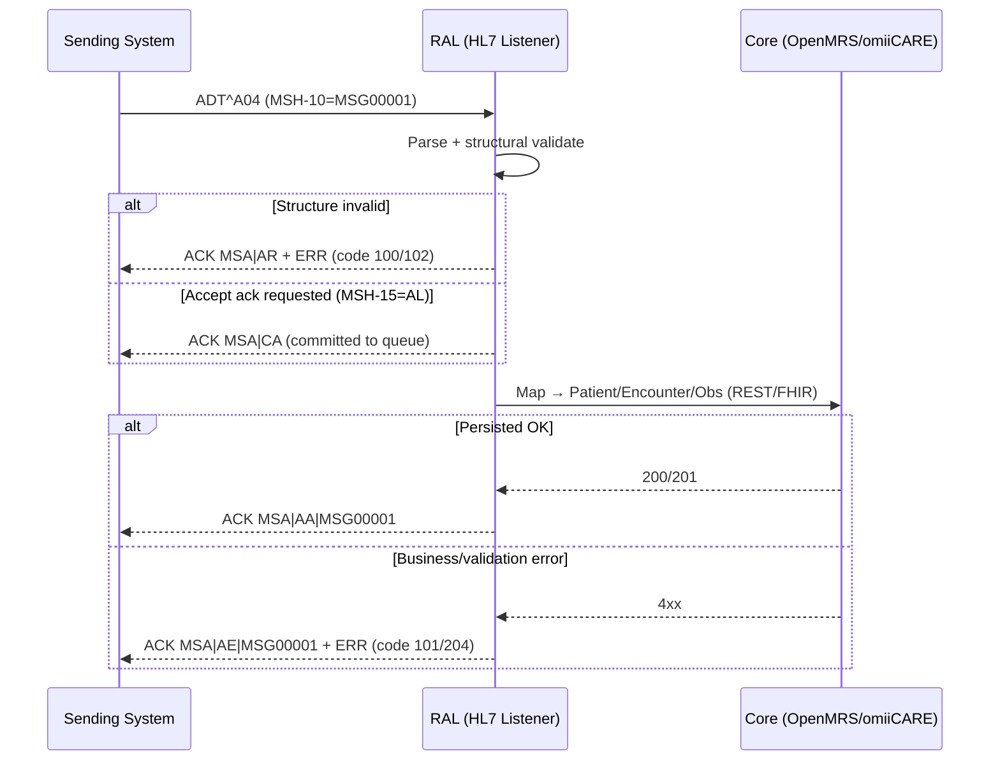
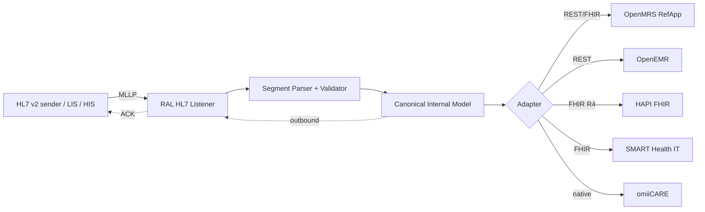

# HL7 v2 Mapping — Reverse-Engineered Specification

> **Reverse-engineered from the OpenMRS Reference Application** (legacy O2 RefApp at
> `o2.openmrs.org`; modern demo O3 at `o3.openmrs.org`) as the **primary reference
> system**, generalised to also serve **OpenEMR, HAPI FHIR, SMART Health IT**, and the
> in-house **omiiCARE** app through a **Resource Adapter Layer (RAL)**.
>
> OpenMRS does not ship a native HL7 v2 listener in the default RefApp distribution; its
> legacy `hl7` module and `HL7InQueue` processor are the historical reference, and modern
> integration is FHIR-first. Therefore the segment/field maps below are **anchored to
> verified OpenMRS REST/FHIR data elements** and the message structures to the **HL7 v2.x
> standard**. Where structure is asserted beyond what the RefApp UI/API directly exposes,
> it is marked **(Assumption)**.
>
> Cross-references: requirement IDs `REQ-HL7-NNN` (this module), `REQ-FHIR-NNN`,
> `REQ-REG-NNN`, `REQ-VISIT-NNN`, `REQ-ORDLAB-NNN`, `REQ-VITAL-NNN`, `REQ-SEC-NNN`.
> Companion docs: `../HL7_GUIDE.md`, `../FHIR_GUIDE.md`, `FIELD_DICTIONARY.md`,
> `DATA_DICTIONARY.md`, `VALIDATION_MATRIX.md`.

---

## 1. Scope & Purpose

| Aspect | Detail |
|--------|--------|
| **Goal** | Define inbound/outbound HL7 v2 message structures and a field-level map from each segment to internal OpenMRS-derived data elements and onward to FHIR R4. |
| **Messages covered** | `ADT^A01` (admit), `ADT^A04` (register), `ADT^A08` (update), `ORM^O01` (order), `ORU^R01` (result) |
| **Segments covered** | `MSH`, `EVN`, `PID`, `PV1`, `ORC`, `OBR`, `OBX` (+ supporting `MSA`, `ERR`, `NK1`, `PD1`, `NTE`) |
| **Encoding** | HL7 v2.x pipe-and-hat; version asserted **2.5.1** as the canonical target (Assumption — configurable per channel) |
| **Out of scope** | Full v2.x trigger-event catalogue, MLLP transport tuning details, certification claims |

**Primary version target:** `MSH-12 = 2.5.1`. The RAL MAY negotiate `2.3.1`–`2.8`
per channel (see §9). HL7 v2 is modelled as a **peer** to the FHIR R4 surface
(`/openmrs/ws/fhir2/R4`) and the REST surface (`/openmrs/ws/rest/v1/*`).

---

## 2. Encoding Primer (Delimiters)

| Delimiter | Char | Meaning | Declared in |
|-----------|------|---------|-------------|
| Field separator | `|` | Separates fields | `MSH-1` |
| Component | `^` | Separates components within a field | `MSH-2` |
| Repetition | `~` | Repeats a field | `MSH-2` |
| Escape | `\` | Escape character | `MSH-2` |
| Sub-component | `&` | Separates sub-components | `MSH-2` |
| Segment terminator | `<CR>` (0x0D) | Ends each segment | implicit |

- Fields are **1-based** after the 3-char segment name; for `MSH` only, `MSH-1`
  *is* the field separator and field numbering shifts by one (the standard "MSH
  off-by-one").
- Empty field = `||`; explicit null = `|""|`; not-present is omitted.
- `REQ-HL7-001` (delimiter parsing), `REQ-HL7-002` (escape handling).

---

## 3. Message Inventory & Triggers

| Message | Trigger event | Business meaning | OpenMRS internal effect | Primary FHIR analogue | Req |
|---------|---------------|------------------|-------------------------|-----------------------|-----|
| `ADT^A01` | Admit/visit start | Inpatient admission | Create `Visit` (inpatient) + `Encounter` (Admission); ensure `Patient` | `Encounter` (class=IMP) + `Patient` | REQ-HL7-003 |
| `ADT^A04` | Register a patient | Outpatient registration | Create `Patient` via registrationapp; optional outpatient `Visit` | `Patient` (+ `Encounter` class=AMB) | REQ-HL7-004 |
| `ADT^A08` | Update patient info | Demographic/visit correction | Update `Patient` / `Visit` fields | `Patient` (PUT) | REQ-HL7-005 |
| `ORM^O01` | New order | Lab/radiology/pharmacy order placed | Create `Order` (TestOrder/DrugOrder) on active `Encounter` | `ServiceRequest` / `MedicationRequest` | REQ-HL7-006 |
| `ORU^R01` | Observation result | Result delivery | Create `Obs` rows under a result `Encounter` | `Observation` (+ `DiagnosticReport`) | REQ-HL7-007 |

> **Mapping note:** OpenMRS "Register a patient" maps most naturally to **A04**;
> "Start Visit"/"Add Past Visit" to **A01** (inpatient) or an **A04/A05** ambulatory
> variant. The RAL treats A01 and A04 as variants of the same patient-administration
> handler, differentiated by `PV1-2` patient class (Assumption).

---

## 4. Segment Reference (Abstract Message Structures)

Notation: `[ ]` optional, `{ }` repeating, indentation = grouping. Aligned to
HL7 v2.5.1. **(Assumption)** where the exact optionality is RAL policy rather than
a RefApp-verified fact.

### 4.1 ADT^A01 / A04 / A08

```
MSH            Message Header                 (required)
[ EVN ]        Event Type                     (required for ADT)
PID            Patient Identification         (required)
[ PD1 ]        Additional Demographics        (optional)
[ { NK1 } ]    Next of Kin / Relationships    (repeating, optional)
PV1            Patient Visit                  (required)
[ { OBX } ]    Observation (e.g. admit vitals)(repeating, optional)
[ { AL1 } ]    Allergy Information            (repeating, optional)
```

### 4.2 ORM^O01

```
MSH
[ { NTE } ]                                   Notes
PID
  [ PV1 ]                                     Patient Visit
  { ORC                                       Common Order  (required, repeating)
      [ OBR ]                                 Order Detail
      [ { NTE } ]
      [ { OBX } ]                             Order-time observations
  }
```

### 4.3 ORU^R01

```
MSH
{ PID                                         (required, repeating per patient)
    [ PV1 ]
    { ORC                                     order grouping
        OBR                                   Observation Request (required)
        { OBX }                               Observation/Result   (repeating)
        [ { NTE } ]
    }
}
```

---

## 5. Field-Level Segment Maps

Each table: **HL7 field → internal data element (OpenMRS-derived) → FHIR R4 path → notes**.
Internal elements cross-reference `FIELD_DICTIONARY.md` / `DATA_DICTIONARY.md`.

### 5.1 MSH — Message Header  *(REQ-HL7-008)*

| Field | Name | Internal element | FHIR analogue | Notes |
|-------|------|------------------|---------------|-------|
| MSH-1 | Field Separator | — (parser) | — | Literal `|` |
| MSH-2 | Encoding Characters | — (parser) | — | `^~\&` |
| MSH-3 | Sending Application | `channel.sendingApp` | `MessageHeader.source.name` | e.g. `OPENMRS^…` |
| MSH-4 | Sending Facility | `channel.sendingFacility` | `MessageHeader.source.endpoint` | Session **Location** (e.g. Outpatient Clinic) |
| MSH-5 | Receiving Application | `channel.receivingApp` | `MessageHeader.destination.name` | |
| MSH-6 | Receiving Facility | `channel.receivingFacility` | `MessageHeader.destination.endpoint` | |
| MSH-7 | Date/Time of Message | `message.timestamp` | `MessageHeader.meta` | `YYYYMMDDHHMMSS[±ZZZZ]` |
| MSH-9 | Message Type | `message.type` | `MessageHeader.eventCoding` | `ADT^A01^ADT_A01` |
| MSH-10 | Message Control ID | `message.controlId` | correlation key | Unique; echoed in `MSA-2` |
| MSH-11 | Processing ID | `message.processingId` | — | `P` prod / `T` test / `D` debug |
| MSH-12 | Version ID | `message.version` | — | `2.5.1` |
| MSH-15/16 | Accept/App Ack Type | `channel.ackPolicy` | — | `AL`/`NE`/`SU`/`ER` — drives ACK mode (§8) |
| MSH-18 | Character Set | `channel.charset` | — | `UNICODE UTF-8` (Assumption default) |

### 5.2 EVN — Event Type  *(REQ-HL7-009)*

| Field | Name | Internal element | FHIR analogue | Notes |
|-------|------|------------------|---------------|-------|
| EVN-1 | Event Type Code | `event.triggerCode` | `Encounter.type` hint | Should equal `MSH-9.2` |
| EVN-2 | Recorded Date/Time | `event.recordedAt` | `Encounter.period.start` | |
| EVN-5 | Operator ID | `event.enteredBy` | `Provenance.agent` | Maps to OpenMRS user (RBAC, `REQ-SEC-NNN`) |
| EVN-6 | Event Occurred | `event.occurredAt` | `Encounter.period.start` | Actual event time vs recorded |

### 5.3 PID — Patient Identification  *(REQ-HL7-010, REQ-REG-NNN)*

| Field | Name | Internal element | FHIR (`Patient.*`) | Notes |
|-------|------|------------------|--------------------|-------|
| PID-3 | Patient Identifier List | `patient.identifiers[]` (MRN / Patient ID) | `identifier[]` | Repeating `ID^^^assigningAuthority^typeCode`; OpenMRS **Patient ID** generated on save |
| PID-5 | Patient Name | `person.givenName` / `middleName` / `familyName` | `name[].given/family` | `Family^Given^Middle^Suffix^Prefix` |
| PID-7 | Date/Time of Birth | `person.birthdate` | `birthDate` | `YYYYMMDD`; estimated births → see PID-7 + birthdateEstimated flag |
| PID-8 | Administrative Sex | `person.gender` | `gender` | `M`/`F`/`O`/`U`/`A`/`N` → `male`/`female`/`other`/`unknown` |
| PID-11 | Patient Address | `person.address` (>=1 field required) | `address[]` | OpenMRS Contact Info requires ≥1 address field (`REQ-REG-NNN`) |
| PID-13 | Phone Home | `person.phoneNumber` | `telecom[]` | OpenMRS Contact Info Phone Number |
| PID-16 | Marital Status | `person.attribute.maritalStatus` | `maritalStatus` | (Assumption — person attribute) |
| PID-29/30 | Death Date / Indicator | `person.deathDate` / `dead` | `deceasedDateTime` | "Mark Patient Deceased" action |

> **birthdateEstimated:** OpenMRS supports exact **or estimated** birthdate. HL7 v2
> has no native estimated flag; the RAL encodes estimation by setting `PID-7` to
> `YYYY` (year only) or carrying an `OBX`/`Z`-segment flag. Mark **(Assumption)**.

### 5.4 PV1 — Patient Visit  *(REQ-HL7-011, REQ-VISIT-NNN)*

| Field | Name | Internal element | FHIR (`Encounter.*`) | Notes |
|-------|------|------------------|----------------------|-------|
| PV1-2 | Patient Class | `visit.type` | `class` | `I`=inpatient→IMP (A01), `O`=outpatient→AMB (A04), `E`=emergency→EMER |
| PV1-3 | Assigned Patient Location | `visit.location` | `location[].location` | Session Location (Inpatient Ward, Isolation Ward, etc.) |
| PV1-7 | Attending Doctor | `encounter.provider` (attending) | `participant[type=ATND]` | Provider; RBAC role Doctor/Clinician |
| PV1-8 | Referring Doctor | `encounter.provider` (referring) | `participant[type=REF]` | |
| PV1-19 | Visit Number | `visit.uuid` / visit number | `identifier[]` | Correlates encounters to the OpenMRS **Visit** |
| PV1-44 | Admit Date/Time | `visit.startDatetime` | `period.start` | "Start Visit" / "Add Past Visit" |
| PV1-45 | Discharge Date/Time | `visit.stopDatetime` | `period.end` | A03 discharge |

### 5.5 ORC — Common Order  *(REQ-HL7-012, REQ-ORDLAB-NNN)*

| Field | Name | Internal element | FHIR | Notes |
|-------|------|------------------|------|-------|
| ORC-1 | Order Control | `order.action` | request intent/status | `NW`=new, `CA`=cancel, `DC`=discontinue, `RP`=replace |
| ORC-2 | Placer Order Number | `order.orderNumber` (placer) | `ServiceRequest.identifier` | OpenMRS `ORD-…` order number |
| ORC-3 | Filler Order Number | `order.accessionNumber` (filler) | `ServiceRequest.identifier` | Assigned by LIS/filler |
| ORC-5 | Order Status | `order.fulfillerStatus` | `status` | `IP`/`CM`/`CA` → in-progress/completed/cancelled |
| ORC-9 | Date/Time of Transaction | `order.dateActivated` | `authoredOn` | |
| ORC-12 | Ordering Provider | `order.orderer` | `requester` | Provider; RBAC gated |

### 5.6 OBR — Observation Request  *(REQ-HL7-013, REQ-ORDLAB-NNN)*

| Field | Name | Internal element | FHIR | Notes |
|-------|------|------------------|------|-------|
| OBR-2 | Placer Order Number | `order.orderNumber` | `identifier` | Mirrors `ORC-2` |
| OBR-3 | Filler Order Number | `order.accessionNumber` | `identifier` | Mirrors `ORC-3` |
| OBR-4 | Universal Service ID | `order.concept` (test code) | `code` | `code^text^codeSystem`; **LOINC** for labs |
| OBR-7 | Observation Date/Time | `obs.obsDatetime` (start) | `effectiveDateTime` | |
| OBR-16 | Ordering Provider | `order.orderer` | `requester` | |
| OBR-22 | Results Rpt/Status Chg | `report.statusChangeAt` | `DiagnosticReport.issued` | |
| OBR-24 | Diagnostic Serv Sect ID | `order.serviceSection` | `DiagnosticReport.category` | `LAB`,`RAD`,`MB`… |
| OBR-25 | Result Status | `report.status` | `DiagnosticReport.status` | `F`=final,`P`=prelim,`C`=corrected |

### 5.7 OBX — Observation/Result  *(REQ-HL7-014, REQ-VITAL-NNN, REQ-FHIR-NNN)*

| Field | Name | Internal element | FHIR (`Observation.*`) | Notes |
|-------|------|------------------|------------------------|-------|
| OBX-2 | Value Type | `obs.datatype` | value[x] selector | `NM`,`ST`,`CE`/`CWE`,`TX`,`DT`,`SN` |
| OBX-3 | Observation Identifier | `obs.concept` | `code` | `code^text^system`; **LOINC** code; e.g. vitals concepts |
| OBX-5 | Observation Value | `obs.value*` | `valueQuantity`/`valueString`/`valueCodeableConcept` | Type per OBX-2 |
| OBX-6 | Units | `obs.units` | `valueQuantity.unit` | UCUM (Assumption canonical) |
| OBX-7 | References Range | `concept.refRange` | `referenceRange` | |
| OBX-8 | Abnormal Flags | `obs.interpretation` | `interpretation` | `H`,`L`,`HH`,`LL`,`N`,`A` |
| OBX-11 | Observation Result Status | `obs.status` | `status` | `F`=final,`P`=prelim,`C`=corrected,`X`=cannot-obtain |
| OBX-14 | Date/Time of Observation | `obs.obsDatetime` | `effectiveDateTime` | |
| OBX-16 | Responsible Observer | `obs.creator` | `performer` | |

### 5.8 MSA / ERR — Acknowledgement & Error  *(REQ-HL7-015)*

| Field | Name | Internal element | Notes |
|-------|------|------------------|-------|
| MSA-1 | Acknowledgment Code | `ack.code` | `AA`/`AE`/`AR` (or enhanced `CA`/`CE`/`CR`) |
| MSA-2 | Message Control ID | `ack.controlId` | Echo of inbound `MSH-10` |
| MSA-3 | Text Message | `ack.text` | Human-readable |
| ERR-3 | HL7 Error Code | `error.code` | e.g. `100` seg-seq, `101` req-field-missing, `102` data-type, `204` unknown key |
| ERR-4 | Severity | `error.severity` | `E`/`W`/`I` |

---

## 6. Internal Data-Element Crosswalk (consolidated)

| Internal element | OpenMRS source | HL7 field(s) | FHIR path |
|------------------|----------------|--------------|-----------|
| Patient ID / MRN | generated on register | PID-3 | `Patient.identifier` |
| Given/Middle/Family name | registrationapp Demographics | PID-5 | `Patient.name` |
| Gender | Demographics | PID-8 | `Patient.gender` |
| Birthdate (exact/estimated) | Demographics | PID-7 | `Patient.birthDate` |
| Address | Contact Info (≥1 field) | PID-11 | `Patient.address` |
| Phone | Contact Info | PID-13 | `Patient.telecom` |
| Relationships / NK1 | Relationships step | NK1 | `RelatedPerson` |
| Visit (type/location/period) | Start Visit / Add Past Visit | PV1-2/3/44/45 | `Encounter` |
| Encounter provider | encounter | PV1-7, ORC-12 | `Encounter.participant` |
| Order | order REST resource | ORC/OBR | `ServiceRequest`/`MedicationRequest` |
| Observation / Vitals | obs REST resource | OBX | `Observation` |
| Allergy | AllergyIntolerance | AL1 | `AllergyIntolerance` |

---

## 7. Example Messages

### 7.1 ADT^A04 — Register a Patient  *(REQ-HL7-004)*

```
MSH|^~\&|OPENMRS|OUTPATIENT_CLINIC|RAL|OMIICARE|20260701083000||ADT^A04^ADT_A01|MSG00001|P|2.5.1
EVN|A04|20260701083000|||admin
PID|1||100GEJ^^^OpenMRS^MR||Doe^John^Q||19850314|M|||123 Main St^^Boston^MA^02118^USA||^PRN^PH^^^617^5551234
PV1|1|O|OUTPATIENT_CLINIC^^^^^^^^Outpatient Clinic||||1234^Smith^Anna^^^^Dr|||||||||||V20260701-01
```

- `PID-3 = 100GEJ` → OpenMRS **Patient ID** (assigning authority `OpenMRS`, type `MR`).
- `PID-8 = M` → `gender=male`; `PID-7 = 19850314` → `birthDate=1985-03-14`.
- `PV1-2 = O` → outpatient class (AMB).

### 7.2 ADT^A01 — Inpatient Admission  *(REQ-HL7-003)*

```
MSH|^~\&|OPENMRS|INPATIENT_WARD|RAL|OMIICARE|20260701090000||ADT^A01^ADT_A01|MSG00002|P|2.5.1
EVN|A01|20260701090000|||nurse01
PID|1||100GEJ^^^OpenMRS^MR||Doe^John^Q||19850314|M|||123 Main St^^Boston^MA^02118^USA
PV1|1|I|INPATIENT_WARD^WARD-A^BED-12^^^^^^Inpatient Ward||||1234^Smith^Anna^^^^Dr||||||||||I20260701-01|||||||||||||||||||||||||20260701090000
```

- `PV1-2 = I` (inpatient/IMP); `PV1-3` carries ward/bed; `PV1-44` admit time.

### 7.3 ADT^A08 — Update Patient  *(REQ-HL7-005)*

```
MSH|^~\&|OPENMRS|REGISTRATION_DESK|RAL|OMIICARE|20260701101500||ADT^A08^ADT_A01|MSG00003|P|2.5.1
EVN|A08|20260701101500|||clerk02
PID|1||100GEJ^^^OpenMRS^MR||Doe^John^Quentin||19850314|M|||456 Oak Ave^^Boston^MA^02119^USA||^PRN^PH^^^617^5559876
PV1|1|O|OUTPATIENT_CLINIC
```

- Identity (`PID-3`) is the match key; changed `PID-5` middle name, `PID-11`
  address, `PID-13` phone → `Patient` update ("Edit Registration Information").

### 7.4 ORM^O01 — Lab Order  *(REQ-HL7-006)*

```
MSH|^~\&|OPENMRS|LABORATORY|RAL|OMIICARE|20260701110000||ORM^O01^ORM_O01|MSG00004|P|2.5.1
PID|1||100GEJ^^^OpenMRS^MR||Doe^John^Q||19850314|M
PV1|1|O|LABORATORY
ORC|NW|ORD-5001^OpenMRS|||IP||||20260701110000|||1234^Smith^Anna^^^^Dr
OBR|1|ORD-5001^OpenMRS||2345-7^Glucose^LN|||20260701110000|||||||||1234^Smith^Anna|||||||||LAB
```

- `ORC-1 = NW` new order; `OBR-4 = 2345-7^Glucose^LN` → LOINC-coded test
  → OpenMRS `TestOrder` concept.

### 7.5 ORU^R01 — Lab Result  *(REQ-HL7-007)*

```
MSH|^~\&|LIS|LABORATORY|OPENMRS|OUTPATIENT_CLINIC|20260701123000||ORU^R01^ORU_R01|MSG00005|P|2.5.1
PID|1||100GEJ^^^OpenMRS^MR||Doe^John^Q||19850314|M
PV1|1|O|LABORATORY
ORC|RE|ORD-5001^OpenMRS|FILL-9001^LIS
OBR|1|ORD-5001^OpenMRS|FILL-9001^LIS|2345-7^Glucose^LN|||20260701120000|||||||||1234^Smith^Anna||||||20260701123000|F|||LAB
OBX|1|NM|2345-7^Glucose^LN||95|mg/dL^mg/dL^UCUM|70-110|N|||F|||20260701120000
```

- `OBX-3 = 2345-7^Glucose^LN` (LOINC) → OpenMRS `obs.concept`;
  `OBX-5 = 95`, `OBX-6 = mg/dL`, `OBX-8 = N`, `OBX-11 = F` → final `Observation`.

---

## 8. ACK Handling

OpenMRS REST/FHIR endpoints require authentication (Basic/OAuth); unauthorized →
`401` (`REQ-SEC-NNN`). For HL7 v2 the analogue is **MLLP transport + application
ACK**; auth is at the channel/transport layer (Assumption — VPN/mTLS/MLLP-over-TLS).

### 8.1 Acknowledgement Codes

| Mode | MSA-1 (original) | MSA-1 (enhanced) | Meaning |
|------|------------------|------------------|---------|
| Accept/Commit | — | `CA` / `CE` / `CR` | Message received & committed (or commit error/reject) |
| Application | `AA` | `AA` | Application Accept — processed OK |
| Application | `AE` | `AE` | Application Error — recoverable (bad data) → `ERR` populated |
| Application | `AR` | `AR` | Application Reject — non-recoverable (bad structure/version) |

`MSH-15` (accept) / `MSH-16` (application) ack types govern which ACKs are sent:
`AL` always, `NE` never, `ER` on error only, `SU` on success only (`REQ-HL7-015`).

### 8.2 ACK Flow



### 8.3 Example ACK Messages

**Success (AA):**
```
MSH|^~\&|OMIICARE|RAL|OPENMRS|OUTPATIENT_CLINIC|20260701083001||ACK^A04^ACK|ACK00001|P|2.5.1
MSA|AA|MSG00001|Message processed successfully
```

**Application error (AE) with ERR:**
```
MSH|^~\&|OMIICARE|RAL|OPENMRS|OUTPATIENT_CLINIC|20260701083001||ACK^A04^ACK|ACK00002|P|2.5.1
MSA|AE|MSG00001|Required field missing
ERR||PID^1^7|101|E^Required field missing^HL70357|||Birthdate is required
```

**Reject (AR) — bad version:**
```
MSH|^~\&|OMIICARE|RAL|OPENMRS|OUTPATIENT_CLINIC|20260701083001||ACK^A04^ACK|ACK00003|P|2.5.1
MSA|AR|MSG00001|Unsupported version
ERR||MSH^1^12|203|E^Unsupported version id^HL70357
```

### 8.4 Error Code Reference (HL7 Table 0357)

| Code | Meaning | Typical MSA-1 |
|------|---------|---------------|
| 100 | Segment sequence error | AR |
| 101 | Required field missing | AE |
| 102 | Data type error | AE |
| 103 | Table value not found | AE |
| 200 | Unsupported message type | AR |
| 201 | Unsupported event code | AR |
| 203 | Unsupported version id | AR |
| 204 | Unknown key identifier (no matching patient) | AE |
| 207 | Application internal error | AE |

---

## 9. Resource Adapter Layer (RAL) — Multi-Backend

The same HL7 message maps to different backends via the RAL, isolating segment
parsing from backend persistence (`REQ-HL7-016`).



| Backend | Inbound persistence target | Notes |
|---------|----------------------------|-------|
| OpenMRS | REST `/ws/rest/v1/*` + FHIR `/ws/fhir2/R4` | Primary; Patient/Encounter/Obs/Order |
| OpenEMR | REST/FHIR API | Maps PID→patient_data, OBX→procedure_result (Assumption) |
| HAPI FHIR | FHIR R4 transaction bundle | Convert HL7→FHIR then POST `Bundle` |
| SMART Health IT | FHIR R4 (sandbox) | Read-mostly; result ingest as `Observation` |
| omiiCARE | Native service layer | Canonical model maps 1:1 |

---

## 10. Validation Rules (QA hooks)

| ID | Rule | Severity | Trace |
|----|------|----------|-------|
| HL7-V01 | `MSH-9` message type ∈ supported set | Critical | REQ-HL7-003..007 |
| HL7-V02 | `MSH-10` control ID present & echoed in `MSA-2` | Critical | REQ-HL7-008 |
| HL7-V03 | `MSH-12` version ∈ {2.3.1..2.8}; else `AR` 203 | Critical | REQ-HL7-008 |
| HL7-V04 | `PID-3` resolves to a patient (else 204 → `AE`) | High | REQ-HL7-010 |
| HL7-V05 | `PID-7` valid date; estimated handling per §5.3 | High | REQ-HL7-010 |
| HL7-V06 | `PID-8` sex code ∈ {M,F,O,U,A,N} | Medium | REQ-HL7-010 |
| HL7-V07 | `PID-11` ≥1 address sub-field (parity with OpenMRS) | Medium | REQ-REG-NNN |
| HL7-V08 | `PV1-2` class consistent with trigger (A01=I, A04=O) | High | REQ-HL7-011 |
| HL7-V09 | `ORC-1` order control ∈ {NW,CA,DC,RP,RE} | High | REQ-HL7-012 |
| HL7-V10 | `OBR-4` / `OBX-3` carry coded identifier (LOINC pref.) | High | REQ-HL7-013/014 |
| HL7-V11 | `OBX-2` value type matches `OBX-5` payload | High | REQ-HL7-014 |
| HL7-V12 | `OBX-11` result status ∈ {F,P,C,X,I} | Medium | REQ-HL7-014 |
| HL7-V13 | Correct ACK emitted per `MSH-15/16` policy | Critical | REQ-HL7-015 |
| HL7-V14 | Round-trip HL7→internal→FHIR preserves identifiers | High | REQ-HL7-016, REQ-FHIR-NNN |

See `VALIDATION_MATRIX.md` for the executable test-case linkage (RTM).

---

## 11. Code Systems

| Domain | Code system | HL7 carriage | FHIR system URI |
|--------|-------------|--------------|-----------------|
| Lab/observations | **LOINC** | `OBX-3`, `OBR-4` (`^LN`) | `http://loinc.org` |
| Diagnoses/problems | **ICD-10** | `DG1-3`, `OBX-5` (CE) | `http://hl7.org/fhir/sid/icd-10` |
| Clinical terms | **SNOMED CT** | `OBX-5` (CWE) | `http://snomed.info/sct` |
| Identifier types | HL7 0203 | `PID-3.5` | `http://terminology.hl7.org/CodeSystem/v2-0203` |
| Ack/error codes | HL7 0008/0357 | `MSA-1`, `ERR-3` | — |

---

## 12. Assumptions Register

| # | Assumption | Basis |
|---|------------|-------|
| A1 | Canonical version is HL7 v2.5.1 | RAL policy; RefApp ships no native listener |
| A2 | MLLP-over-TLS/mTLS transport auth | Mirrors REST/FHIR 401 auth requirement |
| A3 | UCUM units, UTF-8 charset defaults | Interoperability best practice |
| A4 | birthdateEstimated encoded via year-only PID-7 or flag | HL7 v2 lacks native estimate field |
| A5 | A01⇄A04 share one patient-admin handler keyed by PV1-2 | OpenMRS Visit/Register parity |
| A6 | OpenEMR/SMART field maps approximate | Not the primary reference system |

---

*End of HL7_MAPPING.md — reverse-engineered from OpenMRS Reference Application; generalised via the Resource Adapter Layer. Inferences are marked **(Assumption)**.*
