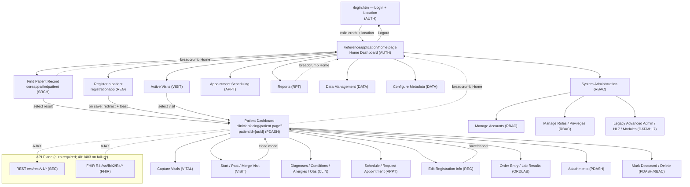

# Navigation Map
## OpenMRS Reference Application — Multi-System Healthcare QA Reference

| Field | Value |
|---|---|
| Document Type | Navigation Map (Site Map, Routes, Deep Links) |
| Primary Reference System | OpenMRS Reference Application (legacy O2 — `https://o2.openmrs.org`; modern demo O3 — `o3.openmrs.org`) |
| Secondary Targets (via Resource Adapter Layer) | OpenEMR, HAPI FHIR, SMART Health IT, in-house omiiCARE |
| Status | Baseline (reverse-engineered) |
| Date | 2026-07-01 |
| Traceability | Cross-referenced to requirement catalog (472 requirements `REQ-<PREFIX>-NNN`; 1,349 manual test cases via RTM) |
| Standards Footprint | FHIR R4 (4.0.1), HL7 v2 (ADT/ORM/ORU), ICD-10, SNOMED CT, LOINC |

> **Assumption marking:** Statements beyond the VERIFIED OpenMRS facts are tagged **(Assumption)**. Verified facts are stated plainly. The route fragments below reflect the legacy O2 RefApp's UI-framework (`coreapps`, `registrationapp`, `referenceapplication`) URL conventions; exact slugs for some secondary screens are marked **(Assumption)** where not directly verified.

---

## 1. Purpose & Scope

This document maps every navigable surface of the OpenMRS Reference Application from the **login gate** to every **module** and **back**, expressed as:

- A **site map** (hierarchical screen/route inventory).
- **Breadcrumb paths** for each screen.
- **Deep links** (direct, bookmarkable, often UUID-parameterized URLs).
- A **Mermaid navigation graph** of the whole application.
- **URL pattern rules** that the QA automation layer and the Resource Adapter Layer (RAL) rely on.

Navigation is the backbone of UI test automation: locators, page-object routing, breadcrumb assertions, deep-link smoke tests, and back/cancel flows all trace here. Each surface is cross-referenced to its owning requirement module (`REQ-<PREFIX>-NNN`).

### 1.1 Module → Navigation Owner Map

| Module | Prefix | Primary Surface(s) | Entry Route Fragment |
|---|---|---|---|
| Authentication & Session | AUTH | Login, Logout, Location select | `/login.htm` |
| Registration | REG | Register a patient wizard | `/registrationapp/registerPatient.page` |
| Patient Search | SRCH | Find Patient Record | `/coreapps/findpatient/findPatient.page` |
| Patient Dashboard | PDASH | Patient dashboard + General Actions | `/coreapps/clinicianfacing/patient.page` |
| Visits | VISIT | Start/Past/Merge Visit, Active Visits | `/coreapps/activeVisits.page` |
| Vitals | VITAL | Capture Vitals | `/coreapps/vitals/...` |
| Clinical | CLIN | Diagnoses, Conditions, Allergies, Obs | (patient dashboard widgets) |
| Appointments | APPT | Appointment Scheduling | `/appointmentschedulingui/...` |
| Orders / Lab / Radiology | ORDLAB | Order entry, lab results | `/orderentryui/...` **(Assumption)** |
| Pharmacy | PHARM | Pharmacy app | `/pharmacy/...` **(Assumption)** |
| RBAC | RBAC | Roles / privileges admin | `/adminui/...` |
| Data Management | DATA | Data Management, Configure Metadata | `/coreapps/datamanagement/...` |
| Reporting & Audit | RPT | Reports | `/reportingui/...` |
| FHIR API | FHIR | FHIR R4 endpoints | `/ws/fhir2/R4/*` |
| HL7 Interfaces | HL7 | HL7 message queue admin | `/admin/hl7/*` **(Assumption)** |
| Security / Session | SEC | Session, CSRF, timeouts | `/ws/rest/v1/session` |

---

## 2. Top-Level Site Map

```
OpenMRS Reference Application
│
├── /login.htm ........................... Login (location + credentials)        [AUTH]
│
└── /referenceapplication/home.page ...... Home Dashboard (app tiles)            [AUTH]
    │
    ├── Find Patient Record ............... /coreapps/findpatient/findPatient.page          [SRCH]
    │   └── Patient Dashboard ............. /coreapps/clinicianfacing/patient.page?patientId={uuid}   [PDASH]
    │       ├── Start Visit / Add Past Visit / Merge Visits .................................  [VISIT]
    │       ├── Capture Vitals ........... /coreapps/vitals/...                              [VITAL]
    │       ├── Diagnoses / Conditions / Allergies / Observations (widgets) .................  [CLIN]
    │       ├── Schedule / Request Appointment ............................................   [APPT]
    │       ├── Attachments ...............................................................   [PDASH]
    │       ├── Edit Registration Information ............ /registrationapp/editSection...   [REG]
    │       ├── Mark Patient Deceased / Delete Patient ....................................   [PDASH/RBAC]
    │       └── Order Entry / Lab Results ................ /orderentryui/...                  [ORDLAB]
    │
    ├── Active Visits ..................... /coreapps/activeVisits.page                      [VISIT]
    ├── Capture Vitals .................... /coreapps/findpatient/findPatient.page?app=...   [VITAL]
    ├── Register a patient ................ /registrationapp/registerPatient.page?appId=...  [REG]
    ├── Appointment Scheduling ............ /appointmentschedulingui/home.page               [APPT]
    ├── Reports ........................... /reportingui/reportsapp/home.page                [RPT]
    ├── Data Management ................... /coreapps/datamanagement/...                     [DATA]
    ├── Configure Metadata ................ /coreapps/configuremetadata/...                  [DATA]
    └── System Administration ............ /coreapps/systemadministration/systemAdministration.page  [RBAC]
        ├── Manage Accounts .............. /adminui/account/account.page                     [RBAC]
        ├── Manage Roles / Privileges .... /adminui/metadata/roles/...                       [RBAC]
        ├── Advanced Administration ...... /index.htm (legacy admin)                         [RBAC/DATA]
        └── HL7 / Modules / Scheduler .... /admin/...                                        [HL7/DATA]
```

> Global chrome on every authenticated page: **Header** (app name/home link, **session location** indicator, **user menu** → **Logout** in a collapsible navbar) and the **breadcrumb bar** directly beneath it.

---

## 3. Screen / Route Inventory

Status legend: **V** = verified route/surface; **A** = assumed slug/route (marked); **derived** = parameterized from a verified parent.

### 3.1 Authentication & Home

| # | Screen | Route | Status | Requirement | Notes |
|---|---|---|---|---|---|
| S-01 | Login | `/openmrs/login.htm` | V | REQ-AUTH-001 | Session **location** picked first (`<li id="...">`), then `#username` / `#password` / `#loginButton`. |
| S-02 | Location select (within login) | `/openmrs/login.htm` | V | REQ-AUTH-004 | Outpatient Clinic, Inpatient Ward, Pharmacy, Laboratory, Registration Desk, Isolation Ward. |
| S-03 | Home Dashboard | `/openmrs/referenceapplication/home.page` | V | REQ-AUTH-010 | App tiles rendered per user privileges (RBAC-gated). |
| S-04 | Logout | `/openmrs/logout` | V | REQ-AUTH-020 | Invalidates session, redirects to S-01. |

### 3.2 Registration & Search

| # | Screen | Route | Status | Requirement | Notes |
|---|---|---|---|---|---|
| S-10 | Register a patient (wizard) | `/openmrs/registrationapp/registerPatient.page?appId=referenceapplication.registrationapp.registerPatient` | V | REQ-REG-001 | Multi-step: Demographics → Contact Info → Relationships → Confirm (`#submit`). |
| S-11 | Find Patient Record | `/openmrs/coreapps/findpatient/findPatient.page` | V | REQ-SRCH-001 | Search box; result rows deep-link to S-20. |
| S-12 | Edit Registration Information | `/openmrs/registrationapp/editSection.page?patientId={uuid}&...` | A (derived) | REQ-REG-040 | Reached from S-20 General Actions. |

### 3.3 Patient Dashboard & Clinical

| # | Screen | Route | Status | Requirement | Notes |
|---|---|---|---|---|---|
| S-20 | Patient Dashboard | `/openmrs/coreapps/clinicianfacing/patient.page?patientId={uuid}` | V | REQ-PDASH-001 | Header: name/gender/age/DOB/Patient ID. Widgets: Diagnoses, Latest Observations, Vitals, Recent Visits, Family, Conditions, Allergies, Attachments, Weight graph, Appointments. |
| S-21 | Start Visit (dialog) | S-20 `#start-visit` action | V | REQ-VISIT-001 | Modal over S-20. |
| S-22 | Add Past Visit | S-20 General Action | V | REQ-VISIT-010 | Modal/page over S-20. |
| S-23 | Merge Visits | S-20 General Action | V | REQ-VISIT-020 | |
| S-24 | Capture Vitals | `/openmrs/coreapps/vitals/vitals.page?patientId={uuid}` | A (derived) | REQ-VITAL-001 | Also reachable as a home tile that first asks for a patient. |
| S-25 | Diagnoses / Conditions / Allergies / Attachments | S-20 widget links | V | REQ-CLIN-001 | In-dashboard widget navigation. |
| S-26 | Mark Patient Deceased | S-20 General Action | V | REQ-PDASH-030 | RBAC-gated. |
| S-27 | Delete Patient | S-20 General Action | V | REQ-RBAC-050 | Requires **Delete Patients** privilege. |

### 3.4 Visits, Appointments, Orders, Pharmacy

| # | Screen | Route | Status | Requirement | Notes |
|---|---|---|---|---|---|
| S-30 | Active Visits | `/openmrs/coreapps/activeVisits.page` | V | REQ-VISIT-100 | Lists active visits for session location; rows deep-link to S-20. |
| S-31 | Appointment Scheduling (home) | `/openmrs/appointmentschedulingui/home.page` | A | REQ-APPT-001 | |
| S-32 | Schedule / Request Appointment | S-20 General Action → appt UI | V (action) / A (route) | REQ-APPT-010 | |
| S-33 | Order Entry | `/openmrs/orderentryui/...` | A | REQ-ORDLAB-001 | Labs/Radiology/Drug orders. |
| S-34 | Lab Results | `/openmrs/...labresults...` | A | REQ-ORDLAB-040 | |
| S-35 | Pharmacy | `/openmrs/pharmacy/...` | A | REQ-PHARM-001 | MedicationRequest fulfillment. |

### 3.5 Administration, Data, Reports

| # | Screen | Route | Status | Requirement | Notes |
|---|---|---|---|---|---|
| S-40 | System Administration | `/openmrs/coreapps/systemadministration/systemAdministration.page` | V | REQ-RBAC-001 | |
| S-41 | Manage Accounts | `/openmrs/adminui/account/account.page` | A | REQ-RBAC-010 | Create users, assign roles. |
| S-42 | Manage Roles / Privileges | `/openmrs/adminui/metadata/roles/manageRoles.page` | A | REQ-RBAC-020 | |
| S-43 | Data Management | `/openmrs/coreapps/datamanagement/...` | A | REQ-DATA-001 | Merge/void patients, identifiers. |
| S-44 | Configure Metadata | `/openmrs/coreapps/configuremetadata/...` | A | REQ-DATA-020 | Concepts, locations, encounter types. |
| S-45 | Reports | `/openmrs/reportingui/reportsapp/home.page` | A | REQ-RPT-001 | Run/schedule reports, exports. |
| S-46 | Legacy Advanced Admin | `/openmrs/index.htm` | V | REQ-DATA-090 | Catch-all legacy admin; HL7 queues, modules, scheduler. |

### 3.6 API Surfaces (non-UI, deep-link/programmatic)

| # | Surface | Route | Status | Requirement | Notes |
|---|---|---|---|---|---|
| A-01 | REST root | `/openmrs/ws/rest/v1/*` | V | REQ-SEC-001 | session, patient, encounter, obs, visit, concept, relationship. Auth (Basic/OAuth); 401 if unauthorized. |
| A-02 | Session | `/openmrs/ws/rest/v1/session` | V | REQ-AUTH-100 | Returns auth state + session location. |
| A-03 | FHIR R4 root | `/openmrs/ws/fhir2/R4` | V | REQ-FHIR-001 | |
| A-04 | FHIR CapabilityStatement | `/openmrs/ws/fhir2/R4/metadata` | V | REQ-FHIR-002 | `fhirVersion = 4.0.1`. |
| A-05 | FHIR resources | `/openmrs/ws/fhir2/R4/{Patient\|Encounter\|Observation\|Condition\|AllergyIntolerance\|MedicationRequest}` | V | REQ-FHIR-010..060 | Auth required; 401 unauthorized. |

---

## 4. Breadcrumb Paths

The legacy O2 RefApp renders a breadcrumb bar (home icon + chain). Breadcrumbs are also a **navigation control** (clicking an ancestor returns there) and a **test assertion target** (`REQ-A11Y-040` — breadcrumb landmark, **(Assumption)** for exact ARIA roles).

| Screen | Breadcrumb Path |
|---|---|
| Home Dashboard | `🏠 Home` |
| Find Patient Record | `🏠 Home › Find Patient Record` |
| Register a patient | `🏠 Home › Register a patient` |
| Patient Dashboard | `🏠 Home › {Patient Name}` |
| Capture Vitals (from dashboard) | `🏠 Home › {Patient Name} › Capture Vitals` |
| Start Visit (modal) | `🏠 Home › {Patient Name}` (modal; breadcrumb unchanged) |
| Edit Registration Information | `🏠 Home › {Patient Name} › Edit` |
| Active Visits | `🏠 Home › Active Visits` |
| Active Visits → Patient | `🏠 Home › Active Visits › {Patient Name}` **(Assumption: some flows reset to `Home › {Patient}`)** |
| Appointment Scheduling | `🏠 Home › Appointment Scheduling` |
| Reports | `🏠 Home › Reports` |
| System Administration | `🏠 Home › System Administration` |
| Manage Roles | `🏠 Home › System Administration › Manage Roles` **(Assumption)** |

**Back/Cancel semantics (test-relevant):**

| Control | Behavior | Requirement |
|---|---|---|
| Breadcrumb ancestor click | Navigate to that ancestor (loses unsaved wizard state) | REQ-REG-070 |
| Wizard **Cancel** | Discard, return to launching screen (Home or Dashboard) | REQ-REG-071 |
| Browser **Back** | Returns to prior route; modal-based actions may not push history **(Assumption)** | REQ-A11Y-050 |
| **Logout** | Always returns to Login (S-01), regardless of depth | REQ-AUTH-021 |

---

## 5. Deep Links

Deep links are **bookmarkable, parameterized** entry points used for smoke tests, RTM-linked test data setup, and the RAL's cross-system routing. All authenticated deep links redirect to **Login** (with a `redirect`/`returnUrl` param) when the session is absent — a key **negative-path** test (`REQ-AUTH-030`, `REQ-SEC-020`).

| Intent | Deep Link Template | Key Params | Auth Behavior |
|---|---|---|---|
| Open a specific patient | `/openmrs/coreapps/clinicianfacing/patient.page?patientId={patientUuid}` | `patientUuid` | 302 → login if unauth |
| Launch registration with an app id | `/openmrs/registrationapp/registerPatient.page?appId={appId}` | `appId` | 302 → login |
| Edit a patient's registration | `/openmrs/registrationapp/editSection.page?patientId={uuid}&editSection={section}` | `patientId`, `editSection` | 302 → login **(Assumption: param name)** |
| Active visits for a location | `/openmrs/coreapps/activeVisits.page?location={locationUuid}` | `location` | 302 → login **(Assumption)** |
| FHIR patient by id | `/openmrs/ws/fhir2/R4/Patient/{fhirId}` | `fhirId` | 401 if unauth |
| FHIR search by identifier | `/openmrs/ws/fhir2/R4/Patient?identifier={system}\|{value}` | `identifier` | 401 if unauth |
| REST patient by uuid | `/openmrs/ws/rest/v1/patient/{uuid}?v=full` | `uuid`, `v` | 401 if unauth |

**Deep-link test matrix (representative):**

| Test | Precondition | Expected | Req |
|---|---|---|---|
| Authenticated patient deep link | Valid session, valid UUID | 200, Patient Dashboard renders header + widgets | REQ-PDASH-001 |
| Unauthenticated patient deep link | No session | 302 → `/login.htm?redirect=...` | REQ-AUTH-030 |
| Invalid UUID | Valid session, bad UUID | Error page / "patient not found" | REQ-PDASH-090 |
| FHIR resource unauth | No `Authorization` header | `401` (OperationOutcome) | REQ-FHIR-200 |
| Cross-privilege deep link | Session lacks privilege (e.g., Delete) | Action hidden/blocked; 403 on submit | REQ-RBAC-090 |

---

## 6. Navigation Graph (Mermaid)



---

## 7. URL Pattern Rules

These rules are the contract the test framework's URL builder and the RAL routing layer encode.

| Pattern | Rule | Example | Req |
|---|---|---|---|
| App context root | All UI/REST/FHIR paths prefixed `/openmrs` | `/openmrs/...` | REQ-SEC-005 |
| UI framework page | `{module}/{controller}/{page}.page` | `coreapps/clinicianfacing/patient.page` | REQ-PDASH-001 |
| App launch param | Tiles pass `appId={dotted.app.id}` | `?appId=referenceapplication.registrationapp.registerPatient` | REQ-REG-001 |
| Entity reference | UUIDs in query string, never path-positional in UI | `?patientId={uuid}` | REQ-PDASH-002 |
| Legacy admin | `.htm`/`.form` extension (Spring legacy) | `/openmrs/index.htm` | REQ-DATA-090 |
| REST resource | `/ws/rest/v1/{resource}/{uuid}` + `?v={rep}` | `/ws/rest/v1/patient/{uuid}?v=full` | REQ-SEC-001 |
| FHIR resource | `/ws/fhir2/R4/{ResourceType}/{id}` (PascalCase type) | `/ws/fhir2/R4/Observation/{id}` | REQ-FHIR-010 |
| FHIR search | `?{param}={system}\|{code}` token syntax | `?identifier=...\|12345` | REQ-FHIR-020 |
| Auth redirect | Unauth UI route → `login.htm?redirect={encodedUrl}` | — | REQ-AUTH-030 |
| Auth error (API) | Unauth REST/FHIR → `401` (no redirect) | — | REQ-SEC-010 |

### 7.1 Cross-System URL Mapping (Resource Adapter Layer)

The RAL normalizes a logical navigation intent into per-backend routes so the same test/page-object runs across systems. **(Assumption: OpenEMR/SMART/omiiCARE slugs are illustrative.)**

| Logical Intent | OpenMRS (primary) | OpenEMR | HAPI FHIR | SMART Health IT | omiiCARE |
|---|---|---|---|---|---|
| Login | `/openmrs/login.htm` | `/interface/login/login.php` | (token endpoint) | OAuth2 `/authorize` | `/auth/login` |
| Open patient (UI) | `/coreapps/clinicianfacing/patient.page?patientId={uuid}` | `/interface/patient_file/summary/demographics.php?set_pid={id}` | n/a (API only) | launch context | `/patients/{id}` |
| Patient (FHIR) | `/ws/fhir2/R4/Patient/{id}` | `/apis/fhir/Patient/{id}` | `/fhir/Patient/{id}` | `/v/r4/fhir/Patient/{id}` | `/fhir/R4/Patient/{id}` |
| Search by identifier | `/ws/fhir2/R4/Patient?identifier=` | `/apis/fhir/Patient?identifier=` | `/fhir/Patient?identifier=` | `/fhir/Patient?identifier=` | `/fhir/R4/Patient?identifier=` |

---

## 8. Navigation Test Considerations (QA)

| Concern | What to assert | Req |
|---|---|---|
| Tile visibility = RBAC | Tiles/actions present only when privilege granted | REQ-RBAC-080 |
| Deep-link guard | Every authed route 302→login when no session | REQ-AUTH-030 |
| Post-save redirect | Registration save → Patient Dashboard + "Created Patient Record" toast | REQ-REG-030 |
| Breadcrumb integrity | Each screen's breadcrumb matches §4; ancestors clickable | REQ-A11Y-040 |
| Logout from any depth | Returns to Login, session invalidated, back-button cannot re-enter | REQ-AUTH-021 |
| Session location persistence | Location indicator stable across navigation until re-login | REQ-AUTH-005 |
| Modal vs route | Start/Merge Visit are modals over Dashboard (no full route change) | REQ-VISIT-002 |
| API auth plane | REST/FHIR unauth → 401 (not redirect); insufficient priv → 403 | REQ-SEC-010 |
| 404 / bad UUID | Graceful error, no stack trace leak | REQ-SEC-030 |
| Back-button safety | No duplicate POST / no stale write after Back **(Assumption)** | REQ-A11Y-050 |

---

## 9. Traceability Summary

| Navigation Area | Screens | Primary Req Modules |
|---|---|---|
| Auth & Home | S-01..S-04, S-03 | AUTH, SEC |
| Registration & Search | S-10..S-12, S-11 | REG, SRCH |
| Patient Dashboard & Clinical | S-20..S-27 | PDASH, VISIT, VITAL, CLIN |
| Visits/Appts/Orders/Pharmacy | S-30..S-35 | VISIT, APPT, ORDLAB, PHARM |
| Admin/Data/Reports | S-40..S-46 | RBAC, DATA, RPT |
| API plane | A-01..A-05 | FHIR, SEC, AUTH |

All routes above are linkable to the 472-requirement catalog (`REQ-<PREFIX>-NNN`) and exercised by RTM-mapped manual test cases. Deep-link and breadcrumb assertions form the navigation-layer regression suite.

---

*End of Navigation Map.*
