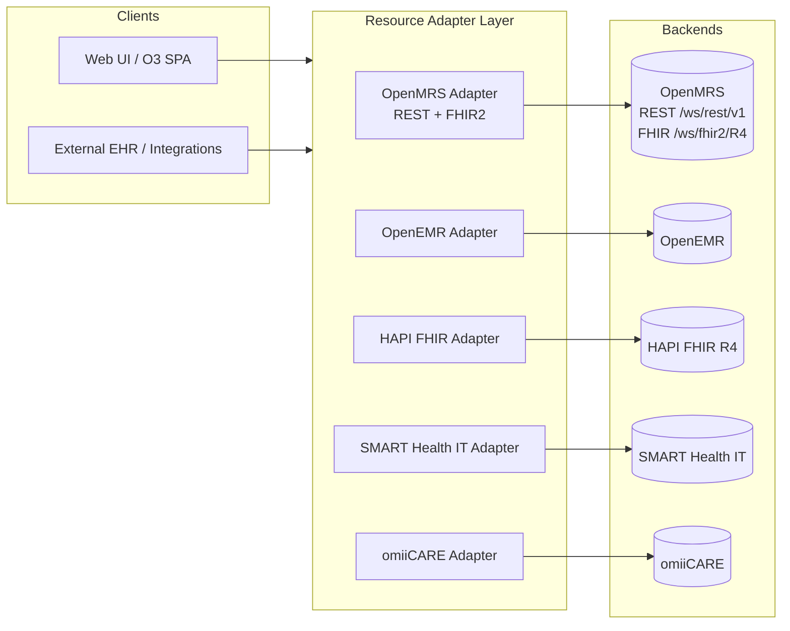
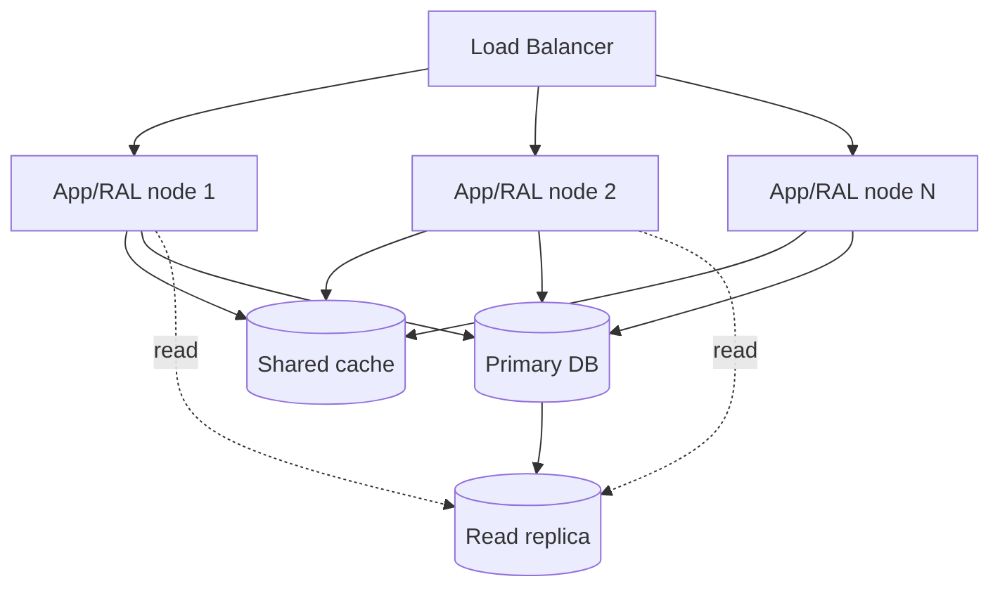
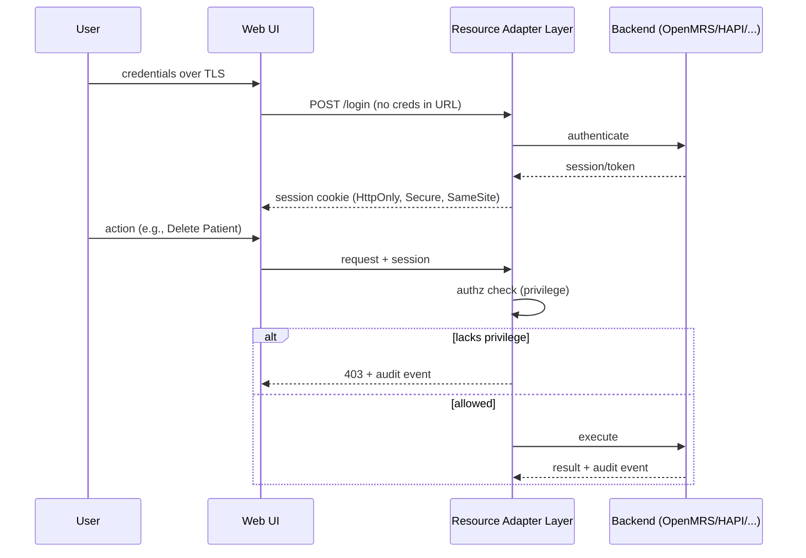

# Non-Functional Requirements (NFR)

> **Purpose.** Define the measurable quality attributes the system under test
> (SUT) must satisfy, reverse-engineered from the **OpenMRS Reference
> Application** (legacy O2 RefApp, `o2.openmrs.org`; modern demo O3 at
> `o3.openmrs.org`) and generalized so the same NFR contract applies across
> **OpenEMR, HAPI FHIR, SMART Health IT**, and the in-house **omiiCARE** app via
> the **Resource Adapter Layer (RAL)**.
>
> **Scope.** This document specifies *quality* requirements (the "how well"),
> complementing the functional catalog (472 `REQ-<PREFIX>-NNN` requirements,
> 1,349 manual test cases, RTM maintained separately). Every NFR below is
> **measurable**, has an **acceptance criterion**, and **cross-references** the
> functional requirement IDs it constrains.
>
> **Provenance convention.** Statements grounded in verified OpenMRS RefApp
> behavior are stated plainly. Any target threshold, SLO, or design choice that
> goes beyond observed behavior is tagged **(Assumption)** and is a portfolio
> design decision, tunable per deployment.

---

## 1. Conventions, ID Scheme, and Reference Architecture

### 1.1 NFR ID Scheme

NFRs use the ID form **`NFR-<CATEGORY>-NNN`**. Categories:

| Category | Prefix | Quality attribute |
|----------|--------|-------------------|
| Performance | `PERF` | Latency, throughput, resource use |
| Scalability | `SCAL` | Growth in load, data, tenants |
| Availability | `AVAIL` | Uptime, RTO/RPO, DR |
| Security | `SEC` | AuthN/Z, transport, hardening |
| Privacy / HIPAA-like | `PRIV` | PHI handling, minimum necessary |
| Interoperability | `INTEROP` | FHIR R4, HL7 v2 conformance |
| Accessibility | `A11Y` | WCAG 2.1 AA |
| Usability | `USE` | Task success, learnability |
| Reliability | `REL` | Fault tolerance, data integrity |
| Maintainability | `MAINT` | Modularity, testability |
| Auditability | `AUD` | Audit trail completeness |
| Compliance | `COMP` | Regulatory/standards conformance |
| Localization | `L10N` | i18n, locale, units |

Each NFR links to functional requirement prefixes (`AUTH, REG, SRCH, PDASH,
VISIT, VITAL, CLIN, APPT, ORDLAB, PHARM, RBAC, DATA, RPT, FHIR, HL7, SEC, A11Y,
PERF, NOTIF, BILL, TELE`) for forward traceability into the RTM.

### 1.2 Resource Adapter Layer context

NFRs are written against the **RAL boundary** so the same acceptance criteria
hold regardless of which backend adapter is active. Backend-specific deltas are
called out per-section as **Adapter notes**.

### 1.3 Measurement vocabulary

- **Latency percentiles** measured server-side at the RAL unless stated as
  "end-to-end" (browser-observed). p50/p95/p99 over a rolling 5-minute window.
- **Steady state** = warmed JVM/connection pools, caches primed, ≥10 min after
  deploy.
- **Reference workload** = the mix in §2.2 unless a requirement names another.
- **Environment of record** for SLO verification = project-owned `perf`
  environment (never public OpenMRS demo hosts — load testing third-party hosts
  is prohibited).

---

## 2. Performance

### 2.1 Latency SLOs

| ID | Operation | Functional ref | Target (steady state) | Acceptance criterion |
|----|-----------|----------------|-----------------------|----------------------|
| NFR-PERF-001 | Login: submit credentials → home dashboard | REQ-AUTH-* | p95 ≤ 1.5 s, p99 ≤ 3 s | Over 1,000 logins at reference load, p95 ≤ 1500 ms end-to-end; `#loginButton`→tiles render |
| NFR-PERF-002 | Patient search (Find Patient Record) | REQ-SRCH-* | p95 ≤ 1.0 s server, ≤ 2 s e2e | 95% of name/ID queries return first result page within target at 50 RPS |
| NFR-PERF-003 | Patient dashboard load (all widgets) | REQ-PDASH-* | p95 ≤ 2.5 s e2e | Diagnoses/Vitals/Visits/Allergies widgets fully painted within target |
| NFR-PERF-004 | Register patient: Confirm `#submit` → patient dashboard | REQ-REG-* | p95 ≤ 2.5 s | "Created Patient Record" toast + redirect within target; ID generated |
| NFR-PERF-005 | Capture Vitals save | REQ-VITAL-* | p95 ≤ 1.2 s | Obs persisted and visible in Latest Observations within target |
| NFR-PERF-006 | Start Visit / Add Past Visit | REQ-VISIT-* | p95 ≤ 1.5 s | Visit created, encounter context established |
| NFR-PERF-007 | REST read `GET /ws/rest/v1/patient/{uuid}` | REQ-DATA-* | p95 ≤ 300 ms server | Authenticated read at 100 RPS within target |
| NFR-PERF-008 | FHIR read `GET /ws/fhir2/R4/Patient/{id}` | REQ-FHIR-* | p95 ≤ 400 ms server | Valid R4 resource returned within target |
| NFR-PERF-009 | FHIR search `GET /ws/fhir2/R4/Patient?name=` | REQ-FHIR-* | p95 ≤ 800 ms server | Bundle with correct `total`/paging within target |
| NFR-PERF-010 | Report generation (standard report) | REQ-RPT-* | ≤ 30 s for ≤10k-row report **(Assumption)** | Async job completes; download available within target |

**(Assumption)** Absolute thresholds are portfolio SLO targets; OpenMRS does not
publish them. They are derived from typical clinical-app expectations and are
configurable per deployment.

### 2.2 Reference workload model (Assumption)

| Class | Mix | Notes |
|-------|-----|-------|
| Read-heavy (search, dashboard, REST/FHIR GET) | 70% | Bursty around clinic open |
| Write (register, vitals, visit, obs) | 25% | Steady through clinic hours |
| Reporting/batch | 5% | Off-peak preferred |

- **Concurrency baseline:** 200 concurrent active clinical sessions; **peak**
  500. **Adapter note:** HAPI FHIR-only deployments skip UI-session classes.

### 2.3 Throughput & resource budgets

| ID | Requirement | Acceptance criterion |
|----|-------------|----------------------|
| NFR-PERF-011 | Sustain ≥ 100 REST RPS and ≥ 50 FHIR RPS at SLO | Soak 60 min; no SLO breach, no error-rate rise |
| NFR-PERF-012 | Frontend payload budget (initial dashboard) ≤ 2.5 MB transfer **(Assumption)** | Measured via Lighthouse/HAR; gzip/brotli on |
| NFR-PERF-013 | Server CPU < 75%, heap < 80% at reference load | No GC pause > 1 s (p99) during soak |
| NFR-PERF-014 | No N+1 query on dashboard/search hot paths | DB query count per request bounded and asserted |

### 2.4 Frontend performance (Core Web Vitals, e2e) (Assumption)

| ID | Metric | Target |
|----|--------|--------|
| NFR-PERF-015 | LCP (dashboard) | ≤ 2.5 s |
| NFR-PERF-016 | INP | ≤ 200 ms |
| NFR-PERF-017 | CLS | ≤ 0.1 |

---

## 3. Scalability

| ID | Requirement | Functional ref | Acceptance criterion |
|----|-------------|----------------|----------------------|
| NFR-SCAL-001 | Horizontal scale of stateless RAL/app tier | all | Adding a node yields ≥ 0.8× linear throughput gain up to 4 nodes |
| NFR-SCAL-002 | Data volume scale: 1M patients, 10M encounters, 50M obs **(Assumption)** | REQ-SRCH-*, REQ-PDASH-* | Search/dashboard SLOs (§2.1) hold at this volume with proper indexing |
| NFR-SCAL-003 | Session location scale | REQ-AUTH-* | All 6 demo locations (Outpatient, Inpatient, Pharmacy, Laboratory, Registration, Isolation) + custom locations load without perf regression |
| NFR-SCAL-004 | Connection-pool sizing scales with nodes | all | No pool-exhaustion errors at peak (§2.2) |
| NFR-SCAL-005 | FHIR pagination bounded | REQ-FHIR-* | Default `_count` enforced (≤ 100 **(Assumption)**); large result sets paged, not buffered whole |
| NFR-SCAL-006 | Multi-tenant isolation (RAL) **(Assumption)** | RBAC, DATA | Tenant A load does not degrade Tenant B beyond agreed noisy-neighbor budget |
| NFR-SCAL-007 | Graceful degradation under overload | all | At >peak, shed non-critical (reports) before clinical writes; return 429 with `Retry-After`, never silent data loss |

---

## 4. Availability & Disaster Recovery

| ID | Requirement | Acceptance criterion |
|----|-------------|----------------------|
| NFR-AVAIL-001 | Monthly availability ≥ 99.9% (clinical hours) **(Assumption)** | ≤ 43.8 min downtime/month measured by synthetic health checks |
| NFR-AVAIL-002 | Health/liveness/readiness endpoints | `/health` returns 200 with dependency status; readiness gates traffic |
| NFR-AVAIL-003 | Zero-downtime deploy (rolling) **(Assumption)** | In-flight requests drain; no 5xx spike during deploy window |
| NFR-AVAIL-004 | RTO ≤ 1 h, RPO ≤ 15 min **(Assumption)** | DR drill restores service and data within targets |
| NFR-AVAIL-005 | Backups verified | Nightly backup + monthly restore test passes; checksum validated |
| NFR-AVAIL-006 | Dependency failure isolation | Reports/FHIR outage does not take down login/registration (bulkhead) |
| NFR-AVAIL-007 | Maintenance-mode behavior | Read-only or banner mode; clinical reads still served where possible |

**Adapter note:** SMART Health IT / external sandboxes are best-effort; RAL
treats them as degradable dependencies and circuit-breaks (§7).

---

## 5. Security

> Cross-reference: functional `REQ-SEC-*` and `REQ-AUTH-*`; deep procedures in
> `SECURITY_TESTING_GUIDE.md`.

### 5.1 Authentication & session

| ID | Requirement | Functional ref | Acceptance criterion |
|----|-------------|----------------|----------------------|
| NFR-SEC-001 | Credentials never sent in URL/query; POST over TLS only | REQ-AUTH-* | `#username`/`#password` posted to `#loginButton` over HTTPS; no creds in logs/GET |
| NFR-SEC-002 | Session fixation prevented | REQ-AUTH-* | New session ID issued on login; old invalidated |
| NFR-SEC-003 | Idle + absolute session timeout | REQ-AUTH-* | Idle ≤ 15 min, absolute ≤ 8 h **(Assumption)**; re-auth required after |
| NFR-SEC-004 | Logout fully invalidates session server-side | REQ-AUTH-* | Post-logout reuse of session token → 401; navbar Logout clears session location |
| NFR-SEC-005 | Brute-force throttling / lockout | REQ-AUTH-*, REQ-SEC-* | ≥5 failures triggers backoff/lockout **(Assumption)**; logged as audit event |
| NFR-SEC-006 | REST/FHIR require auth; unauthorized → 401 | REQ-DATA-*, REQ-FHIR-* | Unauthenticated `/ws/rest/v1/*` and `/ws/fhir2/R4/*` return 401 (verified behavior) |

### 5.2 Authorization (RBAC)

| ID | Requirement | Functional ref | Acceptance criterion |
|----|-------------|----------------|----------------------|
| NFR-SEC-007 | Privilege checks enforced server-side, not UI-only | REQ-RBAC-* | Direct API call without privilege (e.g., Delete Patients) → 403, even if UI tile hidden |
| NFR-SEC-008 | Least privilege per role | REQ-RBAC-* | Nurse cannot Manage Roles; Registration Clerk cannot prescribe; verified per role matrix |
| NFR-SEC-009 | No horizontal privilege escalation | REQ-RBAC-*, REQ-PDASH-* | User cannot access another patient/record outside granted scope |

### 5.3 Transport, hardening, input

| ID | Requirement | Acceptance criterion |
|----|-------------|----------------------|
| NFR-SEC-010 | TLS 1.2+ only; HSTS enabled | SSL Labs grade ≥ A; TLS 1.0/1.1 rejected |
| NFR-SEC-011 | Security headers present | CSP, X-Content-Type-Options, X-Frame-Options/frame-ancestors, Referrer-Policy set |
| NFR-SEC-012 | OWASP Top 10 coverage | No High/Critical in OWASP ZAP/dependency scan gate; injection/XSS/SSRF tested |
| NFR-SEC-013 | CSRF protection on state-changing UI posts | Register/visit/vitals forms reject forged cross-site POST |
| NFR-SEC-014 | Output encoding / no stored XSS in patient names/notes | Script payload in Name fields rendered inert on dashboard |
| NFR-SEC-015 | Secrets not in source/logs; rotation supported | Secret scan clean; no PHI/tokens in app logs |
| NFR-SEC-016 | Dependency & container vulnerability gate | CI fails on known High/Critical CVEs |

---

## 6. Privacy / HIPAA-like

> The portfolio targets a **HIPAA-like** control set (the apps are demo/OSS; no
> real PHI). Controls are written to be auditable against HIPAA Security &
> Privacy Rule expectations. **(Assumption)** where a specific control is a
> design choice.

| ID | Requirement | Functional ref | Acceptance criterion |
|----|-------------|----------------|----------------------|
| NFR-PRIV-001 | PHI encrypted in transit | all PHI flows | All PHI over TLS 1.2+ (ties NFR-SEC-010) |
| NFR-PRIV-002 | PHI encrypted at rest **(Assumption)** | REQ-DATA-* | DB volumes/backups encrypted (AES-256); key mgmt documented |
| NFR-PRIV-003 | Minimum-necessary access | REQ-RBAC-* | Role views expose only fields needed; Lab Tech does not see full med history **(Assumption)** |
| NFR-PRIV-004 | Audit of PHI access (who/what/when) | REQ-DATA-*, REQ-PDASH-* | Read access to patient dashboard recorded (ties §11) |
| NFR-PRIV-005 | Consent capture & enforcement **(Assumption)** | REQ-CLIN-* | FHIR `Consent`/flags honored before disclosure; denial blocks share |
| NFR-PRIV-006 | De-identification for non-prod/test data | TEST_DATA_STRATEGY | No real PHI in test/demo; synthetic data only |
| NFR-PRIV-007 | Data subject rights: export & correction | REQ-REG-*, REQ-DATA-* | Edit Registration Information + FHIR export support correction/portability |
| NFR-PRIV-008 | Retention & secure deletion | REQ-DATA-* | Delete Patient / Mark Deceased follow retention policy; deletions audited |
| NFR-PRIV-009 | Breach-detectable logging | REQ-SEC-* | Anomalous bulk PHI reads detectable from logs/alerts |
| NFR-PRIV-010 | PHI not leaked in error pages/URLs/toasts | all | No patient identifiers in stack traces or shareable URLs beyond opaque UUID |

---

## 7. Interoperability (FHIR R4 / HL7 v2)

> Verified: OpenMRS exposes REST `/openmrs/ws/rest/v1/*` and FHIR R4
> `/openmrs/ws/fhir2/R4`; `metadata` returns a **CapabilityStatement** with
> `fhirVersion 4.0.1`. Supported R4 resources include Patient, Encounter,
> Observation, Condition, AllergyIntolerance, MedicationRequest.

### 7.1 FHIR R4 conformance

| ID | Requirement | Functional ref | Acceptance criterion |
|----|-------------|----------------|----------------------|
| NFR-INTEROP-001 | CapabilityStatement advertises supported resources/interactions | REQ-FHIR-* | `GET /ws/fhir2/R4/metadata` → `fhirVersion 4.0.1`; lists Patient/Encounter/Observation/Condition/AllergyIntolerance/MedicationRequest |
| NFR-INTEROP-002 | Resources validate against R4 StructureDefinitions | REQ-FHIR-* | HAPI validator: 0 errors on returned Patient/Observation/etc. |
| NFR-INTEROP-003 | US Core profile conformance where applicable **(Assumption)** | REQ-FHIR-* | US Core Patient/Observation profiles validate |
| NFR-INTEROP-004 | Correct code systems/URIs | REQ-CLIN-*, REQ-ORDLAB-* | LOINC for labs/vitals, SNOMED CT for clinical findings, ICD-10 for diagnoses; system URIs exact |
| NFR-INTEROP-005 | Search params & paging per spec | REQ-FHIR-* | `_count`, `_lastUpdated`, `name`, `identifier` honored; Bundle `total`/`link.next` correct |
| NFR-INTEROP-006 | Consistent error handling | REQ-FHIR-* | Errors return `OperationOutcome`; 401 unauth, 404 not-found, 422 validation |
| NFR-INTEROP-007 | Bundle transaction atomicity **(Assumption)** | REQ-FHIR-* | Transaction Bundle is all-or-nothing |

### 7.2 HL7 v2 messaging

| ID | Requirement | Functional ref | Acceptance criterion |
|----|-------------|----------------|----------------------|
| NFR-INTEROP-008 | ADT round-trip | REQ-HL7-*, REQ-REG-*, REQ-VISIT- | A01/A04/A08 update demographics/visit; ACK (AA) returned |
| NFR-INTEROP-009 | ORM/ORU order & result flow | REQ-HL7-*, REQ-ORDLAB-* | Order (ORM) and result (ORU) parsed; obs created; NAK on malformed with error code |
| NFR-INTEROP-010 | MSH/encoding correctness | REQ-HL7-* | Field separators, segments, MSH-9 message type validated; version stated |

### 7.3 Adapter equivalence (RAL)

| ID | Requirement | Acceptance criterion |
|----|-------------|----------------------|
| NFR-INTEROP-011 | Adapter contract parity | Same RAL call yields semantically equivalent result across OpenMRS, OpenEMR, HAPI FHIR, SMART, omiiCARE adapters (golden-file diff) |
| NFR-INTEROP-012 | Backend version compatibility | Compatibility matrix (`COMPATIBILITY_MATRIX.md`) pinned & tested per adapter |
| NFR-INTEROP-013 | Resilience to backend faults | Timeout, retry-with-backoff, circuit breaker on backend errors; no cascading failure |

---

## 8. Accessibility (WCAG 2.1 AA)

> Cross-reference functional `REQ-A11Y-*` and `ACCESSIBILITY_GUIDE.md`.
> Target conformance: **WCAG 2.1 Level AA**.

| ID | Requirement | WCAG SC | Acceptance criterion |
|----|-------------|---------|----------------------|
| NFR-A11Y-001 | Perceivable text contrast | 1.4.3 | Normal text ≥ 4.5:1, large ≥ 3:1 across login, dashboard, wizard |
| NFR-A11Y-002 | Non-text contrast (controls, focus) | 1.4.11 | UI components/focus indicators ≥ 3:1 |
| NFR-A11Y-003 | Full keyboard operability | 2.1.1, 2.1.2 | Login, Register wizard, dashboard actions reachable/operable; no keyboard trap |
| NFR-A11Y-004 | Visible focus order | 2.4.3, 2.4.7 | Logical tab order; focus visible on every interactive element |
| NFR-A11Y-005 | Form labels & errors | 1.3.1, 3.3.1, 3.3.2 | `#username`/`#password`, Demographics/Contact fields have programmatic labels; errors identified in text |
| NFR-A11Y-006 | Name/Role/Value for custom widgets | 4.1.2 | Session-location `<li>` selector, toasts, tiles expose correct ARIA roles/state |
| NFR-A11Y-007 | Status messages announced | 4.1.3 | "Created Patient Record" toast announced via `aria-live` |
| NFR-A11Y-008 | Reflow & resize | 1.4.10, 1.4.4 | Usable at 320px width and 200% zoom without loss of content/function |
| NFR-A11Y-009 | Page titles & language | 2.4.2, 3.1.1 | Unique titles; `lang` attribute set |
| NFR-A11Y-010 | Automated + manual audit gate | — | axe-core: 0 serious/critical; manual SR pass (NVDA/VoiceOver) on critical flows |

---

## 9. Usability

| ID | Requirement | Functional ref | Acceptance criterion |
|----|-------------|----------------|----------------------|
| NFR-USE-001 | Registration task success | REQ-REG-* | ≥ 95% of test users complete Demographics→Contact→Confirm `#submit` unaided **(Assumption)** |
| NFR-USE-002 | Error prevention/recovery in wizard | REQ-REG-* | Address requires ≥1 field, Birthdate exact-or-estimated; inline validation before Confirm |
| NFR-USE-003 | Discoverability of core actions | REQ-PDASH-* | Start Visit / Capture Vitals / Edit Registration reachable in ≤ 2 clicks from dashboard |
| NFR-USE-004 | Feedback on every action | all | Save shows toast/confirmation; long ops show progress |
| NFR-USE-005 | Consistent navigation & context | REQ-AUTH-*, REQ-PDASH-* | Session location + user menu + Logout consistently in header navbar |
| NFR-USE-006 | Search efficiency | REQ-SRCH-* | First relevant result for known patient typically in top results within 2 s |
| NFR-USE-007 | Mobile/tablet responsiveness **(Assumption)** | all | Core flows usable on tablet form factor |
| NFR-USE-008 | Error message quality | all | Messages are specific, non-technical, no stack traces shown to clinicians |

---

## 10. Reliability

| ID | Requirement | Functional ref | Acceptance criterion |
|----|-------------|----------------|----------------------|
| NFR-REL-001 | Transactional data integrity | REQ-REG-*, REQ-VISIT-*, REQ-VITAL-* | Patient/visit/obs writes atomic; partial failure leaves no orphan records |
| NFR-REL-002 | Unique Patient ID guarantee | REQ-REG-* | Concurrent registrations never produce duplicate Patient IDs |
| NFR-REL-003 | Idempotent retries | REQ-FHIR-*, REQ-DATA-* | Safe retry of POST via idempotency key / no duplicate encounters on network retry **(Assumption)** |
| NFR-REL-004 | Error rate budget | all | < 0.1% 5xx at reference load over soak window |
| NFR-REL-005 | Graceful handling of backend timeout | INTEROP | User sees actionable error; no data corruption; operation retriable |
| NFR-REL-006 | Concurrency correctness | REQ-VISIT-*, REQ-PDASH-* | Merge Visits / concurrent edits use optimistic locking; no lost update |
| NFR-REL-007 | Data validation on ingest | REQ-VITAL-*, REQ-CLIN-* | Out-of-range vitals/invalid concepts rejected with clear cause |

---

## 11. Auditability

> Cross-reference HIPAA audit logging, `REQ-DATA-*`, `REQ-SEC-*`.

| ID | Requirement | Acceptance criterion |
|----|-------------|----------------------|
| NFR-AUD-001 | Audit every PHI create/read/update/delete | Each operation logs actor, action, target UUID, timestamp, session location, outcome |
| NFR-AUD-002 | Authentication events audited | Login success/failure, logout, lockout recorded |
| NFR-AUD-003 | Authorization denials audited | 403/privilege denials logged with reason |
| NFR-AUD-004 | Tamper-evident, append-only logs **(Assumption)** | Audit store write-once/hash-chained; modification detectable |
| NFR-AUD-005 | Time synchronization | All nodes NTP-synced; timestamps in UTC + offset |
| NFR-AUD-006 | Audit retention | Logs retained ≥ 6 years **(Assumption)**; queryable for investigations |
| NFR-AUD-007 | No PHI overexposure in logs | Logs reference UUIDs/codes, not clear-text identifiers beyond necessity |
| NFR-AUD-008 | Traceability of clinical changes | Mark Deceased, Delete Patient, Merge Visits each produce an audit entry |

---

## 12. Maintainability

| ID | Requirement | Acceptance criterion |
|----|-------------|----------------------|
| NFR-MAINT-001 | Adapter modularity (RAL) | New backend added by implementing adapter interface only; no changes to UI/core |
| NFR-MAINT-002 | API versioning | REST/FHIR versions explicit (`/ws/rest/v1`, `/R4`); breaking changes versioned (`API_VERSIONING_POLICY.md`) |
| NFR-MAINT-003 | Test coverage gate | Unit + API + e2e coverage thresholds enforced in CI **(Assumption)** |
| NFR-MAINT-004 | Configuration over code | Locations, roles, concepts configurable (Configure Metadata) without redeploy |
| NFR-MAINT-005 | Observability built-in | Structured logs, metrics, traces (OpenTelemetry) on hot paths |
| NFR-MAINT-006 | Static analysis & style gates | Lint/format/security-static gates pass in CI (`CODING_STANDARDS.md`) |
| NFR-MAINT-007 | Documentation currency | KB/RTM updated with each feature; deltas reviewed |
| NFR-MAINT-008 | Backward-compatible data migrations | Schema migrations reversible; tested on copy of prod-scale data |

---

## 13. Compliance

| ID | Requirement | Standard | Acceptance criterion |
|----|-------------|----------|----------------------|
| NFR-COMP-001 | FHIR R4 conformance | HL7 FHIR 4.0.1 | CapabilityStatement + validator pass (§7) |
| NFR-COMP-002 | HL7 v2 messaging conformance | HL7 v2.x | ADT/ORM/ORU conform; ACK/NAK semantics correct |
| NFR-COMP-003 | Terminology compliance | ICD-10, SNOMED CT, LOINC | Correct code systems/URIs per data type (§7.1) |
| NFR-COMP-004 | HIPAA-like privacy & security | HIPAA Security/Privacy (analog) | Controls in §5/§6/§11 demonstrably met **(Assumption)** |
| NFR-COMP-005 | Accessibility regulatory alignment | WCAG 2.1 AA / Section 508 | §8 criteria met; VPAT-style evidence producible **(Assumption)** |
| NFR-COMP-006 | SMART/OAuth where used | SMART App Launch / OAuth 2.0 | Token scopes enforced for SMART Health IT adapter **(Assumption)** |
| NFR-COMP-007 | Audit retention compliance | HIPAA-like | §11 retention satisfied |

---

## 14. Localization (i18n / L10n)

| ID | Requirement | Functional ref | Acceptance criterion |
|----|-------------|----------------|----------------------|
| NFR-L10N-001 | UI string externalization | all | No hard-coded user-facing strings; all from resource bundles |
| NFR-L10N-002 | Locale switching | REQ-AUTH-* | Supported locales selectable; UI re-renders fully translated |
| NFR-L10N-003 | Date/time/number formatting per locale | REQ-REG-*, REQ-VITAL-* | Birthdate, timestamps, measurements formatted per active locale |
| NFR-L10N-004 | Units & coding locale-aware **(Assumption)** | REQ-VITAL-* | Metric/imperial unit display configurable; clinical codes unchanged |
| NFR-L10N-005 | RTL language support **(Assumption)** | all | Layout mirrors correctly for RTL locales |
| NFR-L10N-006 | Character-set integrity | REQ-REG-*, REQ-SRCH-* | Unicode names (e.g., accented/CJK) stored, searched, and rendered without corruption |
| NFR-L10N-007 | Translatable validation/error messages | all | Error and toast text localized, not English-only |

---

## 15. Traceability & Verification Summary

| NFR Category | Primary functional prefixes | Verification method |
|--------------|-----------------------------|----------------------|
| Performance (§2) | PERF, SRCH, PDASH, REG, VITAL, DATA, FHIR | Load/soak tests (perf env), Lighthouse, APM percentiles |
| Scalability (§3) | DATA, SRCH, FHIR, RBAC | Volume + horizontal-scale tests |
| Availability (§4) | all | Synthetic monitoring, DR drills, chaos tests |
| Security (§5) | SEC, AUTH, RBAC, DATA, FHIR | ZAP, dependency/secret scan, authz/penetration tests |
| Privacy (§6) | DATA, RBAC, CLIN, REG | Control audit, log review, de-id checks |
| Interoperability (§7) | FHIR, HL7, ORDLAB, CLIN | FHIR validator, HL7 round-trip, adapter golden files |
| Accessibility (§8) | A11Y | axe-core + manual SR audit |
| Usability (§9) | REG, PDASH, SRCH | Task-based usability testing, click-path analysis |
| Reliability (§10) | REG, VISIT, VITAL, FHIR | Fault-injection, concurrency, integrity tests |
| Auditability (§11) | DATA, SEC | Audit-log completeness assertions |
| Maintainability (§12) | all | CI gates, coverage, static analysis |
| Compliance (§13) | FHIR, HL7, SEC, A11Y | Conformance suites + control evidence |
| Localization (§14) | REG, AUTH, SRCH, VITAL | Pseudo-localization + locale matrix tests |

**Verification cadence.** Performance/availability SLOs verified each release on
the `perf` environment; security/compliance gates run per-PR in CI; accessibility
audited per UI change; interoperability conformance run against each adapter on
the pinned `COMPATIBILITY_MATRIX.md`.

> **Reminder.** All load/stress/soak verification runs **only** against
> project-owned environments — never against public OpenMRS, HAPI, or SMART
> Health IT demo hosts.

---

### Appendix A — Open Assumptions Register

The following thresholds/controls are **(Assumption)** portfolio design decisions
(not observed OpenMRS guarantees) and should be ratified per deployment:
absolute latency SLOs (§2.1), workload mix & concurrency (§2.2), payload/CWV
budgets (§2.4), data-volume targets (§3), availability % and RTO/RPO (§4),
session timeouts & lockout thresholds (§5), encryption-at-rest, consent
enforcement, minimum-necessary field maps, de-identification (§6), US Core /
transaction atomicity (§7), task-success rates & mobile support (§9), idempotency
keys & coverage gates (§10/§12), audit immutability & 6-year retention (§11),
SMART/OAuth scoping (§13), RTL/unit localization (§14).
