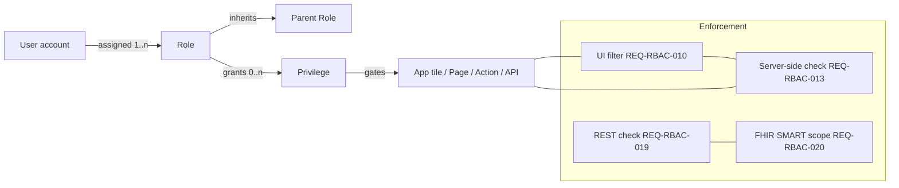
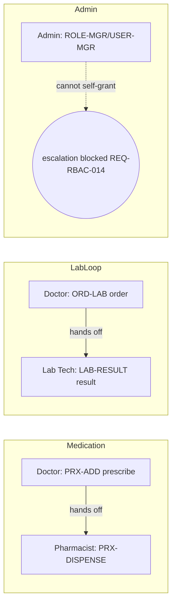
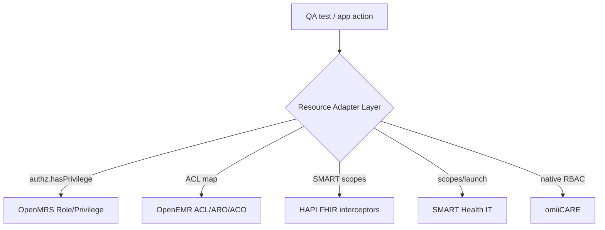

# RBAC Matrix — OpenMRS Reference Application (Reverse-Engineered)

> **Primary reference system:** OpenMRS Reference Application (legacy O2 RefApp, `https://o2.openmrs.org`; modern demo O3 at `o3.openmrs.org`).
> **Portability:** Designed to drive authorization for OpenMRS **and** OpenEMR, HAPI FHIR, SMART Health IT, and the in-house **omiiCARE** app through a **Resource Adapter Layer (RAL)**. The canonical primitive every adapter implements is `authz.hasPrivilege(user, privilege)` / `authz.assignRole(user, role)`.
> **Traceability:** Cross-referenced to `REQ-RBAC-NNN` (and adjacent `REQ-AUTH`, `REQ-SEC`, `REQ-FHIR`, `REQ-HL7`, `REQ-RPT`) throughout. RTM links 1,349 manual test cases to these requirements.
> **Inference policy:** Verified OpenMRS behavior is stated plainly. Anything beyond verified facts is tagged **(Assumption)**.

---

## 1. Purpose & Scope

This document specifies the **Role-Based Access Control** model used to gate every application tile, page, action, REST endpoint, FHIR interaction, and HL7 message in the system under test (SUT). It exists to:

- Give QA an **authoritative oracle** for positive/negative authorization test design (vertical & horizontal escalation, forced browsing, IDOR/BOLA).
- Give BA/SA a **single source of truth** for which role may perform which business action.
- Encode **least-privilege** and **separation-of-duties (SoD)** rules as testable assertions.
- Map cleanly onto OpenMRS's native **Role → Privilege → User** model while remaining adapter-portable.

**Out of scope:** authentication mechanics (covered by `REQ-AUTH-*`), session lifecycle internals, and credential storage (covered by `REQ-RBAC-024`, referenced only).

---

## 2. Authorization Model Overview

OpenMRS uses a **privilege-centric** model: code/UI checks *privileges*, never roles directly. Roles are bundles of privileges; users hold one or more roles; roles may **inherit** from parent roles (`REQ-RBAC-001`).

**Core invariants (testable):**

| Invariant | Rule | REQ |
|---|---|---|
| Privilege-gated, not role-gated | UI checks `hasPrivilege(p)`; roles are only privilege containers | REQ-RBAC-011 |
| Default deny | No role / unknown privilege → access denied | REQ-RBAC-008, REQ-RBAC-013 |
| Defense in depth | UI hides AND server enforces; hiding a tile is never the only control | REQ-RBAC-010, REQ-RBAC-013 |
| Parity across surfaces | UI, REST, FHIR, HL7 enforce the *same* privilege decision | REQ-RBAC-019, REQ-RBAC-020, REQ-RBAC-021 |
| Audit security-relevant changes | Role/privilege/account changes logged | REQ-RBAC-016 |

---

## 3. Role Catalog

OpenMRS ships system-level roles; the RefApp layers clinical roles on top. **Verified** roles below are observable in the demo (`admin/Admin123` holds System Administrator). Granular clinical role *privilege sets* are partly **(Assumption)** — OpenMRS's seeded roles vary by distro, so the matrices encode the *intended* RefApp model that QA validates against.

| Role ID | Role | Description | Inherits | Verified? |
|---|---|---|---|---|
| R-ADMIN | System Administrator | Full metadata, user/role admin, all clinical access | — | Verified (admin user) |
| R-DOCTOR | Doctor / Clinician | Full clinical workflow: diagnoses, orders, prescribe, consult notes | R-CLIN-BASE | Verified role exists; privilege set (Assumption) |
| R-NURSE | Nurse | Vitals, observations, visits, limited orders, allergies, conditions | R-CLIN-BASE | (Assumption) on exact privileges |
| R-CLERK | Registration Clerk | Register/edit patients, demographics, appointments, start visits | — | Verified role exists |
| R-PHARM | Pharmacist | Dispense, view active drug orders, medication reconciliation | R-CLIN-BASE | (Assumption) |
| R-LAB | Lab Tech | View lab orders, enter/result lab observations | R-CLIN-BASE | (Assumption) |
| R-CLIN-BASE | Clinical Base | Shared read of patient dashboard, observations, visits | R-AUTH | (Assumption — modeled parent) |
| R-AUTH | Authenticated | Minimal: login, view own profile, session location select | — | Verified (login + location select) |
| R-ANON | Anonymous | Pre-login; no PHI; only login page/assets | — | Verified (default deny) |

> **Session location** (Outpatient Clinic, Inpatient Ward, Pharmacy, Laboratory, Registration Desk, Isolation Ward) is **orthogonal** to role — it scopes *where* a visit/encounter is recorded, not *what* a user may do. **(Assumption)** Some RefApp deployments further gate apps by location tag; QA treats location as a contextual filter, not a privilege source.

---

## 4. Privilege Catalog

Privileges are the atomic permission units checked at runtime. Naming below follows OpenMRS conventions (`Add Patients`, `Edit Patients`, `Delete Patients`, `Manage Roles`, etc.); non-core entries are **(Assumption)** but map to observable RefApp actions.

| Privilege ID | Privilege name | Gates | REQ |
|---|---|---|---|
| PRV-LOGIN | Authenticated | Any post-login page | REQ-AUTH-* |
| PRV-PAT-ADD | Add Patients | Register a patient wizard (`registrationapp`), `#submit` | REQ-REG-*, REQ-RBAC-011 |
| PRV-PAT-EDIT | Edit Patients | Edit Registration Information | REQ-REG-*, REQ-RBAC-011 |
| PRV-PAT-DEL | Delete Patients | Delete Patient general action | REQ-REG-017, REQ-RBAC-004 |
| PRV-PAT-VIEW | Get/View Patients | Find Patient Record, patient dashboard | REQ-SRCH-*, REQ-PDASH-* |
| PRV-VISIT-MGR | Manage Visits | Start Visit, Add Past Visit, Merge Visits | REQ-VISIT-* |
| PRV-VITAL-ADD | Add Observations (Vitals) | Capture Vitals | REQ-VITAL-* |
| PRV-OBS-ADD | Add Observations | Latest Observations entry | REQ-VITAL-*, REQ-CLIN-* |
| PRV-DX-ADD | Add Diagnoses | Diagnoses widget | REQ-CLIN-* |
| PRV-COND-MGR | Manage Conditions | Conditions widget | REQ-CLIN-* |
| PRV-ALLERGY-MGR | Manage Allergies | Allergies widget | REQ-CLIN-* |
| PRV-ORD-LAB | Order Lab Tests / Manage Orders | Lab order entry | REQ-ORDLAB-* |
| PRV-LAB-RESULT | Enter Lab Results | Result/observe lab orders | REQ-ORDLAB-* |
| PRV-RX-ADD | Add Drug Orders | Prescribe medication | REQ-PHARM-*, REQ-RBAC-011 |
| PRV-RX-DISPENSE | Dispense Medication | Pharmacy dispense | REQ-PHARM-020, REQ-RBAC-026 |
| PRV-APPT-MGR | Manage Appointments | Appointment Scheduling, Schedule/Request Appointment | REQ-APPT-* |
| PRV-DECEASED | Mark Patient Deceased | Mark Patient Deceased action | REQ-PDASH-*, REQ-RBAC-011 |
| PRV-ATTACH | Manage Attachments | Attachments widget/action | REQ-PDASH-* |
| PRV-RPT-VIEW | Run Reports | Reports app | REQ-RPT-* |
| PRV-DATA-MGR | Manage Data | Data Management app | REQ-DATA-* |
| PRV-META-MGR | Manage Metadata / Concepts | Configure Metadata | REQ-DATA-*, REQ-RBAC-004 |
| PRV-USER-MGR | Manage Users | Provision/disable accounts | REQ-RBAC-005, REQ-RBAC-009 |
| PRV-ROLE-MGR | Manage Roles | Create/edit roles & privileges | REQ-RBAC-001, REQ-RBAC-004 |
| PRV-SYSADMIN | Manage System / System Administration | System Administration app | REQ-RBAC-001 |
| PRV-PROVIDER-MGR | Manage Providers | Provider records, retire providers | REQ-RBAC-026 |

---

## 5. Roles × Privileges Matrix (Primary Authorization Oracle)

Legend: **✓** granted · **·** denied · **(I)** granted via inheritance · all unmarked = denied (default-deny, `REQ-RBAC-008`).

| Privilege \ Role | R-ADMIN | R-DOCTOR | R-NURSE | R-CLERK | R-PHARM | R-LAB | R-CLIN-BASE | R-AUTH |
|---|:--:|:--:|:--:|:--:|:--:|:--:|:--:|:--:|
| PRV-LOGIN | ✓ | (I) | (I) | ✓ | (I) | (I) | (I) | ✓ |
| PRV-PAT-VIEW | ✓ | ✓ | ✓ | ✓ | ✓ | ✓ | ✓ | · |
| PRV-PAT-ADD | ✓ | · | · | ✓ | · | · | · | · |
| PRV-PAT-EDIT | ✓ | · | · | ✓ | · | · | · | · |
| PRV-PAT-DEL | ✓ | · | · | · | · | · | · | · |
| PRV-VISIT-MGR | ✓ | ✓ | ✓ | ✓ | · | · | · | · |
| PRV-VITAL-ADD | ✓ | ✓ | ✓ | · | · | · | · | · |
| PRV-OBS-ADD | ✓ | ✓ | ✓ | · | · | ✓ | · | · |
| PRV-DX-ADD | ✓ | ✓ | · | · | · | · | · | · |
| PRV-COND-MGR | ✓ | ✓ | ✓ | · | · | · | · | · |
| PRV-ALLERGY-MGR | ✓ | ✓ | ✓ | · | · | · | · | · |
| PRV-ORD-LAB | ✓ | ✓ | · | · | · | · | · | · |
| PRV-LAB-RESULT | ✓ | · | · | · | · | ✓ | · | · |
| PRV-RX-ADD | ✓ | ✓ | · | · | · | · | · | · |
| PRV-RX-DISPENSE | ✓ | · | · | · | ✓ | · | · | · |
| PRV-APPT-MGR | ✓ | ✓ | ✓ | ✓ | · | · | · | · |
| PRV-DECEASED | ✓ | ✓ | · | · | · | · | · | · |
| PRV-ATTACH | ✓ | ✓ | ✓ | ✓ | · | · | · | · |
| PRV-RPT-VIEW | ✓ | ✓ | · | · | · | · | · | · |
| PRV-DATA-MGR | ✓ | · | · | · | · | · | · | · |
| PRV-META-MGR | ✓ | · | · | · | · | · | · | · |
| PRV-USER-MGR | ✓ | · | · | · | · | · | · | · |
| PRV-ROLE-MGR | ✓ | · | · | · | · | · | · | · |
| PRV-SYSADMIN | ✓ | · | · | · | · | · | · | · |
| PRV-PROVIDER-MGR | ✓ | · | · | · | · | · | · | · |

> **(Assumption)** Doctor holding `PRV-RX-ADD` but **not** `PRV-RX-DISPENSE`, and Pharmacist holding `PRV-RX-DISPENSE` but **not** `PRV-RX-ADD`, encodes the prescribe/dispense SoD (see §8). Validated by `REQ-RBAC-012`.

---

## 6. Roles × Modules / Actions (CRUD) Matrix

Per module, **C**reate / **R**ead / **U**pdate / **D**elete (D = void/retire/delete as applicable). `—` = no access. This is the BA/SA view; each cell traces to the privilege(s) in §4–5.

| Module (app) | R-ADMIN | R-DOCTOR | R-NURSE | R-CLERK | R-PHARM | R-LAB |
|---|---|---|---|---|---|---|
| **Patient Registration** (REG) | CRUD | R | R | CRU | R | R |
| **Patient Search/Dashboard** (SRCH/PDASH) | R | R | R | R | R | R |
| **Visits** (VISIT) | CRUD | CRU | CRU | CRU | — | — |
| **Vitals** (VITAL) | CRUD | CRU | CRU | R | — | — |
| **Clinical / Diagnoses / Conditions / Allergies** (CLIN) | CRUD | CRU | CRU* | R | R | R |
| **Lab Orders & Results** (ORDLAB) | CRUD | CRU (order) | R | — | — | CRU (result) |
| **Pharmacy / Drug Orders** (PHARM) | CRUD | CRU (prescribe) | R | — | RU (dispense) | — |
| **Appointments** (APPT) | CRUD | CRU | CRU | CRU | R | — |
| **Reports** (RPT) | CRUD | R | — | — | — | — |
| **Data Management** (DATA) | CRUD | — | — | — | — | — |
| **Configure Metadata** (DATA/meta) | CRUD | — | — | — | — | — |
| **System Administration** (SEC/RBAC) | CRUD | — | — | — | — | — |
| **User & Role Admin** (RBAC) | CRUD | — | — | — | — | — |

> *Nurse on CLIN: may create conditions/allergies/observations but **not** diagnoses (`PRV-DX-ADD` denied) — `REQ-RBAC-012`. **(Assumption)** on the diagnosis split; QA confirms against deployed RefApp role config.
> **Delete semantics:** OpenMRS rarely hard-deletes; most "delete" = **void/retire** (soft). Hard `Delete Patient` (`PRV-PAT-DEL`) is admin-only and audited (`REQ-RBAC-016`).

---

## 7. Least-Privilege Notes

| # | Principle | Implementation in SUT | REQ | QA assertion |
|---|---|---|---|---|
| LP-1 | Default deny | No-role user gets only `R-AUTH`; every undeclared privilege denied | REQ-RBAC-008, REQ-RBAC-013 | New user with zero roles sees no clinical tiles; direct URL → 403 |
| LP-2 | UI filter ≠ security | Tiles hidden by `REQ-RBAC-010`, but server re-checks `REQ-RBAC-013` | REQ-RBAC-010/013 | Forced-browse hidden URL returns 403, not 200 |
| LP-3 | Minimal role granularity | Clerk cannot view labs/prescribe; Pharmacist cannot prescribe | REQ-RBAC-012 | Negative tests per disallowed action |
| LP-4 | Inheritance over duplication | Clinical roles inherit `R-CLIN-BASE` read set; no copy-paste grants | REQ-RBAC-001 | Removing a privilege from base removes it from all children |
| LP-5 | Scoped tokens / scopes | FHIR write needs explicit SMART scope; REST mirrors UI privilege | REQ-RBAC-019, REQ-RBAC-020 | `patient/Observation.read` scope cannot POST |
| LP-6 | No standing super-access | Only `R-ADMIN` holds `PRV-SYSADMIN`; clinicians never get metadata write | REQ-RBAC-011 | Doctor cannot reach Configure Metadata |
| LP-7 | Retire ≠ delete | Retiring provider/role removes from active selection, preserves history | REQ-RBAC-003, REQ-RBAC-026 | Retired provider absent from order dropdowns |
| LP-8 | Last-admin protection | The final administrator account cannot be disabled | REQ-RBAC-025 | Attempt to disable last admin → blocked |

---

## 8. Separation of Duties (SoD)

SoD prevents one actor from completing a sensitive end-to-end flow alone, reducing fraud/error. Each conflict is a **negative-test pair**.

| SoD ID | Conflicting duties | Rule | Enforcing privileges | REQ |
|---|---|---|---|---|
| SOD-1 | Prescribe vs Dispense | Same user may not both prescribe and dispense a drug order | `PRV-RX-ADD` XOR `PRV-RX-DISPENSE` per role | REQ-RBAC-012 |
| SOD-2 | Order vs Result lab | Ordering clinician should not enter the result | `PRV-ORD-LAB` separate from `PRV-LAB-RESULT` | REQ-RBAC-012 |
| SOD-3 | Account admin vs clinical care | User/role admin held only by `R-ADMIN`, isolated from care delivery | `PRV-USER-MGR`/`PRV-ROLE-MGR` admin-only | REQ-RBAC-005, REQ-RBAC-011 |
| SOD-4 | Self privilege grant | No user may grant themselves a privilege/role (vertical escalation) | Server rejects self-mutation of own roles | REQ-RBAC-014 |
| SOD-5 | Register vs clinical sign-off | Clerk registers but cannot author diagnoses/orders | `PRV-PAT-ADD` ⊄ clinical authoring | REQ-RBAC-012 |
| SOD-6 | Delete patient vs create patient | Hard delete reserved to admin, distinct from registration | `PRV-PAT-DEL` admin-only | REQ-RBAC-004, REQ-REG-017 |

> **(Assumption)** OpenMRS does not natively enforce *dynamic* SoD (run-time "same user who ordered cannot result the same order"); the RefApp enforces *static* SoD via role design. Dynamic SoD is an omiiCARE/adapter-layer enhancement candidate, flagged for `REQ-RBAC-012` extension.

---

## 9. Cross-Surface Enforcement (UI / REST / FHIR / HL7)

The same privilege decision must hold on every channel — a frequent source of escalation bugs.

| Surface | Endpoint pattern | Auth | Unauth result | Unprivileged result | REQ |
|---|---|---|---|---|---|
| Web UI | `/openmrs/...` apps & pages | Session cookie | redirect to login | tile hidden + 403 on direct nav | REQ-RBAC-010/013 |
| REST | `/openmrs/ws/rest/v1/*` (patient, encounter, obs, visit, concept, relationship) | Basic / OAuth | **401** | **403** | REQ-RBAC-019 |
| FHIR R4 | `/openmrs/ws/fhir2/R4` (Patient, Encounter, Observation, Condition, AllergyIntolerance, MedicationRequest) | Basic / OAuth + SMART scopes | **401** | **403** (scope mismatch) | REQ-RBAC-020, REQ-FHIR-* |
| HL7 v2 | ADT / ORM / ORU inbound | Sending facility/app allow-list | rejected (AR/AE ACK) | rejected | REQ-RBAC-021, REQ-HL7-* |

**FHIR SMART scope mapping (Assumption beyond verified R4 fhirVersion 4.0.1):**

| SMART scope | Maps to privilege | Allows |
|---|---|---|
| `patient/Patient.read` | PRV-PAT-VIEW | GET Patient |
| `patient/Observation.write` | PRV-OBS-ADD / PRV-VITAL-ADD | POST/PUT Observation |
| `patient/MedicationRequest.write` | PRV-RX-ADD | POST MedicationRequest |
| `user/*.read` | role read-set | broad read for clinician apps |
| `system/*.*` | PRV-SYSADMIN | backend integrations only |

---

## 10. Privilege Escalation & Access-Control Test Coverage

| Threat (OWASP A01) | Scenario | Expected | REQ | Sample TC focus |
|---|---|---|---|---|
| Vertical escalation | Nurse POSTs drug order to REST | 403 | REQ-RBAC-014/019 | tamper privilege param |
| Vertical escalation | User edits own `roles[]` payload | 403 + audit | REQ-RBAC-014/016 | self-grant blocked |
| Horizontal (BOLA/IDOR) | Clinician fetches a patient outside scope by ID | 403 / filtered | REQ-RBAC-015 | object-id swap |
| Forced browsing | Clerk navigates to System Administration URL | 403 | REQ-RBAC-013 | hidden-tile direct URL |
| Unauthenticated | Anonymous calls REST/FHIR | 401 | REQ-RBAC-013/019/020 | no session |
| Stale session | Disabled user's active session reused | revoked | REQ-RBAC-009 | disable-then-act |
| Injection/XSS in admin | Role name with `<script>` / SQL meta | sanitized/rejected | REQ-RBAC-023 | stored XSS in role admin |
| Audit completeness | Role change leaves no log | fail | REQ-RBAC-016 | verify audit row |

---

## 11. Resource Adapter Layer (Multi-System Portability)

Every authorization check resolves through the RAL so the same test suite runs against multiple SUTs.

| Canonical privilege | OpenMRS | OpenEMR | HAPI FHIR | SMART Health IT | omiiCARE (Assumption) |
|---|---|---|---|---|---|
| PRV-PAT-VIEW | Get Patients | `patients` ACO read | `Patient.read` interceptor | `patient/Patient.read` | `patient:read` |
| PRV-PAT-ADD | Add Patients | `patientdemo` write | `Patient.create` | `patient/Patient.write` | `patient:create` |
| PRV-RX-ADD | Add Drug Orders | `med` write | `MedicationRequest.create` | `patient/MedicationRequest.write` | `rx:prescribe` |
| PRV-ROLE-MGR | Manage Roles | `admin/acl` | n/a (deploy config) | `system/*.*` | `iam:role:write` |
| PRV-RPT-VIEW | Run Reports | `reports` | bulk `$export` scope | `system/*.read` | `report:run` |

> The RAL guarantees `authz.assignRole(user, role)` and `authz.hasPrivilege(user, privilege)` semantics are **identical** across SUTs, so `REQ-RBAC-012` parity tests are write-once.

---

## 12. Requirement Traceability (REQ-RBAC-* coverage)

| REQ | Covered in | REQ | Covered in |
|---|---|---|---|
| REQ-RBAC-001 | §2,§3,§7(LP-4),§4 | REQ-RBAC-014 | §8(SOD-4),§10 |
| REQ-RBAC-002 | §3 (role-name validation note) | REQ-RBAC-015 | §10 (horizontal/BOLA) |
| REQ-RBAC-003 | §7(LP-7) | REQ-RBAC-016 | §2,§6,§10 |
| REQ-RBAC-004 | §4,§6,§8(SOD-6) | REQ-RBAC-017 | §10 (lockout — ref) |
| REQ-RBAC-005 | §4,§6,§8(SOD-3) | REQ-RBAC-018 | §10 (session) |
| REQ-RBAC-006 | §4 (username validation — ref) | REQ-RBAC-019 | §2,§9 |
| REQ-RBAC-007 | §4 (password policy — ref) | REQ-RBAC-020 | §2,§9 |
| REQ-RBAC-008 | §2,§5,§7(LP-1) | REQ-RBAC-021 | §9 (HL7) |
| REQ-RBAC-009 | §4,§10 (stale session) | REQ-RBAC-022 | §10 (a11y — cross-ref REQ-A11Y) |
| REQ-RBAC-010 | §2,§7(LP-2),§9 | REQ-RBAC-023 | §10 (injection/XSS) |
| REQ-RBAC-011 | §2,§5,§6,§7(LP-6) | REQ-RBAC-024 | §1 (credential storage — ref) |
| REQ-RBAC-012 | §5,§6,§8,§11 | REQ-RBAC-025 | §7(LP-8) |
| REQ-RBAC-013 | §2,§7(LP-2),§9,§10 | REQ-RBAC-026 | §4,§6,§7(LP-7),§8 |

---

## 13. Assumptions Register

| # | Assumption | Basis | Validation path |
|---|---|---|---|
| A-1 | Exact privilege sets for Nurse/Pharmacist/Lab/Doctor | OpenMRS seeded roles vary by distro | Inspect deployed `role_privilege` table / role admin UI |
| A-2 | Static SoD only (no native dynamic SoD) | OpenMRS core has no run-time same-user lock | Confirm; flag omiiCARE enhancement |
| A-3 | FHIR SMART scope ↔ privilege mapping | R4 verified; scope binding deployment-specific | Read CapabilityStatement + auth config |
| A-4 | Location may gate apps in some distros | RefApp location tags | Check `location_tag` / app config |
| A-5 | omiiCARE scope names | In-house app, design TBD | Confirm with omiiCARE IAM spec |
| A-6 | Diagnosis authoring denied to Nurse | Clinical convention | Confirm against role config |

---

*End of RBAC Matrix. Maintained as the authorization oracle for the OpenMRS-primary, adapter-portable healthcare QA portfolio. Changes to any role/privilege grant require an accompanying RTM update and re-run of `REQ-RBAC-012` parity tests.*
