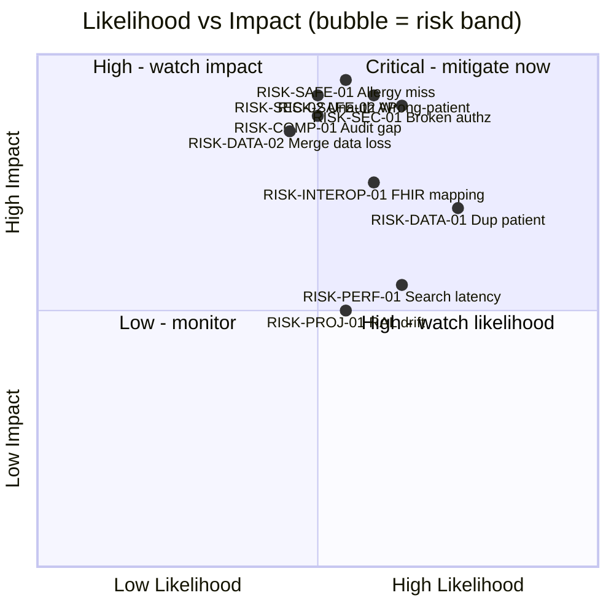

# Risk Register

> **Purpose.** A living, scored inventory of the risks that threaten patient
> safety, data integrity, security/PHI, interoperability, performance, compliance,
> and delivery for the system under test (SUT) — reverse-engineered from the
> **OpenMRS Reference Application** (legacy O2 RefApp, `o2.openmrs.org`; modern
> demo O3 at `o3.openmrs.org`) and generalized so the same register applies across
> **OpenEMR, HAPI FHIR, SMART Health IT**, and the in-house **omiiCARE** app via
> the **Resource Adapter Layer (RAL)**.
>
> **Scope.** This register quantifies *what could go wrong*. It feeds the
> risk-based test prioritization in [RISK_ANALYSIS.md](../RISK_ANALYSIS.md), the
> [MASTER_TEST_PLAN.md](../MASTER_TEST_PLAN.md), and overlays coverage tracked in
> the [RTM.md](../RTM.md). Each risk links to the functional requirement IDs
> (`REQ-<PREFIX>-NNN`, 472 total) and the manual test cases (1,349 total) that
> exercise the relevant control.
>
> **Provenance convention.** Facts grounded in verified OpenMRS RefApp behavior
> are stated plainly. Any threshold, probability estimate, mitigation design, or
> control beyond observed behavior is tagged **(Assumption)** — a portfolio design
> decision, tunable per deployment.

---

## 1. How This Register Works

### 1.1 Scoring model

Each risk is scored on two 1–5 axes, multiplied into an **exposure score**
(`Likelihood × Impact`, range 1–25). The score drives the priority band and the
testing depth applied.

| Axis | 1 | 2 | 3 | 4 | 5 |
|------|---|---|---|---|---|
| **Likelihood** | Rare | Unlikely | Possible | Likely | Almost certain |
| **Impact** | Negligible | Minor | Moderate | Major | Catastrophic (patient harm / breach) |

| Exposure (L×I) | Band | Response | Test depth |
|----------------|------|----------|------------|
| 20–25 | **Critical** | Mitigate now; release blocker | Exhaustive + adversarial + negative |
| 12–19 | **High** | Mitigate before GA; track weekly | Deep functional + boundary + security |
| 6–11 | **Medium** | Mitigate or accept with sign-off | Standard functional + key negatives |
| 1–5 | **Low** | Monitor; accept | Smoke / regression only |

### 1.2 Risk ID convention

`RISK-<CAT>-NN` where `<CAT>` ∈ { `SAFE` (clinical/patient-safety), `SEC`
(security/PHI), `DATA` (data integrity), `INTEROP` (interoperability), `PERF`
(performance/availability), `COMP` (compliance/regulatory), `PROJ`
(project/delivery) }.

### 1.3 Ownership roles

| Owner code | Role |
|------------|------|
| CMO | Clinical Safety Officer / Chief Medical Informatics |
| SEC | Security / PHI Lead |
| DBA | Data Architect / DBA |
| INT | Integration / Interop Engineer |
| SRE | Site Reliability / Performance Lead |
| DPO | Compliance / Data Protection Officer |
| PM | Delivery / Project Manager |
| QA | QA Architect (test-coverage owner for every risk) |

---

## 2. Risk Heat Map

---

## 3. Risk Register — Summary Matrix

| ID | Category | Risk (short) | L | I | Score | Band | Owner |
|----|----------|--------------|---|---|-------|------|-------|
| RISK-SAFE-01 | Clinical/Safety | Allergy/interaction not surfaced at order | 3 | 5 | 15 | High | CMO |
| RISK-SAFE-02 | Clinical/Safety | Wrong-patient action (context confusion) | 3 | 5 | 15 | High | CMO |
| RISK-SAFE-03 | Clinical/Safety | Vitals unit/range mis-capture | 3 | 4 | 12 | High | CMO |
| RISK-SAFE-04 | Clinical/Safety | Deceased / inactive patient still orderable | 2 | 5 | 10 | Medium | CMO |
| RISK-SAFE-05 | Clinical/Safety | Birthdate estimation skews age-based dosing | 3 | 4 | 12 | High | CMO |
| RISK-SEC-01 | Security/PHI | Broken RBAC / privilege escalation | 4 | 5 | 20 | Critical | SEC |
| RISK-SEC-02 | Security/PHI | Unauthenticated REST/FHIR access | 3 | 5 | 15 | High | SEC |
| RISK-SEC-03 | Security/PHI | Session/location spoofing & fixation | 3 | 4 | 12 | High | SEC |
| RISK-SEC-04 | Security/PHI | PHI in logs / URLs / error messages | 4 | 4 | 16 | High | SEC |
| RISK-SEC-05 | Security/PHI | Injection (SQLi/XSS) in patient fields | 3 | 5 | 15 | High | SEC |
| RISK-SEC-06 | Security/PHI | TLS misconfig / data-in-transit exposure | 2 | 5 | 10 | Medium | SEC |
| RISK-DATA-01 | Data Integrity | Duplicate patient records | 4 | 4 | 16 | High | DBA |
| RISK-DATA-02 | Data Integrity | Visit/encounter merge data loss | 3 | 5 | 15 | High | DBA |
| RISK-DATA-03 | Data Integrity | Patient ID collision / non-uniqueness | 2 | 5 | 10 | Medium | DBA |
| RISK-DATA-04 | Data Integrity | Orphaned obs after delete | 3 | 4 | 12 | High | DBA |
| RISK-DATA-05 | Data Integrity | Timezone / timestamp drift on encounters | 3 | 3 | 9 | Medium | DBA |
| RISK-INTEROP-01 | Interoperability | FHIR R4 field/coding mis-mapping | 3 | 4 | 12 | High | INT |
| RISK-INTEROP-02 | Interoperability | HL7 v2 ADT/ORU parse/segment errors | 3 | 4 | 12 | High | INT |
| RISK-INTEROP-03 | Interoperability | Code-system URI / version mismatch | 3 | 4 | 12 | High | INT |
| RISK-INTEROP-04 | Interoperability | RAL adapter behavioral divergence | 4 | 3 | 12 | High | INT |
| RISK-PERF-01 | Performance | Patient search latency at scale | 4 | 3 | 12 | High | SRE |
| RISK-PERF-02 | Performance | Active Visits / dashboard N+1 load | 3 | 3 | 9 | Medium | SRE |
| RISK-PERF-03 | Performance | Report generation resource exhaustion | 3 | 3 | 9 | Medium | SRE |
| RISK-PERF-04 | Performance | Availability / single-point DB failure | 2 | 5 | 10 | Medium | SRE |
| RISK-COMP-01 | Compliance | Incomplete HIPAA audit trail | 3 | 5 | 15 | High | DPO |
| RISK-COMP-02 | Compliance | Consent not enforced before disclosure | 3 | 4 | 12 | High | DPO |
| RISK-COMP-03 | Compliance | Data retention / right-to-erasure gaps | 2 | 4 | 8 | Medium | DPO |
| RISK-PROJ-01 | Project | RAL spec drift across 5 target systems | 3 | 3 | 9 | Medium | PM |
| RISK-PROJ-02 | Project | Test-data realism gap masks defects | 3 | 3 | 9 | Medium | QA |
| RISK-PROJ-03 | Project | Demo-build coupling (O2 vs O3) regressions | 3 | 2 | 6 | Medium | PM |

> 30 risks registered (≥25 required). Detailed cards follow.

---

## 4. Clinical / Patient-Safety Risks

### RISK-SAFE-01 — Allergy / interaction not surfaced at order time
| Field | Value |
|-------|-------|
| **Category** | Clinical / Patient Safety |
| **Description** | A clinician places a drug order while the patient's Allergies widget data (or a drug–drug interaction) is not surfaced as a blocking alert, leading to administration of a contraindicated medication. OpenMRS surfaces an Allergies widget on the patient dashboard, but order-entry alerting depends on configuration. **(Assumption)** interaction checking is not guaranteed in the RefApp. |
| **Likelihood / Impact / Score** | 3 / 5 / **15 (High)** |
| **Mitigation** | Mandatory pre-order allergy reconciliation check; alert must be acknowledged (hard-stop for severity = high); test that an unsaved/missing allergy list blocks high-risk orders; verify allergy code (RxNorm/SNOMED) drives the match, not free text. |
| **Owner** | CMO |
| **Linked requirements** | REQ-CLIN-* (allergies), REQ-PHARM-* (drug orders), REQ-ORDLAB-* |
| **Linked test areas** | Allergy reconciliation, order-entry alerting, negative path (no allergy data), severity escalation, AllergyIntolerance FHIR mapping |

### RISK-SAFE-02 — Wrong-patient action from context confusion
| Field | Value |
|-------|-------|
| **Category** | Clinical / Patient Safety |
| **Description** | Action (vitals, order, note) is recorded against the wrong patient because the active patient context was stale, a second tab was open, or search returned an ambiguous match. The dashboard shows name/age/DOB/Patient ID — but distraction or near-duplicate names enable mis-selection. |
| **Likelihood / Impact / Score** | 3 / 5 / **15 (High)** |
| **Mitigation** | Persistent patient banner with ID + DOB on every write screen; confirm-patient interstitial before first write in a session; multi-tab context isolation **(Assumption)**; search results show DOB + ID + photo to disambiguate. |
| **Owner** | CMO |
| **Linked requirements** | REQ-SRCH-*, REQ-PDASH-*, REQ-VITAL-*, REQ-CLIN-* |
| **Linked test areas** | Patient banner persistence, context-switch isolation, near-duplicate search, confirm-patient gate |

### RISK-SAFE-03 — Vitals unit / range mis-capture
| Field | Value |
|-------|-------|
| **Category** | Clinical / Patient Safety |
| **Description** | Capture Vitals accepts a physiologically impossible or wrong-unit value (e.g., temp in °F stored as °C, weight in lb vs kg) with no range guard, corrupting trends (weight graph) and downstream age/weight-based dosing. |
| **Likelihood / Impact / Score** | 3 / 4 / **12 (High)** |
| **Mitigation** | Server-side absolute-range and critical-range validation per concept (LOINC); explicit unit binding per field; warn on out-of-range, hard-block on impossible; round-trip test °F/°C and kg/lb. |
| **Owner** | CMO |
| **Linked requirements** | REQ-VITAL-*, REQ-CLIN-* |
| **Linked test areas** | Vitals boundary/equivalence, unit conversion, impossible-value rejection, weight-graph trend integrity |

### RISK-SAFE-04 — Deceased / inactive patient still orderable
| Field | Value |
|-------|-------|
| **Category** | Clinical / Patient Safety |
| **Description** | After "Mark Patient Deceased" or patient deactivation, the system still permits Start Visit / order / appointment, producing clinically invalid records. |
| **Likelihood / Impact / Score** | 2 / 5 / **10 (Medium)** |
| **Mitigation** | Deceased/inactive flag gates write actions; UI hides/disables Start Visit & order actions; API rejects writes with 409/422; test resurrection (un-mark) restores actions correctly. |
| **Owner** | CMO |
| **Linked requirements** | REQ-PDASH-* (Mark Deceased), REQ-VISIT-*, REQ-APPT-* |
| **Linked test areas** | Deceased gating (UI + API), state-transition tests, audit of deceased flag |

### RISK-SAFE-05 — Estimated birthdate skews age-based dosing
| Field | Value |
|-------|-------|
| **Category** | Clinical / Patient Safety |
| **Description** | Registration allows estimated birthdate. If the "estimated" flag is lost downstream, age-based decisions (pediatric dosing, screening eligibility) treat an approximate age as exact. |
| **Likelihood / Impact / Score** | 3 / 4 / **12 (High)** |
| **Mitigation** | Persist `birthdateEstimated` through all layers incl. FHIR; display "~" age qualifier on banner; **(Assumption)** flag age-based clinical rules when birthdate is estimated. |
| **Owner** | CMO |
| **Linked requirements** | REQ-REG-* (birthdate exact/estimated), REQ-FHIR-* (Patient.birthDate) |
| **Linked test areas** | Estimated-flag persistence, FHIR Patient birthDate precision, age display qualifier |

---

## 5. Security / PHI Risks

### RISK-SEC-01 — Broken RBAC / privilege escalation
| Field | Value |
|-------|-------|
| **Category** | Security / PHI |
| **Description** | A user reaches an app/action beyond their role (e.g., Registration Clerk performing Delete Patient, or Nurse managing roles) via direct URL, missing server-side check, or mis-assigned privilege. OWASP A01 Broken Access Control. |
| **Likelihood / Impact / Score** | 4 / 5 / **20 (Critical)** |
| **Mitigation** | Enforce privilege checks server-side on every endpoint (not just UI hiding); forced-browse tests per role × action from the RBAC matrix; deny-by-default; periodic privilege-assignment audit. |
| **Owner** | SEC |
| **Linked requirements** | REQ-RBAC-*, REQ-SEC-*, REQ-AUTH-* |
| **Linked test areas** | Role×action matrix (RBAC_MATRIX), forced-browse, horizontal/vertical escalation, UI-vs-API authz parity |

### RISK-SEC-02 — Unauthenticated REST / FHIR access
| Field | Value |
|-------|-------|
| **Category** | Security / PHI |
| **Description** | A `/ws/rest/v1/*` or `/ws/fhir2/R4` resource returns PHI without valid Basic/OAuth credentials due to a mis-secured endpoint. Verified baseline: unauthorized → 401. A regression that drops the guard exposes patient data. |
| **Likelihood / Impact / Score** | 3 / 5 / **15 (High)** |
| **Mitigation** | Automated auth-required test across every REST + FHIR resource; verify 401 on missing/invalid/expired token; confirm `metadata`/CapabilityStatement does not leak record data; CORS allow-list review. |
| **Owner** | SEC |
| **Linked requirements** | REQ-FHIR-*, REQ-SEC-*, REQ-AUTH-* |
| **Linked test areas** | Auth-required sweep (REST + FHIR R4), token expiry, 401 negative tests, CORS |

### RISK-SEC-03 — Session / location spoofing & fixation
| Field | Value |
|-------|-------|
| **Category** | Security / PHI |
| **Description** | Login binds a session location (Outpatient, Pharmacy, Lab, etc.). If the session token is fixated, not rotated on login, or location can be changed without re-authorization, records get attributed to the wrong location/clinic. |
| **Likelihood / Impact / Score** | 3 / 4 / **12 (High)** |
| **Mitigation** | Rotate session ID on login; `HttpOnly`/`Secure`/`SameSite` cookies; server validates location privilege per request; idle + absolute session timeout; test fixation & post-logout token reuse. |
| **Owner** | SEC |
| **Linked requirements** | REQ-AUTH-*, REQ-SEC-* |
| **Linked test areas** | Session lifecycle, location binding, cookie flags, logout invalidation |

### RISK-SEC-04 — PHI in logs / URLs / error messages
| Field | Value |
|-------|-------|
| **Category** | Security / PHI |
| **Description** | Patient identifiers/names appear in query strings, stack traces, or application logs, leaking PHI to log aggregators, browser history, and referer headers. OWASP A09 logging failures. |
| **Likelihood / Impact / Score** | 4 / 4 / **16 (High)** |
| **Mitigation** | No PHI in URL query params (use POST/body or opaque IDs); structured logging with PHI redaction; generic error pages; scan logs in CI for identifier patterns. |
| **Owner** | SEC |
| **Linked requirements** | REQ-SEC-*, REQ-COMP-* |
| **Linked test areas** | Log-redaction scan, error-page content, URL/referer leakage |

### RISK-SEC-05 — Injection (SQLi / XSS) in patient fields
| Field | Value |
|-------|-------|
| **Category** | Security / PHI |
| **Description** | Free-text fields (Name, Address, Phone, notes) accept and reflect/persist malicious payloads, enabling stored XSS on the dashboard or SQL injection in search. OWASP A03. |
| **Likelihood / Impact / Score** | 3 / 5 / **15 (High)** |
| **Mitigation** | Parameterized queries; context-aware output encoding on dashboard widgets; input allow-listing for structured fields; automated XSS/SQLi payload suite on registration + search. |
| **Owner** | SEC |
| **Linked requirements** | REQ-REG-*, REQ-SRCH-*, REQ-SEC-* |
| **Linked test areas** | XSS (stored/reflected), SQLi on search, payload fuzzing of registration wizard |

### RISK-SEC-06 — TLS misconfiguration / data-in-transit exposure
| Field | Value |
|-------|-------|
| **Category** | Security / PHI |
| **Description** | Weak TLS version/cipher, missing HSTS, or mixed content exposes PHI in transit between client, REST/FHIR APIs, and HL7 interfaces. |
| **Likelihood / Impact / Score** | 2 / 5 / **10 (Medium)** |
| **Mitigation** | TLS 1.2+ only, strong cipher suites, HSTS; mTLS for HL7/interface channels **(Assumption)**; periodic SSL Labs / testssl scan in CI. |
| **Owner** | SEC |
| **Linked requirements** | REQ-SEC-*, REQ-HL7-*, REQ-FHIR-* |
| **Linked test areas** | TLS/cipher scan, HSTS, mixed-content, interface-channel encryption |

---

## 6. Data Integrity Risks

### RISK-DATA-01 — Duplicate patient records
| Field | Value |
|-------|-------|
| **Category** | Data Integrity |
| **Description** | Registration creates a second record for an existing patient because no duplicate-detection prompt fires on matching name/DOB/identifier, fragmenting the clinical history. |
| **Likelihood / Impact / Score** | 4 / 4 / **16 (High)** |
| **Mitigation** | Pre-save potential-duplicate search on name+DOB+gender; surface candidates before Confirm (#submit); **(Assumption)** configurable matching threshold; downstream merge workflow. |
| **Owner** | DBA |
| **Linked requirements** | REQ-REG-*, REQ-SRCH-*, REQ-DATA-* |
| **Linked test areas** | Duplicate detection on registration, fuzzy match, identifier reuse |

### RISK-DATA-02 — Visit / encounter merge data loss
| Field | Value |
|-------|-------|
| **Category** | Data Integrity |
| **Description** | "Merge Visits" or patient merge silently drops observations, orders, or encounters, or mis-attributes them, losing clinical data irretrievably. |
| **Likelihood / Impact / Score** | 3 / 5 / **15 (High)** |
| **Mitigation** | Pre/post-merge record-count reconciliation; transactional merge with rollback; preview diff before commit; full audit of merged-from/merged-into; test obs/order/encounter survival counts. |
| **Owner** | DBA |
| **Linked requirements** | REQ-PDASH-* (Merge Visits), REQ-VISIT-*, REQ-DATA-* |
| **Linked test areas** | Merge reconciliation, rollback on failure, audit completeness |

### RISK-DATA-03 — Patient ID collision / non-uniqueness
| Field | Value |
|-------|-------|
| **Category** | Data Integrity |
| **Description** | The auto-generated unique Patient ID collides or repeats under concurrency, breaking record identity. |
| **Likelihood / Impact / Score** | 2 / 5 / **10 (Medium)** |
| **Mitigation** | DB unique constraint + check-digit validation; concurrency/load test on registration ID issuance; verify ID format & uniqueness across RAL targets. |
| **Owner** | DBA |
| **Linked requirements** | REQ-REG-*, REQ-DATA-* |
| **Linked test areas** | Concurrent registration, ID uniqueness, check-digit |

### RISK-DATA-04 — Orphaned observations after delete
| Field | Value |
|-------|-------|
| **Category** | Data Integrity |
| **Description** | "Delete Patient" leaves dangling obs/encounter/visit rows (or voids inconsistently), causing referential-integrity errors and ghost data in reports. |
| **Likelihood / Impact / Score** | 3 / 4 / **12 (High)** |
| **Mitigation** | Void-not-delete semantics with cascade; referential-integrity tests post-delete; verify reports exclude voided data; confirm FHIR queries don't surface deleted patients. |
| **Owner** | DBA |
| **Linked requirements** | REQ-PDASH-* (Delete Patient), REQ-DATA-*, REQ-RPT-* |
| **Linked test areas** | Cascade/void integrity, report exclusion, FHIR visibility post-delete |

### RISK-DATA-05 — Timezone / timestamp drift on encounters
| Field | Value |
|-------|-------|
| **Category** | Data Integrity |
| **Description** | Encounter/obs datetimes stored in inconsistent timezones (server vs client vs location) misorder the clinical timeline and break "Add Past Visit" dating. |
| **Likelihood / Impact / Score** | 3 / 3 / **9 (Medium)** |
| **Mitigation** | Store UTC, render in location/user TZ; explicit TZ on FHIR `dateTime`; test cross-TZ ordering and DST boundaries; validate Add Past Visit cannot post-date future. |
| **Owner** | DBA |
| **Linked requirements** | REQ-VISIT-* (Add Past Visit), REQ-DATA-*, REQ-FHIR-* |
| **Linked test areas** | TZ/DST handling, timeline ordering, future-date guard |

---

## 7. Interoperability Risks

### RISK-INTEROP-01 — FHIR R4 field / coding mis-mapping
| Field | Value |
|-------|-------|
| **Category** | Interoperability |
| **Description** | Internal model maps incorrectly to FHIR R4 resources (Patient, Encounter, Observation, Condition, AllergyIntolerance, MedicationRequest) — wrong cardinality, dropped fields, or invalid references — so external consumers get wrong/incomplete data. CapabilityStatement declares fhirVersion 4.0.1. |
| **Likelihood / Impact / Score** | 3 / 4 / **12 (High)** |
| **Mitigation** | FHIR validator against R4 profiles in CI; round-trip read-after-write equivalence; contract tests per resource; verify CapabilityStatement matches actually-served resources. |
| **Owner** | INT |
| **Linked requirements** | REQ-FHIR-*, REQ-CLIN-*, REQ-INTEROP-* |
| **Linked test areas** | FHIR R4 resource validation, round-trip, CapabilityStatement parity |

### RISK-INTEROP-02 — HL7 v2 ADT/ORU parse & segment errors
| Field | Value |
|-------|-------|
| **Category** | Interoperability |
| **Description** | Inbound/outbound HL7 v2 messages (ADT admit/transfer, ORM orders, ORU results) fail on segment order, missing required fields, encoding chars, or MSH version mismatch, dropping or corrupting messages. |
| **Likelihood / Impact / Score** | 3 / 4 / **12 (High)** |
| **Mitigation** | Conformance profiles per message type; ACK/NACK handling and retry; malformed-message negative suite; encoding/escape-char tests; dead-letter queue with alerting. |
| **Owner** | INT |
| **Linked requirements** | REQ-HL7-*, REQ-ORDLAB-*, REQ-INTEROP-* |
| **Linked test areas** | HL7 ADT/ORM/ORU parsing, ACK/NACK, malformed-message handling |

### RISK-INTEROP-03 — Code-system URI / version mismatch
| Field | Value |
|-------|-------|
| **Category** | Interoperability |
| **Description** | Coded data uses wrong/ambiguous code-system URI or version (ICD-10 vs SNOMED vs LOINC), so a code is misinterpreted by the receiver — a clinical-safety-adjacent interop defect. |
| **Likelihood / Impact / Score** | 3 / 4 / **12 (High)** |
| **Mitigation** | Canonical code-system URI registry; validate `system` + `code` + `version` on every Coding; terminology-server check **(Assumption)**; test ICD-10/SNOMED/LOINC bindings per concept. |
| **Owner** | INT |
| **Linked requirements** | REQ-CLIN-*, REQ-FHIR-*, REQ-INTEROP-* |
| **Linked test areas** | Coding system URI correctness, version pinning, terminology binding |

### RISK-INTEROP-04 — RAL adapter behavioral divergence
| Field | Value |
|-------|-------|
| **Category** | Interoperability |
| **Description** | The Resource Adapter Layer yields different behavior across OpenMRS, OpenEMR, HAPI FHIR, SMART Health IT, and omiiCARE (e.g., search semantics, identifier format, error codes), so tests pass on one target and fail on another. |
| **Likelihood / Impact / Score** | 4 / 3 / **12 (High)** |
| **Mitigation** | Shared contract test pack run against every adapter; capability matrix declaring supported operations per target; normalize error codes at RAL boundary; tag target-specific known gaps. |
| **Owner** | INT |
| **Linked requirements** | REQ-INTEROP-*, REQ-FHIR-*, REQ-DATA-* |
| **Linked test areas** | Cross-adapter contract suite, capability matrix, error normalization |

---

## 8. Performance / Availability Risks

### RISK-PERF-01 — Patient search latency at scale
| Field | Value |
|-------|-------|
| **Category** | Performance |
| **Description** | Find Patient Record search degrades on a large patient population (unindexed name/identifier search), slowing clinical workflow and risking timeouts. |
| **Likelihood / Impact / Score** | 4 / 3 / **12 (High)** |
| **Mitigation** | Indexed/typeahead search; pagination; load test at target population sizes; p95 latency SLO **(Assumption: <2s p95)**; query-plan review. |
| **Owner** | SRE |
| **Linked requirements** | REQ-SRCH-*, REQ-PERF-* |
| **Linked test areas** | Search load/latency, pagination, index verification |

### RISK-PERF-02 — Active Visits / dashboard N+1 load
| Field | Value |
|-------|-------|
| **Category** | Performance |
| **Description** | Patient dashboard widgets (Diagnoses, Vitals, Recent Visits, etc.) and Active Visits issue per-row queries (N+1), spiking DB load under concurrent clinic use. |
| **Likelihood / Impact / Score** | 3 / 3 / **9 (Medium)** |
| **Mitigation** | Batch/eager-load widget data; cache stable metadata; dashboard-load profiling under concurrency; lazy-load below-fold widgets. |
| **Owner** | SRE |
| **Linked requirements** | REQ-PDASH-*, REQ-VISIT-*, REQ-PERF-* |
| **Linked test areas** | Dashboard load profiling, N+1 detection, concurrency |

### RISK-PERF-03 — Report generation resource exhaustion
| Field | Value |
|-------|-------|
| **Category** | Performance |
| **Description** | Large Reports / Data Management exports run unbounded queries, exhausting memory/CPU and degrading the whole instance for clinical users. |
| **Likelihood / Impact / Score** | 3 / 3 / **9 (Medium)** |
| **Mitigation** | Async report jobs off the request thread; row/time limits; resource quotas; isolate reporting from OLTP **(Assumption: read replica)**. |
| **Owner** | SRE |
| **Linked requirements** | REQ-RPT-*, REQ-DATA-*, REQ-PERF-* |
| **Linked test areas** | Report load test, async job handling, resource quotas |

### RISK-PERF-04 — Availability / single-point DB failure
| Field | Value |
|-------|-------|
| **Category** | Performance / Availability |
| **Description** | A single DB/app node failure takes the EMR offline during clinical hours, blocking patient care. |
| **Likelihood / Impact / Score** | 2 / 5 / **10 (Medium)** |
| **Mitigation** | HA DB (replication/failover) and app redundancy **(Assumption)**; health checks; tested backup/restore RTO/RPO; graceful-degradation read-only mode. |
| **Owner** | SRE |
| **Linked requirements** | REQ-PERF-*, REQ-DATA-* |
| **Linked test areas** | Failover drill, backup/restore, health-check, degradation mode |

---

## 9. Compliance / Regulatory Risks

### RISK-COMP-01 — Incomplete HIPAA audit trail
| Field | Value |
|-------|-------|
| **Category** | Compliance |
| **Description** | PHI access/modification events (view patient, edit registration, merge, delete, order) are not logged with who/what/when, failing HIPAA audit-control requirements and breaking breach forensics. |
| **Likelihood / Impact / Score** | 3 / 5 / **15 (High)** |
| **Mitigation** | Mandatory audit log on every PHI read/write incl. API; immutable, time-synced log store; coverage test mapping each PHI action to an audit entry; periodic audit-log review. |
| **Owner** | DPO |
| **Linked requirements** | REQ-COMP-*, REQ-SEC-*, REQ-PDASH-* |
| **Linked test areas** | Audit-log coverage per PHI action (UI + API), immutability, completeness |

### RISK-COMP-02 — Consent not enforced before disclosure
| Field | Value |
|-------|-------|
| **Category** | Compliance |
| **Description** | Records are viewed/shared (including via FHIR export) without checking patient consent/restriction flags, breaching disclosure rules. |
| **Likelihood / Impact / Score** | 3 / 4 / **12 (High)** |
| **Mitigation** | Consent/restriction check at the access boundary incl. API/FHIR; deny + audit on missing consent **(Assumption: consent model)**; test restricted-record access denial. |
| **Owner** | DPO |
| **Linked requirements** | REQ-COMP-*, REQ-FHIR-*, REQ-SEC-* |
| **Linked test areas** | Consent enforcement (UI + FHIR), restricted-record denial, break-glass audit |

### RISK-COMP-03 — Data retention / right-to-erasure gaps
| Field | Value |
|-------|-------|
| **Category** | Compliance |
| **Description** | No enforced retention schedule or erasure/anonymization workflow, conflicting with GDPR/data-protection obligations while preserving clinical/legal-hold needs. |
| **Likelihood / Impact / Score** | 2 / 4 / **8 (Medium)** |
| **Mitigation** | Retention policy with legal-hold override; anonymization workflow; test erasure leaves no residual PHI in logs/backups/search indexes **(Assumption)**. |
| **Owner** | DPO |
| **Linked requirements** | REQ-COMP-*, REQ-DATA-* |
| **Linked test areas** | Retention enforcement, erasure completeness, legal-hold override |

---

## 10. Project / Delivery Risks

### RISK-PROJ-01 — RAL spec drift across 5 target systems
| Field | Value |
|-------|-------|
| **Category** | Project |
| **Description** | The Resource Adapter Layer contract drifts as OpenMRS/OpenEMR/HAPI/SMART/omiiCARE evolve, so the test suite no longer reflects real behavior on every target. |
| **Likelihood / Impact / Score** | 3 / 3 / **9 (Medium)** |
| **Mitigation** | Versioned RAL contract; per-target conformance dashboard; scheduled re-baseline against each target's demo; deprecation policy. |
| **Owner** | PM |
| **Linked requirements** | REQ-INTEROP-*, REQ-DATA- * |
| **Linked test areas** | RAL contract versioning, per-target conformance |

### RISK-PROJ-02 — Test-data realism gap masks defects
| Field | Value |
|-------|-------|
| **Category** | Project |
| **Description** | Synthetic test data lacks the messiness of real records (near-duplicate names, estimated DOBs, multi-identifier patients), so defects in dedup/search/merge escape to production. |
| **Likelihood / Impact / Score** | 3 / 3 / **9 (Medium)** |
| **Mitigation** | Realistic synthetic data generator covering edge cases; align with TEST_DATA_STRATEGY; periodic refresh from anonymized profiles **(Assumption)**. |
| **Owner** | QA |
| **Linked requirements** | REQ-REG-*, REQ-SRCH-*, REQ-DATA-* |
| **Linked test areas** | Edge-case data coverage, dedup/merge with realistic data |

### RISK-PROJ-03 — Demo-build coupling (O2 vs O3) regressions
| Field | Value |
|-------|-------|
| **Category** | Project |
| **Description** | Tests written against legacy O2 RefApp selectors/flows (`#username`, `#loginButton`, location `<li>` ids, registrationapp wizard) break against O3 or a different deployment, eroding suite trust. |
| **Likelihood / Impact / Score** | 3 / 2 / **6 (Medium)** |
| **Mitigation** | Abstract locators behind page objects; tag tests by build (O2/O3); RAL/UI-adapter layer; smoke gate before full run; document version assumptions. |
| **Owner** | PM |
| **Linked requirements** | REQ-AUTH-*, REQ-REG-*, REQ-PDASH-* |
| **Linked test areas** | Page-object abstraction, build-tagged smoke, version compatibility |

---

## 11. Residual Risk & Acceptance

| ID | Residual after mitigation | Accept? | Sign-off |
|----|---------------------------|---------|----------|
| RISK-SEC-01 | Low — pending full forced-browse coverage | No (blocker) | SEC + QA |
| RISK-SAFE-01 | Medium — interaction checking config-dependent **(Assumption)** | Conditional | CMO |
| RISK-SAFE-02 | Low — after banner + confirm-patient gate | Yes | CMO |
| RISK-DATA-01 | Medium — threshold tuning ongoing | Yes w/ monitoring | DBA |
| RISK-COMP-01 | Low — after audit-coverage suite green | No (blocker) | DPO |
| RISK-INTEROP-04 | Medium — known per-target gaps documented | Yes | INT |
| RISK-PROJ-03 | Low — page objects absorb most drift | Yes | PM |

> Residual-risk acceptance is recorded per release; **Critical** band risks
> (RISK-SEC-01) and audit-trail completeness (RISK-COMP-01) are non-negotiable
> release blockers until residual reaches Low with sign-off.

## 12. Traceability & Maintenance

- Every risk links to `REQ-<PREFIX>-NNN` requirement IDs and the corresponding
  test areas; the [RTM.md](../RTM.md) reflects which of the 1,349 manual test
  cases cover each linked area.
- Risk-based depth (§1.1) feeds [RISK_ANALYSIS.md](../RISK_ANALYSIS.md) and the
  [MASTER_TEST_PLAN.md](../MASTER_TEST_PLAN.md) prioritization.
- **Review cadence (Assumption):** re-score every sprint; full re-baseline each
  release or when a RAL target's demo build changes.
- New defects of Critical/High severity must be back-mapped to (or raise) a risk
  in this register.
