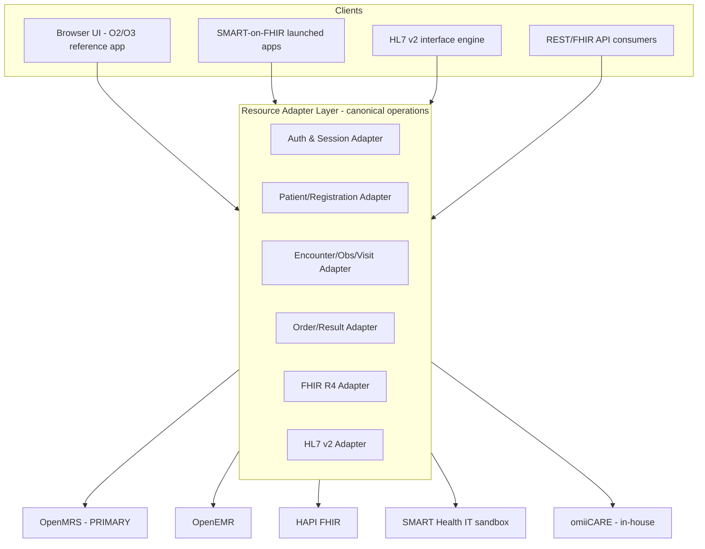
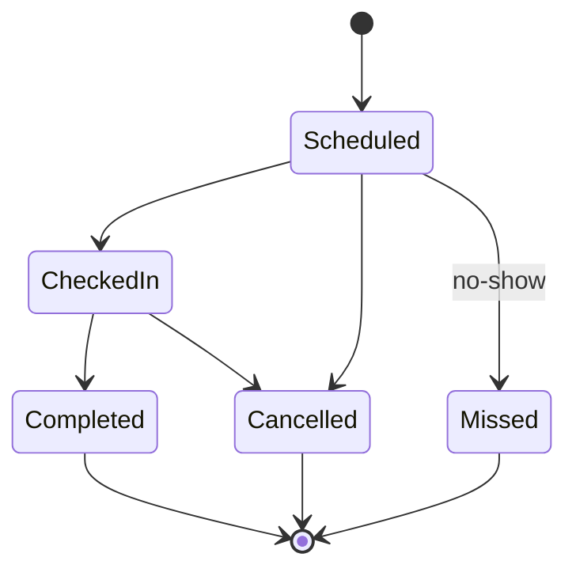

# Software Requirements Specification (SRS)
## OpenMRS-Primary Healthcare QA Reference Platform

> **Standard:** IEEE Std 830-1998 (Recommended Practice for Software Requirements Specifications), adapted.
> **Primary reference system:** OpenMRS Reference Application (legacy O2, https://o2.openmrs.org; modern demo O3 at o3.openmrs.org).
> **Portability targets:** OpenEMR, HAPI FHIR, SMART Health IT, and the in-house **omiiCARE** application via a **Resource Adapter Layer (RAL)**.
> **Document date:** 2026-07-01 · **Status:** Baseline 1.0 · **Audience:** QA, BA, Solution Architecture.
> **Traceability:** This SRS is the parent artifact for the 472-requirement catalog (`docs/requirements/requirements-catalog.md`) and the 1,349-case RTM (`docs/RTM.md`). Requirement IDs follow `REQ-<PREFIX>-NNN`.

---

## Table of Contents
1. [Introduction](#1-introduction)
2. [Overall Description](#2-overall-description)
3. [External Interface Requirements](#3-external-interface-requirements)
4. [System Features (Functional Requirements)](#4-system-features-functional-requirements)
5. [Nonfunctional Requirements](#5-nonfunctional-requirements)
6. [Other Requirements](#6-other-requirements)
7. [Appendices](#7-appendices)

---

## 1. Introduction

### 1.1 Purpose
This SRS specifies the functional and nonfunctional requirements for a **Healthcare QA Reference Platform** that is reverse-engineered from the OpenMRS Reference Application and engineered to be **vendor-portable** across multiple EHR/FHIR backends. It serves three concurrent audiences:

- **QA Engineers** — as the authoritative source against which the 472 requirements and 1,349 manual test cases are written and traced.
- **Business Analysts** — as a behavioral contract describing *what* the system does, independent of implementation.
- **Solution Architects** — as the boundary definition for the Resource Adapter Layer that abstracts backend EHRs.

The document deliberately separates *verified OpenMRS behavior* from *inferred/extended behavior*. Every statement that goes beyond observed OpenMRS facts is tagged **(Assumption)**.

### 1.2 Scope
**Product name:** Healthcare QA Reference Platform (HQRP).

The platform under specification provides clinical front-office and back-office capabilities for an ambulatory + inpatient care setting:

| In Scope | Out of Scope (this baseline) |
|---|---|
| Authentication with session location selection | Full revenue-cycle / claims adjudication |
| Patient registration, search, demographics | Insurance eligibility (270/271) real-time checks *(Assumption: future)* |
| Patient dashboard & longitudinal record | Imaging/PACS DICOM viewer |
| Visits & encounters | Genomics / research data warehouse |
| Vitals & clinical observations | Native mobile apps (web-responsive only) |
| Diagnoses, conditions, allergies | AI clinical decision support engines |
| Appointment scheduling | |
| Lab orders & results, pharmacy/medication | |
| RBAC, audit, security, accessibility | |
| FHIR R4 + HL7 v2 interoperability | |
| Reporting & data management | |

**Benefits / objectives:** demonstrate enterprise-grade QA coverage (security, accessibility, interoperability, performance) over a realistic open-source EHR, while proving a portable adapter architecture.

### 1.3 Definitions, Acronyms, and Abbreviations

| Term | Definition |
|---|---|
| **OpenMRS** | Open Medical Record System; primary reference EHR. |
| **O2 / O3** | OpenMRS Reference Application UI generations (legacy AngularJS/JSP "O2"; React micro-frontend "O3"). |
| **RAL** | Resource Adapter Layer — abstraction translating canonical operations to a specific backend (OpenMRS/OpenEMR/HAPI/SMART/omiiCARE). |
| **FHIR R4** | HL7 Fast Healthcare Interoperability Resources, release 4 (fhirVersion 4.0.1). |
| **HL7 v2** | HL7 version 2.x messaging (ADT, ORM, ORU). |
| **ADT / ORM / ORU** | Admit-Discharge-Transfer / Order message / Observation Result (HL7 v2 message types). |
| **Encounter** | A clinical interaction within a visit (vitals capture, consultation, etc.). |
| **Visit** | A container grouping encounters at a location over a time span. |
| **Obs** | Observation — a single coded/typed clinical data point. |
| **Concept** | OpenMRS dictionary entry backing questions/answers (coded by SNOMED/LOINC/etc.). |
| **RBAC** | Role-Based Access Control. |
| **PHI** | Protected Health Information. |
| **RTM** | Requirements Traceability Matrix. |
| **omiiCARE** | In-house target application served through the RAL. |
| **SMART** | SMART Health IT / SMART-on-FHIR app launch + sandbox. |
| **CapabilityStatement** | FHIR metadata resource describing server capabilities. |

### 1.4 References
- IEEE Std 830-1998.
- OpenMRS REST API: `/openmrs/ws/rest/v1/*`.
- OpenMRS FHIR R4 API: `/openmrs/ws/fhir2/R4`.
- HL7 FHIR R4 spec (4.0.1); HL7 v2.x; ICD-10, SNOMED CT, LOINC code systems.
- WCAG 2.1 AA; OWASP Top 10; HIPAA Security & Privacy Rules.
- Internal: `docs/requirements/requirements-catalog.md`, `docs/RTM.md`, `docs/FHIR_GUIDE.md`, `docs/HL7_GUIDE.md`.

### 1.5 Overview
Section 2 gives the product context and constraints; Section 3 the external interfaces; Section 4 the functional features (organized by requirement-ID module); Section 5 nonfunctional requirements; Section 6 other requirements (compliance, data, portability).

---

## 2. Overall Description

### 2.1 Product Perspective
HQRP is a **web-based EHR reference platform**. Architecturally it is a layered system in which all UI and integration flows route through the **Resource Adapter Layer**, allowing the same requirements and test cases to execute against multiple backends.

The reference behavior (selectors, screens, flows) is observed from OpenMRS; the RAL maps the canonical contract onto the others. **(Assumption:** OpenEMR/HAPI/SMART/omiiCARE adapters implement the same canonical operations but may degrade gracefully where a backend lacks a capability — e.g., HAPI FHIR has no registration *wizard*, so REG flows map to FHIR `Patient` create transactions.)

### 2.2 Product Functions (summary)
- Authenticate users and bind a **session location** (Outpatient Clinic, Inpatient Ward, Pharmacy, Laboratory, Registration Desk, Isolation Ward).
- Register, search, view, edit, merge, and deceased-mark patients.
- Start/record visits and encounters; capture vitals and observations.
- Record diagnoses, conditions, allergies; view longitudinal dashboard widgets.
- Schedule, reschedule, cancel appointments with a status state machine.
- Place lab orders, receive results; manage pharmacy/medication requests.
- Enforce RBAC; produce audit logs; run reports and data-management tasks.
- Expose REST + FHIR R4 APIs; exchange HL7 v2 ADT/ORM/ORU messages.

### 2.3 User Classes and Characteristics

| User Class | Frequency | Technical Skill | Key Privileges | Primary Requirement Modules |
|---|---|---|---|---|
| System Administrator | Low | High | Manage Roles, Configure Metadata, System Administration | RBAC, DATA, SEC |
| Doctor / Clinician | High | Medium | View/Edit Patients, place orders, diagnose | CLIN, ORDLAB, VISIT, PDASH |
| Nurse | High | Medium | Capture Vitals, manage visits, administer meds | VITAL, VISIT, PHARM |
| Registration Clerk | High | Low–Medium | Add/Edit Patients, schedule appointments | REG, SRCH, APPT |
| Pharmacist | Medium | Medium | Dispense, view medication requests | PHARM |
| Lab Technician | Medium | Medium | Fulfill orders, enter results | ORDLAB |
| Interop/Integration System | Continuous | N/A (machine) | API/FHIR/HL7 access | FHIR, HL7, SEC |
| Auditor / Compliance | Low | Medium | Read audit logs, reports | SEC, RPT, DATA |
| Patient *(Assumption: portal, future)* | Variable | Low | View own record via SMART app | TELE, NOTIF, FHIR |

### 2.4 Operating Environment
- **Server (OpenMRS reference):** Java/Tomcat application server, MySQL/MariaDB, OpenMRS platform + reference application modules.
- **Client:** Modern evergreen browsers (Chrome, Firefox, Edge, Safari); responsive layout; keyboard + screen-reader operable (WCAG 2.1 AA).
- **APIs:** REST at `/openmrs/ws/rest/v1/*`; FHIR R4 at `/openmrs/ws/fhir2/R4`; HTTPS expected in production *(Assumption)*.
- **Interop:** HL7 v2 over MLLP/TCP via an interface engine *(Assumption: engine bridges to RAL)*.
- **Portability backends:** OpenEMR (PHP/MySQL), HAPI FHIR (Java server), SMART Health IT sandbox, omiiCARE (in-house stack).

### 2.5 Design and Implementation Constraints
- Login requires **session location selection before credential entry**; locations rendered as `<li id="...">`; fields `#username`, `#password`, `#loginButton`. Demo credential: `admin / Admin123`.
- FHIR responses MUST report `fhirVersion = 4.0.1`; FHIR base path is `/openmrs/ws/fhir2/R4`.
- Coding constrained to ICD-10, SNOMED CT, LOINC where applicable.
- Backend differences MUST be isolated to the RAL; UI/test layers code against the canonical contract.

### 2.6 Assumptions and Dependencies
- **(Assumption)** All non-OpenMRS backends are reachable through the RAL with the same canonical operation set.
- **(Assumption)** HTTPS/TLS termination and a reverse proxy front the application in non-demo environments.
- Dependency: an HL7 interface engine and a FHIR-conformant server are available for INT modules.
- Dependency: identity provider for OAuth2/Basic auth on API surfaces.

---

## 3. External Interface Requirements

### 3.1 User Interfaces
- **Login screen:** location list (`<li id>`), `#username`, `#password`, `#loginButton`; invalid credentials → error, no session. (REQ-AUTH-*, REQ-A11Y-007/008)
- **Home dashboard:** app tiles — Find Patient Record (coreapps `findPatient`), Active Visits, Capture Vitals, Register a patient (`registrationapp`), Appointment Scheduling, Reports, Data Management, Configure Metadata, System Administration. Header exposes user menu, session location, and **Logout** in a collapsible navbar. (REQ-AUTH-*, REQ-SRCH-*, REQ-A11Y-005/006/012)
- **Registration wizard:** Demographics → Contact Info → Relationships → Confirm (`#submit`). (REQ-REG-*)
- **Patient dashboard:** header (name, gender, age, DOB, Patient ID) + widgets (Diagnoses, Latest Observations, Vitals, Recent Visits, Family, Conditions, Allergies, Attachments, Weight graph, Appointments) + General Actions. (REQ-PDASH-*)
- **Accessibility:** keyboard-operable, visible focus, landmarks, associated labels, live-region announcements, 200%/400% reflow. (REQ-A11Y-001…015)

### 3.2 Hardware Interfaces
None mandated beyond standard web client/server hardware. *(Assumption: clinical peripherals such as vitals monitors integrate via HL7 v2 ORU, not direct hardware drivers.)*

### 3.3 Software Interfaces

| Interface | Endpoint / Protocol | Auth | Notes |
|---|---|---|---|
| REST API | `/openmrs/ws/rest/v1/{session,patient,encounter,obs,visit,concept,relationship,...}` | Basic / OAuth | Unauthorized → **401** (REQ-SEC-*, REQ-FHIR-*) |
| FHIR R4 API | `/openmrs/ws/fhir2/R4` (`/metadata` → CapabilityStatement, fhirVersion 4.0.1) | Basic / OAuth | Resources: Patient, Encounter, Observation, Condition, AllergyIntolerance, MedicationRequest (REQ-FHIR-*) |
| HL7 v2 | ADT / ORM / ORU over MLLP | Interface engine | Registration ↔ ADT; orders ↔ ORM; results ↔ ORU (REQ-HL7-*) |
| RAL | Internal canonical contract | Service-to-service | Maps canonical ops → backend-specific calls |

### 3.4 Communications Interfaces
- HTTPS for UI and API *(Assumption in non-demo)*; JSON for REST/FHIR; XML/ER7 (pipe-delimited) for HL7 v2; MLLP framing for HL7 transport. Session via cookie/token; FHIR may use Bearer (SMART-on-FHIR). (REQ-SEC-*, REQ-FHIR-*, REQ-HL7-*)

---

## 4. System Features (Functional Requirements)

Each feature lists *Stimulus/Response* behavior and the requirement-ID range it traces to. Behaviors marked **(Assumption)** extend beyond verified OpenMRS facts.

### 4.1 Authentication & Session (REQ-AUTH-*, REQ-SEC-*)
- **SF-AUTH-1 Location-bound login:** User selects a session location, then enters credentials; on success a session is created and the home dashboard renders with the chosen location shown in the header.
- **SF-AUTH-2 Invalid credentials:** Wrong username/password yields an error and **no** session; API equivalent returns **401**.
- **SF-AUTH-3 Logout:** Logout (collapsible navbar) terminates the session and returns to login.
- **SF-AUTH-4 Session location switch** *(Assumption)*: a user may re-select location without full re-auth, subject to privilege.
- **Priority:** P1. **Risk:** High.

### 4.2 Patient Registration (REQ-REG-*)
- **SF-REG-1 Demographics:** capture given/middle/family Name, Gender, Birthdate (exact **or** estimated).
- **SF-REG-2 Contact info:** Address requires ≥1 field; Phone Number optional/typed.
- **SF-REG-3 Relationships:** optional relationship capture.
- **SF-REG-4 Confirm & save (`#submit`):** generates a **unique Patient ID**, redirects to the patient dashboard, and shows a **"Created Patient Record"** toast.
- **SF-REG-5 Validation:** required-field and birthdate validation block save; errors are programmatically associated (REQ-A11Y-008).
- **Priority:** P1. **Risk:** High.

### 4.3 Patient Search (REQ-SRCH-*)
- **SF-SRCH-1 Find Patient Record:** search by name/ID returns matching patients; selecting one opens the dashboard.
- **SF-SRCH-2 No-match / partial:** graceful empty-state; no PHI leakage in error text (REQ-SEC-*).
- **Priority:** P1. **Risk:** Medium–High.

### 4.4 Patient Dashboard (REQ-PDASH-*)
- **SF-PDASH-1** render identity header and all widgets.
- **SF-PDASH-2 General Actions:** Start Visit, Add Past Visit, Merge Visits, Schedule Appointment, Request Appointment, Mark Patient Deceased, Edit Registration Information, Delete Patient, Attachments — each gated by privilege (REQ-RBAC-*).
- **Priority:** P1. **Risk:** High (destructive actions: Delete, Merge, Deceased).

### 4.5 Visits & Encounters (REQ-VISIT-*)
- **SF-VISIT-1 Start Visit / Add Past Visit** at the session location.
- **SF-VISIT-2 Merge Visits** consolidates overlapping visits *(Assumption: conflict rules enforced)*.
- **SF-VISIT-3** encounters attach to the active visit; HL7 ADT maps admit/transfer/discharge (REQ-HL7-*).
- **Priority:** P1. **Risk:** High.

### 4.6 Vitals & Observations (REQ-VITAL-*, REQ-CLIN-*)
- **SF-VITAL-1 Capture Vitals** creates an encounter with coded obs (LOINC); values validated against ranges.
- **SF-VITAL-2** vitals surface on the dashboard Vitals/Latest Observations/Weight graph widgets.
- **SF-CLIN-1 Diagnoses/Conditions/Allergies** recorded with ICD-10/SNOMED coding; AllergyIntolerance exposed via FHIR.
- **Priority:** P1. **Risk:** High (clinical correctness).

### 4.7 Appointment Scheduling (REQ-APPT-*)
- **SF-APPT-1 Book:** valid patient + provider + service + location + **future** slot.
- **SF-APPT-2 Past-slot block** (REQ-APPT-003) and **double-booking/conflict block** (REQ-APPT-004).
- **SF-APPT-3 Reschedule / Cancel** with reason capture and slot release (REQ-APPT-006/007).
- **SF-APPT-4 State machine:** Scheduled → CheckedIn → Completed; plus Cancelled / Missed (no-show auto-flag) (REQ-APPT-008/009).

- **Priority:** P1. **Risk:** High.

### 4.8 Lab Orders & Results (REQ-ORDLAB-*)
- **SF-ORDLAB-1 Place order** (LOINC-coded) → HL7 **ORM**; **SF-ORDLAB-2 Receive result** via HL7 **ORU** → Observation; surfaced on dashboard.
- **Priority:** P1–P2. **Risk:** High.

### 4.9 Pharmacy / Medication (REQ-PHARM-*)
- **SF-PHARM-1 MedicationRequest** authored by clinician; **SF-PHARM-2 dispense** by pharmacist; FHIR `MedicationRequest` exposed.
- **Priority:** P1. **Risk:** High.

### 4.10 RBAC (REQ-RBAC-*)
- **SF-RBAC-1** privileges (Add/Edit/Delete Patients, Manage Roles, etc.) gate apps and actions; UI hides and API denies (**403/401**) unauthorized operations.
- **SF-RBAC-2** role assignment limited to System Administrator.
- **Priority:** P1. **Risk:** Critical.

### 4.11 Reporting & Data Management (REQ-RPT-*, REQ-DATA-*)
- **SF-RPT-1** run/export reports; **SF-DATA-1** data-management/admin tasks (merge, metadata config) audited.
- **Priority:** P2. **Risk:** Medium.

### 4.12 Interoperability — FHIR (REQ-FHIR-*)
- **SF-FHIR-1** `/metadata` returns a CapabilityStatement with `fhirVersion 4.0.1`.
- **SF-FHIR-2** CRUD/search on Patient, Encounter, Observation, Condition, AllergyIntolerance, MedicationRequest; unauthorized → **401**.
- **Priority:** P1. **Risk:** High.

### 4.13 Interoperability — HL7 v2 (REQ-HL7-*)
- **SF-HL7-1** inbound ADT (A01/A04/A08…) creates/updates patients & visits; **SF-HL7-2** ORM→orders, ORU→results; ACK semantics enforced *(Assumption)*.
- **Priority:** P1. **Risk:** High.

### 4.14 Cross-cutting: Security, Accessibility, Performance, Notifications, Billing, Telehealth
- **REQ-SEC-*** OWASP Top 10, auth, audit logging, PHI minimization.
- **REQ-A11Y-*** WCAG 2.1 AA (see 3.1).
- **REQ-PERF-*** responsiveness/throughput (see §5).
- **REQ-NOTIF-*** appointment reminders respecting consent & minimum-necessary PHI (REQ-APPT-010).
- **REQ-BILL-*** *(Assumption: charge capture, future baseline)*.
- **REQ-TELE-*** *(Assumption: telehealth visit type, future baseline)*.

---

## 5. Nonfunctional Requirements

### 5.1 Performance (REQ-PERF-*)
| Metric | Target *(Assumption unless noted)* |
|---|---|
| Patient search response (p95) | ≤ 2 s |
| Dashboard load (p95) | ≤ 3 s |
| FHIR read (p95) | ≤ 1 s |
| Concurrent users (reference) | ≥ 200 |
| HL7 message throughput | ≥ 50 msg/s |

### 5.2 Security (REQ-SEC-*)
- OWASP Top 10 coverage; enforced authn/authz on every UI + API path; **401** unauthorized, **403** unprivileged.
- Audit logging of access and changes to PHI (HIPAA); session timeout & fixation protection; transport encryption *(Assumption: TLS in non-demo)*.

### 5.3 Reliability & Availability *(Assumption)*
- Target ≥ 99.5% availability for the reference environment; graceful degradation when a backend adapter is unavailable.

### 5.4 Accessibility (REQ-A11Y-*)
- WCAG 2.1 AA across all screens: keyboard operability, no traps, logical focus order, visible focus, semantic landmarks/roles, associated labels, live-region announcements, contrast, no color-only signaling, 200%/400% reflow, reduced-motion.

### 5.5 Usability & Compatibility
- Responsive across evergreen browsers; consistent navigation; informative empty/error states without PHI leakage.

### 5.6 Maintainability & Portability
- All backend specifics confined to the RAL; canonical contract is the test surface so the same RTM runs across OpenMRS/OpenEMR/HAPI/SMART/omiiCARE.

---

## 6. Other Requirements

### 6.1 Compliance & Standards
- **HIPAA** Privacy/Security: audit logging, minimum-necessary PHI in notifications (REQ-NOTIF/APPT-010), access controls.
- **Interoperability standards:** FHIR R4 (4.0.1), HL7 v2 (ADT/ORM/ORU).
- **Terminology:** ICD-10, SNOMED CT, LOINC; FHIR code-system URIs validated (e.g., `http://loinc.org`, `http://snomed.info/sct`).

### 6.2 Data Requirements (REQ-DATA-*)
- Patient identity is **unique Patient ID**; demographic minimum = name + gender + birthdate (exact/estimated) + ≥1 address field.
- Clinical data modeled as Visit → Encounter → Obs with coded concepts.
- Data retention, merge, and deceased-marking are auditable and reversible where feasible *(Assumption: soft-delete preferred over hard-delete)*.

### 6.3 Portability / Resource Adapter Layer (RAL)
| Canonical Operation | OpenMRS (verified) | OpenEMR | HAPI FHIR | SMART Health IT | omiiCARE |
|---|---|---|---|---|---|
| Authenticate + session location | `/ws/rest/v1/session` | session API *(Assumption)* | Bearer/OAuth *(Assumption)* | SMART launch *(Assumption)* | adapter *(Assumption)* |
| Register patient | `registrationapp` wizard | patient API *(Assumption)* | FHIR `Patient` create | n/a (read) *(Assumption)* | adapter *(Assumption)* |
| Read patient | `/ws/rest/v1/patient` / FHIR | FHIR/REST *(Assumption)* | FHIR `Patient` | FHIR `Patient` | adapter *(Assumption)* |
| Capture obs/vitals | `/ws/rest/v1/obs` | API *(Assumption)* | FHIR `Observation` | n/a *(Assumption)* | adapter *(Assumption)* |
| Orders/results | HL7 ORM/ORU | API/HL7 *(Assumption)* | `ServiceRequest`/`Observation` | n/a *(Assumption)* | adapter *(Assumption)* |

### 6.4 Traceability
- This SRS → 472 requirements (`REQ-<PREFIX>-NNN`) → 1,349 test cases (`docs/RTM.md`). Module prefixes: AUTH, REG, SRCH, PDASH, VISIT, VITAL, CLIN, APPT, ORDLAB, PHARM, RBAC, DATA, RPT, FHIR, HL7, SEC, A11Y, PERF, NOTIF, BILL, TELE.

---

## 7. Appendices

### 7.1 Module → Feature → Requirement Map
| Prefix | Module | SRS Feature |
|---|---|---|
| AUTH | Authentication/Session | 4.1 |
| REG | Registration | 4.2 |
| SRCH | Patient Search | 4.3 |
| PDASH | Patient Dashboard | 4.4 |
| VISIT | Visits/Encounters | 4.5 |
| VITAL | Vitals | 4.6 |
| CLIN | Clinical (Dx/Cond/Allergy) | 4.6 |
| APPT | Appointments | 4.7 |
| ORDLAB | Lab Orders/Results | 4.8 |
| PHARM | Pharmacy/Medication | 4.9 |
| RBAC | Access Control | 4.10 |
| DATA | Data Management | 4.11 |
| RPT | Reporting | 4.11 |
| FHIR | FHIR Interop | 4.12 |
| HL7 | HL7 v2 Interop | 4.13 |
| SEC | Security | 4.14 / 5.2 |
| A11Y | Accessibility | 4.14 / 5.4 |
| PERF | Performance | 4.14 / 5.1 |
| NOTIF | Notifications | 4.14 |
| BILL | Billing *(Assumption)* | 4.14 |
| TELE | Telehealth *(Assumption)* | 4.14 |

### 7.2 Assumption Register (summary)
- Non-OpenMRS backends expose the canonical contract via RAL with graceful degradation.
- TLS/HTTPS and reverse proxy in non-demo environments.
- HL7 interface engine + ACK semantics; soft-delete; patient portal, BILL, and TELE modules are future baselines.
- All performance figures are targets pending benchmarking.

> **End of SRS — Baseline 1.0.**
