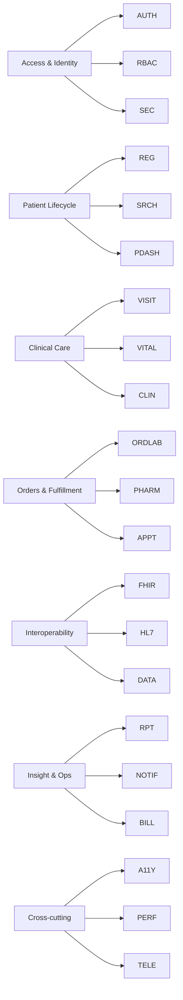
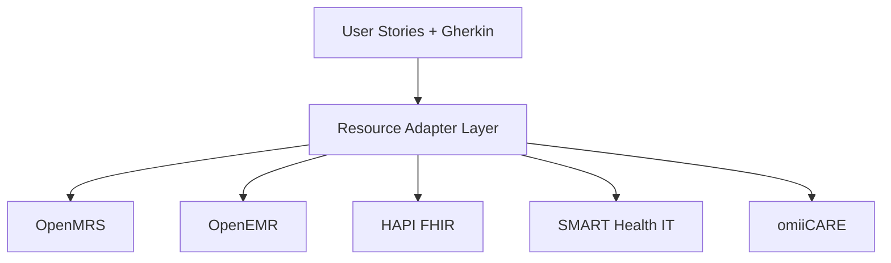

# User Stories & Acceptance Criteria

> **Primary reference system:** OpenMRS Reference Application (legacy O2 — `o2.openmrs.org`; modern demo O3 — `o3.openmrs.org`).
> **Portability:** Stories are written against a **Resource Adapter Layer (RAL)** so the same acceptance criteria can be re-bound to OpenEMR, HAPI FHIR, SMART Health IT, and the in-house **omiiCARE** app without rewriting the behavior.
> **Traceability:** Each story links to one or more requirements `REQ-<PREFIX>-NNN` from the 472-requirement catalog. Manual test cases (1,349 total) trace back through these IDs via the RTM.
> Inferred behavior beyond verified OpenMRS facts is tagged **(Assumption)**.

---

## 1. Document Conventions

| Element | Convention |
|---|---|
| Story ID | `US-<PREFIX>-NNN` — PREFIX matches the requirement module |
| Format | Connextra: *As a `<role>`, I want `<capability>`, so that `<benefit>`* |
| Acceptance Criteria | Gherkin `Given / When / Then` (+ `And`, `But`) |
| Traceability | `REQ-<PREFIX>-NNN` linked per story; one story may cover several REQs |
| Priority | MoSCoW: **M**ust / **S**hould / **C**ould / **W**on't (this release) |
| Adapter | Capability the RAL must expose for the story to be system-agnostic |

### 1.1 Roles (Personas)

| Role | Source of truth |
|---|---|
| Registration Clerk | OpenMRS role + `Add/Edit Patients` privileges |
| Nurse | Vitals capture, visit support |
| Clinician / Doctor | Diagnoses, orders, conditions |
| Pharmacist | Medication dispensing |
| Lab Technician | Lab order fulfillment, results |
| System Administrator | Metadata, roles, users |
| Integration Engineer | REST / FHIR / HL7 consumers |
| Patient / Caregiver | Portal & telehealth (Assumption — not in O2 core) |

### 1.2 Epic → Module Map



---

## 2. Epic A — Access & Identity (AUTH, RBAC, SEC)

### US-AUTH-001 — Location-scoped login
**As a** clinical user, **I want** to select my session location and authenticate, **so that** my encounters are attributed to the correct facility context.
**Priority:** M | **REQ:** REQ-AUTH-001, REQ-AUTH-004, REQ-AUTH-010 | **Adapter:** `session.authenticate(location, credentials)`

```gherkin
Scenario: Successful login with a selected location
  Given I am on the OpenMRS login page
  And the location list shows "Outpatient Clinic", "Inpatient Ward", "Pharmacy", "Laboratory", "Registration Desk", "Isolation Ward"
  When I select the location "Outpatient Clinic"
  And I enter username "admin" and password "Admin123"
  And I click "#loginButton"
  Then I am redirected to the home dashboard
  And the header displays the session location "Outpatient Clinic"

Scenario: Login blocked when no location is chosen
  Given I am on the login page and no location <li> is selected
  When I enter valid credentials and click "#loginButton"
  Then login is rejected and a location-required prompt is shown
```

### US-AUTH-002 — Reject invalid credentials
**As a** security stakeholder, **I want** invalid logins rejected without leaking which field was wrong, **so that** account enumeration is prevented.
**Priority:** M | **REQ:** REQ-AUTH-002, REQ-SEC-003 | **Adapter:** `session.authenticate`

```gherkin
Scenario: Wrong password
  Given I am on the login page with location "Pharmacy" selected
  When I enter username "admin" and password "WrongPass1"
  And I click "#loginButton"
  Then I remain on the login page
  And a generic error "Invalid username or password" is shown
  But the message does not reveal whether the username exists
```

### US-AUTH-003 — Logout terminates session
**As a** clinical user, **I want** to log out from the collapsible user menu, **so that** my session cannot be reused on a shared workstation.
**Priority:** M | **REQ:** REQ-AUTH-006, REQ-SEC-007 | **Adapter:** `session.terminate()`

```gherkin
Scenario: Logout invalidates the session cookie
  Given I am logged in as "admin"
  When I open the user menu and click "Logout"
  Then I am returned to the login page
  And navigating back to the dashboard URL redirects me to login
```

### US-AUTH-004 — Idle session timeout (Assumption)
**As a** compliance officer, **I want** idle sessions to expire automatically, **so that** unattended terminals do not expose PHI.
**Priority:** S | **REQ:** REQ-AUTH-008, REQ-SEC-012 | **Adapter:** `session.policy.idleTimeout`

```gherkin
Scenario: Session expires after inactivity (Assumption: 30 min default)
  Given I am logged in and idle for the configured timeout
  When I perform any action after the timeout elapses
  Then I am redirected to login with a "session expired" notice
```

### US-RBAC-001 — Privilege-gated app tiles
**As a** Registration Clerk, **I want** to see only the apps my role permits, **so that** I cannot reach functions outside my duties.
**Priority:** M | **REQ:** REQ-RBAC-001, REQ-RBAC-005 | **Adapter:** `authz.hasPrivilege(user, privilege)`

```gherkin
Scenario: Registration Clerk dashboard hides clinical apps
  Given I am logged in with role "Registration Clerk"
  Then the home dashboard shows "Register a patient" and "Find Patient Record"
  But "System Administration" and "Configure Metadata" tiles are not shown

Scenario: Direct URL access to a forbidden app is denied
  Given I am logged in with role "Registration Clerk"
  When I navigate directly to the System Administration URL
  Then access is denied with an authorization error
```

### US-RBAC-002 — Manage roles & privileges
**As a** System Administrator, **I want** to assign roles and privileges to users, **so that** access maps to job function.
**Priority:** M | **REQ:** REQ-RBAC-002, REQ-RBAC-008 | **Adapter:** `authz.assignRole(user, role)`

```gherkin
Scenario: Grant Delete Patients privilege
  Given I am a System Administrator on the Manage Roles screen
  When I add the privilege "Delete Patients" to role "Doctor/Clinician"
  And I save
  Then a user with that role sees the "Delete Patient" action on the patient dashboard
```

### US-SEC-001 — REST/FHIR require authentication
**As an** Integration Engineer, **I want** unauthenticated API calls rejected, **so that** PHI is never exposed anonymously.
**Priority:** M | **REQ:** REQ-SEC-001, REQ-FHIR-002 | **Adapter:** `apiClient.requireAuth`

```gherkin
Scenario: Anonymous REST call is rejected
  Given no Authorization header is provided
  When I GET "/openmrs/ws/rest/v1/patient?q=test"
  Then the response status is 401 Unauthorized

Scenario: Anonymous FHIR call is rejected
  Given no Authorization header is provided
  When I GET "/openmrs/ws/fhir2/R4/Patient"
  Then the response status is 401 Unauthorized
```

### US-SEC-002 — PHI access audit trail (Assumption)
**As a** compliance officer, **I want** every PHI read/write audited, **so that** HIPAA accounting-of-disclosures is satisfiable.
**Priority:** M | **REQ:** REQ-SEC-005, REQ-SEC-009 | **Adapter:** `audit.record(actor, action, resource)`

```gherkin
Scenario: Viewing a patient record writes an audit event
  Given I am logged in as a Nurse
  When I open a patient dashboard
  Then an audit record is written capturing actor, patient ID, action "VIEW", and timestamp
```

---

## 3. Epic B — Patient Lifecycle (REG, SRCH, PDASH)

### US-REG-001 — Capture demographics
**As a** Registration Clerk, **I want** to enter patient name, gender, and birthdate, **so that** a uniquely identifiable record is created.
**Priority:** M | **REQ:** REQ-REG-001, REQ-REG-003 | **Adapter:** `patient.create(demographics)`

```gherkin
Scenario: Demographics step accepts a complete name and birthdate
  Given I open "Register a patient"
  When I enter Given Name "John", Middle "Q", Family Name "Public"
  And I select Gender "Male"
  And I enter an exact Birthdate "1990-05-12"
  And I click "Next"
  Then I advance to the Contact Info step with no validation errors

Scenario: Estimated age when birthdate unknown
  Given I am on the Demographics step
  When I choose "Estimated" and enter age 34 years
  Then the system derives an approximate birthdate flagged as estimated
```

### US-REG-002 — Contact info requires an address field
**As a** Registration Clerk, **I want** the address validated to require at least one field, **so that** patients remain contactable.
**Priority:** M | **REQ:** REQ-REG-005, REQ-REG-006 | **Adapter:** `patient.validateAddress`

```gherkin
Scenario: Address must contain at least one field
  Given I am on the Contact Info step
  When I leave all address fields blank and enter Phone "555-0100"
  And I click "Next"
  Then a validation error requires at least one address field

Scenario: Valid contact info proceeds
  Given I am on the Contact Info step
  When I enter City "Boston" and Phone "555-0100"
  Then I advance to the Relationships step
```

### US-REG-003 — Define relationships
**As a** Registration Clerk, **I want** to record patient relationships, **so that** family/caregiver context is available clinically.
**Priority:** S | **REQ:** REQ-REG-008 | **Adapter:** `relationship.create`

```gherkin
Scenario: Add a parent relationship
  Given I am on the Relationships step
  When I add relationship type "Parent" to an existing person "Jane Public"
  Then the relationship is queued for save and shown in the summary
```

### US-REG-004 — Confirm and create record
**As a** Registration Clerk, **I want** to review and submit the wizard, **so that** a patient ID is generated and I land on the dashboard.
**Priority:** M | **REQ:** REQ-REG-010, REQ-REG-011 | **Adapter:** `patient.commit`

```gherkin
Scenario: Successful registration
  Given I am on the Confirm step with valid demographics and contact info
  When I click "#submit"
  Then a unique Patient ID is generated
  And I am redirected to the new patient's dashboard
  And a "Created Patient Record" toast is displayed
```

### US-REG-005 — Edit registration information
**As a** Registration Clerk, **I want** to edit a patient's registration, **so that** corrections and updates are reflected.
**Priority:** S | **REQ:** REQ-REG-013 | **Adapter:** `patient.update`

```gherkin
Scenario: Update phone number
  Given I am on a patient dashboard
  When I choose "Edit Registration Information"
  And I change the Phone Number and save
  Then the patient dashboard reflects the updated phone number
```

### US-REG-006 — Mark patient deceased
**As a** Clinician, **I want** to mark a patient deceased with date and cause, **so that** the record reflects vital status.
**Priority:** S | **REQ:** REQ-REG-015, REQ-CLIN-020 | **Adapter:** `patient.setDeceased`

```gherkin
Scenario: Record death
  Given I am on a living patient's dashboard
  When I choose "Mark Patient Deceased" and enter date "2026-06-01" and cause of death
  Then the dashboard banner indicates the patient is deceased
  And future visit-start actions are restricted (Assumption)
```

### US-REG-007 — Delete / void patient
**As a** System Administrator, **I want** to delete a patient created in error, **so that** test/duplicate records are removed.
**Priority:** C | **REQ:** REQ-REG-017, REQ-RBAC-004 | **Adapter:** `patient.delete`

```gherkin
Scenario: Delete requires the privilege
  Given I am a user without "Delete Patients"
  Then the "Delete Patient" action is not available
```

### US-SRCH-001 — Find patient by name
**As a** Clinician, **I want** to search by name and see matches, **so that** I can open the right record quickly.
**Priority:** M | **REQ:** REQ-SRCH-001, REQ-SRCH-003 | **Adapter:** `patient.search(query)`

```gherkin
Scenario: Name search returns matching patients
  Given I open "Find Patient Record"
  When I type "Public"
  Then a result list shows patients whose name matches "Public"
  And each row shows name, gender, age, and Patient ID

Scenario: No matches
  Given I open "Find Patient Record"
  When I type "Zzxqq"
  Then a "no patients found" empty state is shown
```

### US-SRCH-002 — Find patient by identifier
**As a** Registration Clerk, **I want** to search by Patient ID, **so that** I reach a known record deterministically.
**Priority:** M | **REQ:** REQ-SRCH-005 | **Adapter:** `patient.search`

```gherkin
Scenario: Identifier search opens the exact record
  Given a patient exists with ID "10001V"
  When I search "10001V" in "Find Patient Record"
  Then the matching patient is returned as the top result
```

### US-PDASH-001 — Patient header summary
**As a** Clinician, **I want** the dashboard header to show identity at a glance, **so that** I confirm I am on the correct patient.
**Priority:** M | **REQ:** REQ-PDASH-001 | **Adapter:** `patient.summary`

```gherkin
Scenario: Header shows core identity
  Given I open a patient dashboard
  Then the header shows name, gender, age, date of birth, and Patient ID
```

### US-PDASH-002 — Clinical widgets
**As a** Clinician, **I want** widgets for diagnoses, vitals, observations, and visits, **so that** I see a longitudinal view.
**Priority:** M | **REQ:** REQ-PDASH-003, REQ-PDASH-007 | **Adapter:** `dashboard.widgets`

```gherkin
Scenario: Core widgets render
  Given I open a patient dashboard with recorded data
  Then I see widgets: Diagnoses, Latest Observations, Vitals, Recent Visits, Family, Conditions, Allergies, Attachments, Weight graph, Appointments
```

---

## 4. Epic C — Clinical Care (VISIT, VITAL, CLIN)

### US-VISIT-001 — Start a visit
**As a** Nurse, **I want** to start a visit for a patient, **so that** encounters and observations are grouped.
**Priority:** M | **REQ:** REQ-VISIT-001, REQ-VISIT-004 | **Adapter:** `visit.start(patient, type, location)`

```gherkin
Scenario: Start an active visit
  Given I am on a patient dashboard with no active visit
  When I choose "Start Visit" and select a visit type
  Then an active visit is created at my session location
  And the patient appears in "Active Visits"
```

### US-VISIT-002 — Add a past (retrospective) visit
**As a** Clinician, **I want** to record a past visit, **so that** historical care is captured.
**Priority:** S | **REQ:** REQ-VISIT-006 | **Adapter:** `visit.createRetrospective`

```gherkin
Scenario: Backdated visit
  Given I am on a patient dashboard
  When I choose "Add Past Visit" with start and stop dates in the past
  Then a closed visit is recorded in "Recent Visits"
  But future-dated start/stop values are rejected
```

### US-VISIT-003 — Merge visits
**As a** System Administrator, **I want** to merge duplicate visits, **so that** the timeline is accurate.
**Priority:** C | **REQ:** REQ-VISIT-009 | **Adapter:** `visit.merge`

```gherkin
Scenario: Merge two visits
  Given a patient has two overlapping visits
  When I choose "Merge Visits" and confirm
  Then encounters consolidate under a single visit
```

### US-VITAL-001 — Capture vitals
**As a** Nurse, **I want** to capture vitals, **so that** clinicians have current physiological data.
**Priority:** M | **REQ:** REQ-VITAL-001, REQ-VITAL-003 | **Adapter:** `obs.recordVitals`

```gherkin
Scenario: Record a vitals encounter
  Given I open "Capture Vitals" for a patient with an active visit
  When I enter Height, Weight, Temperature, Pulse, Respiratory Rate, and Blood Pressure
  And I save
  Then a vitals encounter is created
  And the Vitals widget and Weight graph update
```

### US-VITAL-002 — Reject out-of-range vitals (Assumption)
**As a** Nurse, **I want** physiologically impossible values flagged, **so that** data-entry errors are caught.
**Priority:** S | **REQ:** REQ-VITAL-006 | **Adapter:** `obs.validateRange`

```gherkin
Scenario: Implausible pulse is challenged
  Given I am on the Capture Vitals form
  When I enter Pulse "900"
  Then a range warning is shown requiring confirmation or correction
```

### US-CLIN-001 — Record a diagnosis
**As a** Clinician, **I want** to add a coded diagnosis, **so that** the problem list and reporting are accurate.
**Priority:** M | **REQ:** REQ-CLIN-001, REQ-CLIN-004 | **Adapter:** `diagnosis.add(concept, certainty)`

```gherkin
Scenario: Add a primary diagnosis with a coded concept
  Given I am on a patient's clinical view within a visit
  When I search a diagnosis and select an ICD-10/SNOMED-coded concept
  And I mark it Primary and Confirmed and save
  Then the Diagnoses widget lists the diagnosis with its code
```

### US-CLIN-002 — Manage conditions
**As a** Clinician, **I want** to maintain the condition list, **so that** active vs resolved problems are clear.
**Priority:** S | **REQ:** REQ-CLIN-007 | **Adapter:** `condition.upsert`

```gherkin
Scenario: Mark a condition resolved
  Given a patient has an active condition
  When I set the condition status to "Resolved" with an end date
  Then the Conditions widget moves it to the resolved section
```

### US-CLIN-003 — Record allergies
**As a** Nurse, **I want** to record allergies with reaction and severity, **so that** ordering is safe.
**Priority:** M | **REQ:** REQ-CLIN-010, REQ-PHARM-012 | **Adapter:** `allergy.record`

```gherkin
Scenario: Add a drug allergy
  Given I am on the Allergies widget
  When I add allergen "Penicillin", reaction "Hives", severity "Severe"
  Then the allergy appears and is available to medication safety checks
```

### US-CLIN-004 — Attachments
**As a** Clinician, **I want** to attach documents/images, **so that** external records are accessible.
**Priority:** C | **REQ:** REQ-CLIN-014 | **Adapter:** `attachment.upload`

```gherkin
Scenario: Upload an attachment
  Given I open "Attachments" for a patient
  When I upload a PDF under the size limit
  Then the file appears in the Attachments widget with uploader and timestamp
```

---

## 5. Epic D — Orders & Fulfillment (ORDLAB, PHARM, APPT)

### US-ORDLAB-001 — Place a lab order
**As a** Clinician, **I want** to order a lab test, **so that** diagnostics are requested for the patient.
**Priority:** M | **REQ:** REQ-ORDLAB-001, REQ-ORDLAB-003 | **Adapter:** `order.create(labConcept)`

```gherkin
Scenario: Order a CBC
  Given I am in a patient's active visit
  When I place a lab order for "Complete Blood Count"
  Then the order appears as "Active" in the orders list with an orderer and date
```

### US-ORDLAB-002 — Enter lab results (LOINC)
**As a** Lab Technician, **I want** to enter results against an order, **so that** clinicians can act on values.
**Priority:** M | **REQ:** REQ-ORDLAB-006, REQ-ORDLAB-008 | **Adapter:** `result.record(order, value, loincCode)`

```gherkin
Scenario: Result a numeric test
  Given an active lab order for "Hemoglobin" exists
  When I enter a numeric result with units against its LOINC code
  Then the result is linked to the order and shown in Latest Observations
  And abnormal values outside reference range are flagged
```

### US-PHARM-001 — Prescribe a medication
**As a** Clinician, **I want** to prescribe with dose/route/frequency, **so that** the pharmacy can dispense correctly.
**Priority:** M | **REQ:** REQ-PHARM-001, REQ-PHARM-004 | **Adapter:** `medicationRequest.create`

```gherkin
Scenario: Create a drug order
  Given I am in a patient's active visit
  When I prescribe "Amoxicillin 500mg", route "Oral", frequency "TID", duration "7 days"
  Then a drug order is created with status "Active"
```

### US-PHARM-002 — Allergy interaction check
**As a** Pharmacist, **I want** allergy conflicts surfaced before dispensing, **so that** adverse events are prevented.
**Priority:** M | **REQ:** REQ-PHARM-012, REQ-CLIN-010 | **Adapter:** `safety.checkAllergy`

```gherkin
Scenario: Block dispense on known allergy
  Given the patient has a "Penicillin" allergy
  When a clinician prescribes "Amoxicillin"
  Then a cross-allergy warning is shown and acknowledgment is required before dispensing
```

### US-PHARM-003 — Dispense medication
**As a** Pharmacist, **I want** to dispense against an active order, **so that** the patient receives the drug and stock updates.
**Priority:** S | **REQ:** REQ-PHARM-008 | **Adapter:** `dispense.record`

```gherkin
Scenario: Dispense an active order
  Given an active drug order exists
  When I dispense the prescribed quantity
  Then the order status reflects dispensed and the dispense event is logged
```

### US-APPT-001 — Schedule an appointment
**As a** Registration Clerk, **I want** to schedule an appointment, **so that** the patient is booked into a service slot.
**Priority:** M | **REQ:** REQ-APPT-001, REQ-APPT-003 | **Adapter:** `appointment.schedule`

```gherkin
Scenario: Book a future appointment
  Given I open "Appointment Scheduling" for a patient
  When I select service, provider, date, and an open time slot
  And I save
  Then the appointment appears in the Appointments widget with status "Scheduled"

Scenario: Double-booking prevented
  Given a provider slot is already booked
  When I attempt to book the same slot
  Then the system rejects the booking with a conflict message
```

### US-APPT-002 — Request an appointment
**As a** Clinician, **I want** to request an appointment for follow-up, **so that** scheduling staff can confirm it.
**Priority:** C | **REQ:** REQ-APPT-006 | **Adapter:** `appointment.request`

```gherkin
Scenario: Submit a request
  Given I am on a patient dashboard
  When I choose "Request Appointment" with a service and preferred date
  Then a pending request is created for scheduling staff to confirm
```

---

## 6. Epic E — Interoperability (FHIR, HL7, DATA)

### US-FHIR-001 — FHIR R4 CapabilityStatement
**As an** Integration Engineer, **I want** to read the FHIR metadata, **so that** I can confirm version and supported resources.
**Priority:** M | **REQ:** REQ-FHIR-001, REQ-FHIR-004 | **Adapter:** `fhir.metadata()`

```gherkin
Scenario: Metadata reports R4
  Given I am authenticated
  When I GET "/openmrs/ws/fhir2/R4/metadata"
  Then a CapabilityStatement is returned with fhirVersion "4.0.1"
  And it advertises Patient, Encounter, Observation, Condition, AllergyIntolerance, and MedicationRequest
```

### US-FHIR-002 — Read a FHIR Patient
**As an** Integration Engineer, **I want** to fetch a Patient as FHIR R4, **so that** downstream systems consume standard data.
**Priority:** M | **REQ:** REQ-FHIR-006 | **Adapter:** `fhir.read("Patient", id)`

```gherkin
Scenario: Retrieve a Patient resource
  Given a patient exists with a known FHIR id
  When I GET "/openmrs/ws/fhir2/R4/Patient/{id}" with valid auth
  Then a FHIR R4 Patient resource is returned with name, gender, birthDate, and identifier
```

### US-FHIR-003 — Search Observations by patient
**As an** Integration Engineer, **I want** to search Observations for a patient, **so that** I can pull vitals/labs externally.
**Priority:** S | **REQ:** REQ-FHIR-009, REQ-ORDLAB-008 | **Adapter:** `fhir.search`

```gherkin
Scenario: Observation search returns a Bundle
  Given a patient has recorded vitals
  When I GET "/openmrs/ws/fhir2/R4/Observation?patient={id}"
  Then a searchset Bundle of Observation resources is returned with LOINC codings
```

### US-HL7-001 — Inbound ADT registration
**As an** Integration Engineer, **I want** ADT messages to register/update patients, **so that** upstream ADT feeds keep records current.
**Priority:** S | **REQ:** REQ-HL7-001, REQ-HL7-004 | **Adapter:** `hl7.process(ADT)`

```gherkin
Scenario: ADT^A04 creates a patient
  Given a well-formed HL7 v2 ADT^A04 message
  When it is delivered to the HL7 inbound channel
  Then a patient is registered with the PID demographics
  And an ACK is returned

Scenario: Malformed message is negatively acknowledged
  Given a malformed HL7 message
  When it is delivered
  Then an AE/AR NACK is returned and no record is created
```

### US-HL7-002 — Inbound ORU results
**As an** Integration Engineer, **I want** ORU^R01 messages to post results, **so that** external lab instruments flow into the record.
**Priority:** C | **REQ:** REQ-HL7-007 | **Adapter:** `hl7.process(ORU)`

```gherkin
Scenario: ORU posts an observation result
  Given an ORU^R01 with OBX segments referencing an order
  When it is processed
  Then results attach to the patient and an ACK is returned
```

### US-DATA-001 — Bulk data management
**As a** System Administrator, **I want** Data Management tools to merge/manage patients, **so that** data quality is maintained.
**Priority:** S | **REQ:** REQ-DATA-001, REQ-DATA-005 | **Adapter:** `data.merge`

```gherkin
Scenario: Merge duplicate patients
  Given two records represent the same person
  When I merge them via Data Management selecting the surviving record
  Then encounters, visits, and observations consolidate under the surviving Patient ID
```

### US-DATA-002 — Configure metadata
**As a** System Administrator, **I want** to configure concepts, locations, and visit types, **so that** the system reflects local workflows.
**Priority:** S | **REQ:** REQ-DATA-008 | **Adapter:** `metadata.configure`

```gherkin
Scenario: Add a session location
  Given I am in "Configure Metadata"
  When I add a new login location "Triage"
  Then "Triage" appears in the login location list
```

---

## 7. Epic F — Insight & Ops (RPT, NOTIF, BILL)

### US-RPT-001 — Run a report
**As a** System Administrator, **I want** to run operational reports, **so that** facility metrics are available.
**Priority:** S | **REQ:** REQ-RPT-001, REQ-RPT-004 | **Adapter:** `report.run`

```gherkin
Scenario: Run a patient-registrations report
  Given I open "Reports"
  When I run a registrations report for a date range
  Then results render with counts and an export option
```

### US-RPT-002 — Export report data
**As a** Data Analyst, **I want** to export report output, **so that** I can analyze it externally.
**Priority:** C | **REQ:** REQ-RPT-007 | **Adapter:** `report.export`

```gherkin
Scenario: Export to CSV
  Given a report has results
  When I choose "Export" as CSV
  Then a CSV file downloads matching the on-screen rows
```

### US-NOTIF-001 — Appointment reminders (Assumption)
**As a** Patient, **I want** appointment reminders, **so that** I do not miss visits.
**Priority:** C | **REQ:** REQ-NOTIF-001 | **Adapter:** `notify.send`

```gherkin
Scenario: Reminder before appointment (Assumption)
  Given a patient has a scheduled appointment with contact info
  When the configured reminder window is reached
  Then a reminder notification is dispatched and logged
```

### US-BILL-001 — Generate a visit charge (Assumption)
**As a** Billing Clerk, **I want** charges generated from encounters, **so that** services are invoiced.
**Priority:** C | **REQ:** REQ-BILL-001, REQ-BILL-003 | **Adapter:** `billing.charge`

```gherkin
Scenario: Charge a billable encounter (Assumption)
  Given a visit contains a billable service
  When billing runs for the visit
  Then a charge line item is created with code, quantity, and amount
```

---

## 8. Epic G — Cross-cutting (A11Y, PERF, TELE)

### US-A11Y-001 — Keyboard-navigable login & registration
**As a** keyboard-only user, **I want** to operate login and registration without a mouse, **so that** the app is accessible.
**Priority:** S | **REQ:** REQ-A11Y-001, REQ-A11Y-004 | **Adapter:** `ui.a11y`

```gherkin
Scenario: Tab order reaches all login controls
  Given I am on the login page
  When I navigate with Tab only
  Then I can reach the location list, username, password, and "#loginButton" in a logical order
  And the focused element has a visible focus indicator
```

### US-A11Y-002 — Screen-reader labels
**As a** screen-reader user, **I want** form fields labeled, **so that** I understand each input.
**Priority:** S | **REQ:** REQ-A11Y-007 | **Adapter:** `ui.a11y`

```gherkin
Scenario: Demographics fields expose accessible names
  Given I am on the Demographics step with a screen reader
  Then each field announces a name such as "Given Name", "Family Name", "Gender", "Birthdate"
```

### US-PERF-001 — Patient search performance
**As a** Clinician, **I want** search to return quickly under load, **so that** care is not delayed.
**Priority:** S | **REQ:** REQ-PERF-001, REQ-PERF-003 | **Adapter:** `patient.search`

```gherkin
Scenario: Search latency target (Assumption: p95 < 2s)
  Given a dataset of 100k+ patients
  When I search by name
  Then the 95th-percentile response time is under 2 seconds
```

### US-PERF-002 — Dashboard load budget
**As a** Clinician, **I want** the patient dashboard to load within budget, **so that** workflow stays efficient.
**Priority:** S | **REQ:** REQ-PERF-006 | **Adapter:** `dashboard.load`

```gherkin
Scenario: Dashboard render budget (Assumption: < 3s)
  Given a patient with typical clinical history
  When I open the dashboard
  Then all core widgets render within 3 seconds
```

### US-TELE-001 — Start a telehealth visit (Assumption)
**As a** Clinician, **I want** to start a video visit, **so that** remote patients receive care.
**Priority:** C | **REQ:** REQ-TELE-001, REQ-VISIT-001 | **Adapter:** `tele.startSession`

```gherkin
Scenario: Launch a video session for a telehealth visit (Assumption)
  Given a patient has a telehealth appointment
  When I start the visit and launch the video session
  Then a secure session is established and the visit encounter is opened
```

### US-TELE-002 — Patient joins via secure link (Assumption)
**As a** Patient, **I want** to join my video visit via a secure link, **so that** I connect without installing software.
**Priority:** C | **REQ:** REQ-TELE-004, REQ-SEC-007 | **Adapter:** `tele.join`

```gherkin
Scenario: Patient joins the session (Assumption)
  Given I received a one-time secure visit link
  When I open the link at the scheduled time
  Then I join the waiting room and the clinician is notified
  But an expired or reused link is rejected
```

---

## 9. Resource Adapter Layer (Portability)

Each story's **Adapter** capability maps to one stable interface; per-system bindings keep the Gherkin unchanged.

| Adapter capability | OpenMRS (primary) | OpenEMR | HAPI FHIR | SMART Health IT | omiiCARE |
|---|---|---|---|---|---|
| `session.authenticate` | O2 login + REST session | login API | OAuth2/SMART | SMART launch | native auth |
| `patient.create/update` | registrationapp / REST | patient API | FHIR `Patient` | FHIR `Patient` | native |
| `patient.search` | REST `patient?q=` | search API | FHIR search | FHIR search | native |
| `visit.start` | REST `visit` | encounter | FHIR `Encounter` | FHIR `Encounter` | native |
| `obs.recordVitals` | REST `obs` | clinical | FHIR `Observation` | FHIR `Observation` | native |
| `medicationRequest.create` | REST `drugorder` | rx | FHIR `MedicationRequest` | FHIR `MedicationRequest` | native |
| `fhir.read/search` | fhir2 R4 | FHIR module | core | core | gateway |
| `hl7.process` | HL7 module | HL7 engine | HL7→FHIR bridge | n/a | adapter |
| `audit.record` | logging/audit | audit log | interceptor | n/a | native |



---

## 10. Story → Requirement Traceability Summary

| Epic | Stories | Sample REQ coverage |
|---|---|---|
| A — Access & Identity | US-AUTH-001..004, US-RBAC-001..002, US-SEC-001..002 | AUTH-001/002/004/006/008/010, RBAC-001/002/004/005/008, SEC-001/003/005/007/009/012 |
| B — Patient Lifecycle | US-REG-001..007, US-SRCH-001..002, US-PDASH-001..002 | REG-001..017, SRCH-001/003/005, PDASH-001/003/007 |
| C — Clinical Care | US-VISIT-001..003, US-VITAL-001..002, US-CLIN-001..004 | VISIT-001/004/006/009, VITAL-001/003/006, CLIN-001..014 |
| D — Orders & Fulfillment | US-ORDLAB-001..002, US-PHARM-001..003, US-APPT-001..002 | ORDLAB-001/003/006/008, PHARM-001/004/008/012, APPT-001/003/006 |
| E — Interoperability | US-FHIR-001..003, US-HL7-001..002, US-DATA-001..002 | FHIR-001/004/006/009, HL7-001/004/007, DATA-001/005/008 |
| F — Insight & Ops | US-RPT-001..002, US-NOTIF-001, US-BILL-001 | RPT-001/004/007, NOTIF-001, BILL-001/003 |
| G — Cross-cutting | US-A11Y-001..002, US-PERF-001..002, US-TELE-001..002 | A11Y-001/004/007, PERF-001/003/006, TELE-001/004 |

**Total: 47 user stories across 7 epics**, each with Gherkin acceptance criteria and linked `REQ-<PREFIX>-NNN` IDs feeding the RTM and the 1,349 manual test cases.

> **Verification note:** Login flow, dashboard tiles, registration wizard, patient dashboard widgets/actions, REST/FHIR endpoints, and 401-on-anonymous behavior are verified OpenMRS facts. Idle timeout thresholds, audit-event specifics, vitals range rules, notifications, billing, telehealth, and all performance numbers are tagged **(Assumption)** and must be confirmed against the target deployment before being treated as pass/fail oracles.
