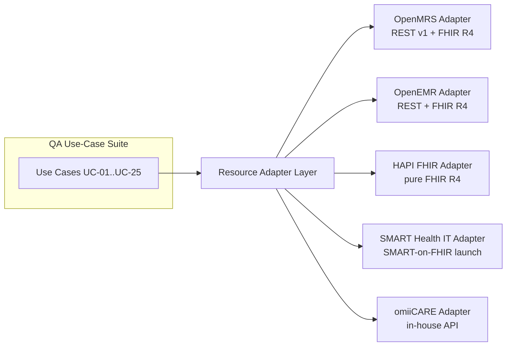

# Use Case Catalog — OpenMRS Reference Application (Reverse-Engineered)

> **Scope.** This catalog reverse-engineers the **OpenMRS Reference Application** (legacy O2 RefApp, `https://o2.openmrs.org`; modern demo O3 at `o3.openmrs.org`) into a set of **fully-dressed use cases** for a healthcare QA portfolio.
> **Primary reference system:** OpenMRS. The catalog is structured so it also targets **OpenEMR**, **HAPI FHIR**, **SMART Health IT**, and the in-house **omiiCARE** app through a **Resource Adapter Layer (RAL)** — see [§2](#2-multi-system-portability-via-the-resource-adapter-layer).
> **Convention.** Verified behavior is stated plainly. Anything beyond the verified facts is tagged **(Assumption)**. Each use case cross-references requirement IDs `REQ-<PREFIX>-NNN` from the existing 472-requirement catalog (RTM-traceable to 1,349 manual test cases).

---

## 1. Catalog Overview

### 1.1 Actor Glossary

| Actor | Description | OpenMRS Role / Privilege basis (REQ-RBAC-*) |
|-------|-------------|----------------------------------------------|
| Registration Clerk | Registers/edits patients, schedules check-in | Registration Clerk role; Add/Edit Patients |
| Nurse | Captures vitals, manages visits | Nurse role; Add Visits, Add Encounters |
| Clinician / Doctor | Diagnoses, orders, prescribes, notes | Doctor role; Add Diagnoses, Order Entry |
| Pharmacist | Dispenses, reviews medication orders | Pharmacist role; Dispense privilege |
| Lab Technician | Receives lab orders, enters results | Lab Tech role; Edit Observations (lab) |
| System Administrator | Manages users/roles/metadata/config | System Administrator role; Manage Roles/Users |
| Appointment Scheduler | Books/reschedules/cancels appointments | Scheduler privileges |
| Data Manager | Merges patients, manages data quality | Data Management privileges |
| Integration Client (System) | External system calling REST/FHIR/HL7 | Service account; Basic/OAuth auth |
| Patient (omiiCARE) | Self-service portal user **(Assumption)** | omiiCARE patient role **(Assumption)** |

### 1.2 Use Case Index

| UC ID | Use Case | Primary Actor | Module Prefix |
|-------|----------|---------------|---------------|
| UC-01 | Login with Session Location | Any clinical user | AUTH |
| UC-02 | Logout / Session Timeout | Any clinical user | AUTH, SEC |
| UC-03 | Register a New Patient | Registration Clerk | REG |
| UC-04 | Edit Patient Registration Info | Registration Clerk | REG |
| UC-05 | Find / Search Patient Record | Any clinical user | SRCH |
| UC-06 | View Patient Dashboard | Clinician | PDASH |
| UC-07 | Start a Visit | Nurse | VISIT |
| UC-08 | Add a Past Visit | Nurse | VISIT |
| UC-09 | Capture Vitals | Nurse | VITAL |
| UC-10 | Record a Diagnosis / Clinical Note | Clinician | CLIN |
| UC-11 | Record Allergy / Condition | Clinician | CLIN |
| UC-12 | Place a Lab Order | Clinician | ORDLAB |
| UC-13 | Enter Lab Results | Lab Technician | ORDLAB |
| UC-14 | Prescribe Medication | Clinician | PHARM |
| UC-15 | Dispense Medication | Pharmacist | PHARM |
| UC-16 | Schedule an Appointment | Appointment Scheduler | APPT |
| UC-17 | Manage Active Visits Queue | Nurse | VISIT |
| UC-18 | Merge Duplicate Patients | Data Manager | DATA |
| UC-19 | Mark Patient Deceased | Clinician | PDASH |
| UC-20 | Manage Users & Roles (RBAC) | System Administrator | RBAC |
| UC-21 | Consume Patient via FHIR R4 API | Integration Client | FHIR |
| UC-22 | Authenticate to REST API | Integration Client | FHIR, SEC |
| UC-23 | Ingest HL7 v2 ADT Message | Integration Client | HL7 |
| UC-24 | Run / Export a Report | Data Manager | RPT |
| UC-25 | Patient Self-Service (omiiCARE) **(Assumption)** | Patient | TELE, NOTIF |

---

## 2. Multi-System Portability via the Resource Adapter Layer

The use-case *flows* are written against OpenMRS, but each verb (create patient, place order, read observation) is dispatched through an adapter so the same QA assets re-target other systems.

| Capability | OpenMRS | OpenEMR | HAPI FHIR | SMART Health IT | omiiCARE |
|------------|---------|---------|-----------|-----------------|----------|
| Create Patient | `POST /ws/rest/v1/patient` or FHIR `Patient` | REST/FHIR | FHIR `Patient` | FHIR `Patient` | adapter call **(Assumption)** |
| Read Observation | `GET /ws/rest/v1/obs` or FHIR `Observation` | FHIR | FHIR | FHIR | adapter **(Assumption)** |
| Auth | Basic / OAuth2 | OAuth2 | none/Basic/SMART | SMART launch + scopes | OAuth2 **(Assumption)** |
| Capability discovery | FHIR `metadata` → CapabilityStatement (4.0.1) | FHIR metadata | FHIR metadata | well-known SMART config | **(Assumption)** |

> Adapter substitution must not change a use case's **main flow steps**, only the underlying endpoint binding (REQ-FHIR-, REQ-HL7-).

---

## 3. Use-Case Diagram

```mermaid
flowchart TB
  RC([Registration Clerk])
  NU([Nurse])
  DR([Clinician/Doctor])
  PH([Pharmacist])
  LT([Lab Technician])
  AD([System Administrator])
  SC([Appointment Scheduler])
  DM([Data Manager])
  IC([Integration Client])

  subgraph OpenMRS Reference Application
    L[UC-01 Login w/ Location]
    R[UC-03 Register Patient]
    S[UC-05 Find Patient]
    D[UC-06 Patient Dashboard]
    V[UC-07 Start Visit]
    VI[UC-09 Capture Vitals]
    DX[UC-10 Record Diagnosis]
    LO[UC-12 Place Lab Order]
    LR[UC-13 Enter Lab Results]
    RX[UC-14 Prescribe Med]
    DP[UC-15 Dispense Med]
    AP[UC-16 Schedule Appointment]
    MG[UC-18 Merge Patients]
    RB[UC-20 Manage Users/Roles]
    API[UC-21 FHIR R4 Read]
    HL[UC-23 HL7 ADT Ingest]
  end

  RC --> L & R & S
  NU --> L & V & VI
  DR --> L & D & DX & LO & RX
  PH --> L & DP
  LT --> L & LR
  AD --> RB
  SC --> AP
  DM --> MG
  IC --> API & HL

  R -.->|<<include>>| L
  V -.->|<<include>>| L
  DX -.->|<<include>>| D
  LR -.->|<<include>>| LO
  DP -.->|<<include>>| RX
```

---

## 4. Fully-Dressed Use Cases

> **Legend.** *MF* = Main Flow, *AF* = Alternate Flow, *EX* = Exception. Selectors (`#username`, etc.) reflect the verified O2 RefApp UI.

---

### UC-01 — Login with Session Location
| Field | Detail |
|-------|--------|
| **Actor** | Any clinical user (Registration Clerk, Nurse, Clinician, Pharmacist, Lab Tech, Admin) |
| **Requirements** | REQ-AUTH-001..030, REQ-SEC-010 |
| **Preconditions** | User has valid credentials; at least one session location is configured. |
| **Trigger** | User navigates to the OpenMRS login URL. |

**Main Flow**
1. System displays login page with a list of session **locations** (`<li id="...">`: Outpatient Clinic, Inpatient Ward, Pharmacy, Laboratory, Registration Desk, Isolation Ward).
2. User selects a location.
3. User enters username (`#username`) and password (`#password`).
4. User clicks Login (`#loginButton`).
5. System authenticates, binds the chosen location to the session, and redirects to the Home dashboard.

**Alternate Flows**
- **AF-1 (Pre-selected location):** Location already remembered from prior session → user only enters credentials.
- **AF-2 (Change location post-login):** User opens the header session-location control to switch location for subsequent encounters.

**Exceptions**
- **EX-1 (Bad credentials):** Inline "Invalid username or password"; remain on login page; increment failed-attempt counter **(Assumption: lockout after N attempts — REQ-SEC-011)**.
- **EX-2 (No location selected):** Login blocked until a location is chosen.
- **EX-3 (Disabled account):** Authentication denied with account-status message.

**Postconditions** Authenticated session active with a bound location; audit log entry created (REQ-SEC-040). On failure: no session, no location binding.

---

### UC-02 — Logout / Session Timeout
| Field | Detail |
|-------|--------|
| **Actor** | Any authenticated user |
| **Requirements** | REQ-AUTH-040, REQ-SEC-020, REQ-SEC-021 |
| **Preconditions** | Active authenticated session. |
| **Trigger** | User clicks Logout (in the collapsible navbar) **or** idle timeout elapses. |

**Main Flow**
1. User opens the user menu / navbar.
2. User clicks **Logout**.
3. System invalidates the server session and redirects to login.

**Alternate Flows**
- **AF-1 (Idle timeout):** No activity for the configured interval → session auto-invalidated; next action redirects to login **(Assumption: timeout configurable — REQ-SEC-021)**.

**Exceptions**
- **EX-1 (In-flight unsaved data):** Warn before navigation **(Assumption)**.

**Postconditions** Session token invalid; protected pages require re-auth; logout audited.

---

### UC-03 — Register a New Patient
| Field | Detail |
|-------|--------|
| **Actor** | Registration Clerk |
| **Requirements** | REQ-REG-001..060, REQ-RBAC-005 (Add Patients) |
| **Preconditions** | Logged in (UC-01); user has *Add Patients* privilege. |
| **Trigger** | User clicks **Register a patient** tile (registrationapp). |

**Main Flow**
1. **Demographics:** enter Given Name, Middle Name, Family Name, Gender, Birthdate (exact) — Next.
2. **Contact Info:** enter Address (≥1 address field required) and Phone Number — Next.
3. **Relationships:** optionally add relationship(s) — Next.
4. **Confirm:** review summary; click `#submit`.
5. System generates a unique **Patient ID**, persists the record, shows **"Created Patient Record"** toast, and redirects to the patient dashboard.

**Alternate Flows**
- **AF-1 (Estimated birthdate):** Birthdate unknown → enter estimated age (years/months); system computes approximate DOB and flags it estimated.
- **AF-2 (Add relationship):** Search existing person and assign relationship type.
- **AF-3 (Possible duplicate):** Matching demographics detected → system surfaces potential duplicates; clerk confirms new vs. opens existing **(Assumption: duplicate-check enabled)**.

**Exceptions**
- **EX-1 (Missing required field):** Validation blocks Next/Submit (e.g., no address field, no gender).
- **EX-2 (Invalid phone format):** Field-level error.
- **EX-3 (Save failure):** Server/network error → no Patient ID issued; user can retry (REQ-REG-055).
- **EX-4 (No privilege):** Tile/route blocked (403) for users lacking Add Patients.

**Postconditions** New patient exists with unique Patient ID; dashboard shown. On failure: no partial patient persisted.

---

### UC-04 — Edit Patient Registration Information
| Field | Detail |
|-------|--------|
| **Actor** | Registration Clerk |
| **Requirements** | REQ-REG-070..085, REQ-RBAC-006 (Edit Patients) |
| **Preconditions** | Patient exists; user has *Edit Patients*. |
| **Trigger** | Patient dashboard → General Actions → **Edit Registration Information**. |

**Main Flow**
1. Open the registration wizard pre-populated with existing values.
2. Modify demographic/contact/relationship fields.
3. Submit (`#submit`).
4. System validates, saves, and returns to dashboard with confirmation.

**Alternate Flows**
- **AF-1 (Add additional identifier):** Add a secondary identifier type.
- **AF-2 (Change preferred name/address):** Mark a new preferred entry; prior retained historically **(Assumption)**.

**Exceptions**
- **EX-1 (Validation failure):** As UC-03 EX-1/EX-2.
- **EX-2 (Concurrent edit):** Another user edited the record → conflict/stale-data warning **(Assumption)**.

**Postconditions** Patient record updated; change audited (REQ-SEC-040).

---

### UC-05 — Find / Search Patient Record
| Field | Detail |
|-------|--------|
| **Actor** | Any clinical user |
| **Requirements** | REQ-SRCH-001..040 |
| **Preconditions** | Logged in. |
| **Trigger** | User clicks **Find Patient Record** tile (coreapps findPatient). |

**Main Flow**
1. System shows search box.
2. User types name or Patient ID.
3. System returns matching patients (id, name, gender, age) as type-ahead/result list.
4. User selects a result → patient dashboard (UC-06).

**Alternate Flows**
- **AF-1 (Search by identifier):** Exact Patient ID returns single match.
- **AF-2 (Partial name):** Fuzzy/prefix matches listed.
- **AF-3 (Recently viewed):** Quick list of recent patients **(Assumption)**.

**Exceptions**
- **EX-1 (No results):** "No patients found" empty state.
- **EX-2 (Query too short):** Minimum-length prompt **(Assumption)**.

**Postconditions** Selected patient context loaded; search may be audited for PHI access (REQ-SEC-041).

---

### UC-06 — View Patient Dashboard
| Field | Detail |
|-------|--------|
| **Actor** | Clinician (or any clinical user) |
| **Requirements** | REQ-PDASH-001..050 |
| **Preconditions** | Patient selected (UC-05) or just registered (UC-03). |
| **Trigger** | Navigation to a patient record. |

**Main Flow**
1. System renders header: name, gender, age, DOB, Patient ID.
2. System loads widgets: Diagnoses, Latest Observations, Vitals, Recent Visits, Family, Conditions, Allergies, Attachments, Weight graph, Appointments.
3. System renders **General Actions**: Start Visit, Add Past Visit, Merge Visits, Schedule Appointment, Request Appointment, Mark Patient Deceased, Edit Registration Information, Delete Patient, Attachments.
4. User reviews data / chooses an action.

**Alternate Flows**
- **AF-1 (No data yet):** Empty widgets show placeholders.
- **AF-2 (Action gated by privilege):** Actions the user lacks are hidden/disabled (REQ-RBAC-*).

**Exceptions**
- **EX-1 (Widget load failure):** One widget errors without blocking others **(Assumption)**.

**Postconditions** Dashboard displayed; PHI view audited (REQ-SEC-041).

---

### UC-07 — Start a Visit
| Field | Detail |
|-------|--------|
| **Actor** | Nurse |
| **Requirements** | REQ-VISIT-001..030 |
| **Preconditions** | Patient on dashboard; no active visit (or multiple allowed per config). |
| **Trigger** | General Actions → **Start Visit**. |

**Main Flow**
1. User selects visit type and (defaulted) location = session location.
2. User confirms start.
3. System creates an active visit; Active Visits/Recent Visits widgets update.

**Alternate Flows**
- **AF-1 (Visit already active):** System offers to use the existing active visit.
- **AF-2 (Start with vitals):** Flow chains directly into Capture Vitals (UC-09).

**Exceptions**
- **EX-1 (Overlapping visit conflict):** Blocked if config disallows concurrent visits.
- **EX-2 (No privilege):** Action hidden/denied.

**Postconditions** Active visit exists, anchored to date/location; encounters can attach.

---

### UC-08 — Add a Past Visit
| Field | Detail |
|-------|--------|
| **Actor** | Nurse / Registration Clerk |
| **Requirements** | REQ-VISIT-040..050 |
| **Preconditions** | Patient on dashboard. |
| **Trigger** | General Actions → **Add Past Visit**. |

**Main Flow**
1. User enters start (and optional stop) date in the past, visit type, location.
2. User submits.
3. System creates a closed/back-dated visit; Recent Visits updates.

**Alternate Flows**
- **AF-1 (Open-ended past visit):** Stop date omitted **(Assumption: may remain open per config)**.

**Exceptions**
- **EX-1 (Future/invalid dates):** Validation blocks save.
- **EX-2 (Date before DOB):** Rejected (REQ-VISIT-048).

**Postconditions** Historical visit recorded with back-dated timestamps.

---

### UC-09 — Capture Vitals
| Field | Detail |
|-------|--------|
| **Actor** | Nurse |
| **Requirements** | REQ-VITAL-001..040, REQ-RBAC-010 |
| **Preconditions** | Active visit recommended; patient context loaded. |
| **Trigger** | **Capture Vitals** tile or visit action. |

**Main Flow**
1. System shows the vitals form (height, weight, temperature, pulse, respiratory rate, BP, SpO₂, etc.).
2. Nurse enters values.
3. Nurse saves the encounter.
4. System records a Vitals encounter/observations; Vitals & Weight-graph widgets update.

**Alternate Flows**
- **AF-1 (Partial vitals):** Save subset of fields.
- **AF-2 (No active visit):** System prompts to start a visit (links UC-07).

**Exceptions**
- **EX-1 (Out-of-range value):** Range/sanity validation warns or blocks (e.g., implausible BP) (REQ-VITAL-030).
- **EX-2 (Non-numeric entry):** Field error.

**Postconditions** Vitals observations stored and timestamped; visible in Latest Observations & graphs.

---

### UC-10 — Record a Diagnosis / Clinical Note
| Field | Detail |
|-------|--------|
| **Actor** | Clinician / Doctor |
| **Requirements** | REQ-CLIN-001..050, REQ-RBAC-020 (Add Diagnoses) |
| **Preconditions** | Active visit; clinician privilege. |
| **Trigger** | Visit/encounter action to add diagnosis or note. |

**Main Flow**
1. Clinician searches a coded diagnosis (ICD-10 / SNOMED).
2. Sets certainty (confirmed/presumed) and order (primary/secondary).
3. Optionally adds a free-text clinical note.
4. Saves the encounter.
5. System persists diagnosis; Diagnoses widget updates.

**Alternate Flows**
- **AF-1 (Non-coded diagnosis):** Enter free-text diagnosis when no code matches.
- **AF-2 (Multiple diagnoses):** Add several with distinct ranks.

**Exceptions**
- **EX-1 (No concept match):** Search returns nothing → use free-text or refine.
- **EX-2 (No active visit/encounter):** Prompt to start one.

**Postconditions** Coded diagnosis recorded with certainty/rank; contributes to problem list/reports.

---

### UC-11 — Record Allergy / Condition
| Field | Detail |
|-------|--------|
| **Actor** | Clinician / Nurse |
| **Requirements** | REQ-CLIN-060..090 |
| **Preconditions** | Patient context loaded. |
| **Trigger** | Allergies or Conditions widget → Add. |

**Main Flow**
1. User selects allergen/condition (coded), reaction, severity, onset.
2. Saves.
3. System updates Allergies / Conditions widget; safety checks may reference allergies during prescribing (UC-14).

**Alternate Flows**
- **AF-1 (No known allergies):** Mark "No Known Allergies" explicitly.
- **AF-2 (Inactive/resolved condition):** Set status to resolved.

**Exceptions**
- **EX-1 (Duplicate allergy):** Warn on duplicate allergen.

**Postconditions** Allergy/condition stored; available to clinical decision support and FHIR `AllergyIntolerance`/`Condition` (UC-21).

---

### UC-12 — Place a Lab Order
| Field | Detail |
|-------|--------|
| **Actor** | Clinician |
| **Requirements** | REQ-ORDLAB-001..040 |
| **Preconditions** | Active visit; order-entry privilege. |
| **Trigger** | Orders → new lab order. |

**Main Flow**
1. Clinician searches an orderable lab test (LOINC-coded).
2. Sets urgency, specimen, instructions.
3. Signs/saves the order.
4. System creates a lab Order in *new/active* state, routed to Laboratory.

**Alternate Flows**
- **AF-1 (Order set/panel):** Select a panel that expands to multiple tests.
- **AF-2 (STAT order):** Urgency = STAT raises priority.

**Exceptions**
- **EX-1 (Duplicate active order):** Warn on same test already active.
- **EX-2 (No privilege):** Denied.

**Postconditions** Lab order persisted and queued; appears for Lab Tech (UC-13).

---

### UC-13 — Enter Lab Results
| Field | Detail |
|-------|--------|
| **Actor** | Lab Technician |
| **Requirements** | REQ-ORDLAB-050..080 |
| **Preconditions** | An active lab order (UC-12) exists; user logged in at Laboratory location. |
| **Trigger** | Lab work queue → select pending order. |

**Main Flow**
1. Lab Tech opens the pending order.
2. Enters result value(s) and units (LOINC/numeric/coded).
3. Saves as a result observation linked to the order.
4. System marks order fulfilled; result shows in Latest Observations and is visible to the clinician.

**Alternate Flows**
- **AF-1 (Partial panel results):** Enter available components; rest stay pending.
- **AF-2 (Critical value):** Flag abnormal/critical; trigger notification (REQ-NOTIF-*) **(Assumption)**.

**Exceptions**
- **EX-1 (Out-of-range numeric):** Reference-range validation flags abnormal.
- **EX-2 (Order cancelled meanwhile):** Block result entry against a cancelled order.

**Postconditions** Result observation stored and linked to order; order state updated to completed.

---

### UC-14 — Prescribe Medication
| Field | Detail |
|-------|--------|
| **Actor** | Clinician |
| **Requirements** | REQ-PHARM-001..050 |
| **Preconditions** | Active visit; prescribe privilege; allergies reviewed (UC-11). |
| **Trigger** | Orders → new drug order. |

**Main Flow**
1. Clinician searches a drug (formulary).
2. Enters dose, units, route, frequency, duration, quantity, refills.
3. Signs the order.
4. System creates a drug Order routed to Pharmacy.

**Alternate Flows**
- **AF-1 (Free-text drug):** Non-formulary drug entered as text **(Assumption)**.
- **AF-2 (Revise/discontinue):** Modify or stop an existing active order (new order references prior).

**Exceptions**
- **EX-1 (Allergy conflict):** Drug matches a recorded allergy → safety alert; clinician must override with reason **(Assumption: CDS enabled — REQ-PHARM-040)**.
- **EX-2 (Incomplete dosing):** Required dose fields missing → blocked.

**Postconditions** Active medication order created; visible to Pharmacist (UC-15) and on med list.

---

### UC-15 — Dispense Medication
| Field | Detail |
|-------|--------|
| **Actor** | Pharmacist |
| **Requirements** | REQ-PHARM-060..090, REQ-RBAC-030 (Dispense) |
| **Preconditions** | An active drug order exists; user at Pharmacy location. |
| **Trigger** | Pharmacy queue → select order. |

**Main Flow**
1. Pharmacist reviews the drug order and patient allergies.
2. Confirms drug, quantity dispensed, and instructions.
3. Records dispense event.
4. System marks the order (partially/fully) dispensed; med history updated.

**Alternate Flows**
- **AF-1 (Partial dispense):** Quantity < ordered; remainder outstanding.
- **AF-2 (Substitution):** Generic/therapeutic substitution with reason **(Assumption)**.

**Exceptions**
- **EX-1 (Stock-out):** Cannot dispense; mark back-ordered **(Assumption)**.
- **EX-2 (Order discontinued):** Block dispense against a stopped order.

**Postconditions** Dispense recorded; order fulfillment state updated; inventory adjusted **(Assumption)**.

---

### UC-16 — Schedule an Appointment
| Field | Detail |
|-------|--------|
| **Actor** | Appointment Scheduler / Clerk |
| **Requirements** | REQ-APPT-001..060 |
| **Preconditions** | Patient exists; Appointment Scheduling app available. |
| **Trigger** | Dashboard → Schedule Appointment, or Appointment Scheduling tile. |

**Main Flow**
1. User selects service/provider, date, and time slot.
2. Sets location and reason.
3. Confirms booking.
4. System creates a scheduled appointment; Appointments widget updates.

**Alternate Flows**
- **AF-1 (Request Appointment):** Patient/clerk requests without confirmed slot → pending request.
- **AF-2 (Reschedule):** Change an existing appointment's slot.
- **AF-3 (Cancel):** Cancel with reason; slot freed.

**Exceptions**
- **EX-1 (Slot conflict):** Double-booking blocked or warned.
- **EX-2 (Past date):** Rejected.

**Postconditions** Appointment persisted in chosen status (scheduled/requested); reminder may be queued (REQ-NOTIF-*).

---

### UC-17 — Manage Active Visits Queue
| Field | Detail |
|-------|--------|
| **Actor** | Nurse / Clinician |
| **Requirements** | REQ-VISIT-060..075 |
| **Preconditions** | Logged in at a clinical location. |
| **Trigger** | Home → **Active Visits** tile. |

**Main Flow**
1. System lists patients with active visits at the location.
2. User selects a patient to open the dashboard/visit context.
3. User performs visit actions (vitals, diagnosis, orders).

**Alternate Flows**
- **AF-1 (Filter by location/type):** Narrow the queue.
- **AF-2 (End visit):** Close a completed visit.

**Exceptions**
- **EX-1 (Empty queue):** "No active visits" state.

**Postconditions** Visit queue reflects current state; selected patient context loaded.

---

### UC-18 — Merge Duplicate Patients
| Field | Detail |
|-------|--------|
| **Actor** | Data Manager |
| **Requirements** | REQ-DATA-001..030, REQ-RBAC-040 |
| **Preconditions** | Two records identified as the same person; merge privilege. |
| **Trigger** | Data Management → Merge Patients. |

**Main Flow**
1. User selects the two patient records.
2. System shows a field-by-field comparison; user chooses the surviving record and preferred values.
3. User confirms merge.
4. System consolidates encounters/observations/orders into the survivor and voids the duplicate.

**Alternate Flows**
- **AF-1 (Preview only):** Review merge plan before committing.

**Exceptions**
- **EX-1 (Conflicting key data):** Block/flag conflicting identifiers for manual resolution.
- **EX-2 (Active visit on loser):** Require closing/handling first **(Assumption)**.

**Postconditions** Single surviving patient; duplicate voided; merge audited (REQ-SEC-040). Irreversible without admin restore **(Assumption)**.

---

### UC-19 — Mark Patient Deceased
| Field | Detail |
|-------|--------|
| **Actor** | Clinician |
| **Requirements** | REQ-PDASH-060..070 |
| **Preconditions** | Patient on dashboard; privilege present. |
| **Trigger** | General Actions → **Mark Patient Deceased**. |

**Main Flow**
1. User enters death date and cause (coded) of death.
2. Confirms.
3. System sets deceased flag; dashboard reflects deceased status; active visits/appointments handled per policy **(Assumption)**.

**Alternate Flows**
- **AF-1 (Undo / correct):** Admin reverses an erroneous deceased mark **(Assumption)**.

**Exceptions**
- **EX-1 (Death date before DOB / future):** Validation blocks.

**Postconditions** Patient marked deceased with date & cause; downstream scheduling restricted.

---

### UC-20 — Manage Users & Roles (RBAC)
| Field | Detail |
|-------|--------|
| **Actor** | System Administrator |
| **Requirements** | REQ-RBAC-001..050, REQ-SEC-030 |
| **Preconditions** | Admin logged in with Manage Roles/Users. |
| **Trigger** | System Administration → Manage Users / Manage Roles. |

**Main Flow**
1. Admin creates/edits a user and assigns role(s).
2. Admin defines/edits roles and their privileges (Add/Edit/Delete Patients, Manage Roles, Order Entry, Dispense, etc.).
3. Saves.
4. System enforces privileges on next login — apps/actions gate accordingly.

**Alternate Flows**
- **AF-1 (Disable user):** Deactivate account without deletion.
- **AF-2 (Reset password):** Force credential reset.

**Exceptions**
- **EX-1 (Remove own admin privilege):** Guard against self-lockout **(Assumption)**.
- **EX-2 (Duplicate username):** Rejected.

**Postconditions** Role/privilege changes persisted and enforced; change audited.

---

### UC-21 — Consume Patient via FHIR R4 API
| Field | Detail |
|-------|--------|
| **Actor** | Integration Client (System) |
| **Requirements** | REQ-FHIR-001..060 |
| **Preconditions** | Valid credentials/scopes; FHIR R4 endpoint reachable. |
| **Trigger** | Client issues an authenticated FHIR request. |

**Main Flow**
1. Client `GET /openmrs/ws/fhir2/R4/metadata` → CapabilityStatement (`fhirVersion` 4.0.1).
2. Client `GET /openmrs/ws/fhir2/R4/Patient?...` with auth (Basic/OAuth).
3. Server returns a FHIR `Bundle` of `Patient` resources (200).
4. Client reads/links related `Encounter`, `Observation`, `Condition`, `AllergyIntolerance`, `MedicationRequest`.

**Alternate Flows**
- **AF-1 (Read by id):** `GET .../Patient/{id}` → single resource.
- **AF-2 (Search params):** Filter by identifier/name/birthdate.
- **AF-3 (Adapter retarget):** Same call routed to HAPI FHIR / SMART Health IT via RAL (§2).

**Exceptions**
- **EX-1 (Unauthorized):** Missing/invalid auth → **401**.
- **EX-2 (Not found):** Unknown id → 404 OperationOutcome.
- **EX-3 (Bad param):** 400 OperationOutcome.

**Postconditions** Client holds conformant FHIR R4 resources; access logged (REQ-SEC-042).

---

### UC-22 — Authenticate to REST API
| Field | Detail |
|-------|--------|
| **Actor** | Integration Client (System) |
| **Requirements** | REQ-FHIR-070, REQ-SEC-010, REQ-SEC-012 |
| **Preconditions** | Service account exists. |
| **Trigger** | Client calls a protected REST endpoint. |

**Main Flow**
1. Client `GET /openmrs/ws/rest/v1/session` with Basic auth (or OAuth bearer).
2. Server validates and returns session/authentication context (`authenticated: true`).
3. Client proceeds to `/patient`, `/encounter`, `/obs`, `/visit`, `/concept`, `/relationship`, etc.

**Alternate Flows**
- **AF-1 (OAuth2):** Bearer token instead of Basic.

**Exceptions**
- **EX-1 (No/invalid credentials):** **401 Unauthorized**.
- **EX-2 (Insufficient privilege):** 403 on a privileged resource.

**Postconditions** Authenticated REST context; subsequent calls succeed within privilege scope.

---

### UC-23 — Ingest HL7 v2 ADT Message
| Field | Detail |
|-------|--------|
| **Actor** | Integration Client (System) |
| **Requirements** | REQ-HL7-001..040 |
| **Preconditions** | HL7 inbound channel configured; auth for the channel. |
| **Trigger** | External system sends an HL7 v2 ADT (e.g., A01/A04/A08) message. |

**Main Flow**
1. System receives the ADT message.
2. Parses PID/PV1 segments; maps to patient/visit per metadata mappings.
3. Creates/updates patient and visit accordingly.
4. Returns an HL7 ACK (AA).

**Alternate Flows**
- **AF-1 (ORM/ORU):** Order / result messages processed into orders/observations.
- **AF-2 (Update A08):** Demographic update to existing patient.

**Exceptions**
- **EX-1 (Malformed message):** Negative ACK (AE/AR); message queued/errored.
- **EX-2 (Unmapped code):** Reject or hold for mapping **(Assumption)**.

**Postconditions** Patient/visit data synchronized from HL7 source; ACK returned; processing audited.

---

### UC-24 — Run / Export a Report
| Field | Detail |
|-------|--------|
| **Actor** | Data Manager / Admin |
| **Requirements** | REQ-RPT-001..040 |
| **Preconditions** | Reporting app available; report privilege. |
| **Trigger** | Home → **Reports** tile. |

**Main Flow**
1. User selects a report definition.
2. Enters parameters (date range, location).
3. Runs the report.
4. System computes results; user views and exports (CSV/Excel/PDF) **(Assumption on formats)**.

**Alternate Flows**
- **AF-1 (Scheduled report):** Recurring run **(Assumption)**.

**Exceptions**
- **EX-1 (No data for params):** Empty result with notice.
- **EX-2 (Timeout/large dataset):** Long-running job handling (REQ-PERF-*).

**Postconditions** Report generated; export downloaded; access logged for PHI reports (REQ-SEC-042).

---

### UC-25 — Patient Self-Service (omiiCARE) **(Assumption)**
| Field | Detail |
|-------|--------|
| **Actor** | Patient (omiiCARE portal) **(Assumption)** |
| **Requirements** | REQ-TELE-*, REQ-NOTIF-*, REQ-A11Y-*, REQ-SEC-* |
| **Preconditions** | Patient enrolled with portal credentials; omiiCARE adapter bound (§2). |
| **Trigger** | Patient logs into omiiCARE. |

**Main Flow** *(Assumption)*
1. Patient authenticates (OAuth2).
2. Patient views appointments, results, and medication list (read via FHIR R4 through RAL).
3. Patient requests an appointment (links UC-16 AF-1) or messages care team.
4. System notifies staff and confirms back to the patient.

**Alternate Flows**
- **AF-1 (Telehealth join):** Start a virtual visit (REQ-TELE-*).

**Exceptions**
- **EX-1 (Unauthorized / consent missing):** Access denied until consent recorded.
- **EX-2 (A11y constraints):** Must meet WCAG (REQ-A11Y-*).

**Postconditions** Patient-initiated actions queued to clinical workflows; all access consent-checked and audited.

---

## 5. Traceability Summary

| Module Prefix | Use Cases | Example Requirement Span |
|---------------|-----------|---------------------------|
| AUTH | UC-01, UC-02 | REQ-AUTH-001..040 |
| REG | UC-03, UC-04 | REQ-REG-001..085 |
| SRCH | UC-05 | REQ-SRCH-001..040 |
| PDASH | UC-06, UC-19 | REQ-PDASH-001..070 |
| VISIT | UC-07, UC-08, UC-17 | REQ-VISIT-001..075 |
| VITAL | UC-09 | REQ-VITAL-001..040 |
| CLIN | UC-10, UC-11 | REQ-CLIN-001..090 |
| ORDLAB | UC-12, UC-13 | REQ-ORDLAB-001..080 |
| PHARM | UC-14, UC-15 | REQ-PHARM-001..090 |
| APPT | UC-16 | REQ-APPT-001..060 |
| DATA | UC-18 | REQ-DATA-001..030 |
| RBAC | UC-20 | REQ-RBAC-001..050 |
| FHIR | UC-21, UC-22 | REQ-FHIR-001..070 |
| HL7 | UC-23 | REQ-HL7-001..040 |
| RPT | UC-24 | REQ-RPT-001..040 |
| TELE/NOTIF/A11Y | UC-25 | REQ-TELE-*, REQ-NOTIF-*, REQ-A11Y-* |
| SEC | cross-cutting | REQ-SEC-010..042 |
| PERF | cross-cutting | REQ-PERF-* |

> **Assumptions register.** All items tagged **(Assumption)** above are inferences beyond the verified OpenMRS RefApp facts and require confirmation against the live O2/O3 instance and the omiiCARE spec before being promoted to verified requirements/test cases.
