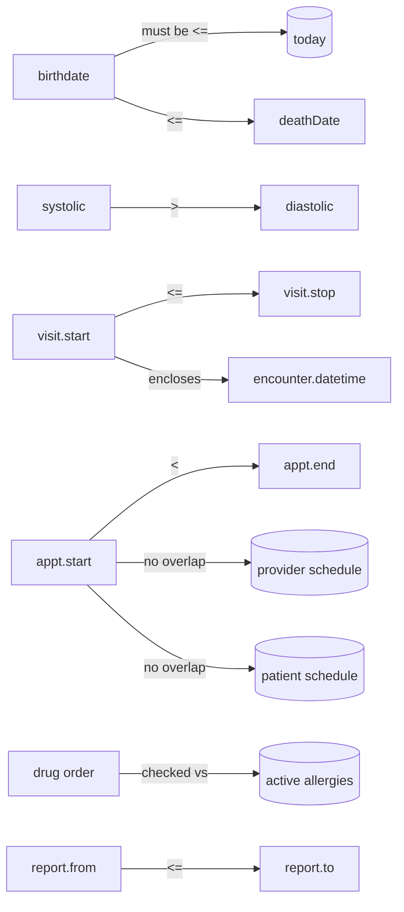
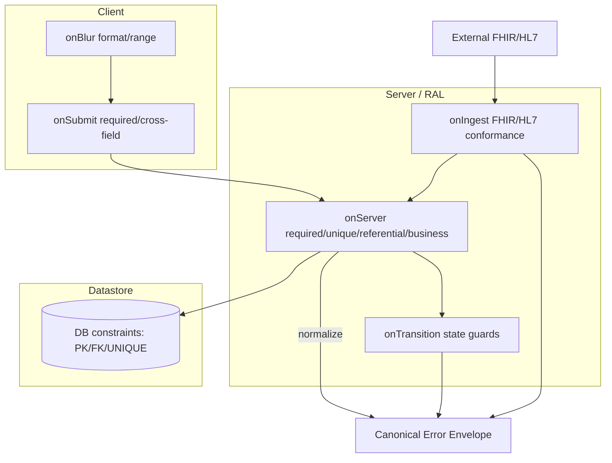

# Validation Matrix

> **Document type:** Reverse-engineering artifact — Validation & Business-Rule Catalog
> **Primary reference system:** OpenMRS Reference Application (legacy O2 — https://o2.openmrs.org; modern demo O3 — https://o3.openmrs.org)
> **Portability target:** OpenEMR, HAPI FHIR, SMART Health IT, in-house **omiiCARE** via the **Resource Adapter Layer (RAL)**
> **Traceability:** Each validation links to one or more requirement IDs `REQ-<PREFIX>-NNN` (catalog of 472 requirements) and is exercised by the 1,349 manual test cases in the RTM.
> **Convention:** Verified facts are stated plainly. Anything beyond verified OpenMRS behavior is marked **(Assumption)**.

---

## 1. Purpose & Scope

This matrix is the single authoritative catalog of **field-level** and **rule-level** validations for the reverse-engineered EHR platform. It exists so that QA can:

- Derive negative / boundary / equivalence-partition test cases directly from validation rows.
- Confirm that error **messages**, **severities**, and **triggers** are consistent across UI, REST, and FHIR surfaces.
- Trace every validation to a requirement (`REQ-*`) and onward to test cases (RTM) and defects.

**In scope:** Demographics, contact, identifiers, login/session, visits, vitals/observations, diagnoses/conditions/allergies, orders (lab/pharmacy), appointments, RBAC gating, data-management merges/deletes, and cross-cutting API/FHIR/HL7 conformance validations.

**Out of scope:** Pure UI layout, copy, and styling assertions (covered in `UI_UX_SPECIFICATION.md`); non-functional thresholds (see `NFR.md`).

---

## 2. Validation Taxonomy

| Code | Class | Definition |
|------|-------|------------|
| **V-REQ** | Required / presence | Field or one-of-group must be non-empty before save. |
| **V-FMT** | Format / syntax | Value must match a pattern (regex, datatype, code system URI). |
| **V-RNG** | Range / bound | Numeric, date, or length within min/max (incl. physiological plausibility). |
| **V-UNQ** | Uniqueness | Value (or composite key) must not already exist. |
| **V-XF** | Cross-field | Value valid only relative to another field's value. |
| **V-BR** | Business rule | Multi-entity / stateful rule (e.g. no double-booking, visit-state guards). |
| **V-REF** | Referential | Foreign key / coded concept must resolve to an existing, non-retired entity. |
| **V-AUTH** | Authorization | Action permitted only with the required privilege/role (RBAC). |
| **V-CONF** | Conformance | Payload conforms to FHIR R4 / HL7 v2 structure & cardinality. |

### Severity legend

| Severity | Meaning | UI behavior | API behavior |
|----------|---------|-------------|--------------|
| **Blocker** | Save/transaction cannot proceed | Inline error, submit disabled/rejected | HTTP 400/409/422, no persistence |
| **Error** | Invalid but recoverable in-context | Inline field error | 400 with field-level `error.fieldErrors` |
| **Warning** | Suspicious; user may override | Confirm dialog / soft warning | 200 with `warning` annotation **(Assumption)** for non-OpenMRS adapters |
| **Info** | Advisory only | Hint text | none |

### Trigger points

`onBlur` (field exit) · `onSubmit` (form/step submit) · `onServer` (server-side persistence) · `onTransition` (state-machine guard) · `onIngest` (HL7/FHIR inbound).

> **Layering principle (Assumption for adapter portability):** every Blocker/Error MUST be enforced `onServer`/`onIngest` even when also enforced in the client. Client-only validation is treated as a defect by QA. The RAL normalizes each backend's native error into the canonical `{code, severity, field, message}` envelope below.

---

## 3. Canonical Error Envelope (RAL-normalized)

```json
{
  "validationId": "VAL-REG-014",
  "requirement": ["REQ-REG-014"],
  "field": "person.birthdate",
  "severity": "Blocker",
  "code": "FUTURE_DATE_NOT_ALLOWED",
  "message": "Birthdate cannot be in the future.",
  "trigger": "onSubmit|onServer",
  "source": "openmrs|openemr|hapi|smart|omiicare"
}
```

The `code` is backend-agnostic; the RAL maps native messages (e.g. OpenMRS `error.required`, FHIR `OperationOutcome.issue`) to it. This lets one test oracle assert across all four backends.

---

## 4. Module Validation Matrices

Columns: **VAL ID · Field / Rule · Class · Trigger · Condition · Message · Severity · REQ.**

### 4.1 Authentication & Session — `AUTH`

| VAL ID | Field / Rule | Class | Trigger | Condition (fails when…) | Message | Severity | REQ |
|--------|--------------|-------|---------|--------------------------|---------|----------|-----|
| VAL-AUTH-001 | Session location | V-REQ | onSubmit | No `<li>` location selected before login | "Please select a login location." | Blocker | REQ-AUTH-003 |
| VAL-AUTH-002 | Username (`#username`) | V-REQ | onSubmit | Empty | "Username is required." | Blocker | REQ-AUTH-001 |
| VAL-AUTH-003 | Password (`#password`) | V-REQ | onSubmit | Empty | "Password is required." | Blocker | REQ-AUTH-001 |
| VAL-AUTH-004 | Credentials valid | V-BR | onServer | Username/password mismatch | "Invalid username or password." (no field-specific enumeration) | Error | REQ-AUTH-004 |
| VAL-AUTH-005 | Account lockout | V-BR | onServer | > N consecutive failures (OpenMRS `allowedFailedLoginsBeforeLockout`, default 7) | "Your account has been locked. Contact an administrator." | Blocker | REQ-AUTH-009, REQ-SEC-012 |
| VAL-AUTH-006 | API auth (REST/FHIR) | V-AUTH | onServer | Missing/invalid Basic/OAuth on `/ws/rest/v1/*` or `/ws/fhir2/R4` | HTTP 401 `Unauthorized` | Blocker | REQ-FHIR-002, REQ-SEC-003 |
| VAL-AUTH-007 | Session timeout | V-BR | onServer | Idle > configured TTL | Redirect to login; "Your session has expired." | Warning | REQ-AUTH-011 |
| VAL-AUTH-008 | Password complexity (admin set) **(Assumption)** | V-FMT | onSubmit | Below min length / missing char class | "Password does not meet complexity requirements." | Error | REQ-SEC-011 |
| VAL-AUTH-009 | Location must be active | V-REF | onSubmit | Selected location retired/disabled | "Selected location is no longer available." | Error | REQ-AUTH-003 |

### 4.2 Patient Registration — `REG`

| VAL ID | Field / Rule | Class | Trigger | Condition | Message | Severity | REQ |
|--------|--------------|-------|---------|-----------|---------|----------|-----|
| VAL-REG-001 | Given Name | V-REQ | onSubmit | Empty | "Given name is required." | Blocker | REQ-REG-002 |
| VAL-REG-002 | Family Name | V-REQ | onSubmit | Empty | "Family name is required." | Blocker | REQ-REG-002 |
| VAL-REG-003 | Name characters | V-FMT | onBlur | Contains digits/illegal symbols (regex `^[\p{L}\p{M}\-' .]+$`) | "Name contains invalid characters." | Error | REQ-REG-003 |
| VAL-REG-004 | Middle Name | V-FMT | onBlur | Optional; same charset rule when present | "Middle name contains invalid characters." | Error | REQ-REG-003 |
| VAL-REG-005 | Gender | V-REQ | onSubmit | Not selected (M/F/other per config) | "Gender is required." | Blocker | REQ-REG-004 |
| VAL-REG-006 | Birthdate present | V-REQ | onSubmit | Neither exact date nor estimated age provided | "Birthdate or estimated age is required." | Blocker | REQ-REG-005 |
| VAL-REG-007 | Birthdate not future | V-XF / V-RNG | onSubmit / onServer | `birthdate > today` | "Birthdate cannot be in the future." | Blocker | REQ-REG-006 |
| VAL-REG-008 | Birthdate plausibility | V-RNG | onSubmit | Age > 120 years (or `birthdate < today-120y`) | "Please verify the birthdate; age exceeds 120 years." | Warning | REQ-REG-007 |
| VAL-REG-009 | Estimated age numeric | V-FMT/V-RNG | onBlur | Non-numeric or ≤ 0 | "Estimated age must be a positive number." | Error | REQ-REG-005 |
| VAL-REG-010 | Address ≥ 1 field | V-REQ | onSubmit | All address sub-fields empty | "At least one address field is required." | Blocker | REQ-REG-010 |
| VAL-REG-011 | Phone Number format | V-FMT | onBlur | Fails phone pattern (E.164 / locale) | "Enter a valid phone number." | Error | REQ-REG-011 |
| VAL-REG-012 | Relationship person exists | V-REF | onSubmit | Related-person lookup returns none | "Related person not found." | Error | REQ-REG-014 |
| VAL-REG-013 | Relationship self-reference | V-XF | onSubmit | Patient related to themselves | "A patient cannot have a relationship to themselves." | Error | REQ-REG-015 |
| VAL-REG-014 | Patient Identifier uniqueness | V-UNQ | onServer | Identifier already assigned to another patient | "This patient identifier is already in use." | Blocker | REQ-REG-018 |
| VAL-REG-015 | Identifier check-digit | V-FMT | onServer | Luhn/mod-30 check fails for identifier type | "Invalid patient identifier (check digit failed)." | Error | REQ-REG-019 |
| VAL-REG-016 | Auto-generated Patient ID | V-BR | onServer | On confirm (`#submit`), system mints unique ID; collision retried | (success toast) "Created Patient Record" | Info | REQ-REG-020 |
| VAL-REG-017 | Duplicate-patient detection | V-BR | onSubmit | High-similarity match on name+gender+DOB **(Assumption)** | "A similar patient may already exist. Review before saving." | Warning | REQ-REG-021, REQ-SRCH-008 |
| VAL-REG-018 | Wizard step order | V-BR | onTransition | Attempt to reach Confirm before required steps complete | "Complete the previous step first." | Error | REQ-REG-001 |
| VAL-REG-019 | Deceased date vs birthdate | V-XF | onSubmit | `deathDate < birthdate` | "Date of death cannot precede birthdate." | Blocker | REQ-PDASH-014 |

### 4.3 Patient Search — `SRCH`

| VAL ID | Field / Rule | Class | Trigger | Condition | Message | Severity | REQ |
|--------|--------------|-------|---------|-----------|---------|----------|-----|
| VAL-SRCH-001 | Min query length | V-RNG | onBlur | Query < 2 (or 3) chars | "Enter at least 2 characters to search." | Warning | REQ-SRCH-002 |
| VAL-SRCH-002 | Identifier exact match | V-FMT | onSubmit | Identifier-shaped query but malformed | "Enter a valid patient identifier." | Info | REQ-SRCH-004 |
| VAL-SRCH-003 | No-results state | V-BR | onServer | Zero matches | "No patients found matching your search." | Info | REQ-SRCH-005 |
| VAL-SRCH-004 | Result-cap / pagination | V-BR | onServer | Matches exceed page size | "Showing first N results; refine your search." | Info | REQ-SRCH-006, REQ-PERF-009 |

### 4.4 Visits — `VISIT`

| VAL ID | Field / Rule | Class | Trigger | Condition | Message | Severity | REQ |
|--------|--------------|-------|---------|-----------|---------|----------|-----|
| VAL-VISIT-001 | One active visit | V-BR | onTransition | "Start Visit" while patient already has an open visit | "This patient already has an active visit." | Blocker | REQ-VISIT-003 |
| VAL-VISIT-002 | Visit type required | V-REQ | onSubmit | No visit type chosen | "Visit type is required." | Blocker | REQ-VISIT-002 |
| VAL-VISIT-003 | Past-visit start ≤ now | V-XF | onSubmit | "Add Past Visit" start date in the future | "Past visit start date cannot be in the future." | Blocker | REQ-VISIT-006 |
| VAL-VISIT-004 | Stop ≥ start | V-XF | onSubmit | `stopDatetime < startDatetime` | "Visit end must be on or after the start." | Blocker | REQ-VISIT-007 |
| VAL-VISIT-005 | No overlapping visits | V-BR | onServer | New visit date range overlaps an existing visit for same patient | "Visit dates overlap an existing visit." | Error | REQ-VISIT-008 |
| VAL-VISIT-006 | Merge same patient | V-BR | onTransition | "Merge Visits" across two different patients | "Only visits for the same patient can be merged." | Blocker | REQ-VISIT-010 |
| VAL-VISIT-007 | Encounter within visit | V-XF | onServer | Encounter datetime outside the parent visit window | "Encounter date must fall within the visit." | Error | REQ-VISIT-009 |
| VAL-VISIT-008 | Location set on visit | V-REQ | onServer | Visit created without session location | "A visit location is required." | Error | REQ-VISIT-004 |

### 4.5 Vitals & Observations — `VITAL`

| VAL ID | Field / Rule | Class | Trigger | Condition | Message | Severity | REQ |
|--------|--------------|-------|---------|-----------|---------|----------|-----|
| VAL-VITAL-001 | Temperature range | V-RNG | onBlur | Outside 25–45 °C (absolute reject); 34–42 plausible | <34/>42 "Verify temperature."; <25/>45 "Temperature out of allowable range." | Warning / Error | REQ-VITAL-003 |
| VAL-VITAL-002 | Heart rate range | V-RNG | onBlur | Outside 0–250 bpm reject; 40–180 plausible | "Verify heart rate." / "Heart rate out of range." | Warning / Error | REQ-VITAL-004 |
| VAL-VITAL-003 | Systolic BP range | V-RNG | onBlur | Outside 0–300 mmHg | "Systolic BP out of range." | Error | REQ-VITAL-005 |
| VAL-VITAL-004 | Diastolic < Systolic | V-XF | onSubmit | `diastolic ≥ systolic` | "Diastolic must be lower than systolic." | Error | REQ-VITAL-006 |
| VAL-VITAL-005 | Respiratory rate | V-RNG | onBlur | Outside 0–80 /min | "Respiratory rate out of range." | Error | REQ-VITAL-007 |
| VAL-VITAL-006 | SpO₂ percentage | V-RNG | onBlur | Outside 0–100 % | "Oxygen saturation must be 0–100%." | Error | REQ-VITAL-008 |
| VAL-VITAL-007 | Height range | V-RNG | onBlur | ≤ 0 or > 272 cm | "Verify height." | Warning | REQ-VITAL-009 |
| VAL-VITAL-008 | Weight range | V-RNG | onBlur | ≤ 0 or > 650 kg | "Verify weight." | Warning | REQ-VITAL-010 |
| VAL-VITAL-009 | Numeric obs format | V-FMT | onBlur | Non-numeric in numeric concept field | "Enter a numeric value." | Error | REQ-VITAL-002 |
| VAL-VITAL-010 | Obs concept resolves | V-REF | onServer | Concept UUID/code not found or retired | "Unknown or retired concept." | Error | REQ-CLIN-012 |
| VAL-VITAL-011 | Obs datetime ≤ now | V-XF | onServer | Observation datetime in the future | "Observation time cannot be in the future." | Error | REQ-VITAL-011 |
| VAL-VITAL-012 | At least one vital entered | V-REQ | onSubmit | All vital fields blank on Capture Vitals | "Enter at least one vital sign." | Error | REQ-VITAL-001 |

> Physiological min/max above are **(Assumption)** defaults sourced from common OpenMRS concept `absoluteHi/absoluteLow` and `hiCritical/lowCritical` ranges; exact numbers are configuration-driven per concept dictionary.

### 4.6 Clinical — Diagnoses, Conditions, Allergies — `CLIN`

| VAL ID | Field / Rule | Class | Trigger | Condition | Message | Severity | REQ |
|--------|--------------|-------|---------|-----------|---------|----------|-----|
| VAL-CLIN-001 | Diagnosis coded concept | V-REF | onSubmit | Free-text diagnosis not mapped to ICD-10/SNOMED concept | "Select a coded diagnosis." | Error | REQ-CLIN-002 |
| VAL-CLIN-002 | Diagnosis certainty | V-REQ | onSubmit | Primary/secondary + confirmed/presumed not set | "Specify diagnosis order and certainty." | Error | REQ-CLIN-003 |
| VAL-CLIN-003 | One primary diagnosis | V-BR | onSubmit | More than one primary on same encounter **(Assumption)** | "Only one primary diagnosis is allowed." | Warning | REQ-CLIN-004 |
| VAL-CLIN-004 | Condition status | V-REQ | onSubmit | Active/Inactive/Resolved not chosen | "Condition status is required." | Error | REQ-CLIN-006 |
| VAL-CLIN-005 | Condition onset ≤ now | V-XF | onSubmit | Onset date in future | "Onset date cannot be in the future." | Error | REQ-CLIN-007 |
| VAL-CLIN-006 | Allergen required | V-REQ | onSubmit | No allergen/substance chosen | "Allergen is required." | Blocker | REQ-CLIN-009 |
| VAL-CLIN-007 | Allergy reaction coded | V-REF | onSubmit | Reaction free-text only | "Select a coded reaction." | Warning | REQ-CLIN-010 |
| VAL-CLIN-008 | Allergy severity | V-REQ | onSubmit | Mild/Moderate/Severe not set | "Reaction severity is required." | Error | REQ-CLIN-011 |
| VAL-CLIN-009 | Duplicate allergy | V-UNQ | onServer | Same allergen already recorded & active | "This allergen is already on the patient's allergy list." | Warning | REQ-CLIN-013 |
| VAL-CLIN-010 | No-known-allergies flag | V-XF | onSubmit | "No Known Allergies" set while allergens present | "Remove existing allergies before marking 'No Known Allergies'." | Error | REQ-CLIN-014 |

### 4.7 Appointments — `APPT`

| VAL ID | Field / Rule | Class | Trigger | Condition | Message | Severity | REQ |
|--------|--------------|-------|---------|-----------|---------|----------|-----|
| VAL-APPT-001 | Service / type required | V-REQ | onSubmit | No appointment service selected | "Select an appointment service." | Blocker | REQ-APPT-002 |
| VAL-APPT-002 | Provider required | V-REQ | onSubmit | No provider chosen (where mandatory) | "A provider is required." | Error | REQ-APPT-003 |
| VAL-APPT-003 | Start in future | V-XF | onSubmit | Scheduled start ≤ now | "Appointment must be scheduled in the future." | Error | REQ-APPT-005 |
| VAL-APPT-004 | End > start | V-XF | onSubmit | `end ≤ start` | "End time must be after start time." | Blocker | REQ-APPT-006 |
| VAL-APPT-005 | **No double-booking (provider)** | V-BR | onServer | New slot overlaps an existing booked appointment for the same provider | "This provider is already booked for the selected time." | Blocker | REQ-APPT-009 |
| VAL-APPT-006 | No double-booking (patient) | V-BR | onServer | Patient already has an overlapping appointment | "The patient already has an appointment at this time." | Error | REQ-APPT-010 |
| VAL-APPT-007 | Within service hours | V-XF | onSubmit | Slot outside the service's availability window | "Selected time is outside service hours." | Error | REQ-APPT-011 |
| VAL-APPT-008 | Capacity / overbooking | V-BR | onServer | Slot capacity exceeded | "This slot is fully booked." | Error | REQ-APPT-012 |
| VAL-APPT-009 | Status transition valid | V-BR | onTransition | Illegal transition (e.g. Completed→Requested) | "Invalid appointment status transition." | Error | REQ-APPT-014 |
| VAL-APPT-010 | Cancel reason | V-REQ | onSubmit | Cancellation without reason **(Assumption)** | "A cancellation reason is required." | Warning | REQ-APPT-015 |

### 4.8 Orders — Lab & Pharmacy — `ORDLAB` / `PHARM`

| VAL ID | Field / Rule | Class | Trigger | Condition | Message | Severity | REQ |
|--------|--------------|-------|---------|-----------|---------|----------|-----|
| VAL-ORDLAB-001 | Test/orderable required | V-REQ | onSubmit | No orderable concept selected | "Select a test to order." | Blocker | REQ-ORDLAB-002 |
| VAL-ORDLAB-002 | Active visit required | V-BR | onServer | Order placed with no active visit/encounter | "Start a visit before placing orders." | Error | REQ-ORDLAB-003, REQ-VISIT-003 |
| VAL-ORDLAB-003 | Result within range flag | V-RNG | onIngest (ORU) | Result outside reference range | flagged H/L/critical (not a reject) | Info/Warning | REQ-ORDLAB-008 |
| VAL-ORDLAB-004 | Result numeric/format | V-FMT | onIngest | Numeric result non-numeric | "Result value is not valid for a numeric test." | Error | REQ-ORDLAB-009 |
| VAL-PHARM-001 | Drug required | V-REQ | onSubmit | No drug/orderable chosen | "Select a drug." | Blocker | REQ-PHARM-002 |
| VAL-PHARM-002 | Dose > 0 | V-RNG | onBlur | Dose ≤ 0 or non-numeric | "Dose must be a positive number." | Error | REQ-PHARM-003 |
| VAL-PHARM-003 | Dose units required | V-REQ | onSubmit | Units empty when dose present | "Dose units are required." | Error | REQ-PHARM-004 |
| VAL-PHARM-004 | Frequency required | V-REQ | onSubmit | No frequency selected | "Frequency is required." | Error | REQ-PHARM-005 |
| VAL-PHARM-005 | Route required | V-REQ | onSubmit | No route selected | "Route of administration is required." | Error | REQ-PHARM-006 |
| VAL-PHARM-006 | Allergy contraindication | V-BR | onServer | Drug matches a recorded active allergen | "Patient has a recorded allergy to this drug." | Warning (override w/ reason) | REQ-PHARM-009, REQ-CLIN-013 |
| VAL-PHARM-007 | Duplicate active order | V-UNQ | onServer | Same drug already on an active order | "An active order for this drug already exists." | Warning | REQ-PHARM-010 |
| VAL-PHARM-008 | Discontinue requires active | V-BR | onTransition | Discontinue/revise an order not in active state | "Only active orders can be discontinued." | Error | REQ-PHARM-011 |

### 4.9 RBAC / Authorization — `RBAC`

| VAL ID | Field / Rule | Class | Trigger | Condition | Message | Severity | REQ |
|--------|--------------|-------|---------|-----------|---------|----------|-----|
| VAL-RBAC-001 | Add Patient privilege | V-AUTH | onServer | User lacks "Add Patients" | HTTP 403 / "You do not have permission to register patients." | Blocker | REQ-RBAC-003 |
| VAL-RBAC-002 | Edit Patient privilege | V-AUTH | onServer | Lacks "Edit Patients" | 403 / "You do not have permission to edit this patient." | Blocker | REQ-RBAC-004 |
| VAL-RBAC-003 | Delete Patient privilege | V-AUTH | onServer | Lacks "Delete Patients" | 403 / "You do not have permission to delete patients." | Blocker | REQ-RBAC-005 |
| VAL-RBAC-004 | Manage Roles privilege | V-AUTH | onServer | Non-admin opens Configure Metadata / roles | 403 / "Administrator privileges required." | Blocker | REQ-RBAC-006 |
| VAL-RBAC-005 | App-tile gating | V-AUTH | onServer | Tile rendered/clicked without backing privilege | tile hidden; direct URL → 403 | Blocker | REQ-RBAC-002 |
| VAL-RBAC-006 | Order signing (clinician) | V-AUTH | onServer | Non-clinician signs an order | 403 / "Only clinicians may sign orders." | Blocker | REQ-RBAC-008 |
| VAL-RBAC-007 | Least-privilege default | V-AUTH | onServer | New role created with no explicit privileges defaults to none **(Assumption)** | (no access) | Info | REQ-RBAC-010, REQ-SEC-015 |

### 4.10 Data Management — `DATA`

| VAL ID | Field / Rule | Class | Trigger | Condition | Message | Severity | REQ |
|--------|--------------|-------|---------|-----------|---------|----------|-----|
| VAL-DATA-001 | Merge preferred patient | V-REQ | onSubmit | No surviving (preferred) record chosen | "Select the record to keep." | Blocker | REQ-DATA-003 |
| VAL-DATA-002 | Merge distinct records | V-XF | onSubmit | Same patient on both sides | "Select two different patients to merge." | Blocker | REQ-DATA-004 |
| VAL-DATA-003 | Merge conflict resolution | V-BR | onSubmit | Conflicting demographics unresolved | "Resolve conflicting fields before merging." | Error | REQ-DATA-005 |
| VAL-DATA-004 | Delete confirmation | V-BR | onSubmit | Delete without explicit confirm | "Confirm permanent deletion of this patient." | Warning | REQ-DATA-007 |
| VAL-DATA-005 | Void reason required | V-REQ | onSubmit | Void/retire without reason | "A reason is required to void this record." | Error | REQ-DATA-008 |
| VAL-DATA-006 | Audit trail written | V-BR | onServer | Any create/update/void/merge must emit audit log (HIPAA) | (silent; absence = defect) | Blocker | REQ-SEC-020, REQ-DATA-010 |

### 4.11 API · FHIR R4 · HL7 v2 Conformance — `FHIR` / `HL7` / `RPT`

| VAL ID | Field / Rule | Class | Trigger | Condition | Message | Severity | REQ |
|--------|--------------|-------|---------|-----------|---------|----------|-----|
| VAL-FHIR-001 | CapabilityStatement version | V-CONF | onServer | `/ws/fhir2/R4/metadata` `fhirVersion ≠ 4.0.1` | OperationOutcome / version mismatch | Error | REQ-FHIR-001 |
| VAL-FHIR-002 | Resource type whitelist | V-CONF | onIngest | Type not in {Patient, Encounter, Observation, Condition, AllergyIntolerance, MedicationRequest} | 404 / "Resource type not supported." | Error | REQ-FHIR-004 |
| VAL-FHIR-003 | Required element cardinality | V-CONF | onIngest | Mandatory element missing (e.g. `Observation.status`, `.code`) | 422 OperationOutcome `required` | Blocker | REQ-FHIR-006 |
| VAL-FHIR-004 | Code system URI correctness | V-FMT | onIngest | Wrong/blank system URI (LOINC `http://loinc.org`, SNOMED `http://snomed.info/sct`, ICD-10) | 422 / "Invalid or missing code system." | Error | REQ-FHIR-008, REQ-CLIN-002 |
| VAL-FHIR-005 | Patient reference resolves | V-REF | onIngest | `subject`/`patient` reference unresolved | 422 / "Referenced Patient not found." | Error | REQ-FHIR-010 |
| VAL-FHIR-006 | Unauthorized FHIR call | V-AUTH | onServer | No/invalid auth | 401 | Blocker | REQ-FHIR-002, REQ-SEC-003 |
| VAL-FHIR-007 | Search param validity | V-FMT | onServer | Unsupported/malformed search parameter | 400 OperationOutcome | Warning | REQ-FHIR-012 |
| VAL-HL7-001 | MSH segment present | V-CONF | onIngest | Inbound ADT/ORM/ORU missing MSH | NAK (AR) | Blocker | REQ-HL7-002 |
| VAL-HL7-002 | Message type supported | V-CONF | onIngest | Type ∉ {ADT, ORM, ORU} | NAK / "Unsupported message type." | Error | REQ-HL7-003 |
| VAL-HL7-003 | PID identifier present | V-REQ | onIngest | PID-3 patient identifier empty | NAK (AE) | Error | REQ-HL7-005 |
| VAL-HL7-004 | Datetime format (TS) | V-FMT | onIngest | Non `YYYYMMDDHHMMSS` HL7 timestamp | NAK / "Invalid datetime format." | Error | REQ-HL7-007 |
| VAL-HL7-005 | ORU result code (LOINC) | V-FMT | onIngest | OBX-3 not a valid LOINC | NAK / "Invalid observation code." | Error | REQ-HL7-009, REQ-ORDLAB-008 |
| VAL-RPT-001 | Report date range | V-XF | onSubmit | `from > to` | "Start date must be before end date." | Error | REQ-RPT-004 |
| VAL-RPT-002 | Report param required | V-REQ | onSubmit | Mandatory parameter empty | "This report parameter is required." | Error | REQ-RPT-003 |

### 4.12 Cross-cutting — Security, Accessibility, Notifications, Billing, Telehealth

| VAL ID | Field / Rule | Class | Trigger | Condition | Message | Severity | REQ |
|--------|--------------|-------|---------|-----------|---------|----------|-----|
| VAL-SEC-001 | Input sanitization (XSS/SQLi) | V-FMT | onServer | Payload contains script/SQL metacharacters in free-text | rejected/escaped; 400 | Blocker | REQ-SEC-005 |
| VAL-SEC-002 | CSRF token | V-CONF | onServer | State-changing form without valid CSRF token | 403 | Blocker | REQ-SEC-007 |
| VAL-SEC-003 | PHI in URL | V-BR | onServer | Identifiers/PHI passed as query params **(Assumption)** | flagged (defect) | Warning | REQ-SEC-009 |
| VAL-A11Y-001 | Field error association | V-CONF | onSubmit | Error not linked via `aria-describedby` | (defect) | Error | REQ-A11Y-006 |
| VAL-A11Y-002 | Required field announce | V-CONF | onBlur | Required not marked `aria-required` | (defect) | Warning | REQ-A11Y-007 |
| VAL-NOTIF-001 | Notification recipient | V-REQ | onServer | Reminder/alert with no resolvable recipient | "No valid recipient for notification." | Error | REQ-NOTIF-003 |
| VAL-BILL-001 | Charge amount ≥ 0 | V-RNG | onSubmit | Negative charge **(Assumption)** | "Charge amount cannot be negative." | Error | REQ-BILL-004 |
| VAL-TELE-001 | Telehealth link validity | V-FMT | onServer | Malformed/expired session link **(Assumption)** | "Telehealth session link is invalid." | Error | REQ-TELE-005 |

---

## 5. Key Business-Rule Validations (Detailed)

### 5.1 Future-DOB Rejection (`VAL-REG-007`)
- **Rule:** `person.birthdate ≤ currentDate` in the session timezone.
- **Triggers:** client `onSubmit` AND server `onServer` (defense-in-depth). FHIR `onIngest` rejects `Patient.birthDate > today` with `OperationOutcome` severity `error`.
- **Edge cases:** today's date allowed (newborn); timezone boundary — server uses UTC-normalized comparison **(Assumption)**; estimated-age path computes birthdate and re-applies the same guard.
- **Linked:** REQ-REG-006. **Test cases:** boundary (today, today+1, today−1), leap-day, far-future.

### 5.2 No Double-Booking (`VAL-APPT-005` / `VAL-APPT-006`)
- **Rule:** For a given provider, the half-open interval `[start, end)` must not overlap any existing non-cancelled appointment. Same for patient.
- **Overlap predicate:** `newStart < existingEnd AND newEnd > existingStart`.
- **Severity:** provider clash = **Blocker**; patient clash = **Error** (configurable override).
- **Edge cases:** back-to-back (`newStart == existingEnd`) is allowed; cancelled/no-show appointments excluded; multi-resource (room + provider) checked independently **(Assumption)**.
- **Linked:** REQ-APPT-009/010. **Test cases:** exact overlap, partial overlap (front/back), containment, adjacency, cancelled-excluded.

### 5.3 Single Active Visit (`VAL-VISIT-001`)
- **Rule:** A patient may have at most one visit with `stopDatetime IS NULL`. "Start Visit" is blocked while one is open.
- **Edge cases:** "Add Past Visit" with closed dates is permitted concurrently; overlapping past visits → `VAL-VISIT-005`.
- **Linked:** REQ-VISIT-003.

### 5.4 Identifier Uniqueness + Check Digit (`VAL-REG-014/015`)
- **Rule:** `(identifierType, identifier)` unique across non-voided patients; check digit per the type's validator (e.g. Luhn mod-30).
- **Race condition:** uniqueness enforced at DB constraint, not just app layer, to survive concurrent registration **(Assumption)**.
- **Linked:** REQ-REG-018/019. **Test cases:** duplicate insert (concurrent), bad check digit, voided-patient identifier reuse.

### 5.5 Allergy-Aware Prescribing (`VAL-PHARM-006`)
- **Rule:** On drug order, cross-check the active allergy list; if the drug (or its class) matches a recorded allergen, raise a **Warning** requiring an override reason.
- **Linked:** REQ-PHARM-009 ↔ REQ-CLIN-013. **Test cases:** exact-drug match, drug-class match, inactive allergy ignored, override-reason captured in audit.

---

## 6. Cross-Field Dependency Map



---

## 7. Validation Enforcement Layering



**QA mandate:** every **Blocker/Error** must be proven enforceable on the server (bypass the client via direct REST/FHIR call). A rule that only fails in the UI is logged as a defect against the relevant `REQ-*`.

---

## 8. Resource Adapter Layer (RAL) — Backend Mapping

| Validation surface | OpenMRS (primary) | OpenEMR | HAPI FHIR | SMART Health IT | omiiCARE |
|--------------------|-------------------|---------|-----------|-----------------|----------|
| Required/format | Validator + Hibernate | form/PHP validators | StructureDef + profiles | profile-driven | RAL rules engine **(Assumption)** |
| Uniqueness | DB unique + IdentifierValidator | DB unique | n/a (server-dependent) | n/a | RAL **(Assumption)** |
| Business rules | service-layer (visit/appt) | service-layer | custom interceptors | app logic | RAL **(Assumption)** |
| Conformance | fhir2 module / HL7 engine | FHIR/HL7 modules | core profile validator | inferno-style | RAL maps to envelope |
| Error shape | `error.fieldErrors` / OperationOutcome | varied | OperationOutcome | OperationOutcome | canonical envelope |

The RAL guarantees that the same `VAL-*` id produces the same canonical `code`/`severity` regardless of backend, so the 1,349 test cases assert once and run cross-platform.

---

## 9. Traceability & Coverage

| Module | VAL rows | Primary REQ prefixes | Notes |
|--------|----------|----------------------|-------|
| AUTH | 9 | REQ-AUTH, REQ-SEC, REQ-FHIR | session + API auth |
| REG | 19 | REQ-REG, REQ-PDASH, REQ-SRCH | wizard + identifiers |
| SRCH | 4 | REQ-SRCH, REQ-PERF | query guards |
| VISIT | 8 | REQ-VISIT | state machine |
| VITAL | 12 | REQ-VITAL, REQ-CLIN | physiological ranges |
| CLIN | 10 | REQ-CLIN | coded clinical data |
| APPT | 10 | REQ-APPT | double-booking core |
| ORDLAB/PHARM | 12 | REQ-ORDLAB, REQ-PHARM, REQ-CLIN | order safety |
| RBAC | 7 | REQ-RBAC, REQ-SEC | authorization |
| DATA | 6 | REQ-DATA, REQ-SEC | merge/void/audit |
| FHIR/HL7/RPT | 14 | REQ-FHIR, REQ-HL7, REQ-RPT | conformance |
| Cross-cutting | 8 | REQ-SEC, REQ-A11Y, REQ-NOTIF, REQ-BILL, REQ-TELE | platform-wide |

> **Coverage assertion (Assumption):** every validation row maps to ≥ 1 requirement and ≥ 1 RTM test case; orphan validations (no REQ) or orphan REQs (no validation) are flagged in the RTM gap report.

---

## 10. Negative-Test Derivation Guide

For each row, QA derives at minimum:
1. **Happy path** — valid value passes.
2. **Boundary** — at min, min−1, max, max+1 (for V-RNG / V-XF dates).
3. **Empty/null** — for V-REQ.
4. **Malformed** — for V-FMT (regex/code-system/datatype).
5. **Duplicate/collision** — for V-UNQ (including concurrent).
6. **Unauthorized** — for V-AUTH (direct API bypass).
7. **State violation** — for V-BR/V-TRANSITION.
8. **Conformance break** — for V-CONF (missing element, wrong cardinality, wrong system URI).

This yields the negative and boundary cases that populate the 1,349-case suite and keeps the matrix the source of truth for all validation testing.

---

*End of Validation Matrix.*
