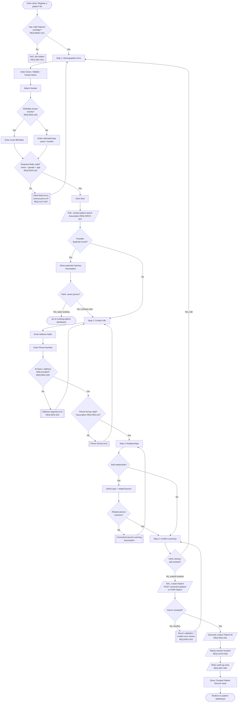
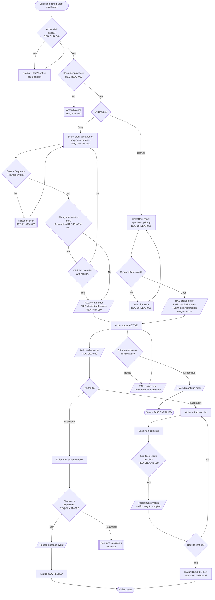
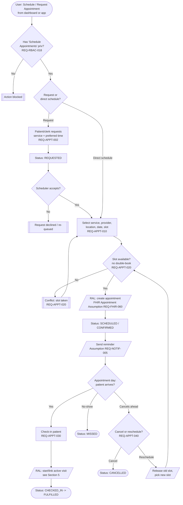
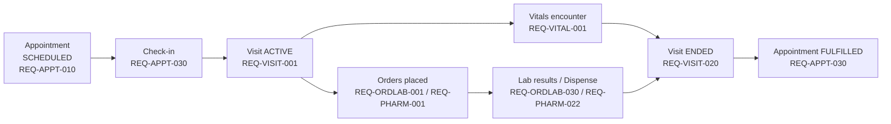

# Activity Diagrams — OpenMRS Reference Application (Reverse-Engineered)

> **Scope.** UML-style activity diagrams (rendered as Mermaid flowcharts) for the four core clinical workflows of the OpenMRS Reference Application: **Patient Registration Wizard**, **Order Lifecycle**, **Appointment Lifecycle**, and **Visit Lifecycle**.
> **Primary reference system:** OpenMRS legacy O2 Reference Application (`https://o2.openmrs.org`). Diagrams are authored against the **Resource Adapter Layer (RAL)** abstraction so they remain valid for OpenEMR, HAPI FHIR, SMART Health IT, and the in-house **omiiCARE** app.
> **Convention.** Verified behavior is stated plainly. Inferred behavior is marked **(Assumption)**. Requirement IDs `REQ-<PREFIX>-NNN` are cross-referenced for RTM traceability.

---

## 1. Reading Guide

| Element | Mermaid representation | Meaning |
|---|---|---|
| Start / End | `([ ])` stadium | Initial / final node of the activity |
| Action | `[ ]` rectangle | A user or system step |
| Decision | `{ }` diamond | Branch / validation guard |
| System action | `[/ /]` parallelogram | Backend / API / persistence step |
| Error sink | `[[ ]]` subroutine box | Validation failure / blocked path |
| Swimlane | `subgraph` | Actor or system boundary |

**Actors referenced:** Registration Clerk, Clinician/Doctor, Nurse, Pharmacist, Lab Tech, Scheduler, System (`REQ-RBAC-*` gate every privileged transition).

**Adapter note.** Every step tagged `[/RAL …/]` is dispatched through the Resource Adapter Layer, which maps the abstract operation onto the concrete backend (OpenMRS REST `/ws/rest/v1/*`, FHIR R4 `/ws/fhir2/R4`, OpenEMR, HAPI FHIR, or omiiCARE). The activity logic is backend-agnostic; only the adapter binding changes.

---

## 2. Patient Registration Wizard

**Workflow.** Multi-step `registrationapp` wizard: **Demographics → Contact Info → Relationships → Confirm**, with per-step client validation and a final server-side persistence + ID generation step.
**Key requirements:** `REQ-REG-001..` (wizard flow), `REQ-REG-010` (mandatory name fields), `REQ-REG-018` (birthdate exact/estimated), `REQ-REG-025` (address ≥1 field), `REQ-REG-031` (unique Patient ID), `REQ-AUTH-005` (session location stamped on encounter), `REQ-RBAC-012` ("Add Patients" privilege), `REQ-SEC-040` (audit log of create), `REQ-A11Y-007` (field-level error announcements).

### 2.1 Activity Diagram — Registration with Validation Branches



**Validation branch summary (RTM hooks)**

| Branch | Guard | Failure sink | Requirement |
|---|---|---|---|
| Name/gender/age required | non-empty + valid gender | inline field errors | `REQ-REG-010` |
| Birthdate exact vs estimated | one mode chosen | inline error | `REQ-REG-018` |
| Address ≥1 field | any address field set | address-required error | `REQ-REG-025` |
| Phone format **(Assumption)** | regex pass | phone format error | `REQ-REG-027` |
| Duplicate detection **(Assumption)** | no high-confidence match | match-review prompt | `REQ-SRCH-022` |
| Server accept | 2xx response | conflict/validation error | `REQ-REG-033` |

---

## 3. Order Lifecycle

**Workflow.** Clinician places a **Drug order** (→ Pharmacy) or **Test order** (Lab/Radiology → results). OpenMRS persists orders via the REST `order`/`encounter` resources within an active visit; FHIR exposes `MedicationRequest` (drug) and `ServiceRequest`/`Observation` (lab). Orders move through **NEW → ACTIVE → (REVISED) → COMPLETED**, or **DISCONTINUED**.
**Key requirements:** `REQ-ORDLAB-001..` (lab order entry), `REQ-PHARM-001..` (drug order entry), `REQ-CLIN-040` (order requires active visit/encounter), `REQ-RBAC-020` ("Order Tests"/"Prescribe" privilege), `REQ-ORDLAB-030` (result entry → ORU), `REQ-PHARM-022` (dispense), `REQ-HL7-010` (ORM/ORU messaging — **(Assumption)** for legacy O2), `REQ-FHIR-050` (MedicationRequest mapping), `REQ-SEC-040` (audit).

### 3.1 Activity Diagram — Order Lifecycle



**Order status model**

| Status | Trigger | FHIR mapping | Requirement |
|---|---|---|---|
| NEW → ACTIVE | order saved within visit | `MedicationRequest.status=active` / `ServiceRequest.status=active` | `REQ-ORDLAB-001`, `REQ-PHARM-001` |
| REVISED | clinician edits active order | new resource, `priorPrescription`/`replaces` | `REQ-PHARM-018` **(Assumption)** |
| COMPLETED | dispensed / results verified | `status=completed` | `REQ-PHARM-022`, `REQ-ORDLAB-030` |
| DISCONTINUED | clinician stops order | `status=stopped` / `cancelled` | `REQ-CLIN-045` |

---

## 4. Appointment Lifecycle

**Workflow.** Appointment Scheduling app (`appointmentschedulingui`): **Request/Schedule → Confirmed → (Reminder) → Checked-In → Fulfilled (visit) / Missed / Cancelled / Rescheduled**.
**Key requirements:** `REQ-APPT-001..` (schedule appointment), `REQ-APPT-010` (provider + service + slot), `REQ-APPT-020` (double-booking guard), `REQ-APPT-030` (check-in links to visit), `REQ-APPT-040` (cancel/reschedule), `REQ-NOTIF-005` (reminder — **(Assumption)**), `REQ-RBAC-018` ("Schedule Appointments" privilege), `REQ-FHIR-060` (FHIR Appointment mapping — **(Assumption)** for O2).

### 4.1 Activity Diagram — Appointment Lifecycle



**Appointment state table**

| State | Entry trigger | Exit transitions | Requirement |
|---|---|---|---|
| REQUESTED | patient/clerk request | → SCHEDULED, DECLINED | `REQ-APPT-002` |
| SCHEDULED/CONFIRMED | slot booked, no conflict | → CHECKED_IN, CANCELLED, MISSED, RESCHEDULED | `REQ-APPT-010`, `REQ-APPT-020` |
| CHECKED_IN | patient arrives, visit linked | → FULFILLED | `REQ-APPT-030` |
| FULFILLED | encounter completed | terminal | `REQ-APPT-030` |
| MISSED | no-show at slot time | terminal | `REQ-APPT-035` |
| CANCELLED / RESCHEDULED | clerk action before slot | terminal / re-enter SCHEDULED | `REQ-APPT-040` |

---

## 5. Visit Lifecycle

**Workflow.** A **Visit** groups encounters at a location for a time window. Dashboard **General Actions**: Start Visit, Add Past Visit, Merge Visits. Visit: **Active → encounters captured → Closed/Ended**; past visits back-dated; multiple visits can be **merged**.
**Key requirements:** `REQ-VISIT-001` (start visit), `REQ-VISIT-005` (visit type + location), `REQ-VISIT-010` (encounters within visit — vitals, notes, orders), `REQ-VISIT-020` (end/close visit), `REQ-VISIT-025` (add past visit, back-dated), `REQ-VISIT-030` (merge visits), `REQ-AUTH-005` (session location), `REQ-RBAC-022` ("Manage Visits" privilege), `REQ-FHIR-055` (FHIR Encounter mapping), `REQ-SEC-040` (audit).

### 5.1 Activity Diagram — Visit Lifecycle

```mermaid
flowchart TD
    Start([Clinician/Nurse on patient dashboard]) --> Priv{Has 'Manage Visits' priv?<br/>REQ-RBAC-022}
    Priv -- No --> Denied[[Action blocked]]
    Priv -- Yes --> Action{General Action chosen}

    %% --- Start active visit ---
    Action -- Start Visit --> Existing{Active visit<br/>already open?}
    Existing -- Yes --> Resume[Open existing active visit]
    Existing -- No --> NewVisit[Select Visit Type + Location<br/>REQ-VISIT-005]
    NewVisit --> LocStamp[/Stamp session location<br/>REQ-AUTH-005/]
    LocStamp --> SaveVisit[/RAL: create Visit<br/>FHIR Encounter REQ-FHIR-055/]
    SaveVisit --> Active

    Resume --> Active[Visit status: ACTIVE]

    %% --- Encounters within visit ---
    Active --> Capture{Capture encounter?}
    Capture -- Vitals --> EncV[Capture Vitals<br/>REQ-VITAL-001]
    Capture -- Clinical note --> EncN[Clinical note / diagnosis<br/>REQ-CLIN-001]
    Capture -- Order --> EncO[Place order<br/>see Section 3]
    EncV --> PersistEnc[/RAL: persist encounter + obs<br/>REQ-VISIT-010/]
    EncN --> PersistEnc
    EncO --> PersistEnc
    PersistEnc --> Audit[/Audit encounter<br/>REQ-SEC-040/]
    Audit --> Active

    %% --- Close visit ---
    Active --> Close{End visit?<br/>REQ-VISIT-020}
    Close -- No, keep open --> Active
    Close -- Yes --> EndChk{Open orders /<br/>unsigned notes?<br/>Assumption}
    EndChk -- Yes --> Warn[[Warn: pending items<br/>Assumption REQ-VISIT-021]]
    Warn --> ConfirmEnd{Proceed anyway?}
    ConfirmEnd -- No --> Active
    ConfirmEnd -- Yes --> Ended
    EndChk -- No --> Ended[/RAL: set visit stopDatetime/]
    Ended --> Closed([Visit status: ENDED])

    %% --- Past visit + merge branches ---
    Action -- Add Past Visit --> PastForm[Enter back-dated start/stop<br/>+ type + location<br/>REQ-VISIT-025]
    PastForm --> PastVal{Dates valid &<br/>not future?}
    PastVal -- No --> ErrPast[[Date validation error]]
    ErrPast --> PastForm
    PastVal -- Yes --> SavePast[/RAL: create back-dated visit/]
    SavePast --> Closed

    Action -- Merge Visits --> SelMerge[Select source + target visits<br/>REQ-VISIT-030]
    SelMerge --> MergeChk{Compatible<br/>(same patient)?}
    MergeChk -- No --> ErrMerge[[Merge blocked]]
    MergeChk -- Yes --> DoMerge[/RAL: move encounters,<br/>merge windows, audit/]
    DoMerge --> Closed
```

**Visit state table**

| State | Entry trigger | Encounters allowed | Exit | Requirement |
|---|---|---|---|---|
| ACTIVE | Start Visit (type+location) | vitals, notes, orders | → ENDED | `REQ-VISIT-001`, `REQ-VISIT-010` |
| ENDED | clinician closes / stopDatetime set | read-only (Assumption) | terminal | `REQ-VISIT-020` |
| PAST (back-dated) | Add Past Visit | back-dated encounters | terminal | `REQ-VISIT-025` |
| MERGED | Merge Visits | encounters consolidated | terminal | `REQ-VISIT-030` |

---

## 6. Cross-Workflow Interaction (Composite)

How the four activities chain in a typical outpatient journey (traceability spine).



---

## 7. Adapter-Layer Portability Notes

| Abstract step | OpenMRS (primary) | OpenEMR | HAPI FHIR / SMART | omiiCARE |
|---|---|---|---|---|
| Create patient | `POST /ws/rest/v1/patient` | `/api/patient` | `POST Patient` | adapter `createPatient()` |
| Start visit | `POST /ws/rest/v1/visit` | `/api/encounter` | `POST Encounter` | adapter `openVisit()` |
| Place order | `order` resource / `MedicationRequest` | order module | `MedicationRequest`/`ServiceRequest` | adapter `placeOrder()` |
| Appointment | `appointmentschedulingui` | appointments API | `Appointment` resource | adapter `bookAppointment()` |
| Auth gate | session + RBAC privilege | ACL | OAuth scopes / SMART | omiiCARE RBAC |

**Portability assertions (Assumption where noted):**
- All four activities are expressible purely through the RAL; only binding tables differ. **(Assumption)** for OpenEMR/omiiCARE specifics not directly verified.
- Auth precondition (`REQ-AUTH-*`, `REQ-RBAC-*`) is the **first gate** in every activity; unauthorized → terminal block, mapping to REST `401`/`403` or FHIR `OperationOutcome`.
- HL7 v2 ORM/ORU and FHIR `Appointment` flows for legacy O2 are marked **(Assumption)** — confirmed for O3 / HAPI but not asserted as verified O2 RefApp behavior.

---

## 8. Traceability Index (Diagram → Requirements)

| Diagram | Primary REQ prefixes | Notable IDs |
|---|---|---|
| §2 Registration Wizard | REG, RBAC, AUTH, A11Y, SEC, SRCH | REQ-REG-010/018/025/031/033, REQ-RBAC-012 |
| §3 Order Lifecycle | ORDLAB, PHARM, CLIN, FHIR, HL7, SEC | REQ-ORDLAB-001/030, REQ-PHARM-001/022, REQ-CLIN-040 |
| §4 Appointment Lifecycle | APPT, NOTIF, RBAC, FHIR | REQ-APPT-002/010/020/030/040 |
| §5 Visit Lifecycle | VISIT, VITAL, CLIN, AUTH, FHIR, SEC | REQ-VISIT-001/010/020/025/030 |
| §6 Composite | APPT, VISIT, ORDLAB, PHARM, VITAL | cross-spine |

> **Assumption log.** Items explicitly marked **(Assumption)**: duplicate detection in registration, phone-format validation, drug interaction alerts, HL7 ORM/ORU on legacy O2, FHIR Appointment on O2, appointment reminders, end-visit pending-item warning, read-only ENDED visits, and OpenEMR/omiiCARE adapter specifics. These require validation against the live system before being promoted to verified test bases.
