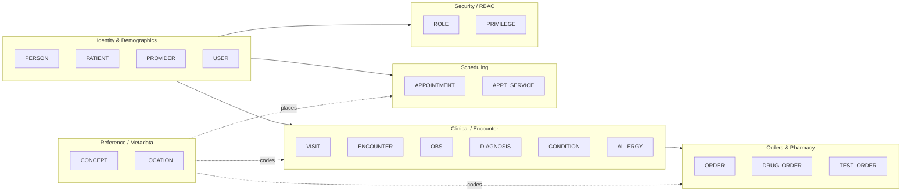
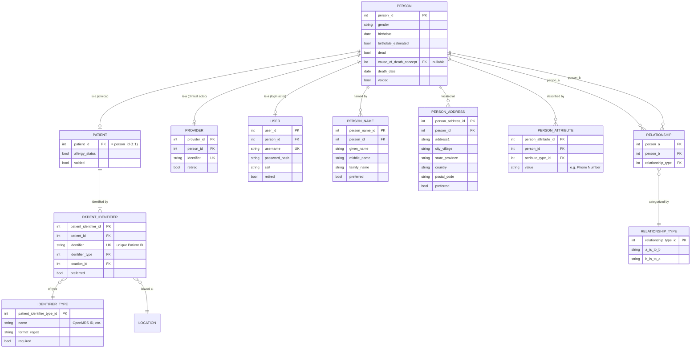
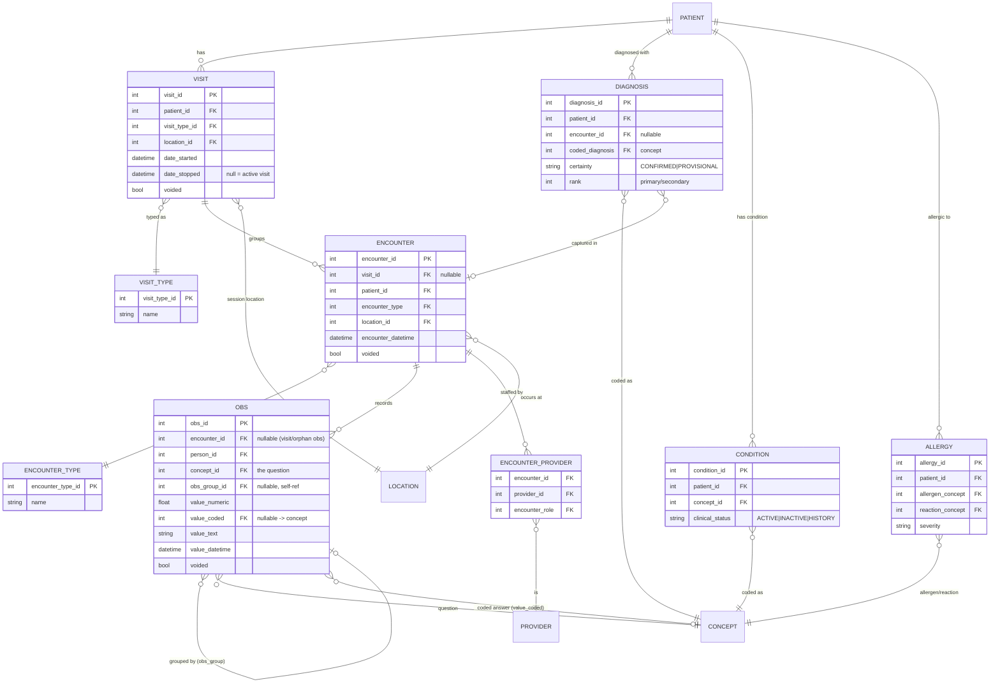
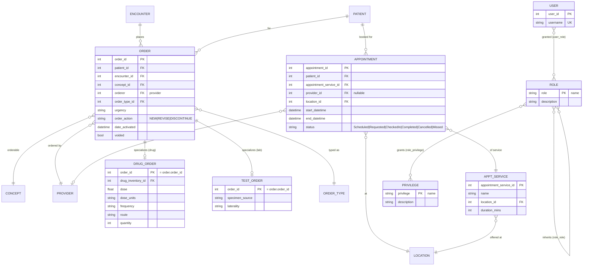
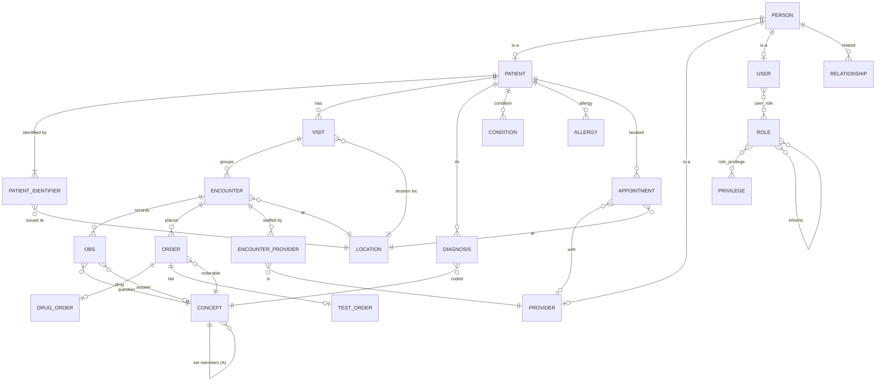
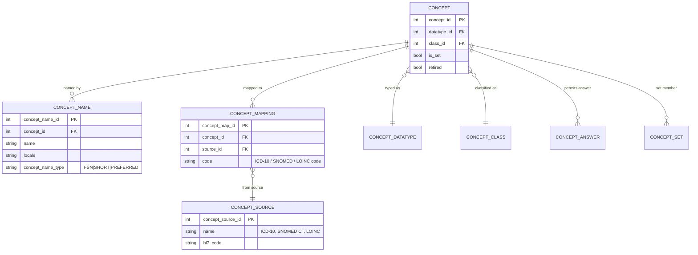
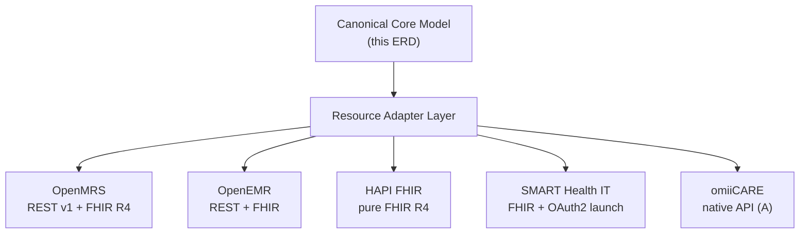

# Entity Relationship Diagram (ERD)

**System under reverse-engineering:** OpenMRS Reference Application (legacy O2 RefApp, `https://o2.openmrs.org`; modern demo O3 at `o3.openmrs.org`).
**Document scope:** Conceptual + logical data model of the core **clinical / identity / scheduling / security** schema, expressed as Mermaid `erDiagram` blocks with explicit relationships and cardinalities.
**Portability:** OpenMRS is the **primary reference**. The model is abstracted so a **Resource Adapter Layer (RAL)** can map the same canonical entities onto **OpenEMR**, **HAPI FHIR**, **SMART Health IT**, and the in-house **omiiCARE** app (see §9).

> **Verified vs inferred.** Entities, attributes, and cardinalities that match observed OpenMRS Reference Application behavior or the documented OpenMRS data model are stated plainly. Anything beyond that (extra columns, vendor parity, omiiCARE specifics) is marked **(Assumption)**. Requirement IDs `REQ-<PREFIX>-NNN` are cross-referenced for RTM traceability.

---

## 1. How to read this document

- **Notation:** Mermaid Entity Relationship syntax. Crow's-foot endpoints encode cardinality.
- **Cardinality legend**

  | Mermaid | Reads as | Meaning |
  |---|---|---|
  | `||--||` | one-to-one | exactly one on each side |
  | `||--o{` | one-to-zero-or-many | one parent, 0..* children |
  | `||--|{` | one-to-one-or-many | one parent, 1..* children |
  | `}o--o{` | many-to-many | resolved via a junction entity |
  | `}o--||` | many-to-one (mandatory parent) | 0..* children, exactly one parent |

- **PK** = primary key, **FK** = foreign key, **UK** = unique key, **(A)** = Assumption.
- The schema is split into four bounded contexts to keep each diagram legible; §6 stitches them into one consolidated view.

---

## 2. Domain map (bounded contexts)

**Identity model (critical, drives test boundaries).** OpenMRS separates **Person** (demographic root) from **Patient** (clinical identity). Every `Patient` *is-a* `Person` sharing `person_id`; a `Person` can exist without being a `Patient` (staff-only providers/users). `Provider` and `User` are also Person specializations. This 1:1 specialization is the demographics-vs-clinical-identity boundary tested under `REQ-REG-001..NNN` and `REQ-AUTH-NNN`.

---

## 3. Identity & demographics subschema

**Cardinality & rule notes**

| Relationship | Cardinality | Verified? | Trace |
|---|---|---|---|
| Person → Patient | 1 .. 0..1 | Verified | REQ-REG-001 |
| Person → Provider | 1 .. 0..1 | Verified | REQ-RBAC-NNN |
| Person → User | 1 .. 0..1 | Verified | REQ-AUTH-NNN |
| Person → PersonName | 1 .. 1..* (>=1 preferred) | Verified | REQ-REG-010 |
| Person → PersonAddress | 1 .. 0..* (>=1 field required to save an address) | Verified | REQ-REG-020 |
| Patient → PatientIdentifier | 1 .. 1..* (>=1, exactly one preferred, identifier unique per type) | Verified | REQ-REG-030 |
| PatientIdentifier → IdentifierType | many .. 1 | Verified | REQ-REG-031 |
| PatientIdentifier → Location | many .. 1 (issuing location) | Verified | REG-032 |
| Person ↔ Person via Relationship | M:N, self-referential (person_a, person_b) | Verified | REQ-REG-040 |
| Phone Number | stored as PersonAttribute, not a column **(A)** | Assumption | REQ-REG-021 |

---

## 4. Clinical / encounter subschema

**Cardinality & rule notes**

| Relationship | Cardinality | Verified? | Trace |
|---|---|---|---|
| Patient → Visit | 1 .. 0..* (at most one *active* visit, `date_stopped` null) | Verified | REQ-VISIT-001 |
| Visit → Encounter | 1 .. 0..* | Verified | REQ-VISIT-010 |
| Encounter → Obs | 1 .. 0..* | Verified | REQ-VITAL-NNN, REQ-CLIN-NNN |
| Obs → Obs (obs_group) | 0..1 .. 0..* (self-referential grouping for panels, e.g. vitals) | Verified | REQ-VITAL-020 |
| Obs → Concept (question) | many .. 1 (mandatory) | Verified | REQ-CLIN-005 |
| Obs → Concept (value_coded) | many .. 0..1 (only when datatype is coded) | Verified | REQ-CLIN-006 |
| Encounter → Provider | M:N via ENCOUNTER_PROVIDER + role | Verified | REQ-CLIN-030 |
| Encounter → Location | many .. 1 | Verified | REQ-VISIT-011 |
| Obs may be encounter-less | obs.encounter_id nullable (visit-level / orphan obs) **(A)** | Assumption | REQ-CLIN-007 |
| Diagnosis/Condition/Allergy → Patient | many .. 1 | Verified | REQ-PDASH-NNN |

---

## 5. Orders, scheduling & RBAC subschema

**Cardinality & rule notes**

| Relationship | Cardinality | Verified? | Trace |
|---|---|---|---|
| Encounter → Order | 1 .. 0..* | Verified | REQ-ORDLAB-001, REQ-PHARM-001 |
| Order → DrugOrder / TestOrder | 1 .. 0..1 (table-per-subclass; shared PK) | Verified | REQ-PHARM-010 / REQ-ORDLAB-010 |
| Order → Concept (orderable) | many .. 1 | Verified | REQ-ORDLAB-005 |
| Patient → Appointment | 1 .. 0..* | Verified | REQ-APPT-001 |
| Appointment → Provider | many .. 0..1 (provider optional at request stage) | Verified | REQ-APPT-005 |
| Appointment → Location / Service | many .. 1 | Verified | REQ-APPT-006 |
| User ↔ Role | M:N (`user_role`) | Verified | REQ-RBAC-001 |
| Role ↔ Privilege | M:N (`role_privilege`) | Verified | REQ-RBAC-010 |
| Role ↔ Role | M:N self-ref (inheritance) | Verified | REQ-RBAC-020 |
| Privilege gates app/action visibility | enforced at REST/UI layer | Verified | REQ-SEC-NNN, REQ-RBAC-030 |

**Role/privilege seed (verified RefApp set):** System Administrator, Doctor/Clinician, Nurse, Registration Clerk, Pharmacist, Lab Tech — gating privileges Add Patients, Edit Patients, Delete Patients, Manage Roles, etc. See `RBAC_MATRIX.md`.

---

## 6. Consolidated core ERD (single view)

---

## 7. Concept (terminology) detail

`CONCEPT` is the universal reference for questions, coded answers, orderables, diagnoses, conditions and allergens — the spine of OpenMRS terminology.

| Coding system | Used for | Mapped via | Trace |
|---|---|---|---|
| ICD-10 | Diagnoses, conditions | CONCEPT_MAPPING → CONCEPT_SOURCE | REQ-CLIN-NNN |
| SNOMED CT | Clinical findings, allergens | CONCEPT_MAPPING | REQ-CLIN-NNN |
| LOINC | Lab observations / orderables | CONCEPT_MAPPING | REQ-ORDLAB-NNN |

---

## 8. FHIR R4 / HL7 v2 projection

The relational core projects onto FHIR R4 resources via `/openmrs/ws/fhir2/R4` and onto HL7 v2 messages. This mapping is what the Resource Adapter Layer normalizes across vendors.

| Canonical entity | FHIR R4 resource | HL7 v2 segment/msg | Trace |
|---|---|---|---|
| Person / Patient | `Patient` | PID (ADT) | REQ-FHIR-001, REQ-HL7-001 |
| Provider | `Practitioner` / `PractitionerRole` | PV1.7 | REQ-FHIR-010 |
| Location | `Location` | PV1.3 | REQ-FHIR-011 |
| Visit | `Encounter` (class=visit) | PV1 (ADT) | REQ-FHIR-020 |
| Encounter | `Encounter` | PV1 / EVN | REQ-FHIR-020 |
| Obs | `Observation` | OBX (ORU) | REQ-FHIR-030, REQ-HL7-030 |
| Diagnosis / Condition | `Condition` | DG1 | REQ-FHIR-040 |
| Allergy | `AllergyIntolerance` | AL1 | REQ-FHIR-041 |
| DrugOrder | `MedicationRequest` | RXO/RXE (ORM) | REQ-FHIR-050, REQ-PHARM-NNN |
| TestOrder | `ServiceRequest` | ORC/OBR (ORM) | REQ-ORDLAB-NNN |
| Appointment | `Appointment` | SIU (S12) | REQ-APPT-NNN |
| Concept + mappings | `CodeableConcept` / `Coding` | CE/CWE fields | REQ-FHIR-060 |

> CapabilityStatement reports `fhirVersion 4.0.1`. All REST (`/ws/rest/v1/*`) and FHIR endpoints require auth (Basic/OAuth); unauthorized → **401** (REQ-SEC-NNN).

---

## 9. Resource Adapter Layer — cross-vendor mapping

The canonical schema above is the **internal model**. The RAL maps it to each backend so test suites and the omiiCARE app stay vendor-neutral.

| Canonical entity | OpenMRS (primary) | OpenEMR (A) | HAPI FHIR | SMART Health IT | omiiCARE (A) |
|---|---|---|---|---|---|
| Patient | `patient`/`person` | `patient_data` | `Patient` | `Patient` | `member` |
| Provider | `provider` | `users`/`providers` | `Practitioner` | `Practitioner` | `clinician` |
| Visit | `visit` | `form_encounter` (visit) | `Encounter` | `Encounter` | `episode` |
| Encounter | `encounter` | `form_encounter` | `Encounter` | `Encounter` | `visit_event` |
| Obs | `obs` | `observation` | `Observation` | `Observation` | `metric` |
| Order (drug) | `drug_order` | `prescriptions` | `MedicationRequest` | `MedicationRequest` | `rx` |
| Appointment | `appointment` | `openemr_postcalendar_events` | `Appointment` | `Appointment` | `booking` |
| Concept code | `concept`+`concept_reference_map` | `list_options`/`codes` | `CodeableConcept` | `CodeableConcept` | `code_ref` |
| Role/Privilege | `role`/`privilege` | `acl`/`gacl` | (deployment IAM) | OAuth scopes | `role`/`scope` |

**Adapter design rules**

- Identity split (Person vs Patient) is OpenMRS-specific; vendors that flatten it (OpenEMR, HAPI) collapse to a single Patient — the adapter synthesizes a virtual `person_id`. **(A)**
- Obs grouping (`obs_group_id`) maps to FHIR `Observation.hasMember`; vendors without grouping flatten panels. **(A)**
- RBAC: OpenMRS role/privilege ↔ SMART OAuth scopes ↔ omiiCARE role/scope is many-to-many and lossy; the RAL keeps a privilege→scope crosswalk (see `RBAC_MATRIX.md`). **(A)**

---

## 10. Integrity & test-relevant constraints

| # | Constraint | Type | Trace |
|---|---|---|---|
| C1 | `patient_identifier.identifier` unique within identifier type | Unique | REQ-REG-030 |
| C2 | Exactly one preferred PersonName, one preferred PatientIdentifier per Patient | Business | REQ-REG-010/030 |
| C3 | At most one active Visit per Patient (`date_stopped` null) **(A)** | Business | REQ-VISIT-002 |
| C4 | An address row requires ≥1 non-empty field | Business | REQ-REG-020 |
| C5 | `obs.value_coded` only when concept datatype = Coded | Conditional | REQ-CLIN-006 |
| C6 | `order` of action DISCONTINUE must reference a prior active order **(A)** | Referential | REQ-PHARM-020 |
| C7 | Soft-delete via `voided`/`retired` flags, not physical delete (audit trail) | Audit | REQ-SEC-NNN, REQ-DATA-NNN |
| C8 | `cause_of_death_concept` required when `person.dead = true` (per config) | Conditional | REQ-PDASH-042 |
| C9 | Deleting a Patient (RefApp "Delete Patient") voids dependents, gated by Delete Patients privilege | Cascade + RBAC | REQ-RBAC-030 |
| C10 | All REST/FHIR access authenticated; anonymous → 401 | Security | REQ-SEC-NNN, REQ-FHIR-NNN |

---

## 11. Traceability summary

| Subschema | Primary requirement prefixes |
|---|---|
| Identity & demographics (§3) | REQ-REG, REQ-AUTH, REQ-PDASH |
| Clinical / encounter (§4) | REQ-VISIT, REQ-VITAL, REQ-CLIN, REQ-PDASH |
| Orders & pharmacy (§5) | REQ-ORDLAB, REQ-PHARM |
| Scheduling (§5) | REQ-APPT |
| Security / RBAC (§5) | REQ-RBAC, REQ-SEC |
| Terminology (§7) | REQ-CLIN, REQ-ORDLAB |
| Interop projection (§8) | REQ-FHIR, REQ-HL7 |
| Cross-vendor (§9) | REQ-DATA, REQ-FHIR, REQ-RBAC |

> Related artifacts: `../DATA_DICTIONARY.md` (attribute-level detail), `../FIELD_DICTIONARY.md` (UI field bindings), `../RBAC_MATRIX.md` (privilege grid), `./WORKFLOW_DIAGRAMS.md` (process flows). This ERD is the structural counterpart to those behavioral documents.
