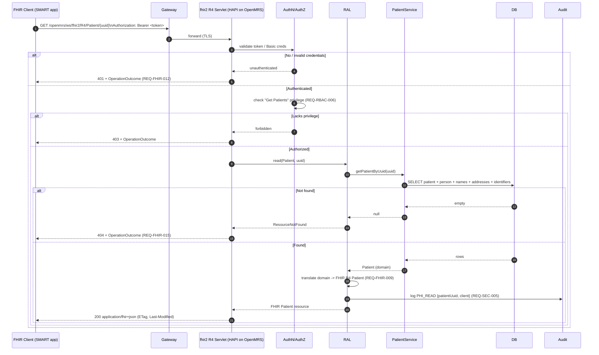
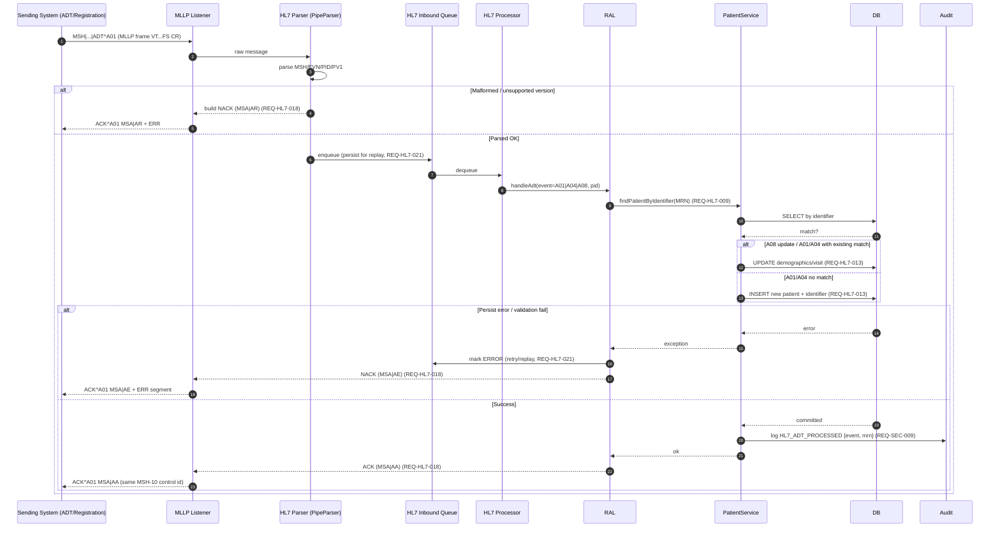
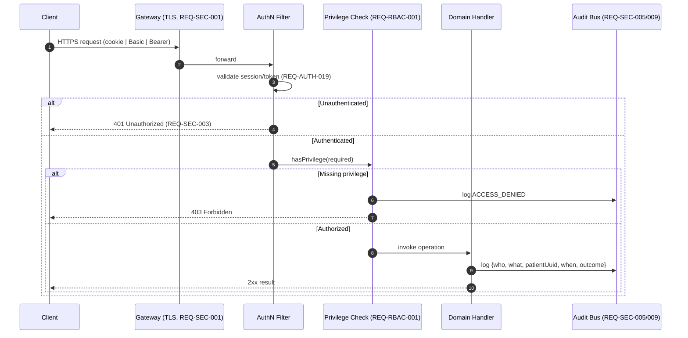

# Sequence Diagrams — OpenMRS Reference Application (Reverse-Engineered)

> **Primary reference system:** OpenMRS Reference Application (legacy O2 RefApp, `o2.openmrs.org`; modern demo O3 at `o3.openmrs.org`).
> **Portability:** All flows are designed against a **Resource Adapter Layer (RAL)** so the same sequences map onto OpenEMR, HAPI FHIR, SMART Health IT, and the in-house **omiiCARE** app. Adapter-specific behavior is called out where it diverges.
> **Notation:** Mermaid `sequenceDiagram`. Inferences beyond verified OpenMRS behavior are tagged **(Assumption)**.
> **Traceability:** Each diagram cites requirement IDs `REQ-<PREFIX>-NNN` from the 472-requirement catalog. Manual test cases (1,349) trace to these via the RTM.

---

## Table of Contents

| # | Diagram | Primary Module | Key REQ IDs |
|---|---------|----------------|-------------|
| 1 | Login + Session Establishment | AUTH | REQ-AUTH-001..030, REQ-SEC-014 |
| 2 | Register Patient (UI → Server → DB) | REG | REQ-REG-001..045 |
| 3 | FHIR R4 Patient Read | FHIR | REQ-FHIR-001..020 |
| 4 | REST Create Patient | REG / DATA | REQ-REG-050, REQ-DATA-011 |
| 5 | Appointment Booking + Conflict Check | APPT | REQ-APPT-001..028 |
| 6 | HL7 ADT Inbound (A01/A04/A08) | HL7 | REQ-HL7-001..022 |
| 7 | Cross-cutting: Auth + Audit envelope (shared) | SEC / AUTH | REQ-SEC-001..020 |

---

## Conventions Used in All Diagrams

| Participant | Role | OpenMRS realization | RAL abstraction |
|-------------|------|---------------------|-----------------|
| `Browser` | Thin client (RefApp UI) | coreapps / registrationapp OWA + JSP | Web client |
| `Gateway` | Reverse proxy / TLS term | Apache/Nginx fronting Tomcat **(Assumption)** | Ingress |
| `WebApp` | App server | Tomcat + OpenMRS webapp | Service host |
| `RAL` | Resource Adapter Layer | OpenMRS REST/FHIR module facade **(Assumption: explicit layer)** | Vendor adapter |
| `Service` | Domain service | `PatientService`, `VisitService`, etc. | Domain API |
| `DAO` | Persistence | Hibernate DAOs | Repository |
| `DB` | Datastore | MySQL/MariaDB | RDBMS |
| `Audit` | Audit log sink | atomfeed / logging **(Assumption)** | Audit bus |

> **Auth note:** REST (`/openmrs/ws/rest/v1/*`) and FHIR (`/openmrs/ws/fhir2/R4`) require auth (Basic or OAuth/session cookie). Unauthorized requests return **401**. Every privileged call is gated by RBAC privileges (REQ-RBAC-*).

---

## 1. Login + Session Establishment

**Covers:** Location selection (Outpatient Clinic, Inpatient Ward, Pharmacy, Laboratory, Registration Desk, Isolation Ward), credential submit (`#username`, `#password`, `#loginButton`), session creation, RBAC role resolution.
**REQ:** REQ-AUTH-001 (login form), REQ-AUTH-007 (session location mandatory), REQ-AUTH-012 (invalid credential handling), REQ-AUTH-019 (session timeout), REQ-SEC-014 (audit login events), REQ-RBAC-003 (role → privilege resolution).

```mermaid
sequenceDiagram
    autonumber
    actor User
    participant Browser
    participant Gateway
    participant WebApp as WebApp (Spring MVC)
    participant Auth as AuthN/AuthZ (Context)
    participant Service as UserService
    participant DB
    participant Audit

    User->>Browser: Navigate to /openmrs/login.htm
    Browser->>Gateway: GET /openmrs/login.htm (TLS)
    Gateway->>WebApp: forward
    WebApp-->>Browser: Login page (location <li> list + #username/#password)
    Note over Browser: REQ-AUTH-007 — a session LOCATION must be chosen

    User->>Browser: Select location (e.g. Outpatient Clinic), enter admin/Admin123
    Browser->>Gateway: POST /openmrs/loginServlet (username, password, sessionLocationId)
    Gateway->>WebApp: forward + #loginButton submit
    WebApp->>Auth: authenticate(username, password)
    Auth->>Service: getUserByUsername(username)
    Service->>DB: SELECT user, salted hash
    DB-->>Service: user row + roles
    Service-->>Auth: User + Roles

    alt Credentials invalid
        Auth-->>WebApp: AuthenticationException
        WebApp->>Audit: log FAILED_LOGIN (REQ-SEC-014)
        WebApp-->>Browser: 200 login.htm + "Invalid username/password" (REQ-AUTH-012)
    else Credentials valid
        Auth->>Auth: resolve privileges from roles (REQ-RBAC-003)
        Auth->>WebApp: bind sessionLocation to UserContext (REQ-AUTH-007)
        WebApp->>DB: persist/refresh HTTP session
        WebApp->>Audit: log LOGIN_SUCCESS {user, location, ip} (REQ-SEC-014)
        WebApp-->>Browser: 302 -> /referenceapplication/home.page (Set-Cookie JSESSIONID; HttpOnly,Secure)
        Browser->>Gateway: GET home.page (cookie)
        Gateway->>WebApp: forward
        WebApp-->>Browser: Home dashboard tiles filtered by privileges
        Note over Browser: Tiles shown only for granted apps (REQ-RBAC-008)
    end
```

**Adapter notes (RAL):**
- **OpenEMR:** session login via `interface/main/main_screen.php`; no first-class "session location" — map facility selection to OpenEMR `facility` **(Assumption)**.
- **HAPI FHIR / SMART Health IT:** no UI session; replace location+credentials with **SMART-on-FHIR OAuth2 authorization_code + PKCE**, returning a bearer token; "session location" carried as a launch context parameter **(Assumption)**.
- **omiiCARE:** JWT issued by in-house IdP; session location is a required custom claim **(Assumption)**.

**Failure / edge paths:** account locked after N failures (REQ-AUTH-014, **Assumption** on threshold), expired password forces reset (REQ-AUTH-016), session idle timeout → 302 to login (REQ-AUTH-019).

---

## 2. Register Patient (UI → Server → DB)

**Covers:** registrationapp multi-step wizard — Demographics → Contact Info → Relationships → Confirm (`#submit`); unique Patient ID generation; redirect to patient dashboard; "Created Patient Record" toast.
**REQ:** REQ-REG-001 (Demographics: given/middle/family, gender, birthdate exact or estimated), REQ-REG-010 (Address ≥1 field required), REQ-REG-014 (phone validation), REQ-REG-022 (relationships optional), REQ-REG-030 (idgen unique identifier), REQ-REG-038 (atomic save), REQ-REG-041 (success toast + redirect), REQ-SEC-009 (audit create).

```mermaid
sequenceDiagram
    autonumber
    actor Clerk as Registration Clerk
    participant Browser as Browser (registrationapp OWA)
    participant WebApp
    participant RAL as Resource Adapter Layer
    participant PS as PatientService
    participant IDGen as IdentifierSource (idgen)
    participant DAO as Hibernate DAO
    participant DB
    participant Audit

    Clerk->>Browser: Open "Register a patient"
    Browser-->>Clerk: Step 1 Demographics form

    Clerk->>Browser: Enter given/middle/family, gender, birthdate (exact|estimated)
    Browser->>Browser: Client validation (REQ-REG-001)
    Clerk->>Browser: Next -> Step 2 Contact Info
    Clerk->>Browser: Address (>=1 field, REQ-REG-010) + Phone (REQ-REG-014)
    Clerk->>Browser: Next -> Step 3 Relationships (optional, REQ-REG-022)
    Clerk->>Browser: Next -> Step 4 Confirm
    Clerk->>Browser: Click #submit

    Browser->>WebApp: POST registration payload (JSON)
    WebApp->>RAL: createPatient(demographics, addresses, names, relationships)
    RAL->>PS: savePatient(Patient)
    Note over PS: REQ-RBAC-005 privilege "Add Patients" enforced; else 403

    PS->>IDGen: generateIdentifier(source=OpenMRS ID)
    IDGen->>DB: reserve next sequence (row lock)
    DB-->>IDGen: next value + check digit
    IDGen-->>PS: unique Patient ID (REQ-REG-030)

    PS->>DAO: persist person, person_name, person_address, patient, patient_identifier
    DAO->>DB: BEGIN TX; INSERTs; COMMIT (REQ-REG-038 atomic)
    alt DB constraint / validation error
        DB-->>DAO: error
        DAO-->>PS: rollback
        PS-->>RAL: ValidationException
        RAL-->>WebApp: 400 with field errors
        WebApp-->>Browser: inline errors, stay on wizard
    else Success
        DB-->>DAO: committed (patient_id)
        PS->>Audit: log PATIENT_CREATED {patientUuid, clerk} (REQ-SEC-009)
        PS-->>RAL: Patient(uuid, identifier)
        RAL-->>WebApp: 201 Created
        WebApp-->>Browser: 302 -> patient dashboard
        Browser-->>Clerk: "Created Patient Record" toast (REQ-REG-041)
    end
```

**Adapter notes (RAL):**
- **OpenEMR:** `new_patient.php` / REST `POST /api/patient`; identifier = `pubpid` **(Assumption)**.
- **HAPI FHIR / SMART:** wizard maps to a single FHIR `Patient` create (see Diagram 4); idgen replaced by server-assigned logical id.
- **omiiCARE:** same RAL contract; idgen delegated to in-house MPI for cross-system patient matching **(Assumption)**.

---

## 3. FHIR R4 Patient Read

**Covers:** `GET /openmrs/ws/fhir2/R4/Patient/{id}`; CapabilityStatement `fhirVersion 4.0.1`; auth required (401 if missing); RBAC read gating.
**REQ:** REQ-FHIR-001 (R4 base), REQ-FHIR-004 (CapabilityStatement), REQ-FHIR-009 (Patient read by id), REQ-FHIR-012 (401 unauthenticated), REQ-FHIR-015 (404 unknown id), REQ-FHIR-018 (OperationOutcome on error), REQ-SEC-005 (PHI access audit).



**Adapter notes (RAL):** HAPI FHIR and SMART Health IT serve native FHIR R4 (translation is identity). OpenEMR exposes `/apis/default/fhir/Patient/{id}` (OAuth2 required). omiiCARE adapter maps internal model to R4 and must preserve `meta.profile` for US Core conformance **(Assumption)**.

---

## 4. REST Create Patient

**Covers:** `POST /openmrs/ws/rest/v1/patient` with nested `person` (names, addresses, gender, birthdate) + `identifiers`; auth required (401); 201 with uuid on success.
**REQ:** REQ-REG-050 (REST patient create), REQ-DATA-011 (server-side validation), REQ-FHIR-012/SEC parity for 401, REQ-SEC-009 (audit create).

```mermaid
sequenceDiagram
    autonumber
    participant Client as REST Client
    participant Gateway
    participant REST as ws/rest/v1 Controller
    participant Auth
    participant RAL
    participant PS as PatientService
    participant Val as Validator
    participant DAO
    participant DB
    participant Audit

    Client->>Gateway: POST /openmrs/ws/rest/v1/patient\nAuthorization: Basic <...>\n{person:{names,gender,birthdate,addresses}, identifiers:[...]}
    Gateway->>REST: forward (TLS)

    REST->>Auth: authenticate
    alt Unauthenticated
        Auth-->>REST: 401
        REST-->>Client: 401 Unauthorized
    else Authenticated + has "Add Patients"
        REST->>RAL: createPatient(dto)
        RAL->>PS: savePatient(Patient)
        PS->>Val: validate(Patient)
        alt Invalid (missing name/gender/birthdate, bad identifier)
            Val-->>PS: errors
            PS-->>RAL: APIException
            RAL-->>REST: 400 Bad Request (field errors, REQ-DATA-011)
            REST-->>Client: 400 {error:{message, fieldErrors}}
        else Valid
            PS->>DAO: persist person/patient/identifier
            DAO->>DB: BEGIN; INSERTs; COMMIT
            DB-->>DAO: patient_id, uuid
            PS->>Audit: log PATIENT_CREATED (REQ-SEC-009)
            PS-->>RAL: Patient(uuid)
            RAL-->>REST: created
            REST-->>Client: 201 Created\n{uuid, display, identifiers, links}
        end
    end
```

**Idempotency (Assumption):** REST create is not idempotent; clients should pre-check by identifier (`GET /patient?identifier=`) to avoid duplicates (REQ-DATA-013). RAL may add an `Idempotency-Key` shim for omiiCARE/HAPI.

---

## 5. Appointment Booking + Conflict Check

**Covers:** Schedule Appointment from patient dashboard; provider + service + time-slot selection; **conflict detection** (double-booking, provider unavailable, location closed) before commit.
**REQ:** REQ-APPT-001 (book appointment), REQ-APPT-008 (provider availability lookup), REQ-APPT-013 (slot conflict rejection), REQ-APPT-017 (overbooking policy), REQ-APPT-021 (confirmation + status SCHEDULED), REQ-NOTIF-004 (notify patient/provider), REQ-SEC-009 (audit).

```mermaid
sequenceDiagram
    autonumber
    actor Sched as Scheduler/Clerk
    participant Browser as Browser (appointmentscheduling UI)
    participant WebApp
    participant RAL
    participant AS as AppointmentService
    participant Avail as AvailabilityEngine
    participant DB
    participant Notif as Notification Svc
    participant Audit

    Sched->>Browser: Open "Schedule Appointment" for patient
    Browser->>WebApp: GET services + providers + open slots (date range)
    WebApp->>RAL: getAvailableSlots(service, provider, range)
    RAL->>AS: searchSlots(...)
    AS->>DB: SELECT provider schedule, existing appointments, blocks
    DB-->>AS: slots + bookings
    AS-->>RAL: candidate slots (REQ-APPT-008)
    RAL-->>Browser: render open slots

    Sched->>Browser: Pick slot (provider P, 2026-07-03 10:00, Outpatient Clinic)
    Browser->>WebApp: POST appointment {patient, provider, service, start, end, location}
    WebApp->>RAL: bookAppointment(req)
    RAL->>AS: book(req)

    AS->>DB: BEGIN TX; SELECT ... FOR UPDATE overlapping appts for provider/location
    Note over AS,DB: Lock prevents race double-book (REQ-APPT-013)
    AS->>Avail: checkConflicts(provider, location, start, end)
    Avail-->>AS: conflictResult

    alt Conflict (provider busy / slot taken / location closed)
        AS->>DB: ROLLBACK
        AS-->>RAL: ConflictException (409)
        RAL-->>WebApp: 409 with conflicting appt + alternatives
        WebApp-->>Browser: "Time not available" + suggested slots (REQ-APPT-013)
    else Overbooking allowed by policy
        Note over AS: REQ-APPT-017 only if provider/role permits overbook
        AS->>DB: INSERT appointment (status=SCHEDULED); COMMIT
        AS->>Audit: log APPT_OVERBOOKED (REQ-SEC-009)
        AS-->>RAL: Appointment(uuid, OVERBOOKED-flag)
        RAL-->>WebApp: 201
        WebApp-->>Browser: booked with overbook warning
    else No conflict
        AS->>DB: INSERT appointment (status=SCHEDULED); COMMIT (REQ-APPT-021)
        AS->>Audit: log APPT_CREATED (REQ-SEC-009)
        AS->>Notif: notify(patient, provider) (REQ-NOTIF-004)
        AS-->>RAL: Appointment(uuid)
        RAL-->>WebApp: 201 Created
        WebApp-->>Browser: "Appointment scheduled" confirmation
    end
```

**Conflict matrix (Assumption beyond verified UI):**

| Check | Source | Outcome |
|-------|--------|---------|
| Slot already booked (same provider, overlap) | `SELECT ... FOR UPDATE` | 409 reject |
| Provider time-off / not on schedule | provider schedule table | 409 reject |
| Location closed / holiday | location calendar | 409 reject |
| Patient already booked elsewhere (overlap) | patient appts | warn (REQ-APPT-019, **Assumption**) |
| Overbook permitted by role | RBAC policy | allow + flag (REQ-APPT-017) |

**Adapter notes:** HAPI FHIR models this as `Appointment` + `Slot` + `Schedule`; conflict check = `Slot.status=busy`. OpenEMR uses `openemr_postcalendar_events`. omiiCARE RAL exposes the same `bookAppointment` contract over its scheduling microservice **(Assumption)**.

---

## 6. HL7 ADT Inbound (A01 / A04 / A08)

**Covers:** Inbound HL7 v2 ADT messages (A01 admit, A04 register, A08 update) over MLLP; parse → patient match/create → persist → **ACK/NACK** (MSA). OpenMRS HL7 queue processing.
**REQ:** REQ-HL7-001 (MLLP listener), REQ-HL7-004 (ADT A01/A04/A08 parse), REQ-HL7-009 (PID → patient match by MRN), REQ-HL7-013 (create/update patient), REQ-HL7-018 (ACK AA / NACK AE/AR with MSA), REQ-HL7-021 (error queue + replay), REQ-SEC-009 (audit inbound), REQ-DATA-011 (validation).



**ACK codes (HL7 v2):**

| Code | Meaning | When |
|------|---------|------|
| `AA` | Application Accept | parsed + persisted OK |
| `AE` | Application Error | parsed OK, processing/validation failed → replayable |
| `AR` | Application Reject | malformed / unsupported / auth reject |

**Adapter notes:** HAPI provides the v2 `PipeParser` + MLLP `HL7Service`. SMART Health IT / pure-FHIR stacks have no native HL7 v2 — RAL must bridge ADT→FHIR (`A01`→`Encounter`+`Patient`, `A08`→`Patient` update) **(Assumption)**. omiiCARE consumes ADT via the same MLLP listener feeding its MPI **(Assumption)**.

---

## 7. Cross-Cutting: Auth + Audit Envelope (Shared)

Every privileged sequence above is wrapped by the same auth/audit envelope. Shown once to avoid repetition.

**REQ:** REQ-SEC-001 (TLS in transit), REQ-SEC-003 (authN required for all PHI ops), REQ-SEC-005 (PHI read audit), REQ-SEC-009 (write audit), REQ-RBAC-001 (privilege check), REQ-AUTH-019 (session validity).



---

## Traceability Summary

| Diagram | Modules (prefix) | Representative REQ IDs | Notes |
|---------|------------------|------------------------|-------|
| 1 Login + Session | AUTH, SEC, RBAC | REQ-AUTH-001/007/012/019, REQ-SEC-014, REQ-RBAC-003 | Session location mandatory |
| 2 Register Patient | REG, RBAC, SEC | REQ-REG-001/010/014/022/030/038/041, REQ-SEC-009 | idgen unique ID, atomic TX |
| 3 FHIR Patient Read | FHIR, RBAC, SEC | REQ-FHIR-001/004/009/012/015/018, REQ-SEC-005 | 401/403/404 + OperationOutcome |
| 4 REST Create Patient | REG, DATA, SEC | REQ-REG-050, REQ-DATA-011/013, REQ-SEC-009 | 401/400/201 |
| 5 Appointment Booking | APPT, NOTIF, SEC | REQ-APPT-001/008/013/017/021, REQ-NOTIF-004 | FOR UPDATE conflict lock |
| 6 HL7 ADT Inbound | HL7, DATA, SEC | REQ-HL7-001/004/009/013/018/021, REQ-SEC-009 | AA/AE/AR ACK semantics |
| 7 Auth + Audit | SEC, AUTH, RBAC | REQ-SEC-001/003/005/009, REQ-RBAC-001 | Shared envelope |

> **Assumption ledger:** Items tagged **(Assumption)** (gateway topology, explicit RAL layer, idempotency shim, overbooking/patient-overlap policy, ADT→FHIR bridging, MPI integration, lock-out thresholds) are design inferences, not verified OpenMRS behavior, and must be validated against the target deployment before test automation hardening.
