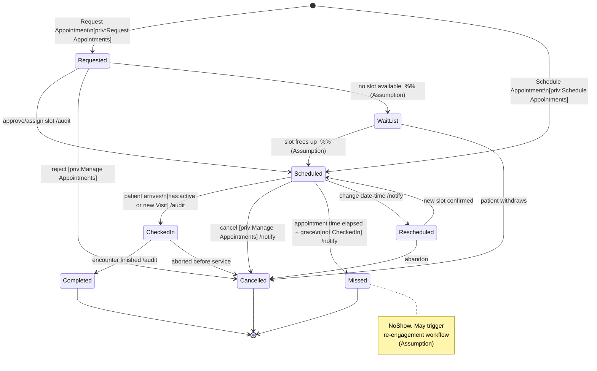
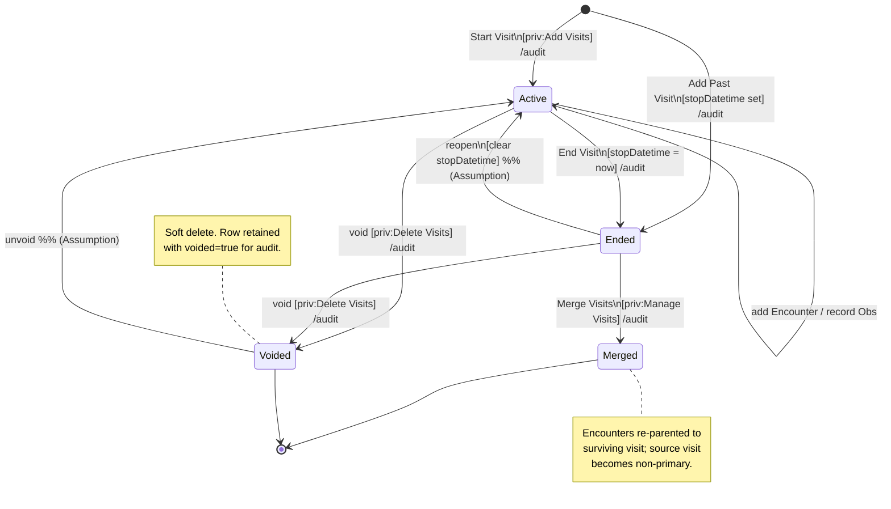
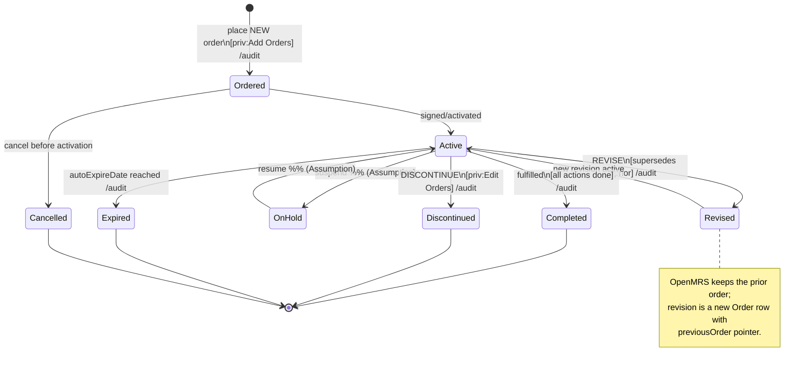
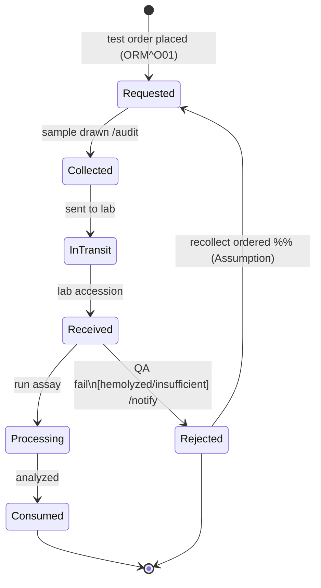
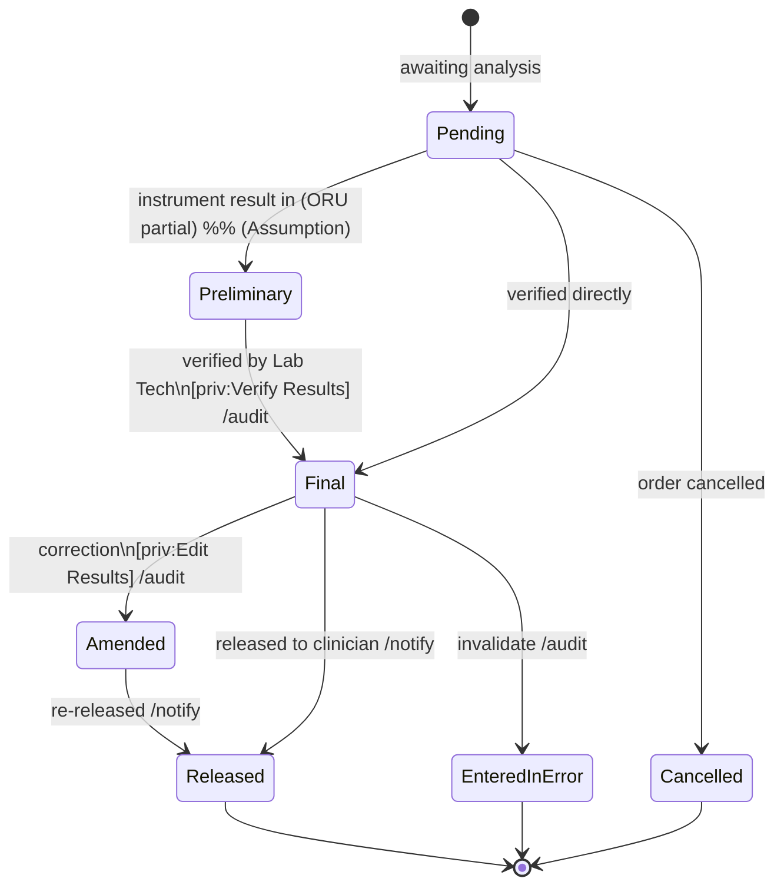
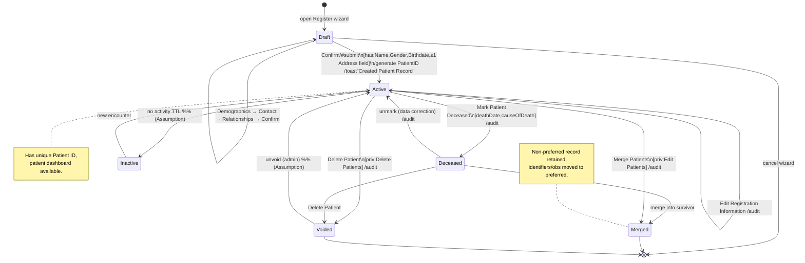
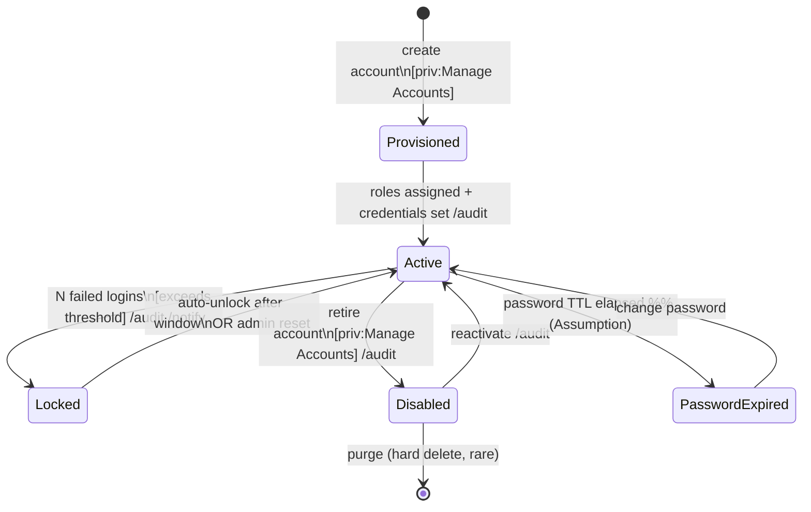
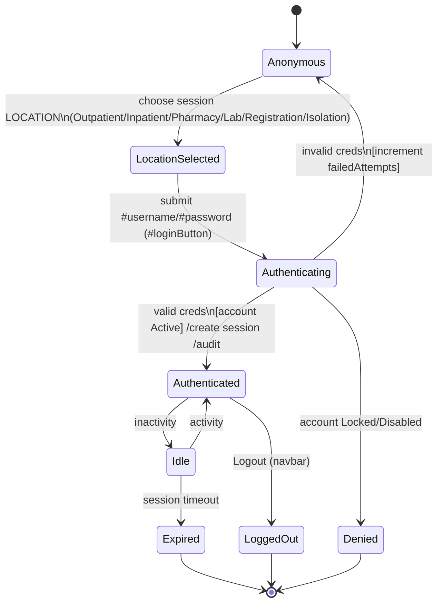
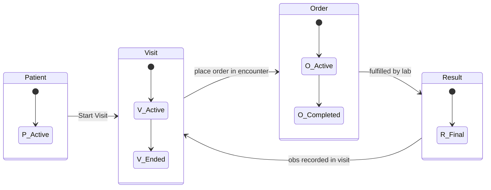

# State Diagrams — OpenMRS Reference Application (and Adapter-Backed EHR Targets)

> **Scope.** This document reverse-engineers the lifecycle state machines that govern the core
> clinical and administrative entities exposed by the OpenMRS Reference Application (legacy O2,
> `https://o2.openmrs.org`; modern demo O3 at `o3.openmrs.org`). OpenMRS is the **PRIMARY reference
> system**. Each state machine is expressed in a backend-neutral form so it can be mapped, through the
> **Resource Adapter Layer (RAL)**, onto OpenEMR, HAPI FHIR, SMART Health IT, and the in-house
> **omiiCARE** application.
>
> **Notation.** All diagrams are Mermaid `stateDiagram-v2`. Guard conditions are shown in
> `[brackets]`, triggering events/actions after a slash. Privilege gates reference the RBAC model.
>
> **Inference policy.** Facts verified against the Reference Application are stated plainly. Any state,
> transition, or guard inferred beyond verified behavior is tagged **(Assumption)**.
>
> **Traceability.** Each section cross-references requirement IDs `REQ-<PREFIX>-NNN` from the
> 472-requirement catalog. These anchor the 1,349 manual test cases via the RTM.

---

## 0. Conventions & Cross-Cutting Notes

| Convention | Meaning |
|---|---|
| `[* ]` initial pseudostate | Entity creation event |
| `[*]` final pseudostate | Terminal state; entity no longer transitions |
| `(Assumption)` | Inferred — not directly verified against the RefApp UI/REST/FHIR surface |
| Guard `[priv:X]` | Transition gated by RBAC privilege X (see RBAC section) |
| Guard `[has:Y]` | Transition gated by data precondition Y |
| Action `/audit` | HIPAA audit-log event MUST be written on this transition (REQ-SEC-***) |

**Adapter mapping legend** (used in every section's mapping table):

| Target | Status field source |
|---|---|
| OpenMRS REST | entity-specific status property (`voided`, `stopped`, `status`, etc.) |
| OpenMRS FHIR R4 | FHIR resource `status` / `clinicalStatus` element |
| OpenEMR | column-level status flags (Assumption — adapter-normalized) |
| HAPI FHIR | canonical FHIR R4 `status` value sets |
| SMART Health IT | read-mostly sandbox; same FHIR value sets as HAPI |
| omiiCARE | internal enum normalized to FHIR by RAL (Assumption) |

> **RAL principle.** The RAL exposes a **canonical state vocabulary** (the FHIR R4 value sets where one
> exists). Each backend adapter is responsible for translating native states into the canonical set and
> rejecting illegal transitions before they reach the backend, so all targets share one test oracle.

---

## 1. Appointment Status

Drives the Appointment Scheduling app. The canonical vocabulary follows FHIR R4
`Appointment.status` and `Encounter`-adjacent flows. OpenMRS appointment statuses are
**Requested, Scheduled (Booked), CheckedIn, Completed, Cancelled, Missed (NoShow)** plus an
adapter-mapped **WaitList** state.

**Requirements:** `REQ-APPT-001..045`, audit `REQ-SEC-014`, notifications `REQ-NOTIF-006..011`.

**Transition guard table**

| From → To | Trigger | Guard | Privilege |
|---|---|---|---|
| Requested → Scheduled | Staff approval | Slot exists | Manage Appointments |
| Scheduled → CheckedIn | Patient arrival | Visit open/created | Edit Appointments |
| Scheduled → Missed | Time + grace elapsed | Not CheckedIn | system (job) |
| Scheduled → Cancelled | Cancel action | Not already terminal | Manage Appointments |
| CheckedIn → Completed | Encounter saved | Linked encounter exists | Edit Appointments |

**Adapter mapping**

| Canonical | OpenMRS | FHIR R4 `Appointment.status` | OpenEMR (Assumption) | omiiCARE (Assumption) |
|---|---|---|---|---|
| Requested | requested | `proposed`/`pending` | `^` pending | `REQUESTED` |
| Scheduled | scheduled/booked | `booked` | `*` scheduled | `BOOKED` |
| CheckedIn | checkedin | `arrived`/`checked-in` | `@` arrived | `ARRIVED` |
| Completed | completed | `fulfilled` | `~` complete | `DONE` |
| Cancelled | cancelled | `cancelled` | `x` cancelled | `CANCELLED` |
| Missed | missed | `noshow` | `?` no-show | `NO_SHOW` |
| WaitList (Assumption) | — | `waitlist` | — | `WAITLIST` |

---

## 2. Visit Status

OpenMRS Visit lifecycle from the patient dashboard **General Actions** (Start Visit, Add Past Visit,
Merge Visits). A Visit is a time-boxed container of encounters; it is either **Active** (no stop
datetime) or **Ended**. OpenMRS additionally supports **voiding** (soft delete) and **merging**.

**Requirements:** `REQ-VISIT-001..060`, merge `REQ-VISIT-040..048`, audit `REQ-SEC-016`.

**State invariants**

| State | Invariant |
|---|---|
| Active | `startDatetime` set, `stopDatetime` null, exactly one active visit per patient per location |
| Ended | `stopDatetime >= startDatetime` |
| Voided | `voided=true`, `voidReason` required, excluded from default queries |
| Merged | encounters moved; source visit dereferenced |

**Adapter mapping**

| Canonical | OpenMRS | FHIR R4 `Encounter.status` (visit ≈ encounter grouping) | omiiCARE (Assumption) |
|---|---|---|---|
| Active | active (no stop) | `in-progress` | `OPEN` |
| Ended | stopped | `finished` | `CLOSED` |
| Voided | voided=true | `entered-in-error` | `DELETED` |
| Merged | merged | `finished` (+ link) | `MERGED` |

> **(Assumption)** FHIR R4 has no native "visit"; the RAL maps an OpenMRS Visit onto a grouping
> `Encounter` (class `IMP`/`AMB`) so visit status normalizes onto `Encounter.status`.

---

## 3. Order Status (Generic / Drug / Test Order)

OpenMRS Order Entry. Orders are **action-versioned** (NEW, REVISE, DISCONTINUE) and carry a
fulfillment/care status. The canonical machine below merges the *order action* lifecycle with the
FHIR `MedicationRequest`/`ServiceRequest.status`.

**Requirements:** `REQ-CLIN-070..110` (orders), `REQ-PHARM-001..050` (drug), `REQ-ORDLAB-001..030` (lab).

**Action vs. status**

| OpenMRS Order action | Resulting canonical status |
|---|---|
| NEW | Ordered → Active |
| REVISE | Revised (prior order stopped, new active) |
| DISCONTINUE | Discontinued |
| RENEW | new Active order linked to prior |

**Adapter mapping**

| Canonical | FHIR `MedicationRequest.status` | FHIR `ServiceRequest.status` | OpenEMR (Assumption) |
|---|---|---|---|
| Ordered | `draft` | `draft` | pending |
| Active | `active` | `active` | active |
| OnHold | `on-hold` | `on-hold` | held |
| Completed | `completed` | `completed` | completed |
| Discontinued | `stopped` | `revoked` | discontinued |
| Cancelled | `cancelled` | `revoked` | cancelled |
| Expired | `stopped` (auto) | `revoked` | expired |

---

## 4. Lab Specimen & Result Lifecycle

Two coupled machines: the **physical specimen** path (collection → lab) and the **result** path
(LOINC-coded observation → verification → release). Maps to HL7 v2 ORM (order) / ORU (result) and
FHIR `Specimen.status`, `Observation.status`, `DiagnosticReport.status`.

**Requirements:** `REQ-ORDLAB-001..060`, HL7 `REQ-HL7-010..025` (ORM/ORU), coding `REQ-CLIN-130` (LOINC).

### 4a. Specimen

### 4b. Result / DiagnosticReport

**Adapter mapping**

| Canonical (result) | FHIR `Observation.status` | FHIR `DiagnosticReport.status` | HL7 v2 OBR-25 |
|---|---|---|---|
| Pending | `registered` | `registered` | `I` (in process) |
| Preliminary | `preliminary` | `preliminary` | `P` |
| Final | `final` | `final` | `F` |
| Amended | `amended` | `amended` | `C` (correction) |
| Cancelled | `cancelled` | `cancelled` | `X` |
| EnteredInError | `entered-in-error` | `entered-in-error` | `W` |

> **(Assumption)** OpenMRS RefApp captures lab results primarily as `Obs`; the formal
> Specimen/DiagnosticReport state machine is normalized by the RAL and is closer to HAPI FHIR / a
> dedicated LIS than to stock OpenMRS UI behavior.

---

## 5. Patient Record Lifecycle

From **Register a Patient** wizard through dashboard actions (Edit Registration, Mark Deceased,
Delete Patient) and admin merge. Covers soft-delete (`voided`) semantics that pervade OpenMRS.

**Requirements:** `REQ-REG-001..080`, deceased `REQ-PDASH-030`, delete `REQ-REG-070`, merge
`REQ-DATA-020..028`, audit `REQ-SEC-018`.

**Registration wizard precondition matrix** (REQ-REG-010..035)

| Step | Required to advance |
|---|---|
| Demographics | given Name, family Name, Gender, Birthdate (exact OR estimated) |
| Contact Info | ≥1 Address field; Phone Number optional |
| Relationships | optional (0..n) |
| Confirm | all prior steps valid → `#submit` |

**Adapter mapping**

| Canonical | OpenMRS | FHIR R4 `Patient` | omiiCARE (Assumption) |
|---|---|---|---|
| Draft | (pre-persist) | n/a | `DRAFT` |
| Active | active, voided=false | `active=true` | `ACTIVE` |
| Deceased | dead=true | `deceasedBoolean/deceasedDateTime` | `DECEASED` |
| Inactive (Assumption) | — | `active=false` | `INACTIVE` |
| Merged | non-preferred | `active=false` + `link=replaced-by` | `MERGED` |
| Voided | voided=true | `active=false` (entered-in-error) | `DELETED` |

---

## 6. User / Account Status

OpenMRS `User` accounts (System Administration → Manage Accounts). Governs authentication and
RBAC enablement, separate from the clinical Patient/Person. Includes login session lifecycle.

**Requirements:** `REQ-AUTH-001..040`, RBAC `REQ-RBAC-001..050`, lockout `REQ-SEC-005`, session `REQ-AUTH-020..030`.

### 6a. Account state

### 6b. Login session (per authentication)

**Account guard table**

| From → To | Trigger | Guard |
|---|---|---|
| Active → Locked | failed login | `failedAttempts > threshold` (REQ-SEC-005) |
| Locked → Active | unlock | window elapsed OR admin reset |
| Active → Disabled | retire | `priv:Manage Accounts` |
| Authenticating → Authenticated | login | creds valid AND account Active |
| Authenticating → Denied | login | account Locked or Disabled |

**Adapter mapping**

| Canonical | OpenMRS `User` | FHIR (Practitioner/Person) | omiiCARE (Assumption) |
|---|---|---|---|
| Active | retired=false, enabled | `Practitioner.active=true` | `ENABLED` |
| Locked | locked flag (impl) | n/a (IAM concern) | `LOCKED` |
| Disabled | retired=true | `active=false` | `DISABLED` |

> **Note.** REST `/openmrs/ws/rest/v1/*` and FHIR `/openmrs/ws/fhir2/R4` both require auth
> (Basic/OAuth); an unauthenticated request returns **401** — i.e., from the API's perspective only
> the `Authenticated` session state grants resource access (REQ-FHIR-002, REQ-SEC-001).

---

## 7. RBAC Privilege Gate Summary (cross-cutting)

Transitions tagged `[priv:X]` above are enforced per role. Indicative mapping (RefApp roles):

| Privilege | System Admin | Doctor/Clinician | Nurse | Registration Clerk | Pharmacist | Lab Tech |
|---|---|---|---|---|---|---|
| Add/Edit Patients | ✓ | ✓ | ✓ | ✓ | — | — |
| Delete Patients | ✓ | — | — | — | — | — |
| Add/End Visits | ✓ | ✓ | ✓ | ✓ | — | — |
| Add/Edit Orders | ✓ | ✓ | partial | — | — | — |
| Dispense Drugs | ✓ | — | — | — | ✓ | — |
| Verify Lab Results | ✓ | — | — | — | — | ✓ |
| Manage Accounts/Roles | ✓ | — | — | — | — | — |

Cross-ref: `REQ-RBAC-001..050`. Every privilege-gated transition MUST emit an audit event
(`REQ-SEC-014..020`) capturing actor, entity, from-state, to-state, timestamp, session location.

---

## 8. Cross-Entity Lifecycle Interaction (overview)

**Integrity rules**

| Rule | Requirement |
|---|---|
| An Order can only be Active if its parent Visit is Active (or order is retrospective) | REQ-CLIN-072 |
| Marking a Patient Deceased does not auto-void open Orders; they must be Discontinued (Assumption) | REQ-CLIN-095 |
| Voiding a Visit cascades to void its encounters/obs | REQ-VISIT-052 |
| A Result reaching Final triggers clinician notification on the originating Visit | REQ-NOTIF-009 |

---

## 9. Traceability Index

| Section | State machine | Primary REQ prefixes |
|---|---|---|
| 1 | Appointment status | APPT, NOTIF, SEC |
| 2 | Visit status | VISIT, SEC |
| 3 | Order status | CLIN, PHARM, ORDLAB |
| 4 | Lab specimen & result | ORDLAB, HL7, CLIN |
| 5 | Patient record lifecycle | REG, PDASH, DATA, SEC |
| 6 | User/account & session | AUTH, RBAC, SEC, FHIR |
| 7 | RBAC gates | RBAC, SEC |
| 8 | Cross-entity | CLIN, VISIT, NOTIF |

---

*End of STATE_DIAGRAMS.md — Primary reference: OpenMRS Reference Application. Backend-neutral
states normalized by the Resource Adapter Layer for OpenEMR, HAPI FHIR, SMART Health IT, omiiCARE.
Items tagged **(Assumption)** are inferred beyond directly verified RefApp behavior.*
