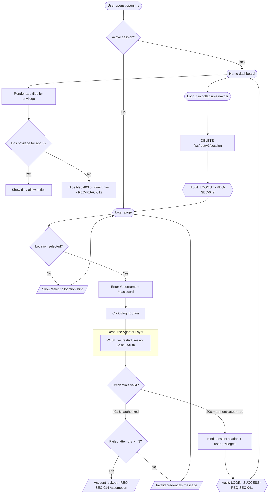
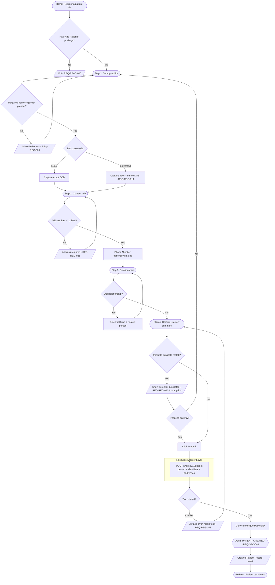
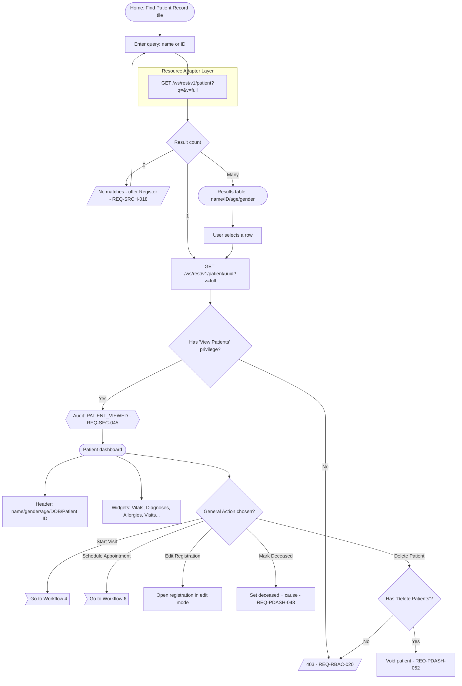
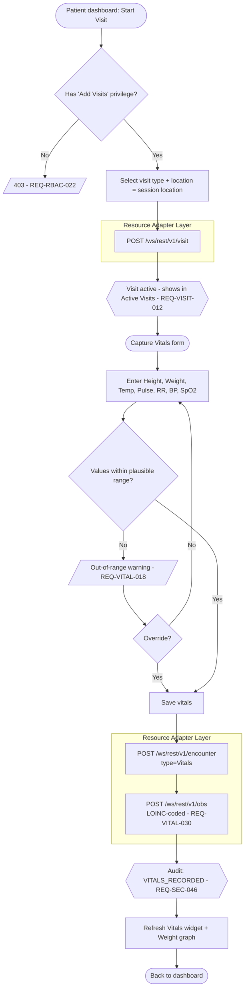
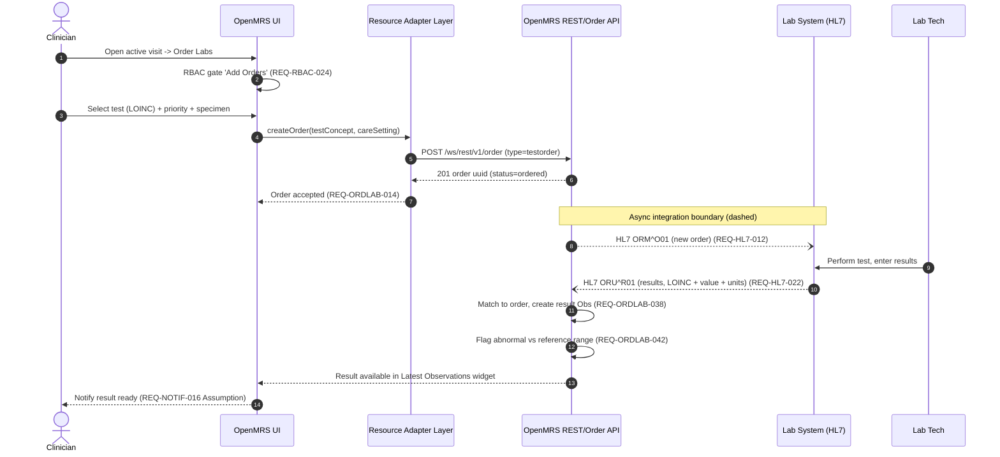
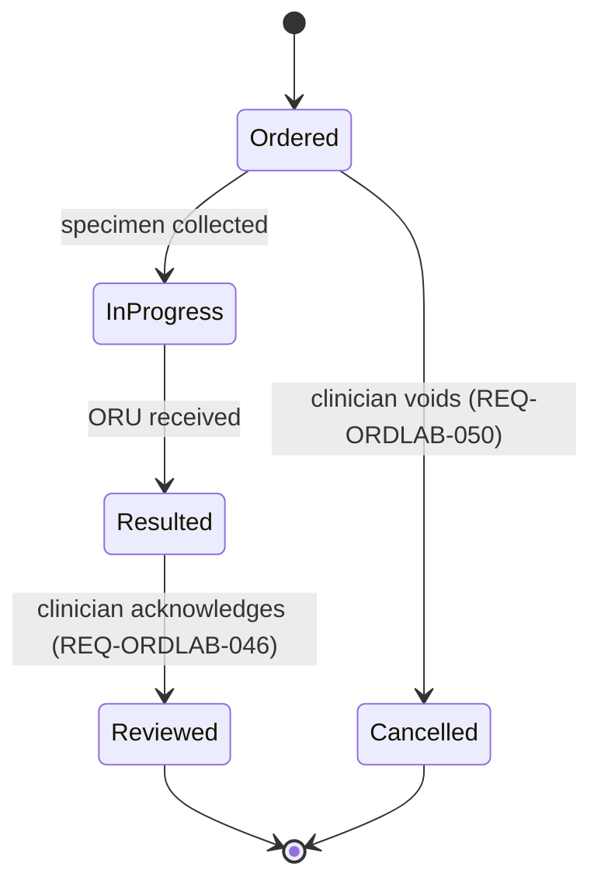
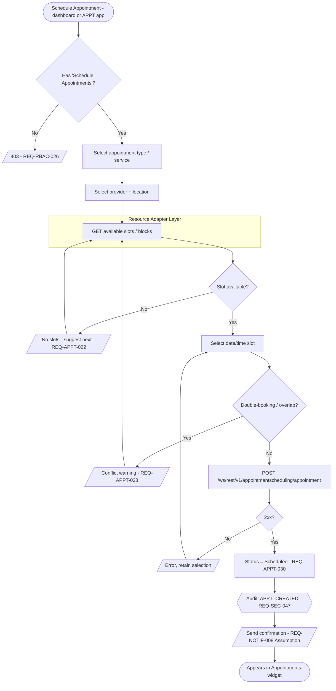
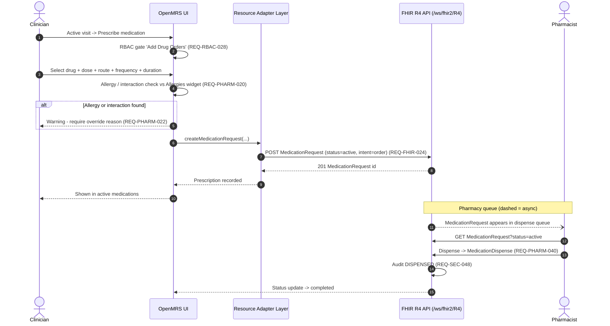
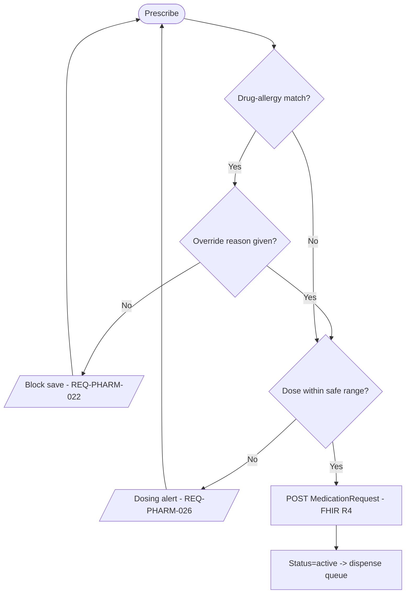
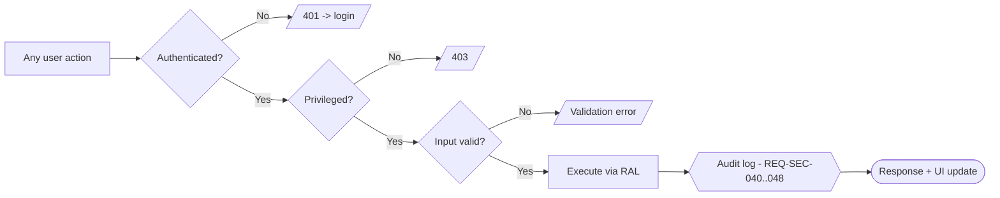

# Workflow Diagrams
## OpenMRS Reference Application — Multi-System Healthcare QA Reference

| Field | Value |
|---|---|
| Document Type | Workflow Diagrams (process / sequence reference) |
| Primary Reference System | OpenMRS Reference Application (legacy O2 — `https://o2.openmrs.org`; modern demo O3 — `o3.openmrs.org`) |
| Secondary Targets (via Resource Adapter Layer) | OpenEMR, HAPI FHIR, SMART Health IT, in-house omiiCARE |
| Status | Baseline (reverse-engineered) |
| Date | 2026-07-01 |
| Traceability | Cross-referenced to requirement catalog (472 requirements `REQ-<PREFIX>-NNN`; 1,349 manual test cases via RTM) |
| Standards Footprint | FHIR R4 (4.0.1), HL7 v2 (ADT/ORM/ORU), ICD-10, SNOMED CT, LOINC |

> **Assumption marking:** Statements beyond the VERIFIED OpenMRS facts are tagged **(Assumption)**. Verified facts are stated plainly.
> **Diagram conventions:** Rounded nodes = UI screens/states; rectangles = system actions; diamonds = decisions/RBAC gates; `{{...}}` = persistence events; dashed edges = async/integration; subgraphs labelled `RAL` = Resource Adapter Layer indirection points where alternate backends bind.

---

## 1. Purpose & How to Read These Diagrams

This document renders the **primary workflows** of the OpenMRS Reference Application as Mermaid flowcharts and sequence diagrams, each annotated with the requirement IDs (`REQ-<PREFIX>-NNN`) and the UI selectors / API endpoints that automated and manual tests assert against. Every workflow is drawn so that the OpenMRS-specific REST/FHIR call sits behind a **Resource Adapter Layer (RAL)** node, making the same workflow re-bindable to OpenEMR, HAPI FHIR, SMART Health IT, or omiiCARE without changing the business process.

### 1.1 Workflow Index

| # | Workflow | Module / Prefix | Primary Endpoint(s) | Key Requirements |
|---|---|---|---|---|
| 1 | Login + RBAC gate | AUTH / RBAC / SEC | `POST /ws/rest/v1/session` | REQ-AUTH-001..040, REQ-RBAC-001..030, REQ-SEC-001..060 |
| 2 | Patient registration | REG | `POST /ws/rest/v1/patient` | REQ-REG-001..080 |
| 3 | Find & open patient | SRCH / PDASH | `GET /ws/rest/v1/patient?q=` | REQ-SRCH-001..045, REQ-PDASH-001..060 |
| 4 | Start visit & capture vitals | VISIT / VITAL | `POST /ws/rest/v1/visit`, `/encounter`, `/obs` | REQ-VISIT-001..050, REQ-VITAL-001..040 |
| 5 | Place lab order & result | ORDLAB / HL7 | `POST /ws/rest/v1/order`, ORM/ORU | REQ-ORDLAB-001..060, REQ-HL7-010..030 |
| 6 | Appointment booking | APPT | `POST /ws/rest/v1/appointmentscheduling/appointment` | REQ-APPT-001..050 |
| 7 | Prescription (medication) | PHARM / FHIR | `MedicationRequest` (FHIR R4) | REQ-PHARM-001..055, REQ-FHIR-020..040 |

---

## 2. Workflow 1 — Login & RBAC Gate

**Verified:** Login requires selecting a session **location** (`<li id="...">` — Outpatient Clinic, Inpatient Ward, Pharmacy, Laboratory, Registration Desk, Isolation Ward) then `#username` / `#password` / `#loginButton` (demo `admin` / `Admin123`). REST/FHIR require auth (Basic/OAuth); unauthorized → **401**. RBAC roles (System Administrator, Doctor/Clinician, Nurse, Registration Clerk, Pharmacist, Lab Tech) gate apps and actions via privileges.

**RBAC privilege → app gate matrix (verified roles, representative privileges):**

| Role | Register a patient | Capture Vitals | Order Labs | Dispense Meds | Manage Roles | Requirement |
|---|---|---|---|---|---|---|
| System Administrator | ✅ | ✅ | ✅ | ✅ | ✅ | REQ-RBAC-001 |
| Doctor / Clinician | ✅ | ✅ | ✅ | ⚠️ order only | ❌ | REQ-RBAC-005 |
| Nurse | ⚠️ (Assumption) | ✅ | ❌ | ❌ | ❌ | REQ-RBAC-008 |
| Registration Clerk | ✅ | ❌ | ❌ | ❌ | ❌ | REQ-RBAC-010 |
| Pharmacist | ❌ | ❌ | ❌ | ✅ | ❌ | REQ-RBAC-014 |
| Lab Tech | ❌ | ❌ | ⚠️ result entry | ❌ | ❌ | REQ-RBAC-017 |

> Account lockout threshold and password policy specifics are **(Assumption)** — OpenMRS supports configurable lockout via `security.*` global properties but the demo value is not part of the verified fact set.

---

## 3. Workflow 2 — Patient Registration

**Verified:** `registrationapp` wizard — **Demographics** (given / middle / family Name, Gender, Birthdate exact or estimated), **Contact Info** (Address requires ≥1 field, Phone Number), **Relationships**, **Confirm** (`#submit`). On save: unique **Patient ID** generated, redirect to patient dashboard, **"Created Patient Record"** toast.

**Field validation matrix:**

| Step | Field | Rule | Requirement |
|---|---|---|---|
| Demographics | Given / Family Name | Non-empty | REQ-REG-006 |
| Demographics | Gender | Required, coded M/F/O | REQ-REG-008 |
| Demographics | Birthdate | Exact date **or** estimated age (mutually exclusive) | REQ-REG-014 |
| Contact Info | Address | At least one address field populated | REQ-REG-021 |
| Contact Info | Phone | Format-validated (Assumption) | REQ-REG-024 |
| Confirm | Patient ID | System-generated, unique, immutable | REQ-REG-035 |

---

## 4. Workflow 3 — Find & Open Patient

**Verified:** Home tile **Find Patient Record** (`coreapps` findPatient). Patient dashboard shows name / gender / age / DOB / Patient ID and widgets (Diagnoses, Latest Observations, Vitals, Recent Visits, Family, Conditions, Allergies, Attachments, Weight graph, Appointments) plus **General Actions**.

> **(Assumption)** Search ranking (exact-ID-first, then name fuzzy match) and minimum-character threshold are inferred; OpenMRS exposes configurable name search but the demo behaviour is not in the verified set.

---

## 5. Workflow 4 — Start Visit & Capture Vitals

**Verified:** General Actions include **Start Visit / Add Past Visit / Merge Visits**; Home tile **Capture Vitals**. Visits, encounters, and observations persist via REST (`/visit`, `/encounter`, `/obs`). Vitals appear in the dashboard Vitals widget and Weight graph.

**Vitals concept coding (verified standards footprint):**

| Vital | LOINC (representative) | Unit | Requirement |
|---|---|---|---|
| Body Temperature | 8310-5 | °C | REQ-VITAL-031 |
| Pulse | 8867-4 | /min | REQ-VITAL-032 |
| Respiratory Rate | 9279-1 | /min | REQ-VITAL-033 |
| Systolic BP | 8480-6 | mmHg | REQ-VITAL-034 |
| Diastolic BP | 8462-4 | mmHg | REQ-VITAL-035 |
| SpO2 | 59408-5 | % | REQ-VITAL-036 |
| Weight | 29463-7 | kg | REQ-VITAL-037 |

---

## 6. Workflow 5 — Place Lab Order & Result

**Verified:** Order entry / lab results module (ORDLAB) with REST `/order`; HL7 v2 **ORM** (order) and **ORU** (result) interfaces; LOINC coding. As a sequence diagram to show the order→fulfilment→result loop and HL7 integration boundary.

**Order lifecycle states:**

---

## 7. Workflow 6 — Appointment Booking

**Verified:** Home tile **Appointment Scheduling**; dashboard General Actions **Schedule Appointment** / **Request Appointment**; Appointments widget. REST under `appointmentscheduling`.

**Appointment status transitions (Assumption — modelled on OpenMRS appointment module):**

| From | Event | To | Requirement |
|---|---|---|---|
| Scheduled | Patient arrives | CheckedIn | REQ-APPT-034 |
| CheckedIn | Seen by provider | Completed | REQ-APPT-036 |
| Scheduled | No-show | Missed | REQ-APPT-038 |
| Scheduled | Cancelled by patient/staff | Cancelled | REQ-APPT-040 |

---

## 8. Workflow 7 — Prescription (Medication Request)

**Verified:** Pharmacy app (PHARM), `MedicationRequest` resource via FHIR R4 (`/ws/fhir2/R4`). Drug orders flow from clinician prescribing to pharmacist dispensing.

**Prescription decision gate (flowchart view):**

---

## 9. Cross-Workflow Concerns

### 9.1 Resource Adapter Layer (RAL) binding

Every `RAL` subgraph above is a single seam where the same logical operation maps to a backend-specific call. This keeps all 7 workflows portable across the secondary targets.

| Logical Operation | OpenMRS (primary) | OpenEMR | HAPI FHIR | SMART Health IT | omiiCARE (Assumption) |
|---|---|---|---|---|---|
| Authenticate | `POST /ws/rest/v1/session` | OAuth2 / API token | n/a (server) | SMART OAuth2 launch | JWT login |
| Create patient | `POST /ws/rest/v1/patient` | `POST /api/patient` | `POST /Patient` | `POST /Patient` | adapter `createPatient` |
| Record vitals | `/obs` (LOINC) | form save | `POST /Observation` | `POST /Observation` | `recordObservation` |
| Place order | `/order` + HL7 ORM | order module | `POST /ServiceRequest` | `POST /ServiceRequest` | `createOrder` |
| Prescribe | FHIR `MedicationRequest` | prescription | `MedicationRequest` | `MedicationRequest` | `createRx` |

### 9.2 Cross-cutting checks present in every workflow

| Concern | Applies To | Requirement |
|---|---|---|
| AuthN (401 on missing/invalid creds) | All API workflows | REQ-AUTH-030, REQ-SEC-001 |
| AuthZ / privilege gate (403) | All app entry points | REQ-RBAC-001..030 |
| Input validation | REG, VITAL, ORDLAB, PHARM, APPT | REQ-REG, REQ-VITAL, REQ-A11Y-010 |
| Audit logging | All write operations | REQ-SEC-040..048 |
| Accessibility (keyboard, labels, ARIA) | All UI screens | REQ-A11Y-001..030 |
| Performance budget (Assumption) | Search, dashboard load | REQ-PERF-001..020 |

---

## 10. Traceability Note

Each diagram node carrying a `REQ-<PREFIX>-NNN` tag is a direct hook into the requirement catalog (472 requirements) and, via the RTM, to the 1,349 manual test cases. QA engineers should treat each **decision diamond** and each `{{audit}}` node as a distinct test condition (positive + negative path), and each `RAL` subgraph as the boundary where backend-specific contract tests (OpenMRS / OpenEMR / HAPI FHIR / SMART / omiiCARE) are parameterised.

> **End of Workflow Diagrams.** Assumptions are explicitly tagged; all untagged statements derive from the verified OpenMRS Reference Application fact set.
